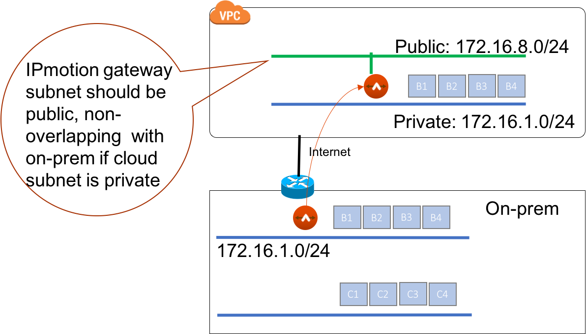
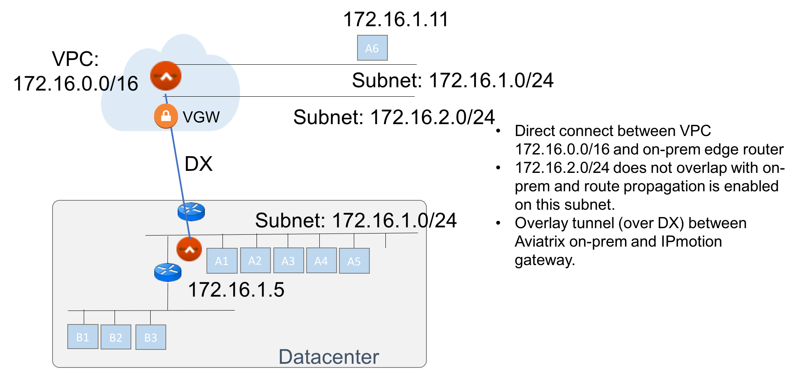
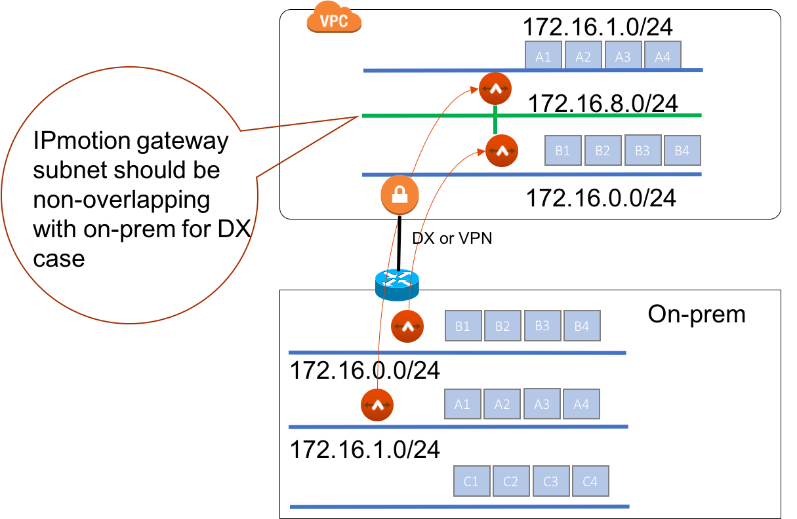

.. meta::
  :description: IP motion Ref Design
  :keywords: AWS Migration, DR, Disaster Recovery, aviatrix, Preserving IP address, IPmotion, ip motion

=================================
IPmotion Design Patterns
=================================

This guide describes different design patterns, it assumes you have read `IPmotion Setup Instructions. <http://docs.aviatrix.com/HowTos/ipmotion.html>`_

IPmotion connects an on-prem subnet and a cloud subnet with identical CIDR block, it is flexible to deploy. 

The cloud subnet can be a private subnet or a public subnet in AWS. 
The connections can be over Internet or private links such as Direct Connect. There maybe multiple cloud subnets in one VPC with each on-cloud subnet connecting to one on-prem subnet. 

1. IPmotion over Internet
--------------------------

IPmotion over Internet is convenient as it requires no additional private link infrastructure such as Direct Connect, all you need is Internet access. This deployment model well suits applications whose bandwidth throughput requirement is less than 1Gbps.

When IPmotion is deployed over the Internet, packets are encrypted in flight with IPSEC. 

If the cloud subnet is a public subnet, the IPmotion gateway subnet can be the same as the migrate subnet. 

If the cloud subnet is a private subnet, the IPmotion gateway subnet must be on a public subnet whose CIDR block does not overlap with any on-prem datacenter range, as displayed
in the diagram below.

|image-internet|

2. IPmotion over Private Links
--------------------------------

IPmotion over private link such as Direct Connect provides consistent bandwidth and 
latency as well as regulatory compliance for certain industries. 

When IPmotion is deployed over Direct Connect, data is not encrypted in flight.

The IPmotion gateway subnet must be an non-overlapping subnet with an on-prem datacenter.
This subnet must be routable to on-prem via AWS VGW. The route propagation should be enabled. 

Below is a deployment diagram.

 |image-DX|

3. Migrating multiple subnets to one VPC
-----------------------------------------

Multiple on-prem subnets can be migrated into one VPC with identical cloud subnets.
In this case, you need to identify one subnet that is not overlapping with any 
on-prem datacenter CIDRs and use that as an IPmotion gateway subnet. 
A deployment diagram is shown below.

 |image-multi|

4. IPmotion HA
----------------

The Aviatrix virtual appliance CloudN should be deployed in a VMware HA cluster for on-prem HA protection. 

The IPmotion gateway is monitored by CloudN for gateway health. If the gateway 
becomes unreachable, CloudN will stop the gateway instance and start it again. 
The default gateway failure detection and failover time is 3 minutes. 
You can change this setting 
by going to CloudN console, Settings -> Advanced -> KeepAlive and changing to a different setting. 

5. Simultaneously migrate multiple VMs on multiple subnets
------------------------------------------------------------- 

You can simultaneously migrate multiple VMs on multiple subnets, deploy multiple Aviatrix virtual appliance CloudN and build connections. You can move on-prem IP addresses to a Staging state before the AWS AMI is ready, as long as you do not power down the on-prem corresponding VM (meaning the on-prem VM is still in operational state.) 

 

.. disqus::
