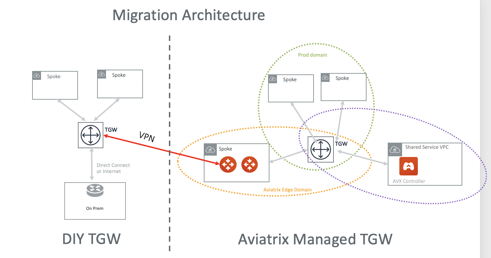

.. meta::
   :description: instructions on migrating from DIY TGW to Aviatrix managed TGW	deployment
   :keywords: Transit Gateway, AWS Transit Gateway, TGW, TGW Migration

==================================================================
Migrating a DIY TGW to Aviatrix Managed TGW Deployment 
==================================================================

If you built an AWS Transit Gateway (TGW) deployment by yourself (the DIY way) and would like to migrate to an Aviatrix managed TGW deployment, 
this document is for you. 

The objectives here are:

 - Minimum downtime during migration.
 - No change to existing VPC infrastructure.
 - Minimum change to on-prem network.   

.. Note::

  This document assumes you have already `launched an Aviatrix Controller <http://docs.aviatrix.com/StartUpGuides/aviatrix-cloud-controller-startup-guide.html>`_.

..

Before the migration process starts,  plan out what security domains you need to create and which security domains should connect other domains. If you are not sure and need to transition, proceed with no worries. The security domains can be added and modified at any time. 

The Solution
^^^^^^^^^^^^^^^^

There are multiple ways to migrate. For example, you can simply detach a spoke VPC from the DIY TGW and attach it to Aviatrix managed TGW and then build hybrid connection if necessary. 

In this implementation, the migrated spoke VPCs can communicate with the not yet migrated VPCs during migration process, thus reducing the 
downtime, as shown in the migration architecture below. 

|migration_architecture|

The key idea is to build an IPSec tunnel between TGW VPN and Aviatrix Transit Gateway, so that migrated VPC can
communicate with not yet migrated VPCs. 

**Step 1. Launch a Transit Gateway** 
^^^^^^^^^^^^^^^^^^^^^^^^^^^^^^^^^^^^^^^

Follow `Step 1 <https://docs.aviatrix.com/HowTos/tgw_plan.html#create-aws-tgw>`_.

**Step 2. Create Security Domains** 
^^^^^^^^^^^^^^^^^^^^^^^^^^^^^^^^^^^^^

If you have plans for custom security domains, follow `Step 2 <https://docs.aviatrix.com/HowTos/tgw_plan.html#optional-create-a-new-security-domain>`_ to create them. Follow `Step 3 <https://docs.aviatrix.com/HowTos/tgw_plan.html#optional-build-your-domain-connection-policies>`_ to build connection policies. If you do not intend to build custom security domains, skip this section. 

**Step 3. Launch Aviatrix Transit GW** 
^^^^^^^^^^^^^^^^^^^^^^^^^^^^^^^^^^^^^^^^^

`Follow Step 1 and Step 2 <http://docs.aviatrix.com/HowTos/transitvpc_workflow.html#launch-a-transit-gateway>`_ to launch an Aviatrix Transit GW and enable HA in the Transit hub VPC. For best practice, create a new Transit hub VPC to deploy the Aviatrix Transit GW. 

Make sure you enable `ActiveMesh Mode <https://docs.aviatrix.com/HowTos/gateway.html?#activemesh-mode>`_. This document 
is written for Aviatrix Transit GW with ActiveMesh mode enabled.  

**Step 4 Create TGW VPN Attachment**
^^^^^^^^^^^^^^^^^^^^^^^^^^^^^^^^^^^^^^^^^^^^^

This step is to create a TGW VPN attachment on the DIY TGW. 

Login to AWS console, select VPC Service. Click Transit Gateway Attachments -> Create Transit Gateway Attachment. 
Select Attachment type VPN, as shown below. 

|tgw_vpn_config|

After the attachment is created, go to Site-to-Site VPN Connections. Click Download Configuration. Make sure you select 
Vendor "**Generic**" and download the configuration text file.  

**Step 5. Create VPN on Aviatrix Transit Gateway** 
^^^^^^^^^^^^^^^^^^^^^^^^^^^^^^^^^^^^^^^^^^^^^^^^^^^^^^^^^^^

This step is to create the other end of the VPN tunnel that terminates on the Aviatrix Transit GW. 

Login to the Controller. Follow Transit Network -> Setup -> Step 3, Connect to External Device. 

Select External Device and fill in the parameters from the downloaded configuration text file as shown below where 
the right side shows the screen capture of the AWS VPN configuration text file. 

|migrate_tgw_config_vpn|

**Step 6. Start Migrating VPCs**
^^^^^^^^^^^^^^^^^^^^^^^^^^^^^^^^^^^^

In this step, you detach VPCs from DIY TGW and attach it to Aviatrix managed TGW. 

 ::
 
 - Before or after you detach a VPC, you may need to clean up the VPC route tables entries so that they do not have conflict routes entries when later attaching it to Aviatrix managed TGW. 

Repeat this step to migrating all VPCs. 

**Step 7. Build The Hybrid Connectivity** 
^^^^^^^^^^^^^^^^^^^^^^^^^^^^^^^^^^^^^^^^^^^^

Once all VPCs have migrated to Aviatrix managed TGW deployment, the migrated VPCs communicate with on-prem via Aviatrix Transit GW to DIY TGW and then to on-prem.

At this point, you can move DIY TGW Direct Connect to Aviatrix Transit GW or to Aviatrix managed TGW directly. 

**Step 8. Delete DIY TGW** 
^^^^^^^^^^^^^^^^^^^^^^^^^^^^^^^^

After all VPCs and hybrid connectivity if any are all removed, you can safely delete DIY TGW. 

.. |migrate_tgw_config_vpn| image:: diy_tgw_migrate_to_aviatrix_tgw_media/migrate_tgw_config_vpn.png
   :scale: 30%

.. disqus::
