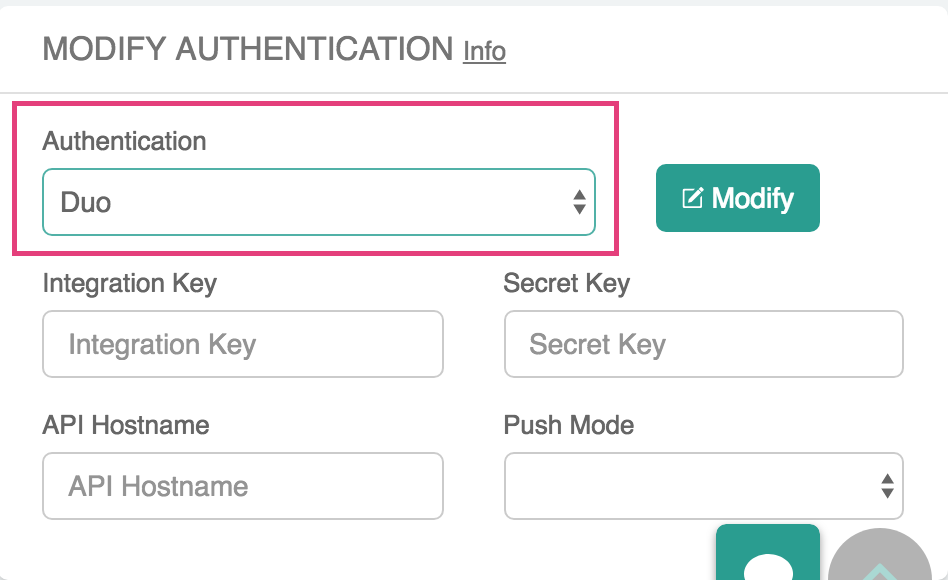

.. meta::
   :description: Admin users and Duo Authentication Management
   :keywords: Admin users, Duo authentication, Duo, Aviatrix

.. raw:: html

   

=============================================
Duo Authentication
=============================================
  
The Aviatrix OpenVPN® solution provides Duo authentication integration. This document helps you set up Duo to connect with Aviatrix. For more information on how to configure OpenVPN®, check out `this link <http://docs.aviatrix.com/HowTos/uservpn.html>`_.

You need to first have a Duo account setup.  If you do not have one, please see `https://www.duosecurity.com/product <http://www.duosecurity.com/product>`__.

Getting Duo API Credentials
---------------------------------------

.. important::
   This step requires admin privileges in Duo.

You must first add an application to Duo for Aviatrix before you can connect. If you already have already completed this step, these same steps will take you to the API credentials needed to connect Aviatrix with this application.

#. Log in to the Duo Admin Panel.
#. Navigate to **Applications**.
#. Click **Protect an Application**.
#. Search for "OpenVPN" in the application list.
#. Click **Protect this Application**.
#. The Integration key, Secret key and API hostname are displayed.

   .. note::
      You will need these values in Aviatrix to connect Aviatrix client to Duo.

   |imageDuoAppDetails|

#. (optional) Update the Settings fields as required.
#. (optional) Click **Save Changes**.

.. note::

   You may need to adjust policies to allow this application to be visible to your users.

Connecting Aviatrix VPN with Duo
-------------------------------------------------

.. note::
   You can set up Duo at both Aviatrix VPN Gateway launch time and after Aviatrix VPN Gateway is launched. We highly recommend you configure Duo after the VPN Gateway is launched.

#. Follow the `steps to create <uservpn.html#create-a-vpn-gateway>`__ a new Aviatrix Gateway.
#. After the gateway is launched, in your Aviatrix Controller, go to OpenVPN® > Edit Config > Modify Authentication. Select Duo at the dropdown menu.   
#. Populate **Integration Key**, **Secret Key**, and **API Hostname** from the values provided by Duo application details.
#. Update the **Push Mode**.

   +---------------------------+-----------------------------------------------+
   | Push Mode                 | Description                                   |
   +===========================+===============================================+
   | Auto                      | Duo sends a push notification to the user's   |
   |                           | mobile device(s). The VPN client will wait   |
   |                           | for the user to accept this request before    |
   |                           | authenticating and proceeding.                |
   +---------------------------+-----------------------------------------------+
   | Selective                 | This setting allows users to control which    |
   |                           | method they would prefer to use for           |
   |                           | authentication.                               |
   |                           | The server supports either Duo Push or        |
   |                           | Duo Passcode.                                 |
   |                           | The password prompt field of the VPN client   |
   |                           | is used to indicate which method is requested:|
   |                           |                                               |
   |                           | o A value of ``#push`` indicates the user     |
   |                           | requests to receive a push notification.      |
   |                           |                                               |
   |                           | o A value of ``#<passcode>`` indicates the    |
   |                           | user is providing the token after the ``#``   |
   |                           | to authorize.                                 |
   |                           |                                               |
   |                           |                                               |
   |                           | .. note::                                     |
   |                           |    The ``#`` is required.   If you are also   |
   |                           |    connecting with LDAP, then the user's LDAP |
   |                           |    password should be provided before the #.  |
   +---------------------------+-----------------------------------------------+
   | Token                     | The user must enter the current Duo Passcode  |
   |                           | in the password field when prompted by the    |
   |                           | VPN client.  If the client prompts for a      |
   |                           | username, any value is acceptable.            |
   +---------------------------+-----------------------------------------------+

#. Click **Modify** to have the action take effect.

   |imageAviatrixDuo|

Validating
-----------------

You will need one Aviatrix VPN user to test.  Validate that a VPN user is able to connect after receiving the push notification (or after entering a valid Passcode).

Using **Push Mode** of ``auto``
+++++++++++++++++++++++++++++++

1. Connect your VPN client to the VPN Gateway.

   .. note::
      You should receive a push notification from Duo.

2. Open the Duo Mobile app and select **Confirm** for the pending request.

   .. note::
      Once you confirm the request, the VPN client should proceed to authenticate the user.

3. Verify you are connected and can access resources in the cloud.

Using **Push Mode** of ``token``
++++++++++++++++++++++++++++++++

#. Connect your VPN client to the VPN Gateway.

   .. note::
      You should receive a prompt to authenticate.  If you do not receive a prompt, make sure ``auth-user-pass`` option is in the .ovpn configuration file.

#. Open the Duo Mobile app and generate a new passcode. 
#. In the VPN user/password prompt, enter any value for the username field and enter the passcode from Duo Mobile app for the password.
#. Verify you are connected and can access resources in the cloud.
#. Note that you need to generate a new passcode for each connection.

Currently, selective authentication with Duo is broken if used when combined with LDAP. This bug is expected to be fixed in a later release.

OpenVPN is a registered trademark of OpenVPN Inc.

.. |imageDuoAppDetails| image:: Duo_media/duo_add_app_details.png

   
.. disqus::   
