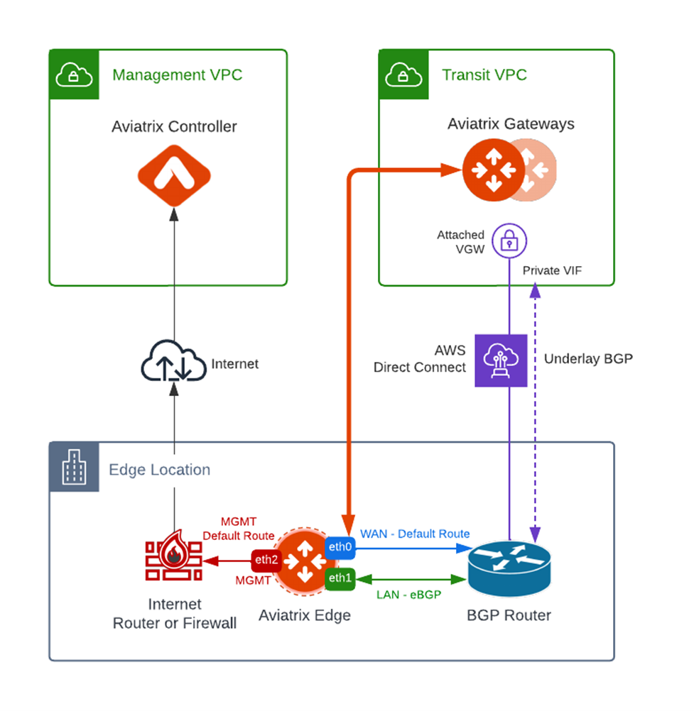
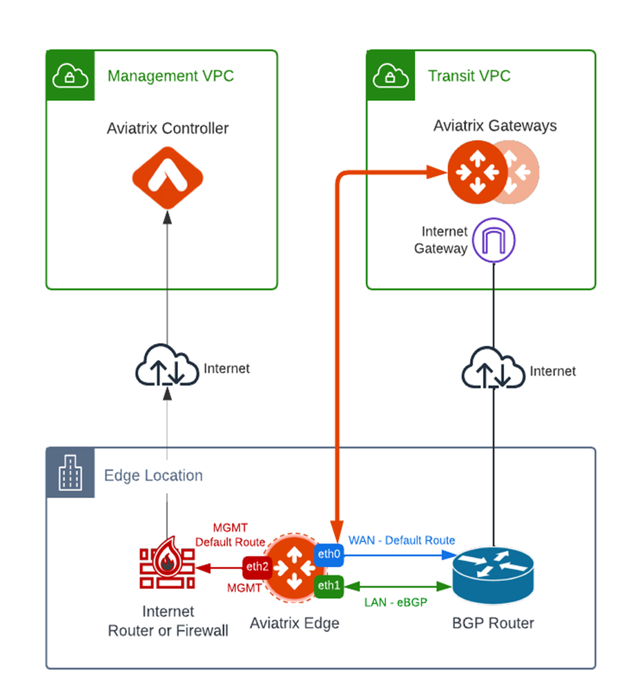

Aviatrix Edge Design Patterns
=============================

This document describes common design patterns for deploying Aviatrix Edge Gateways.

Single Transit with Single Edge – Attachment over Private Network
-----------------------------------------------------------------

In this design, a single Edge Gateway attached to an Aviatrix Transit Gateway over a private network, such as AWS Direct Connect, Azure Express Route, and GCP Interconnect.

|edge-single-transit-private|

The key ideas for this AWS scenario are:

- BGP router (functioning as WAN and LAN Router) runs a BGP session to VGW (AWS) where the BGP router advertises the Edge Gateway WAN subnet network and the VGW advertises the Transit VPC CIDR.
- Edge Gateway LAN interface runs a BGP session to the BGP router LAN interface where the BGP router advertises on-prem network address range to Edge Gateway LAN interface.
- Edge Gateway is attached to the Aviatrix Transit Gateway in the Transit VPC where Aviatrix Transit Gateway advertises all Spoke VPC CIDRs to Edge Gateway and Edge Gateway advertises on-prem network to the Aviatrix Transit Gateway.

Single Transit with Single Edge – Attachment over Public Network
----------------------------------------------------------------

In this design, a single Edge Gateway attached to an Aviatrix Transit Gateway over the public network.

|edge-single-transit-public|

Single Transit with Redundant Edge
----------------------------------

In this design, redundant Edge Gateway is deployed to provide redundancy over a single private network circuit.

|edge-single-transit-redundant|

Single Transit with Redundant Edge 2.0 + Redundant Circuits
-----------------------------------------------------------

In this design, redundant Edge Gateways are deployed to provide redundancy with redundant private network circuits.
Private network circuits can be used in an Active/Active model or Active/Standby model depending on requirements and on-prem hardware capabilities.

.. Important::
    In the Active/Active deployment model, the on-premises device needs to be able to handle asymmetric routing.

|edge-redundant-circuit|

Multiple Transit with Single Edge
---------------------------------

|edge-multiple-transit-single-edge|

Multiple Transit with Redundant Edge
------------------------------------

|edge-multiple-transit-redundant|

.. |edge-redundant-circuit| image:: CloudN_workflow_media/edge-redundant-circuit.png
   :scale: 50%	

.. |edge-single-transit-redundant| image:: CloudN_workflow_media/edge-single-transit-redundant.png
   :scale: 50%	

.. |edge-multiple-transit-single-edge| image:: CloudN_workflow_media/edge-multiple-transit-single-edge.png
   :scale: 50%

.. |edge-multiple-transit-redundant| image:: CloudN_workflow_media/edge-multiple-transit-redundant.png
   :scale: 50%