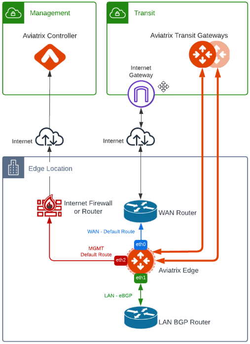

Aviatrix Secure Edge Design Patterns
====================================

This document describes common design patterns for deploying Aviatrix Edge Gateways.

Single Edge Gateway Attachment to Transit Gateway over Private Network
----------------------------------------------------------------------

In this design, a single Edge Gateway attached to an Aviatrix Transit Gateway over a private network, such as AWS Direct Connect, Azure Express Route, and GCP Interconnect.

|edge_private_network|

The key ideas for this scenario are:

- WAN router runs a BGP session for underlay CSP to exchange routes with the CSP and the CSP advertises the Transit CIDR.
- Edge Gateway LAN interface runs a BGP session to the LAN BGP router where the LAN BGP router advertises edge location network address range to Edge Gateway LAN interface.
- Edge Gateway is attached to the Aviatrix Transit Gateway in the Transit VPC where Aviatrix Transit Gateway advertises all Spoke CIDRs to Edge Gateway and Edge Gateway advertises edge location network to the Aviatrix Transit Gateway.
- Edge Gateway registration via Management with default route towards the Internet Firewall or router. Registration can be done via the Internet such as per the diagram or via private network.

Single Edge Gateway Attachment to Transit Gateway over Public Network
---------------------------------------------------------------------

In this design, a single Edge Gateway attached to an Aviatrix Transit Gateway over the public network.
Key ideas are similar to Attachment over Private Network design except the WAN Router provides Internet connectivity to Transit

.. Important::
    If you have multiple Edge Gateways, make sure each Edge Gateway has a unique WAN Public IP.

|edge_public_network|

Single Transit Gateway with Redundant Edge Gateways
---------------------------------------------------

In this design, multiple Edge Gateways are deployed to provide redundancy over a single private network circuit.
Multiple Edge Gateways can be deployed in Active-Active mode with ECMP or Active-Standby.

.. Important::
    In the Active-Active deployment model, the network device connected to Edge Gateways needs to be able to handle asymmetric routing.

.. Note::
    Active-Active mode can support more than 2 Edge Gateways. While there is no maximum number of Edge Gateways, Aviatrix recommends a maximum of 4.

|edge-single-transit-redundant|

Single Transit Gateway with Redundant Edge Gateways and Circuits
-----------------------------------------------------------------

In this design, multiple Edge Gateways are deployed with redundant private network circuits.
Multiple Edge Gateways can be deployed in Active-Active mode with ECMP or Active-Standby.

.. Important::
    In the Active-Active deployment model, the network device connected to Edge Gateways needs to be able to handle asymmetric routing.

.. Note::
    Active-Active mode can support more than 2 Edge Gateways. While there is no maximum number of Edge Gateways, Aviatrix recommends a maximum of 4.

|edge-redundant-circuit|

Multi-Cloud Transit Networking with Edge Gateway
------------------------------------------------

In a multi-cloud setup scenario, Edge Gateway can function as a transitive router providing high-performance encryption and routing the traffic between cloud service providers.

The key ideas for this scenario are:

- Edge Gateway is attached to multiple Transit Gateways (for example, Transit in AWS and Transit in Azure)
- Transitive Routing feature is enabled on Edge Gateway.
- (Optional) Transit Peering over Public Network between Transit in AWS and Transit in Azure.
- By default, Transit Peering will be the preferred path. To make Transit Peering less preferred, use `Connection AS Path Prepend feature <https://docs.aviatrix.com/HowTos/transit_advanced.html#connection-as-path-prepend>`_.
- Edge redundancy can be achieved by deploying multiple Edge Gateways in Active-Active or Active-Standby configurations.

|edge-multiple-transit-single-edge|

.. |edge-redundant-circuit| image:: CloudN_workflow_media/edge-redundant-circuit.png
   :scale: 40%	

.. |edge_private_network| image:: CloudN_workflow_media/edge_private_network.png
   :scale: 40%

.. |edge-multiple-transit-single-edge| image:: CloudN_workflow_media/edge-multiple-transit-single-edge.png
   :scale: 40%
