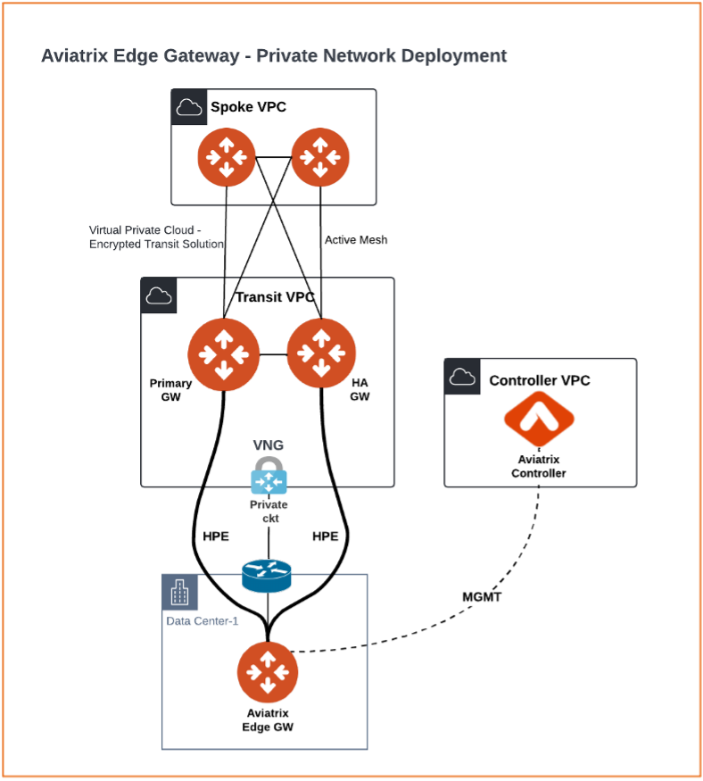
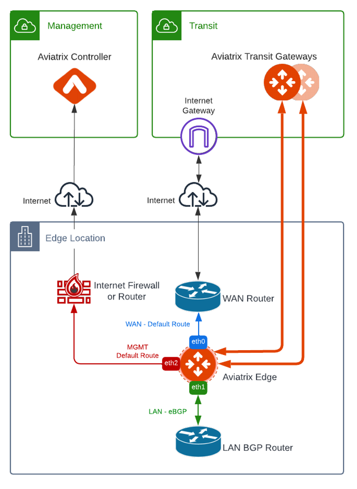

.. meta::
   :description: Aviatrix Edge
   :keywords: Edge, Edge Gateway, ESXi, EaaS, Edge ZTP, Edge as a Spoke

=================
Aviatrix Edge FAQ
=================

What is Aviatrix Edge?
----------------------

Aviatrix Edge enables enterprises migrating to the cloud to integrate their on-premises footprint as Spokes into the enterprise Cloud backbone. The result is secure, seamless connectivity to locations at the Edge of your network such as data centers, remote sites, provider locations, branch offices, and retail stores.

By extending the Aviatrix data plane to the Edge of the network, you can use Aviatrix Controller and Aviatrix CoPilot to manage orchestration, visibility, and operational capabilities. You can deploy an Edge Gateway using Aviatrix Controller, the VMware ESXi host server, and the VMware vSphere management console.

Aviatrix Edge 2.0
-----------------

Aviatrix Edge 2.0 lets you run Edge as an Aviatrix Spoke Gateway. This gives you the ability to implement more intelligent, robust, transformative Edge solutions that include retail/e-commerce, healthcare, manufacturing, agriculture—basically any industry that wants to gain a competitive advantage. Benefits of the Aviatrix Edge 2.0 solution include:

-	Go-to platform for all branch, off-prem, and on-prem hybrid connectivity

-	Centralized control plane across on-premises and multi-cloud networks that also reduces on-premises hardware and operating costs

-	Single pane of glass for visibility, monitoring, and troubleshooting from Controller

-	Encrypted connectivity and routing between clouds with a private path that uses standard architecture

-	High Performance Encryption (HPE) supported over public and private networks for AWS and Azure

Aviatrix Edge 1.0
-----------------

Aviatrix Edge 1.0 is the initial implementation of the Aviatrix Edge solution offered as a virtual form factor that lets you deploy an Edge Gateway as a standard virtual machine (VM). Edge 1.0 is for customers who want to try out Edge in a limited capacity while retaining the ability to use Aviatrix Controller and Aviatrix CoPilot to manage the network. Benefits include:

-	Virtual form factor deployed on VMware ESXI that integrates with the existing Cloud orchestration platform

-	Go-to platform for all branch, off-prem, and on-prem hybrid connectivity

-	Centralized control plane across on-premises and multi-cloud networks that also reduces on-premises hardware and operating costs

-	Single pane of glass for visibility, monitoring, and troubleshooting from Controller

-	Parity with hardware-based Edge gateway solutions

-	Encrypted connectivity and routing between clouds with a private path that uses standard architecture

-	Zero-touch provisioning (ZTP) that supports automated provisioning

-	High Performance Encryption (HPE) supported over public and private networks for AWS and Azure

-	Can be run as an external BGP device (CloudN)

For more information, refer to `Deploying Aviatrix Secure Edge 1.0 for VMware ESXi <http://docs.aviatrix.com/HowTos/secure_edge_workflow.html>`_.

What are the use cases for the Aviatrix Edge Gateway?
-----------------------------------------------------

You can deploy Aviatrix Edge to extend the Aviatrix platform to the Edge or to configure multi-cloud/multi-transit connectivity. You can deploy the Edge Gateway in an on-premises location with connectivity over a private network or as a secure gateway supporting locations at the Edge of your network.

-	Extend Aviatrix to Edge Locations

-	Multi-Cloud/Multi-Transit Connectivity via Aviatrix Edge

-	Aviatrix Edge Gateway – Private Network

-	Aviatrix Edge Gateway – Public Network

Extend Aviatrix to Edge Locations
~~~~~~~~~~~~~~~~~~~~~~~~~~~~~~~~~

This diagram illustrates Edge Gateways deployed into multiple Edge locations.

|eaas_usecase_edge_location|

Multi-Cloud Connectivity via Aviatrix Edge
~~~~~~~~~~~~~~~~~~~~~~~~~~~~~~~~~~~~~~~~~~

This diagram illustrates Edge Gateway deployed as primary path of Multi-Cloud Connectivity with Transit Peering over Internet for the backup path.

|eaas_usecase_mc|

Aviatrix Edge Gateway – Private Network
~~~~~~~~~~~~~~~~~~~~~~~~~~~~~~~~~~~~~~~

This diagram illustrates Edge Gateway deployed in a private network.

|secure_edge_private_network|

Aviatrix Edge Gateway – Public Network
~~~~~~~~~~~~~~~~~~~~~~~~~~~~~~~~~~~~~~

This diagram illustrates Edge Gateway deployed in a public network.

|secure_edge_public_network|

What are the requirements to run the Edge Gateway?
--------------------------------------------------

Aviatrix Edge 2.0 requires Aviatrix Controller 6.8. For additional requirements, refer to the *Prerequisites* section in `Deploying Aviatrix Edge 2.0 <http://docs.aviatrix.com/HowTos/edge-2.0.html#prerequisites>`_.

Aviatrix Edge 1.0 requires Aviatrix Controller 6.7. For additional requirements, refer to the *Prerequisites* section in `Deploying Aviatrix Secure Edge 1.0 for VMware ESXi <http://docs.aviatrix.com/HowTos/secure_edge_workflow.html#prerequisites>`_.

How do I deploy Aviatrix Edge?
------------------------------

To deploy Aviatrix Edge 2.0 as a Spoke, follow the workflow in `Deploying Aviatrix Edge 2.0 <http://docs.aviatrix.com/HowTos/edge-2.0.html>`_..

To deploy Aviatrix Edge 1.0 as a virtual machine, follow the workflow in `Deploying Aviatrix Secure Edge 1.0 for VMware ESXi <http://docs.aviatrix.com/HowTos/secure_edge_workflow.html>`_.

.. |eaas_usecase_edge_location| image:: CloudN_workflow_media/eaas_usecase_edge_location.png
   :scale: 40%

.. |eaas_usecase_mc| image:: CloudN_workflow_media/eaas_usecase_mc.png
   :scale: 40%

.. disqus::
