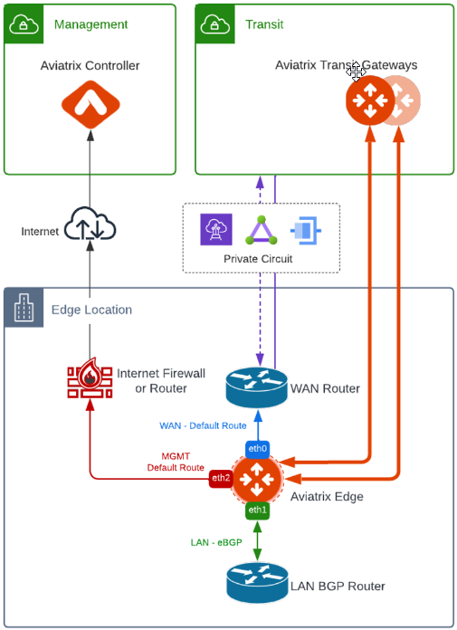

==================
Aviatrix Edge FAQ
==================

What is Aviatrix Edge?
----------------------

The Aviatrix Edge solution enables enterprises to extend the Cloud operational model to the edge network for consistent and repeatable architecture, management, visibility, security, and control. This cloud-out architecture enables enterprises to leverage the Aviatrix platform ubiquitous support for edge connectivity. The result is secure, seamless connectivity to edge locations such as data centers, co-locations, remote sites, provider locations, branch offices, and retail stores.

Benefits of the Aviatrix Edge solution include:

- Go-to platform for all hybrid connectivity

- Centralized Control Plane across multi-cloud networks and edge locations resulting in reduced hardware and operating costs

- Single pane of glass for visibility, monitoring, and troubleshooting from Aviatrix Controller and Aviatrix CoPilot

- Encrypted connectivity and routing between multi-cloud networks with a private path that uses standard architecture

- High Performance Encryption (HPE) support over public and private networks 

- Zero-touch provisioning (ZTP) for automated Edge deployments

- Available in multiple form factors to support various edge requirements

Aviatrix Edge 2.0
-----------------

Aviatrix Edge 2.0 solution is offered in VMware ESXi and KVM form factors that lets you deploy an Edge Gateway with spoke gateway capabilities at the edge network. 

Edge 2.0 features include:  

- High-availability active-active and active-standby mode for Edge Gateways at the same site location

- HPE over private and public network for AWS, Azure, OCI and over private network for GCP

- Non-HPE over private and public network on Edge to Transit Gateway connection

- Custom SNAT and DNAT (A/S) on Edge to Transit Gateway connection

- Network segmentation

- Transitive routing

- FireNet traffic inspection

Aviatrix Edge 2.0 is supported on Aviatrix Controller version 6.8.

For more information about Edge 2.0 use case scenarios, see `What are the use cases for Aviatrix Edge?`_.

For additional requirements and deployment workflow, see `Deploying Aviatrix Edge 2.0 <http://docs.aviatrix.com/HowTos/edge-2.0-workflow.html>`_.

Aviatrix Edge 1.0
-----------------

Aviatrix Edge 1.0 solution is the initial implementation of the Aviatrix Edge. Edge 1.0 is offered as a virtual form factor on VMware ESXi that lets you deploy an Edge Gateway as a standard virtual machine (VM) and has feature parity with Managed CloudN. Edge 1.0 is for customers who want to try out Edge in a limited capacity while retaining the ability to use Aviatrix Controller and Aviatrix CoPilot to manage the network. For customers with Edge 1.0 deployment, we recommend that you migrate to Edge 2.0.

Aviatrix Edge 1.0 is supported on Aviatrix Controller versions 6.7(build version **6.7.1376**) and 6.8. 

For additional requirements and deployment workflow, see `Deploying Aviatrix Secure Edge 1.0 for VMware ESXi <http://docs.aviatrix.com/HowTos/secure_edge_workflow.html>`_.

What are the use cases for Aviatrix Edge?
-----------------------------------------

The following are examples of Aviatrix Edge use cases.

-       `Extend Aviatrix to Edge Locations`_

-	`Multi-Cloud Connectivity Using Aviatrix Edge`_

-	`Aviatrix Edge Connectivity over Private Network`_

-	`Aviatrix Edge Connectivity over Public Network`_

Extend Aviatrix to Edge Locations
~~~~~~~~~~~~~~~~~~~~~~~~~~~~~~~~~

This diagram illustrates Aviatrix Edge Gateways deployed at multiple edge locations.

|edge_usecase_edge_location|

Multi-Cloud Connectivity Using Aviatrix Edge
~~~~~~~~~~~~~~~~~~~~~~~~~~~~~~~~~~~~~~~~~~~~

This diagram illustrates Aviatrix Edge Gateway deployed as the primary path for the multi-cloud connectivity and transit peering over the Internet for the backup path.

|edge_usecase_multi_cloud|

Aviatrix Edge Connectivity over Private Network
~~~~~~~~~~~~~~~~~~~~~~~~~~~~~~~~~~~~~~~~~~~~~~~

This diagram illustrates Aviatrix Edge Gateway deployed in a private network.

|edge_private_network|

Aviatrix Edge Connectivity over Public Network
~~~~~~~~~~~~~~~~~~~~~~~~~~~~~~~~~~~~~~~~~~~~~~

This diagram illustrates Aviatrix Edge Gateway deployed in a public network.

|edge_public_network|

.. |edge_usecase_edge_location| image:: CloudN_workflow_media/edge_usecase_edge_location.png
   :scale: 50%

.. |edge_public_network| image:: CloudN_workflow_media/edge_public_network.png
   :scale: 50%

.. disqus::
