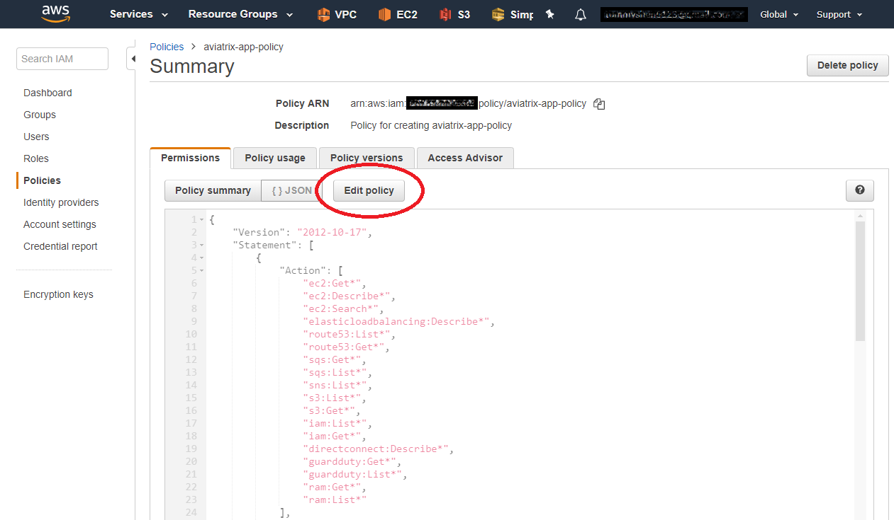
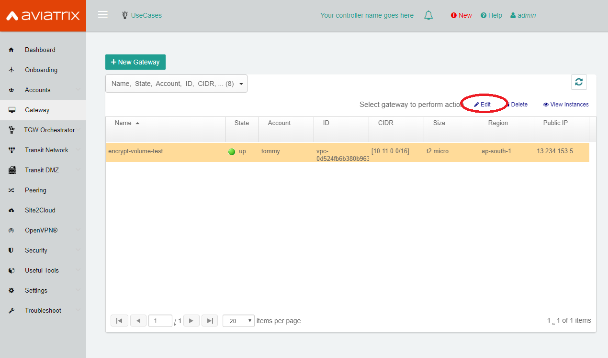
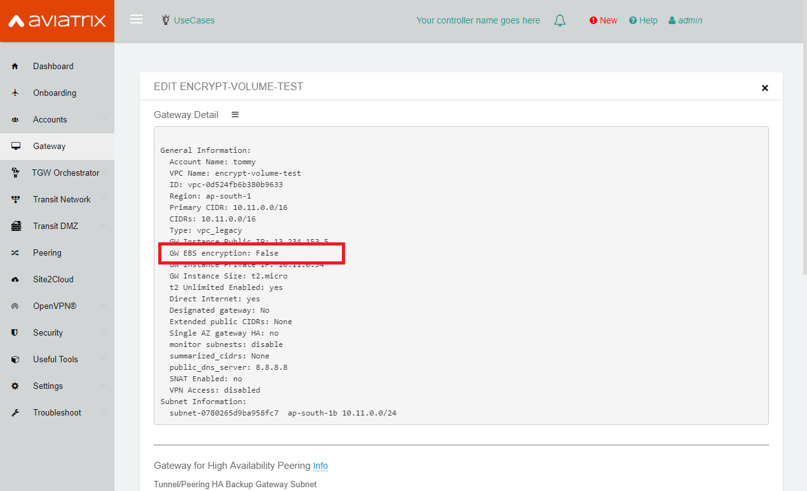
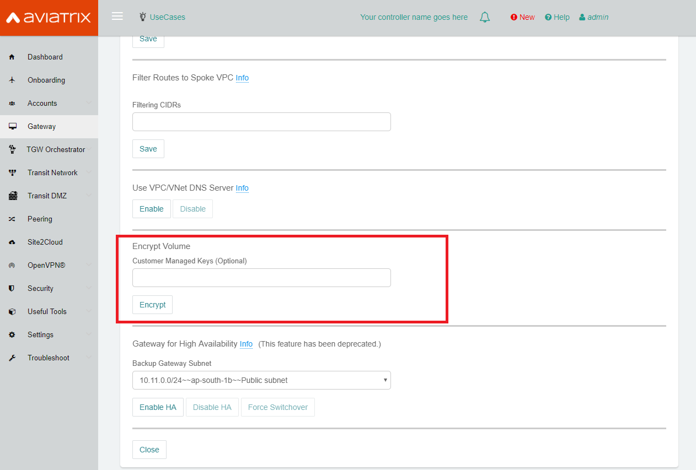
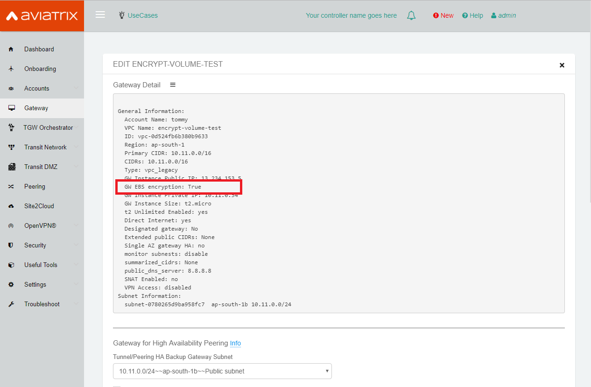
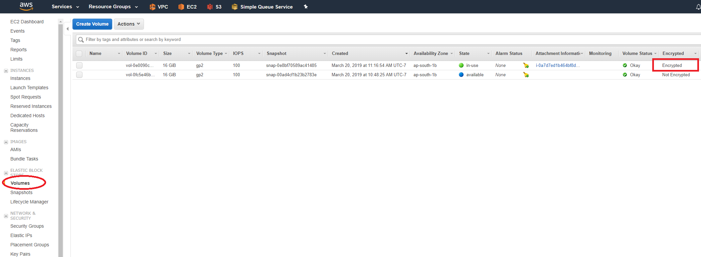

.. meta::
   :description: Encrypt EBS Volume
   :keywords: encrypt, ebs, volume, gateway

############################
Encrypt EBS Volume 
############################

.. note::

   Aviatrix starts to support enabling EBS encryption by default when users launch gateway since release 6.0.

Description 
------------

This feature is used to encrypt your gateway EBS volume. Note that you will need to disable the `Gateway Single AZ HA  <https://docs.aviatrix.com/HowTos/gateway.html#gateway-single-az-ha>`_ on your gateway prior if you are running a release prior to 5.2 before encrypting its EBS volume. On 5.2 release and later you do not need to disable the Single AZ HA before encrypting.

Prerequisite
--------------

You need to add below rules into your IAM role policies ("aviatrix-app-policy"). 

::

        { 
            "Effect": "Allow", 
            "Action": [ 
                "ec2:DescribeInstances",
                "ec2:DescribeVolumes",
                "ec2:DescribeSnapshots",
                "ec2:StopInstances",
                "ec2:StartInstances",
                "ec2:CopySnapshot",
                "ec2:CreateSnapshot",
                "ec2:CreateVolume",
                "ec2:DeleteVolume",
                "ec2:DeleteSnapshot",
                "ec2:AttachVolume",
                "ec2:DetachVolume"
            ],
            "Resource": "*"
        }
 
|

How to add IAM rules? 
^^^^^^^^^^^^^^^^^^^^^^

**Step1: Go to your AWS account and select IAM service.** 

|image_1_IAMRolesClickAviatrixroleapp|

**Step2: Select "Roles", then double click the role name "aviatrix-role-app."** 

|image_2_selectAviatrixAppPolicyEnditPolicy|

**Step3:  Click "JSON", then put the rules into the JSON file.  Then click "Review policy".**

|image_3_selectJSONAddRulesClickReviewPolicy|

**Step4: Click “Save changes” to finish editing aviatrix-app-policy**

|image_4_saveChanges|

|

How to encrypt gateway EBS volume via Aviatrix controller?  
-----------------------------------------------------------

**Step1: Go to your Aviatrix controller page, and select "Gateway" page.**

**Step2: Select the gateway which you want to encrypt, then click "Edit" button.**

|image_11_selectGwEdit|

**Step3: Check the current status of Gateway EBS volume.**

|image_12_checkStatus|

**Step4: Scroll down to "Encrypt Volume" and Click "Encrypt" button to encrypt the EBS. Please wait for the encryption process to complete.** 

|image_13_scrollDownToEncryptVolume|

.. note::
   The controller will use Default **"AWS Managed Keys"** to encrypt your EBS volume. Otherwise, you can use your* **"Customer Managed Key ID"** to encrypt the gateway EBS volume. `How to create AWS Customer Managed Key ID?  <http://docs.aws.amazon.com/kms/latest/developerguide/create-keys.html#create-keys-api>`_

|

**Step5: Check the encrypted volume. You may need to refresh the controller "Gateway" page to check the status of Gateway’s EBS volume.**

|image_14_checkEncryptResult|

**Step6: You can check the result on your AWS console. It's on EC2 -> Volume page.**

|image_15_checkEncryptResultOnAws|

.. note::
   You can see that the gateway EBS volume was encrypted. Also, the previous unencrypted volume will be kept.
   Please make sure to add "aviatrix-role-app" to the CMK as Key users in KMS when you want to replace or resize the gateway later.

|

.. disqus::
