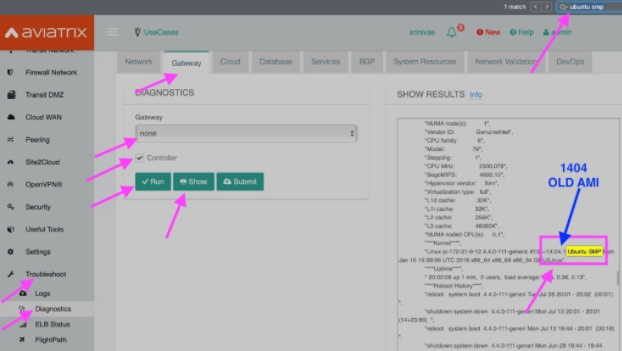
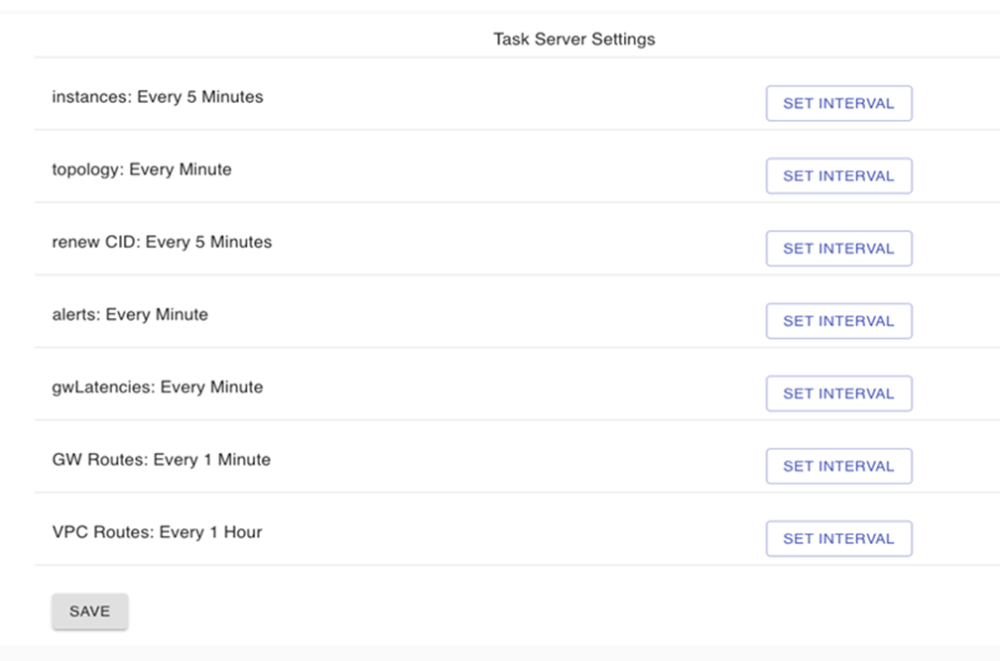
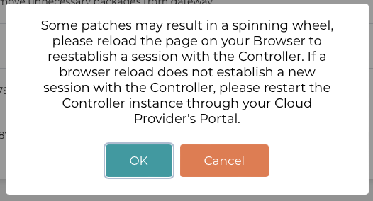

=======================================
Field Notices
=======================================

.. Note::

 These field notices are provided as a service to our customers to proactively update them on major issues. This service is provided without any changes in our SLA. The information in this field notice will be updated as we learn more.
 
42. Field Notice
------------------------------------------------

**Date**: 04/17/2023

**Issue Description**:

For all current Controller software versions (all versions 7.0.1726 and earlier), Aviatrix gateways are exporting files to a remote log collection entity. Starting in Controller software version 7.0.1726, instead of exporting files to a remote log collection entity, the Aviatrix Controller and gateways will start streaming the log lines being written to “Syslog” and “Auth.log”.

When you use the default rsyslog server configuration suggested in `Aviatrix Documentation <https://docs.aviatrix.com/documentation/latest/platform-administration/aviatrix-logging.html#rsyslog-config-on-controller>`_, the logs streamed from the Controller and gateways will now have multiple files. Each file will be named with the application that generated the log.

For example: All logs generated by avx-gw-state-sync would be re-directed to avx-gw-state-sync on the log server.

There will be a change in log format. You must change your syslog collectors and any related automation to accept the new log format.

**Old format**:

Mar 23 19:17:50 GW-UdpGateway-50.17.41.173 syslog 2023-03-05T19:17:50+00:00 GW-UdpGateway-50.17.41.173 avx-gw-state-sync[11249]: warn#011gateway_launcher/gateway_launcher.go:212#011daemon exited

**New format**:

Mar 23 19:17:50 GW-UdpGateway-50.17.41.173 avx-gw-state-sync[11249]: warn#011gateway_launcher/gateway_launcher.go:212#011daemon exited

Prefix of old format: Mar 23 19:17:50 GW-gg-aws-usw2-s127-35.162.124.66 syslog 2023-03-05T19:17:50+00:00

Prefix of new format: Mar 23 19:17:50 GW-gg-aws-usw2-s127-35.162.124.66

41. Field Notice
------------------------------------------------

**Date:** 11/28/2022

**Change in Default Behavior**

The latest 7.0 version of Aviatrix controller introduces a token verification to Aviatrix’s private API.

Please take notice of a change in behavior beginning with Aviatrix Controller version 7.0. The 7.0 version introduces token-based Controller API operations that binds Aviatrix’s private API usage by Aviatrix API Legal Terms of Use*.

To allow time for customers to make necessary changes in their infrastructure to support token-based API operations, we will not enforce a strict check for the token in the 7.0 release. Therefore, Aviatrix’s private API will continue to work for your existing use cases while running 7.0. However, token checking will be enforced in a later release.

**Who is impacted?**

Direct users of Aviatrix’s private API would be impacted by this change. There is no impact to users of Aviatrix Terraform Provider, Aviatrix CoPilot and Aviatrix Controller UI. Customers who have a Controller HA set up would also be affected. After upgrading to the release with token enforcement enabled, recreate your Controller HA configuration. Use HA script 2.0.1 or above. For details on HA script version, refer to Controller HA.

**Recommended Solution:**

To insulate customers from our evolving private API, Aviatrix strongly recommends you switch to Aviatrix Terraform Provider for all operations involving automation.

If you have special need to still use Aviatrix’s private API, please reach out to Aviatrix Support by opening a ticket at Support Portal at https://support.aviatrix.com for guidance on Aviatrix’s private API token generation.

Please mention your Aviatrix private API use case(s) in your ticket for us to better understand your automation needs, thereby enhancing our Terraform Support.

**Aviatrix API Legal Terms of Use:**

Use of Aviatrix API software (“Developer Software”) is governed by the Customer Terms of Use. We reserve the right to rescind any license to the Developer Software at our sole discretion without prior notice. DEVELOPER SOFTWARE IS MADE AVAILABLE BY US TO YOU ON AN “AS IS” AND “AS AVAILABLE” BASIS, (I) WITHOUT ANY REPRESENTATION OR WARRANTY OF ANY KIND, WHETHER EXPRESS, IMPLIED OR STATUTORY TO THE FULLEST EXTENT PERMITTED BY LAW AND (II) WITHOUT ANY OBLIGATION OF US TO PROVIDE TECHNICAL SUPPORT OR ANY INDEMNITY FOR YOUR ACCESS TO, AND USE OF, THE DEVELOPER SOFTWARE.

40. Field Notice
------------------------------------------------
 
**Date:** 11/04/2022
 
**High Priority Product Enhancement: AVX-31334**
 
**Customers affected:**
 
Any customer who:
 
* Has `Encrypted Transitive Peering <https://docs.aviatrix.com/HowTos/TransPeering.html?highlight=encrypted%20transitive#encrypted-transitive-peering>`_ configured in their Aviatrix Controller. This feature was introduced in 2017 and has been superseded by Aviatrix Multi-CloudTransit, a much more advanced and efficient feature set with expanded capabilities.
* Upgrades to 6.8.1398, 6.9.221, or future releases.
 
**Issue Description:** 

The Encrypted Transitive Peering feature is deprecated. Functionality is replaced by `Aviatrix Multi-Cloud Transit <https://docs.aviatrix.com/HowTos/transit_gateway_peering.html>`_.
 
Aviatrix recommends transitioning to Aviatrix Multi-Cloud Transit if you are using Encrypted Transitive Peerings. The process is straightforward we can help you make the transition.

39. Field Notice
---------------------------------

**Date**: 08/16/2022 

**High Severity Bug Fix: AVX-25425**

**Affected Versions:**

For customers running version 6.8 of the Aviatrix Controller and an older AMI released in February 2021 or prior. 
 
**Issue Description**

Performing a dry run in 6.8 and later versions will fail if the CSP gateway’s AMI is based on IKE-type Racoon**, even though the upgrade from version 6.8 to 6.9 will succeed. This particular issue is reported in AVX-25425 and Aviatrix recommends performing an Image upgrade of gateways running IKE-type Racoon before performing the Software Upgrade. An image upgrade will upgrade the Gateway AMI version and thereby change the IKE-type on the gateways from Racoon to Strongswan. Please follow the steps below to perform a `Gateway Image Upgrade <https://docs.aviatrix.com/HowTos/gateway-image-migration.html>`_:
 
Settings > Maintenance > Selective Gateway Upgrade > Select the gateway which lists IKE-type Racoon > click **Image Upgrade**.
 
The Image Upgrade of the Gateway AMIs also includes several Critical security updates. 

.. note::

  Gateways running older AMIs will not be able to upgrade from 6.9 to 7.0 without performing an Image Upgrade of Gateways to switch to IKE-type Strongswan. 
 
** Racoon – Older IKE daemon (to be deprecated starting R7.0)
      Strongswan – Current IKE daemon and requires all gateways to run Strongswan prior to upgrading to R7.0

38. Field Notice
------------------

**Date** 08/09/2022

**High Severity Bug Fix: AVX-26277**

**Affected Versions:**

* For customers running 6.5 or older of the Aviatrix Controller **OR**,
* For customers running 6.7 of the Aviatrix Controller, with release 6.7.1325 or older OR 
* For customers running 6.6 of the Aviatrix Controller, with release 6.6.5667 or older 

**AND**

* AWS AMI version released between May 2022 and June 2022 (ver. 05102022). 

**Remediation:**

This bug is fixed in 6.7.1376 or 6.6.5712. Due to the nature of this error, we strongly recommend that customers upgrade their platforms to the latest version, so that they do not face an outage, and are not blocked in their deployments or configuration changes. 

**IMPORTANT NOTE FOR CUSTOMERS RUNNING 6.5 OR OLDER VERSIONS:** Customers running 6.5 or older versions of the Aviatrix Controller should refrain from upgrading their AMI image (to ver. 05102022) until they first upgrade their software version on the Controller to 6.6.5712 or 6.7.1376 by following the steps in “Instructions for Upgrade”. These customers also need to follow the `valid upgrade path <https://docs.aviatrix.com/HowTos/selective_upgrade.html#valid-upgrade-paths>`_.

Any customers who are running 6.5 or older who have already upgraded their AMI image (to ver. 05102022) but have not yet seen the issue should proactively open a support ticket with Aviatrix Support for remediation. 

**Issue Description & Impact**

The AMI included a version of a database store that does not include automatic maintenance settings.  This will cause resource exhaustion on the Controller after a period of time depending on the level of activity the Controller sees.   

Due to this bug, at least one of the following situations may occur:

* Customers may come across an issue that will halt their ability to build environments or make configuration changes; they will see an error stating `StatusCode.RESOURCE_EXHAUSTED` and details will include `tcdserver : mvcc: database space exceeded`.
* Gateway deployment or configuration changes are prevented or is not reflected in the data-plane.
* Controller may lose connectivity with the Gateways.
* Controller may report an incorrect Gateway status or “waiting” status.
* When performing backup using *Settings > Maintenance > Backup & Restore > Backup Now*, an error appears `Gateway <name> not found` on the UI.

**Instructions for Upgrade**

If you have seen this issue already as described in the “*Issue Description & Impact*” section, it is mandatory to open a support ticket with Aviatrix Support first so that they can assist you in preparing for the bug fix and the subsequent upgrade. 

1. Take a backup at *Controller > Settings > Maintenance > Backup & Restore > Backup Now*. If you encounter an issue generating the backup please contact Aviatrix Support.
2. Aviatrix requests that you upgrade your Controller and Gateways to the latest build in the release you are running.  

* Please go through the release notes.  
* Please review the field notices.  
* Please go through the relevant upgrade instructions: Releases 6.4 and earlier or Releases 6.5 and later.  
* **Make sure that all Gateways are in “UP” state.**  
* **PLEASE DO NOT upgrade unless *Settings > Upgrade > Dry Run* is successfully completed for all Gateways.**  If dry run fails, please address the issue, or reach out to Aviatrix Support.  
* Please upgrade to the latest build in the current release by entering the release that the Controller is currently running at *Settings > Upgrade > Target Release Version*. For example, if your Controller is running 6.7.1325, please enter “6.7” in the box without quotation marks.  
* Attempt the backup again.  

If you run into any issues during the upgrade, please reach out to Aviatrix Support by opening a ticket on the Support Portal at https://support.aviatrix.com.  

37. Field Notice
------------------

**Date** 03/25/2022

**High Severity Bug Fix: AVX-18796**

AVX-18796 fixes an issue with Controller to Gateway control channel recently. The recommended builds with the fix in 6.4, 6.5 and 6.6 releases are 6.4.3015, 6.5.3012, 6.6.5413 or later.  Please refer to `Release Notes <https://docs.aviatrix.com/HowTos/Controller_and_Software_Release_Notes.html>`_ for more information on AVX-18796.  

We have published the following software patches to help identify if your Controller is at risk and address it: 

 * **Detect AVX-18796**: This patch can be run anytime, and a **maintenance window is not required** as no configuration changes are made and there will be no impact to either the control plane or the data plane on the Controller and the Gateways. The patch will generate an email to the Controller’s admin email and provide a recommendation on next steps. 
 * **AVX-18796: Check the SSH connectivity to all gateways**: This patch validates the state of the connection between the Controller and the Gateway. This patch can be run anytime, a **maintenance window is not required**. We recommend that you run this before applying the next patch to fix the issue. 
 * **AVX-18796: Sanitize certificate state on all gateways**: This software patch will extend the lifetime of certificates to give you time to upgrade to address AVX-18796. This patch is **recommended to be run in a maintenance window**. This patch should only be run when "AVX-18796-Detect" software patch reports this message "Your network is being impacted by a known issue AVX-18796. Follow the intructions in the Field Notice". The patch will generate an email to the Controller’s admin email.  

When you apply any of the above patches, you will see a popup message like the one shown below – please ignore it and click on “OK”. Depending on the number of Gateways in your deployment, each of these patches can take a while to complete and for an email report to be sent out. 

|imagefn37|

Aviatrix recommends the following be done, as soon as possible, to avoid any possibility of an outage due to this issue:

 - Check the Controller’s admin email address at "Settings/Controller/Email/ChangeAdminEmail" and make sure that it is correct. Please update this address if needed. 
 - First, do a backup on your Controller in "Controller/Settings/Maintenance/Backup&Restore/Backup Now"
 - Make sure that **all your Gateways are in Up/Green state**
 - Go to "Controller/Settings/Maintenance/Software Patches" and click on "Update Available Patches" to see the three patches listed above. 

 - Apply **"Detect AVX-18796"** patch first. Check your email for a report.

   - AVX_SW-PATCH_AVX-18796-FIXED: If the report indicates that your system is NOT impacted, no further actions are needed. We recommend that you stay on the latest supported releases 
   - AVX_SW-PATCH_BEFORE-DANGER-ZONE: If the report informs you that your system IS affected and directs you to upgrade your Controller and Gateways, please proceed to the "Instructions for Upgrade" section below and **complete your upgrade, before the "due date"** as mentioned in the report 
   - AVX_SW-PATCH_IN-DANGER-ZONE: If the report informs you that your system IS impacted and asks you to follow the instructions in the Field Notice, please do the following: 

      - Please apply the software patch **"AVX-18796: Check the SSH connectivity to all gateways"**: If it succeeds, proceed to next step, else reach out to Aviatrix Support 
      - Please apply the software patch **"AVX-18796: Sanitize certificate state on all gateways"** during a maintenance window. If it succeeds, please proceed to the "Instructions for Upgrade" section below and complete an upgrade on your Controller and Gateways and run **"Detect AVX-18796"** software patch again, to validate your network. If it fails, or if you have any questions or need assistance, please open a ticket with Aviatrix Support. 
   - AVX_SW-PATCH_INACCESSIBLE-GW: If the report informs you that some of the Gateways are inaccessible, please try to fix them and apply this patch again. Reach out to Aviatrix Support if you are unable to fix your Gateways  
   - AVX_SW-PATCH_UNEXPECTED-STATE: If the report indicates an error, please follow the directions in the email report and upload your Controller tracelogs and reach out to Aviatrix Support 
   - AVX_SW-PATCH_INAPPLICABLE: If the report says that no additional action is needed. The patch is not applicable to your controller version. We recommend that you stay on the latest supported releases 
 - Take a backup again at "Controller/Settings/Maintenance/Backup&Restore/Backup Now"

**Instructions for Upgrade**

 - Take a backup at "Controller/Settings/Maintenance/Backup&Restore/Backup Now"
 - We request you to upgrade your Controller and Gateways to the latest build in the release you are running  
     - Please go through the `release notes <https://docs.aviatrix.com/HowTos/Controller_and_Software_Release_Notes.html>`_
     - Please review the `field notices <https://docs.aviatrix.com/HowTos/field_notices.html>`_
     - Please go through the relevant upgrade instructions: `Releases 6.4 and earlier <https://docs.aviatrix.com/HowTos/inline_upgrade.html>`_ or `Releases 6.5 and later <https://docs.aviatrix.com/HowTos/selective_upgrade.html>`_
     - **Make sure that all Gateways are in “Up/Green” state**
     - **PLEASE DO NOT upgrade, unless “Settings/Upgrade/Dry Run” is successfully completed.** If “Dry Run” fails, please address the issue or reach out to Aviatrix Support 
     - Please upgrade to the latest build in the current release by entering the release that the Controller is currently running at “Settings/Upgrade/TargetReleaseVersion”. _(For example, if your Controller is running 6.4.3008, please enter “6.4” for “Settings/Upgrade/TargetReleaseVersion”)_
     - Take a backup again 
     - Please apply **"Detect AVX-18796"** software patch again to confirm that your network is free of AVX-18796 
 
If you run into any issues during upgrade, you can reach out to Aviatrix Support by opening a ticket at Support Portal at https://support.aviatrix.com.

36. Field Notice
------------------

**Date** 01/11/2022

**High and Medium Severity Vulnerability - AVI-2021-0008**

A new software release with a fix for this vulnerability was made available on Tuesday, January 11th, 2022. Aviatrix is strongly recommending you to upgrade to the new release at your earliest convenience. This vulnerability was discovered by Aviatrix engineering team and is not known to be exploited. Please refer to `Release Notes <https://docs.aviatrix.com/HowTos/UCC_Release_Notes.html>`_ and `Security Bulletin <https://docs.aviatrix.com/HowTos/security_bulletin_article.html#aviatrix-controller-and-gateways-unauthorized-access>`_ for more information.

The upgrade mechanism is described in our documentation:

* For 6.4 release, refer to `these instructions <https://docs.aviatrix.com/HowTos/inline_upgrade.html#how-to-upgrade-software>`_
* For 6.5 release, start `here <https://docs.aviatrix.com/HowTos/selective_upgrade.html#performing-a-platform-software-upgrade-dry-run>`_ 

If you run into any issues during upgrade, you can reach out to Aviatrix Support by opening a ticket at Support Portal at https://support.aviatrix.com

35. Field Notice
------------------

**Date** 10/25/2021

**Critical Vulnerability Security Patch - AVI-2021-0006**

This security patch was made available Monday, October 25th, 2021 at 05:00PM PST. The critical vulnerability addressed by this patch was privately disclosed to Aviatrix. It affects services of Controller available on port 443 and would allow an unauthenticated attacker to execute code on the Controller. This could be mitigated by limiting access to the https/port 443 of the Controller, or by running a Web Application Firewall (WAF) in front of it. Please refer to our documentation to `secure the Controller access <https://docs.aviatrix.com/HowTos/FAQ.html#how-do-i-secure-the-controller-access>`_.

Aviatrix is strongly recommending you to apply this patch at your earliest convenience. To apply a security patch, please refer to the following steps:

* First, do a backup on your Controller in “Controller/Settings/Maintenance/Backup&Restore/Backup Now”
* Go to “Controller/Settings/Maintenance/Software Patches” and click on “Update Available Patches”
* You should see a new patch called: “AVI-2021-0006 Critical Vulnerability Security Patch”
* Apply the patch, by clicking on the icon on the right and selecting “Apply Patch”
* Take a backup again at “Controller/Settings/Maintenance/Backup&Restore/Backup Now”

**Note:**

* The security patch does not impact the data path or control path and can be executed without a maintenance window
* This patch can be applied on releases 6.2 and higher
* Aviatrix **strongly recommends** you to upgrade to releases 6.4 or higher. Please check out the `release notes <https://docs.aviatrix.com/HowTos/UCC_Release_Notes.html>`_ and follow the `upgrade instructions <https://aviatrix.zendesk.com/hc/en-us/articles/4403944002829-Aviatrix-Controller-Upgrade>`_

34. Field Notice
------------------

**Date** 10/11/2021

**Security Fixes for 6.2, 6.3, 6.4, and 6.5 versions to improve security**

These releases address a Denial-of-Service vulnerability and also improve the security on Controllers by automatically enabling `security group management <https://docs.aviatrix.com/HowTos/FAQ.html#enable-controller-security-group-management>`_ when the first account is added to the Controller, to deal with security updates in CloudFormation when launching new Controllers.

Please upgrade to latest release:

- 6.2: 6.2.2052 or later
- 6.3: 6.3.2526 or later
- 6.4: 6.4.2869 or later
- 6.5: 6.5.1936 or later

Refer to the `Security Alert <https://docs.aviatrix.com/HowTos/UCC_Release_Notes.html#security-note-6-5-1936-6-4-2869-6-3-2526-and-6-2-2052-10-11-2021>`_ for more details on these updates.

Please upgrade to these builds, following the `upgrade instructions <https://aviatrix.zendesk.com/hc/en-us/articles/4403944002829-Aviatrix-Controller-Upgrade>`_, as soon possible.

33. Field Notice
------------------

**Date** 10/02/2021

**The latest 6.5, 6.4, 6.3, and 6.2 versions contain fixes for several vulnerabilities in the controller API**

**Problem:**

Several APIs used to upload configurations of certain services did not verify the authentication of the service or user executing the API call properly. Similar APIs designed to upload files from authenticated users did not properly sanitize their destination input, allowing directory traversal attacks which could eventually allow an authenticated attacker to execute code on the controller.

**Recommended Solution:**

Please upgrade to latest release:

* 6.2: 6.2.2043 or later
* 6.3: 6.3.2490 or later
* 6.4: 6.4.2838 or later
* 6.5: 6.5.1922 or later
Credit: Aviatrix would like to thank the team at Tradecraft ( https://www.wearetradecraft.com/ ) for the responsible disclosure of these issues.

Release notes also available on: https://docs.aviatrix.com/HowTos/UCC_Release_Notes.html

Please upgrade to these builds, following the `upgrade instructions <https://aviatrix.zendesk.com/hc/en-us/articles/4403944002829-Aviatrix-Controller-Upgrade>`_, as soon possible.

32. Field Notice
------------------

**Date** 09/09/2021

**In rare occasions, Controller backup file could get corrupted, resulting in gateways being shown as “down” if used for a Controller restore**

**Problem:**

We have observed, on one occasion, that the Controller’s backups were corrupt. If the backup file does get corrupt, the size of the backup file will be much larger than expected (in tens of MB or larger - much larger than the typical sizes ≤1 MB). The size would be the only indication of the backup file corruption. This issue is being tracked as AVX-14852

**Recommended Solution:**

A fix for this issue is in works and will be released for the supported releases (6.2, 6.3, 6.4, 6.5) on 9/11/2021. Please upgrade to these builds, following the `upgrade instructions <https://aviatrix.zendesk.com/hc/en-us/articles/4403944002829-Aviatrix-Controller-Upgrade>`_, as soon possible.

We request that you inspect your backup file size and if it is larger than expected, please go to Controller/Settings/Backup and click on “backup now” while not running any other operation on the Controller - and compare the backup file sizes.
* If the new backup file size is as expected, please save a copy. And upgrade to the new builds with fix for AVX-14852
* If the new backup file size continues to be large, please reach out to Aviatrix Support at https://support.aviatrix.com

31. Field Notice
------------------

**Date** 08/06/2021

**After a Gateway Replace operation on version 6.4 or later, the Site2Cloud connections on the Gateway might not come up**

**Problem:**

If you run a "Gateway Replace" operation from a Controller running version 6.4 or later, on a gateway which was created when this Controller was running on 6.3 or earlier, the Site2Cloud connections on this Gateway might not be able to come up

The default IPSec tunnel management software was changed in the `Gateway Images <https://docs.aviatrix.com/HowTos/image_release_notes.html>`_ associated with `version 6.4 <https://docs.aviatrix.com/HowTos/UCC_Release_Notes.html>`_ and later. Any Gateway which might have been created while running version 6.3 or older will be using the older IPSec tunnel management software. While the Controller ported the config from the old Gateway to the new Gateway, one of the field's default setting has changed. This setting could come into play based on the devices that this Gateway has established Site2Cloud tunnels and might result in the Site2Cloud tunnel not coming up. This was `documented in the 6.4.2499 release notes <https://docs.aviatrix.com/HowTos/UCC_Release_Notes.html#behavior-change-notice>`_. You can find `more information <https://aviatrix.zendesk.com/hc/en-us/articles/4406236429581>`_ on our `Support Portal <https://support.aviatrix.com/>`_ about this issue

**Recommended Solution:**

If the Site2Cloud tunnel(s) does/do not come up on a Gateway after a "Gateway Replace" operation in 6.4, please go to Controller/Site2Cloud, select the tunnel, click on edit and update the "Remote Identifier" field. If you have any issues, please open a ticket on our `Support Portal <https://support.aviatrix.com/>`_.

30. Field Notice
------------------

**Date** 07/19/2021

**Upgrade from 6.3 to 6.4 could cause gateways to be in down/polling state if any of them have more than 44 characters**

**Problem:**

We had announced in Field Notice 0027(https://docs.aviatrix.com/HowTos/field_notices.html#field-notice-0027-2021-04-29) that gateway names are required to be 50 characters or less. We have noticed that during upgrade operations, from 6.3 to 6.4, we are further limited on the gateway name length to 44 characters due to a new default behavior introduced in 6.4.
 
From 6.4, we started using self-signed certs to authenticate management/control communication between controller and gateways. The default cert domain used is "aviatrixnetwork.com". This ends up using 20 characters from our internal max of 64 characters - leaving only 44 characters for the gateway names(including "-hagw", if the gateway has an HA gateway). If the controller has any gateways with names longer than 44 characters, that gateway and the following gateways in the upgrade process could show up as "down/polling" state on the gateway page.
 
**Recommended Solution:**

* If all your gateway names(including ha gateways) have less than 44 characters, you are not impacted by this issue
* If the name length of any of your gateways is 45 to 50 characters, you have two options

    * While in 6.3, you can delete them and recreate them with names shorter than 44 characters (39 chars max, if you plan to have HA gateway, to account for 5 extra characters in "-hagw" which will be appended to the HA gateway name)
    * Upgrade to 6.4. Some gateways will not be in "green/up". To recover, head to Controller/Onboarding and click in "AWS" icon and enter "av.com". All gateways should come up in "green/up" status. If not, please perform "Troubleshoot/Diagnostics/Gateway/ForceUpgrade" on the affected gateways.
* If any of your gateway names have more than 50 characters (including "-hagw") please schedule a downtime, delete them, and create them again with shorter names(<44 chars, <39 chars if you have an HA for them).
 
If you need further support, please head to our support portal at https://support.avaiatrix.com and open a new ticket.

29. Field Notice
------------------

**Date** 05/11/2021

**Do not upgrade Controllers to R6.4.2499 if you have CloudN’s in your network**

Due to some unresolved issues in R6.4.2499, we strongly ask that you do not upgrade your Aviatrix Controller or CloudN devices to R6.4.2499. If you upgrade to this build, your CloudNs could fail, impacting your network operations.
 
Please look to our `release notes <https://docs.aviatrix.com/HowTos/UCC_Release_Notes.html>`_ on future 6.4 builds for guidance on upgrading your network when CloudN devices are involved. We apologize for any inconvenience.

28. Field Notice
------------------

**Date** 05/03/2021

**End of Life (EOL) announcement for Gateway AMI's**

Gateway AMI's based on old opensource OS versions are designated EOL effective 5/3/2021. Aviatrix is discontinuing support because these operating systems have reached their end of standard support from the provider. 
 
What is the impact if you remain on a deprecated release that is designated EOL?

  * The Aviatrix Support team does not provide assistance on EOL releases.
  * Patches for known issues and vulnerabilities are no longer provided.
 
**Recommendation**

Replace the deprecated gateways and use the new AMIs. To update your Aviatrix gateways, you may need to upgrade your Aviatrix Controller first. The Gateway page lists the AMIs for all your gateways. Go to "Gateway->Column View->Select Gateway Image Name->Apply Columns". For more information, see https://docs.aviatrix.com/HowTos/image_release_notes.html.
 
Discover all deprecated AMIs. Download the "Generate list of Aviatrix Gateways using deprecated AMIs" utility from "Settings->Maintenance->Software Patches->Update Available Patches". Run this utility to send an email to the admin with a list of all gateways running deprecated AMI's. 
 
We recommend that you replace gateways running on old opensource OS versions based AMIs before upgrading to 6.4.
 
Upgrade your Aviatrix Controller to the latest 6.3 release following the instructions at https://docs.aviatrix.com/HowTos/inline_upgrade.html and replace these gateways using the procedures at https://docs.aviatrix.com/HowTos/image_release_notes.html#existing-customers-gateway-image-upgrade. 
 
You can also use the following Aviatrix API's to replace your gateways programmatically:

  * Login and generate CID: curl --location -g --request POST 'https://{{controller_hostname}}/v1/api' --form 'action="login"' --form 'username="admin"' --form 'password="{{admin_password}}"'
  * Use the CID generated above to resize gateway and wait till it is complete, before running on another gateway : curl --location -g --request POST 'https://{{controller_hostname}}/v1/api'  --form 'action="replace_gateway"' --form 'CID="{{CID}}"' --form 'gateway_name="{{gateway_name_in_controller}}"' 
  * Check the Gateway AMI information: curl --location -g --request GET 'https://{{controller_hostname}}/v1/api?action=get_gateway_info&CID={{CID}}&gateway_name={{gateway_name_in_controller}}'
 
Aviatrix strongly recommends that you keep your Aviatrix Network up to date with the latest releases. We also strongly suggest that you periodically check the AMI versions on all your gateways and update them to get the latest fixes for known issues and vulnerabilities. 
 
If you have any difficulties in upgrading your Gateways or have any questions about your Aviatrix network, please open a `support ticket <https://aviatrix.zendesk.com>`_.

27. Field Notice
------------------

**Date** 04/29/2021

**Gateway names longer than 50 bytes can cause issues**

**Problem**

In Version 6.2 and prior, customer may create a spoke or transit gateway name exceeding 50 Bytes. During peer creation a failure may occur if the peering name (concatenation of spoke-to-transit, spoke-to-spoke, etc) exceeds 120 Bytes and throws an error.

(example)
Error: command create_peer_xx_gw failed due to exception errors fully qualified namespace peering_info.xxxxxxxx is too long (max is 120 bytes)

**Recommended Solution**

Version 6.2 and prior: If spoke or transit name exceeds 50 Bytes, manually delete and re-create gateway with name limited to 50 Bytes or less.

Version 6.3 and higher: Newly created spoke and transit gateway names are checked and limited to 50 Bytes or less. However, if there are any residual gateways (6.2 and prior) with name exceeding 50 Bytes they must be deleted and re-created to avoid this issue.

26. Field Notice
------------------

**Date** 04/28/2021

**End of Life (EOL) announcement for Aviatrix VPN Clients for old opensource OS versions**

VPN Clients running on old opensource OS versions are designated EOL effective immediately. VPN Clients running on old opensource OS versions are designated EOL effective 6/1/2021. Aviatrix is discontinuing support because these operating systems have reached their end of standard support from the provider.
 
What is the impact if you remain on a deprecated release that is designated EOL?
The Aviatrix Support team does not provide assistance on EOL releases.
Patches for known issues and vulnerabilities are not provided.
 
Recommendation
Please upgrade to one of the supported `Aviatrix VPN Clients <https://docs.aviatrix.com/Downloads/samlclient.html>`_.
 
If you have any difficulties in upgrading your Aviatrix VPN Client, please contact your Aviatrix Network Admin and have them open a `support ticket <https://aviatrix.zendesk.com/>`_.

25. Field Notice
------------------

**Date** 04/26/2021

**End of Life (EOL) announcement for 5.4, 6.0, 6.1 releases**
 
Following up on Field Notice `0012 <https://docs.aviatrix.com/HowTos/field_notices.html#field-notice-0012-2020-08-07>`_ and `0016 <https://docs.aviatrix.com/HowTos/field_notices.html#field-notice-0016-2020-12-22>`_, we are announcing EOL and End of Support for releases 5.4, 6.0 and 6.1. The R5.4 EOL date is 6/1/2021, the R6.0 EOL date is 6/19/2021 and the R6.1 EOL date is 8/31/2021.
 
What is the impact if you remain on a deprecated release that is designated EOL?

 * The Aviatrix Support team does not provide assistance on EOL releases.
 * Patches for known issues and vulnerabilities are not provided.
 * Enabling the remote SSH support option as well as sending logs and diagnostics to Aviatrix Support may not work.
 * The default SMTP on the Controller cannot send Alerts.
 
**Recommendation:**
Please use the following processes to upgrade your Aviatrix network:

* https://docs.aviatrix.com/HowTos/UCC_Release_Notes.html
* https://docs.aviatrix.com/Support/support_center_operations.html#pre-op-procedures
* https://docs.aviatrix.com/HowTos/inline_upgrade.html
 
If you have any difficulties upgrading your Aviatrix network, please open a `support ticket <https://aviatrix.zendesk.com/>`_.

24. Field Notice
------------------

**Date** 04/25/2021

**Controller HA Code Improvements for release R6.3 and R6.4**
 
Problem:
Improved Controller HA process to avoid corner cases related to Controller HA restore failures.
 
What is Impacted?
Controllers deployed in AWS with the "Controller HA" process enabled.
 
Recommendation
For Controllers running in AWS with the Controller HA process enabled, Aviatrix strongly recommends that you `disable <https://docs.aviatrix.com/HowTos/controller_ha.html#steps-to-disable-controller-ha>`_ and `reenable <https://docs.aviatrix.com/HowTos/controller_ha.html#steps-to-enable-controller-ha>`_ the "Controller HA" process as soon as possible to pick up the latest version of the software. This operation should not impact the Controller that is in operation but we do recommend that you follow our `pre-operation recommendations <https://docs.aviatrix.com/Support/support_center_operations.html#pre-op-procedures>`_. Please see https://docs.aviatrix.com/HowTos/controller_ha.html for more information on Controller HA. Please verify that your `Controller HA <https://docs.aviatrix.com/HowTos/controller_ha.html?#faq>`_ version is 1.6 or higher. Please check `Controller HA release notes <https://docs.aviatrix.com/HowTos/controller_ha.html#changelog>`_.
 
 
Please note that enabling and disabling the Controller HA process is a prerequisite for upgrading to release R6.4, which is scheduled to be released soon.

* https://docs.aviatrix.com/HowTos/UCC_Release_Notes.html
* https://docs.aviatrix.com/Support/support_center_operations.html#pre-op-procedures
* https://docs.aviatrix.com/HowTos/inline_upgrade.html

23. Field Notice
------------------

**Date** 04/24/2021

**Default SMTP Service Down on releases < 6.2.1955**

**Problem:**

The default SMTP service used by Aviatrix has been impacted in releases older than 6.2.1955. Alerts generated from the Controller will fail to reach the admin by email. Gateways are not impacted. Password recovery by email and sending OpenVPN profiles via email will also be impacted.

**Who is impacted?**

Any Controller running versions older than R6.2.1955 that also does not have an SMTP server configured to override the default service.

**Recommended Solution:**

To resolve this issue, please upgrade your Controller to the latest R6.2(>=6.2.1955) or R6.3 software version following the instructions at https://docs.aviatrix.com/HowTos/inline_upgrade.html, or configure your own SMTP service to override the default SMTP service using the instructions at https://docs.aviatrix.com/HowTos/alert_and_email.html.
 
This issue will not be addressed in 5.4, 6.0 and 6.1 releases so if your Controller is running one of these releases, Aviatrix strongly encourages you to upgrade to the 6.3 release.

22. Field Notice
------------------

**Date** 04/19/2021

**Deprecated build 6.3.2405**
 
Last week, Aviatrix published R6.3.2405 and due to the incorrect handling of a corner case issue we decided to deprecate R6.3.2405. If you upgraded to R6.3.2405 your controller might incorrectly notify you that there is a newer release, since you are not running the current R6.3.2364 release. We request that you ignore this upgrade notification. We will be releasing a new build > R6.3.2405 later today. You can safely upgrade to the new release.
 
**Recommendation:**
Please use the following processes to upgrade your Aviatrix network:

* https://docs.aviatrix.com/HowTos/UCC_Release_Notes.html
* https://docs.aviatrix.com/Support/support_center_operations.html#pre-op-procedures
* https://docs.aviatrix.com/HowTos/inline_upgrade.html
 
If you have any questions about your Aviatrix network, please open a `support ticket <https://aviatrix.zendesk.com/>`_.

   
.. |image1804Controller| image:: field_notices_media/1804Controller.png 
   :width: 600
   

