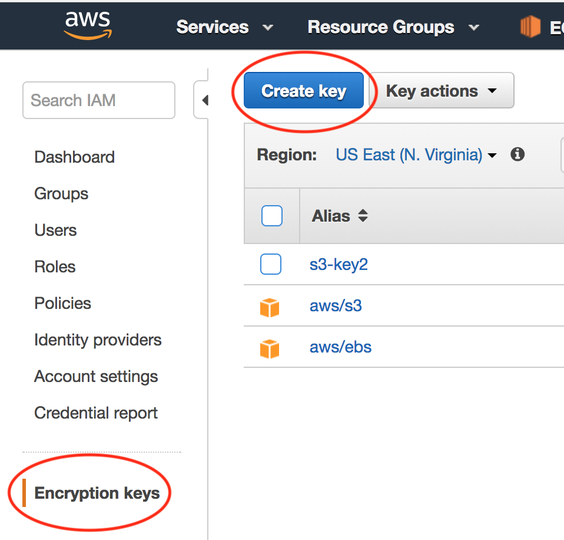

.. meta::
   :description: FIPS 140-2
   :keywords: FIPS 140-2  

###################################
FIPS 140-2 Module
###################################

Aviatrix OpenVPN supports the FIPS 140-2 crypto module. This security policy does not affect any other controller or gateway features. When FIPS 140-2 is enabled, the Controller and all gateways will be installed with the FIPS 140-2 module to support OpenVPN. 

The Aviatrix Certificate number is #3475 which you can find from the `NIST site <https://csrc.nist.gov/projects/cryptographic-module-validation-program/certificate/3475>`_.

The Aviatrix FIPS 140-2 Security Policy can be found at this `link. <https://csrc.nist.gov/CSRC/media/projects/cryptographic-module-validation-program/documents/certificates/FIPS140ConsolidatedCertAug2018.pdf>`_

Before enabling FIPS 140-2, the FIPS 140-2 Security patch needs to be applied.

- To apply FIPS patch go to the Controller Console, Settings -> Maintainence -> Security Patches -> Click FIPS 140-2  

- To enable, go to the Controller Console, Settings -> Advanced -> FIPS 140-2. Click Enable. 

.. note::

   OpenVPN services will be restarted and this will cause your VPN clients to disconnect and reconnect to the gateways.

.. |gen_csr| image::  controller_certificate_media/gen_csr.png
    :scale: 30%

.. |ca.crt| image::  controller_certificate_media/ca.crt.png
    :scale: 30%

.. |server_crt| image::  controller_certificate_media/server_crt.png
    :scale: 30%

.. |imageRestoreAWS| image::  controller_backup_media/backup_restore_restore_aws.png

.. |S3Create| image:: controller_backup_media/S3Create.png
.. |S3Properties| image:: controller_backup_media/S3Properties.png
    :scale: 30%
.. |S3SelectDefaultEncryption| image:: controller_backup_media/S3SelectDefaultEncryption.png
      :scale: 25%
.. |S3SelectEncryption| image:: controller_backup_media/S3SelectEncryption.png
      :scale: 25%

.. |KMSKeyAddUser| image:: controller_backup_media/KMSKeyAddUser.png
      :scale: 30%
      :align: middle

.. disqus::
	  
