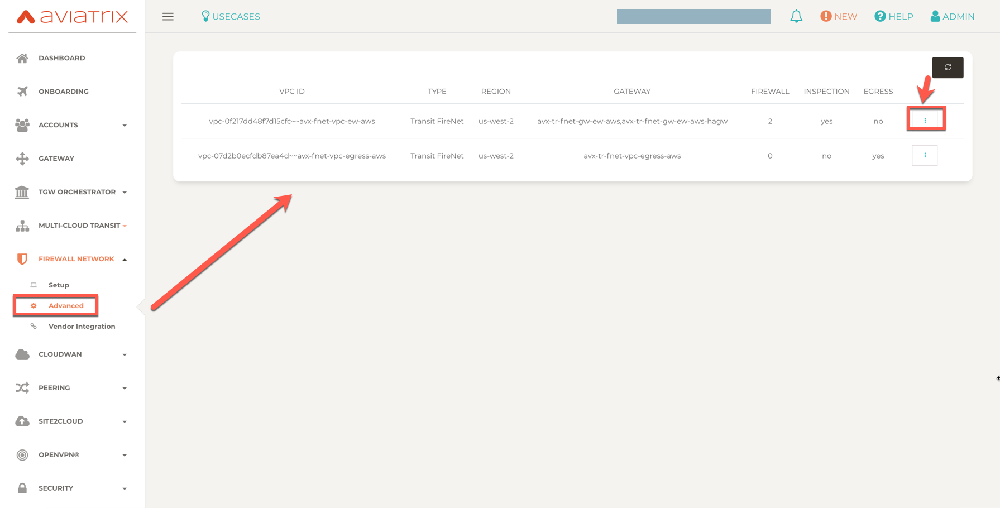
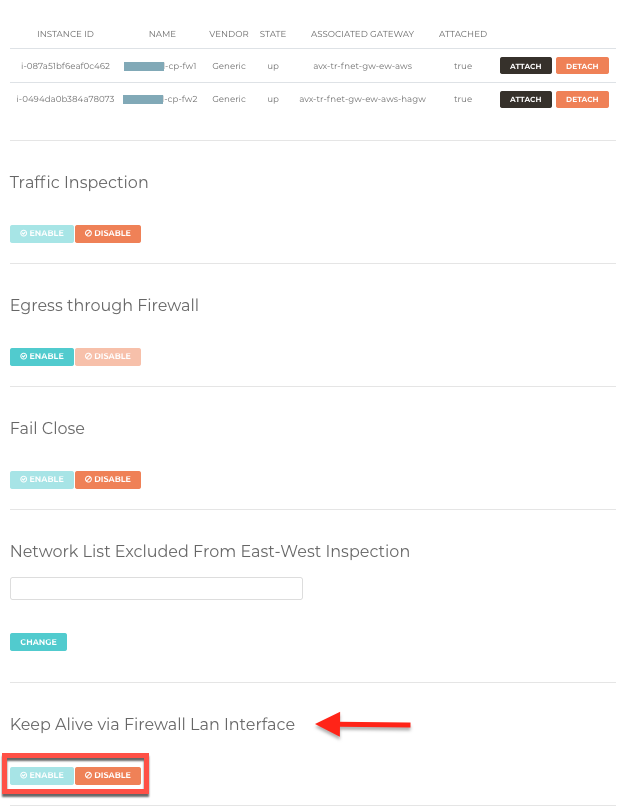
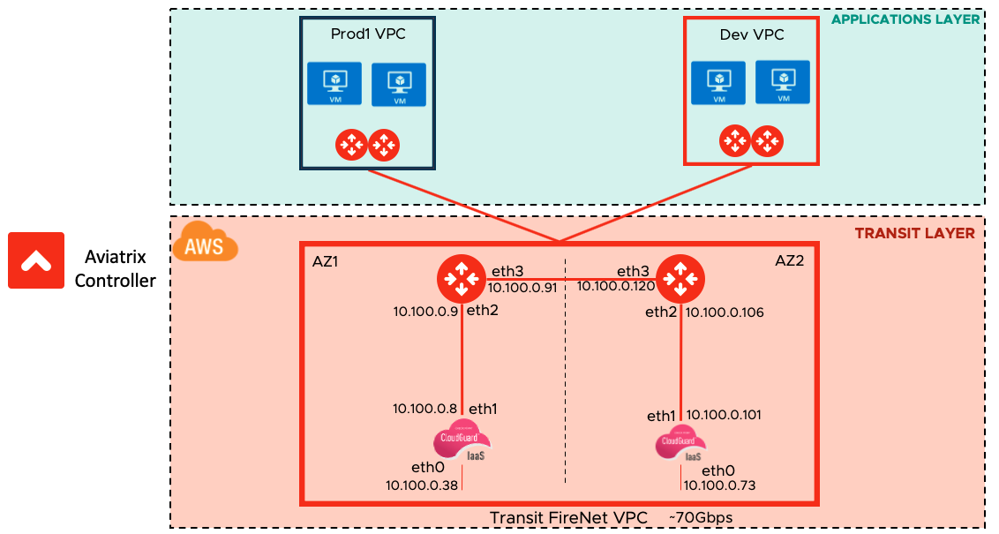
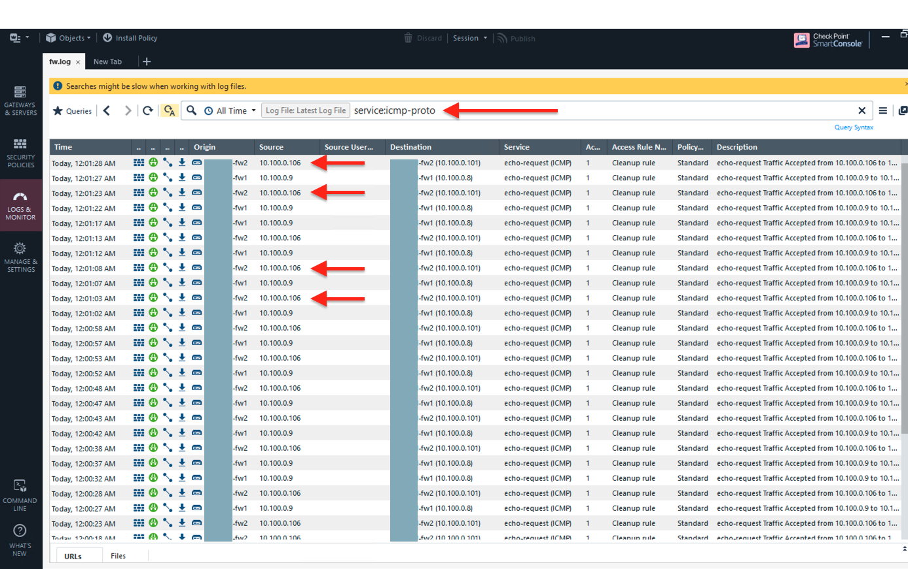
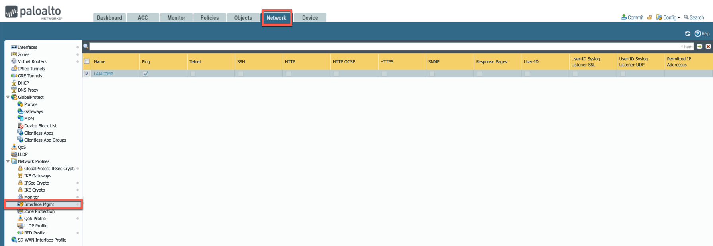
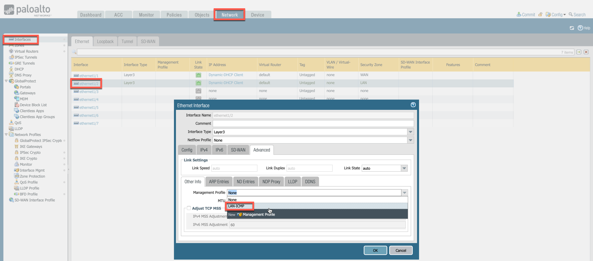
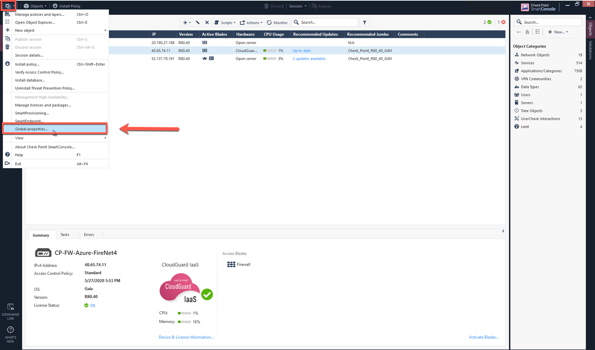
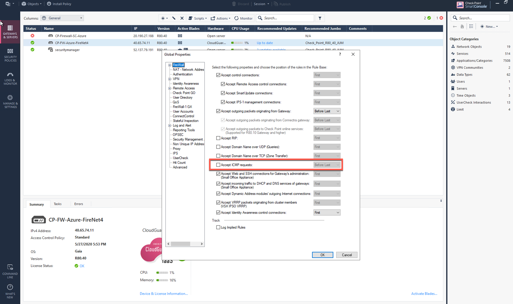
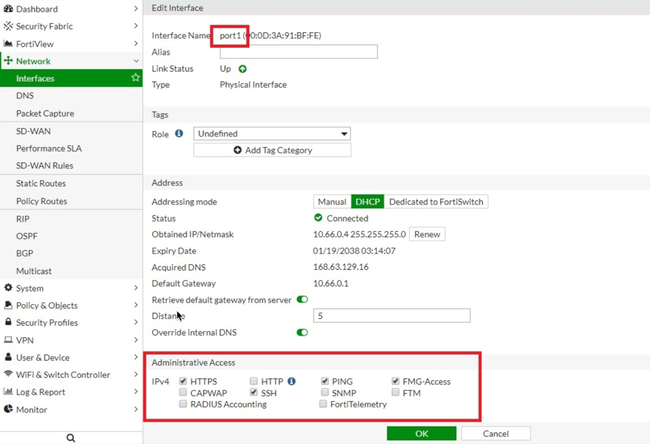

.. meta::
  :description: Firewall Network Advanced Config
  :keywords: AWS Transit Gateway, AWS TGW, TGW orchestrator, Aviatrix Transit network, Transit DMZ, Egress, Firewall, Firewall Network, FireNet

=========================================================
Firewall Network (FireNet) Advanced Config
=========================================================

Firewall Network (FireNet) Advanced Config applies to both AWS TGW-based FireNet and Aviatrix Transit FireNet.

For questions about FireNet, check out the `FireNet FAQ <https://docs.aviatrix.com/HowTos/firewall_network_faq.html>`_.
For questions on FireNet workflow, check out the `FireNet Workflow <https://docs.aviatrix.com/HowTos/firewall_network_workflow.html>`_.

For questions about Aviatrix Transit FireNet, check out `Transit FireNet FAQ <https://docs.aviatrix.com/HowTos/transit_firenet_faq.html#transit-firenet-faq>`_.
For questions on Aviatrix FireNet workflow, check out `Transit FireNet Workflow <https://docs.aviatrix.com/HowTos/transit_firenet_workflow.html#transit-firenet-workflow-for-aws-azure>`_.

Traffic Inspection
------------------------------------------------

You can enable and disable traffic inspection. When traffic inspection is disabled, FireNet Gateway loops back all packets.

Egress through Firewall
-----------------------------------

This is to enable Internet-bound egress traffic for inspection.

To configure, go to Controller > Firewall Network > Advanced. Select one firewall domain and click the 3-dots skewer to the detail page. 
At Egress through Firewall, click **Enable**. 

Egress Static CIDRs
-----------------------

You can allow egress to a subset of your IP address space from your on-prem data center to the Internet with Aviatrix Egress FireNet. Static CIDR egress is supported on Aviatrix Transit and AWS Transit Gateways (TGW). Up to 20 subnets are supported.

Network List Excluded From East-West Inspection
-------------------------------------------------------------------

By default, FireNet inspects all East-West (VPC/VNet to VPC/VNet) traffic but you may have an instance in the VPC/VNet which you do not want to be inspected. For example, the Aviatrix Controller deployed in the Shared Service VPC/VNet to be excluded from inspection while Shared Service VPC/VNet traffic is inspected. This improves the Controller reachability by not subjecting the Controller access to unintentional firewall policy errors.

Put the CIDRs in the field **"Network List Excluded From East-West Inspection"** to exclude from being inspected by the firewall.

.. Note::

    1. Maximum 50 CIDRs coma-separated are supported.
    2. CIDRs are excluded from East-West inspections only.
    3. In Transit FireNet, if Egress inspection is enabled, all the Egress traffic will get inspected by the firewall even for the CIDRs excluded for East-West inspection.

Firewall Hashing
--------------------------

Firewall Network solution supports two hashing types:
    - Five-tuple and
    - Two-tuple.

By default, AWS TGW-based FireNet and Aviatrix Transit FireNet use 5-tuple hashing algorithm (source IP, source port, destination IP, destination port and protocol type) to load balance the traffic across different firewall. However, user has an option to select two-tuple (source IP and destination IP) hashing algorithm to map traffic to the available firewalls.

Keep Alive via Firewall LAN Interface (AWS)
---------------------------------------------

For AWS, the LAN or Management interface can be used for firewall health check and failure detection.

See `below <#checking-firewall-health-in-azure-and-gcp>`_ for information on performing health checks in Azure and GCP.

By default, Aviatrix Controller checks the health of a firewall in AWS by pinging the firewall's management IP address. Starting in version 6.0, you can also check the AWS firewall instance’s health by pinging its LAN interface from the connecting Aviatrix FireNet Gateway. This is an alternative approach which improves firewall failure detection time and detection accuracy.

The FireNet Gateway pings the firewall instance's LAN interface every 5 seconds with a ping time out of 20ms. If the first ping times out, it immediately pings again. Two consecutive ping failures indicate that the firewall is in 'down' state and it is detached from the FireNet Gateway pool. The ping function continues and once it detects that the firewall instance has come up (pings are successful), it is attached back to the FireNet Gateway pool. 

With LAN interface pinging, the firewall instance fail over time is reduced. 

The following details describe how to enable ping on the firewall instance LAN interface. 

Enabling ICMP on Firewall Devices
^^^^^^^^^^^^^^^^^^^^^^^^^^^^^^^^^^^^^^^^^^^^^^^^

**Palo Alto Network**
~~~~~~~~~~~~~~~~~~~~~~

Go to Network > Network Profiles > Interface Mgmt and create profile to allow ping.

|pan_network_profile|

Next, Go to Network > Interfaces, select **Ethernet 1/2**, go to the Advanced tab > Management Profile and select the profile just created in the step above.

|pan_lan_attach|

Commit changes

**Panoroma**
~~~~~~~~~~~~~~~~~

Configure stack similar to Palo Alto Network shown above.

**Check Point**
~~~~~~~~~~~~~~~~~~~~~

Go to SmartConsole > Global Properties > Firewall > Accept ICMP requests.

|cp_ping_enable_1|

|cp_ping_enable_2|

**Fortigate (Fortinet)**
~~~~~~~~~~~~~~~~~~~~~~~~~~`

Go to Network > Interfaces > Edit Interface > Mark the **Ping** checkbox.

|fortigate_example_ping|

Configuring Aviatrix Controller
^^^^^^^^^^^^^^^^^^^^^^^^^^^^^^^^^^^^^^^^^

Go to Firewall Network > Advanced > Click the 3 vertical dots as shown below:

|firewall_advanced_lan_1|

The expanded view shows the firewall deployed by the Aviatrix Controller and towards the end of screen shot, one can enable/disable LAN side Health Check.

|firewall_advanced_lan_ping|

Verifying LAN Side ICMP Health Check
^^^^^^^^^^^^^^^^^^^^^^^^^^^^^^^^^^^^^^^^^^^^^^^
In this example, AWS and Check Point used to demonstrate the functionality as shown below:

|example_topology_lan_ping|

Go to Check Point logs and Monitoring section, notice that the ICMP health check is initiated every 5 seconds from the Aviatrix Transit FireNet Gateways. The 5 second setting is the default and cannot be changed.

|cp_icmp_lan_example|

Checking Firewall Health in Azure and GCP
-----------------------------------------

Enabling Transit FireNet for Azure or GCP automatically creates Load Balancers in those CSPs. HTTPS in these Load Balancers perform the firewall health check (not ping). You must disable ping in the interface management profile of your Azure or GCP firewalls. 

In Azure:

- You can check the health probe status under Monitor > Metrics. See `this article <https://docs.microsoft.com/en-us/azure/load-balancer/load-balancer-standard-diagnostics>`_ for more information.
- The State column on the Gateway page in the Aviatrix Controller only reflects if the firewall is up or not. It does not reflect if the firewall is responding to health checks. You must check the health of the firewall in the Azure portal.

In GCP: 

- You can check the health status of the backend under Network services > Load balancing > Load balancer details. See `this article <https://cloud.google.com/load-balancing/docs/health-check-concepts#lb_guide>`_ for more information.
- The State column on the Gateway page in the Aviatrix Controller reflects the health status of the firewall from the GCP load balancer.

.. disqus::
