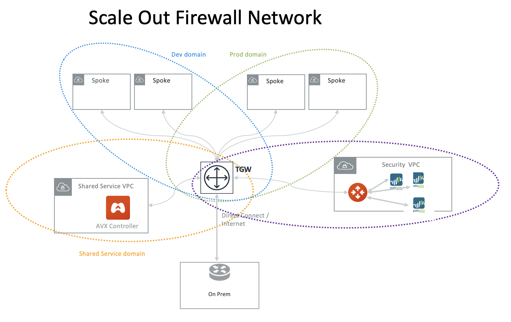

.. meta::
  :description: Transit DMZ FAQ	
  :keywords: AWS Transit Gateway, AWS TGW, TGW orchestrator, Aviatrix Transit network, Firewall, DMZ, Cloud DMZ

=========================================================
Firewall Network
=========================================================

For enterprises that wish to deploy firewall in AWS, Aviatrix's FireNet deployment model provides the best performance and automation. 

Benefits of FireNet Deployment Model
----------------------------------------------------------------------------------------

 - **Full Traffic Inspection** With FireNet, North South (on-prem and cloud), East West (VPC to VPC) and Internet bound egress traffic can be inspected by firewall instances.
 - **No IPSEC Tunnels** No IPSEC tunnels connecting to firewall instances as opposed to ECMP VPN deployment model, maximizing each firewall instance throughput.
 - **No SNAT** No SNAT function required to be performed by firewall instances for east west traffic inspection as opposed to the ECMP VPN deployment model, resulting in instances in Spoke VPCs having complete visibility of source traffic.
 - **Scale Out** Multiple firewall instances can be deployed as a group to meet the demand of increasing workload. 

 - **Policy Driven** Policy driven workflow allows you to customize which VPCs traffic should be inspected. 
 - **Vendor Integration** Launch Palo Alto Networks VM-Series from the Aviatrix Controller console to simplify deployment. 
 - **Automation** The Aviatrix Controller automatically updates Palo Alto VM-Series route tables when on-prem route changes or VPC attachment changes. 

FireNet Deployment Model 1 - Transit VPC
---------------------------------------------------

FireNet supports AWS Transit Gateway (TGW), as shown below. 

|firenet_transit|

FireNet Deployment Model 2 - Insane Mode
----------------------------------------------

FireNet supports AWS Transit (TGW) with Insane Mode,  

|firenet_insane|

FireNet Deployment Model 3 (Future release)
----------------------------------------------

In the future release, the hybrid deployment can be using native AWS Direct Connect Gateway. 

|firenet|

What is the problem with deploying firewall instances with ECMP?
------------------------------------------------------------------

AWS Transit Gateway (TGW) supports VPN with ECMP load balancing. With its capability, you can launch multiple firewall instances in a load balanced fashion 
for Egress Inspection and VPC to VPC traffic inspection. The problem with this deployment is performance. The IPSEC tunnel limits each firewall instance
to be capped at 1Gbps. When this architecture is deployed for VPC to VPC inspection, traffic goes through VGW (the other end of the IPSEC tunnel) twice, 
further reducing its throughput to 400Mbps. What this implies is that each firewall instance can only operate at 400Mpbs throughput. This is 
much lower than what firewall instances can do without IPSEC tunnel.

How to migrate from Aviatrix FireNet to FireNet with AWS GWLB?
---------------------------------------------------------------------------------

Starting 6.3, Aviatrix added the support for AWS Gateway Load Balancer (GWLB) and allowing users to migrate from FireNet to FireNet with AWS GWLB or vice versa. Follow the below steps for migration:

    1. Disassociate Firewall Instance -> Go to Aviatrix Controller's console -> FIREWALL NETWORK -> Setup -> Step 10.
    #. Disable FireNet Function -> Go to Aviatrix Controller's console -> FIREWALL NETWORK -> Step 11a to disable Aviatrix Gateway FireNet Function.
    #. Enable Transit FireNet Function -> Go to Aviatrix Controller's console -> FIREWALL NETWORK -> Step 5a to enable the Aviatrix Gateway for FireNet Function. Check "Use AWS GWLB" if migrating from Aviatrix FireNet to FireNet with AWS GWLB.
    #. Associate Existing Firewall -> Go to Aviatrix Controller's console -> FIREWALL NETWORK -> Step 7b.

 .. note::
    Vendor integration is required in some cases to populate the RFC 1918 or non-RFC 1918 to the firewall appliance for successful migration. Go to Aviatrix Controller's console -> FIREWALL NETWORK -> Vendor Integration, provide the firewall information and do the Save, Show and Sync operations.

How to migrate from AWS Native Firewall Network solution to Aviatrix FireNet solution or vice versa ?
----------------------------------------------------------------------------------------------------------------

Those scenarios are not supported. You need to un-deploy everything and re-deploy it.

.. |firenet_transit| image:: firewall_network_media/firenet_transit.png
   :scale: 30%

.. |firenet_insane| image:: firewall_network_media/firenet_insane.png
   :scale: 30%

.. |main_companion_gw| image:: transit_dmz_media/main_companion_gw.png
   :scale: 30%

.. |main_companion_subnets| image:: transit_dmz_media/main_companion_subnets.png
   :scale: 30%

.. disqus::
