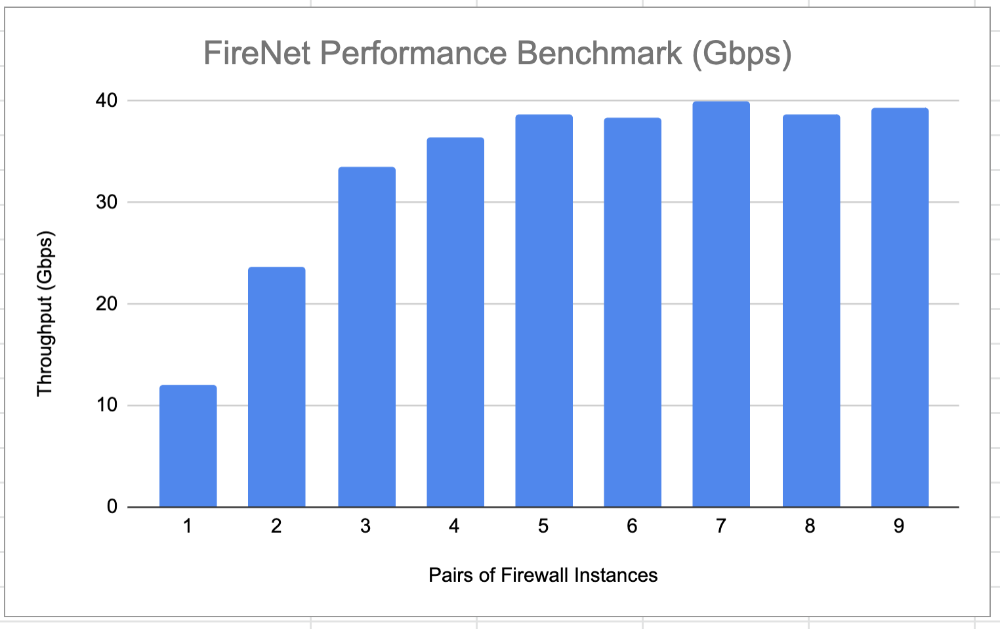
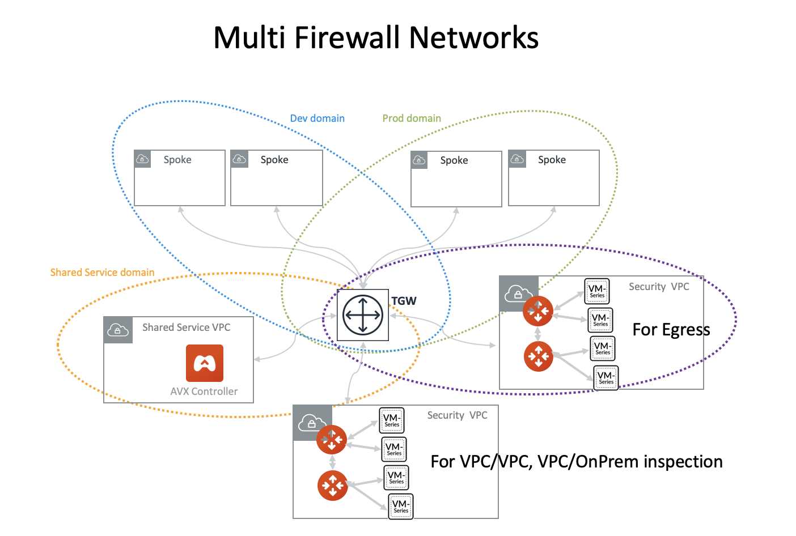

.. meta::
  :description: Firewall Network FAQ	
  :keywords: AWS Transit Gateway, AWS TGW, TGW orchestrator, Aviatrix Transit network, Firewall, DMZ, Cloud DMZ, Firewall Network, FireNet

=========================================================
Firewall Network Design Patterns
=========================================================

1. Hybrid with TGW
---------------------------------------------------

FireNet supports AWS Transit Gateway (TGW), as shown below. 

|firenet_transit|

2. Hybrid with Insane Mode
--------------------------------------------------------

FireNet supports AWS Transit (TGW) with Insane Mode,  

|firenet_insane|

3. Native TGW integration
------------------------------------------------------------------

In the Release 4.6, the hybrid deployment can be using native AWS Direct Connect Gateway. 

|firenet|

4. Multi Region Transit with Native TGW integration 
---------------------------------------------------------------------------------

Connect to on-prem with AWS DXGW and use Aviatrix Edge gateway to connect to multiple regions.

|multi_region_firewall|

5. Multi Region Transit with Aviatrix Edge
------------------------------------------------------------------------

Connect to on-prem with an Aviatrix Edge gateway for both hybrid and multi regions.

|multi_region_aviatrix_edge|

6. Two Firewall Networks 
--------------------------------------------------------

You can deploy two Firewall Networks, one dedicated for VPC to VPC traffic inspection and another for Ingress/Egress
inspection.

When Ingress inspection is deployed, make sure you enable SNAT on the firewall instance to source NAT the private 
IP address of NLB or a third party load balancer the IP address of LAN (or Trusted) interface of the FireNet. 

Note you must follow the configuration sequence below:

 1. Disable the Traffic Inspection of the FireNet domain for Ingress/Egress.
 #. Enable Egress Control for FireNet domain for Ingress/Egress. 
 #. Build connection policies. 

|multi_firewall|

7. Ingress/Egress Traffic Inspection
-----------------------------------------------------------------

|firenet_ingress_egress|

8. Aviatrix FQDN in FireNet for Egress Control
-------------------------------------------------

|fqdn_in_firenet|

.. |firewall_network| image:: firewall_network_faq_media/firewall_network.png
   :scale: 30%

.. |firewall_deploy| image:: firewall_network_faq_media/firewall_deploy.png
   :scale: 30%

.. |multi_region_firewall| image:: firewall_network_faq_media/multi_region_firewall.png
   :scale: 30%

.. |multi_region_aviatrix_edge| image:: firewall_network_faq_media/multi_region_aviatrix_edge.png
   :scale: 30%

.. |firenet_ingress_egress| image:: firewall_network_faq_media/firenet_ingress_egress.png
   :scale: 30%

.. |firenet| image:: firewall_network_media/firenet.png
   :scale: 30%

.. |firenet_transit| image:: firewall_network_media/firenet_transit.png
   :scale: 30%

.. |firenet_insane| image:: firewall_network_media/firenet_insane.png
   :scale: 30%

.. |private_interfaces| image:: firewall_network_workflow_media/private_interfaces.png
   :scale: 30%

.. |fqdn_in_firenet| image:: firewall_network_workflow_media/fqdn_in_firenet.png
   :scale: 30%

.. disqus::
