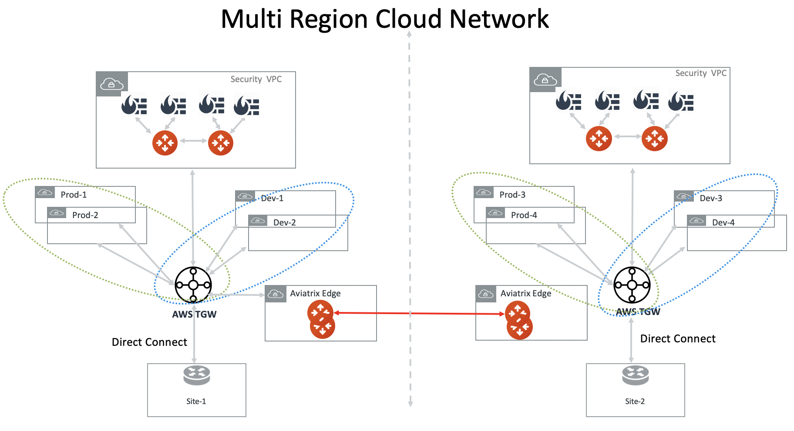
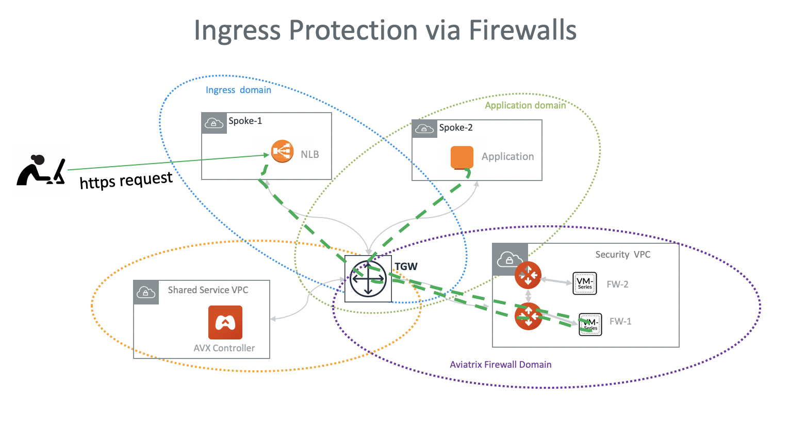

.. meta::
  :description: Firewall Network FAQ	
  :keywords: AWS Transit Gateway, AWS TGW, TGW orchestrator, Aviatrix Transit network, Firewall, DMZ, Cloud DMZ, Firewall Network, FireNet

=========================================================
Firewall Network Design Patterns
=========================================================

1. Hybrid with TGW
---------------------------------------------------

FireNet supports AWS Transit Gateway (TGW), as shown below. 

|firenet_transit|

2. Hybrid with Insane Mode
--------------------------------------------------------

FireNet supports AWS Transit (TGW) with Insane Mode,  

|firenet_insane|

3. Native TGW integration
------------------------------------------------------------------

In the Release 4.6, the hybrid deployment can be using native AWS Direct Connect Gateway. 

|firenet|

4. Multi Region Transit with Native TGW integration 
---------------------------------------------------------------------------------

Connect to on-prem with AWS DXGW and use Aviatrix Edge gateway to connect to multiple regions.

|multi_region_firewall|

5. Multi Region Transit with Aviatrix Edge
------------------------------------------------------------------------

Connect to on-prem with an Aviatrix Edge gateway for both hybrid and multi regions.

|multi_region_aviatrix_edge|

6. Two Firewall Networks 
--------------------------------------------------------

You can deploy two Firewall Networks, one dedicated for VPC to VPC traffic inspection and another for Egress
inspection.

Note you must follow the configuration sequence below:

 1. Disable the Traffic Inspection of the FireNet domain intended for Egress control.
 #. Enable Egress Control for FireNet domain intended for Egress control. 
 #. Build connection policies. 

|multi_firewall|

7. Ingress Traffic Inspection
-----------------------------------------------------------------

Follow the `Ingress firewall instructions <https://docs.aviatrix.com/HowTos/ingress_firewall_example.html>`_ to deploy the solution for Ingress traffic inspection. 

|ingress_firewall|

8. Aviatrix FQDN in FireNet for Egress Control
-------------------------------------------------

When Aviatrix FQDN gateway is deployed in a VPC, it uses a public IP address to perform both whitelisting and NAT function 
for Internet bound traffic. Sometimes these Internet bound traffic are partner API calls and these partners require to 
limit the number of IP addresses for each customer of theirs. In such situation, you can deploy FQDN in a centralized 
manner as shown in the diagram below. 

|fqdn_in_firenet|

9. Ingress Directly through Firewall
---------------------------------------

Another often configured Ingress Egress design pattern is to have the traffic forward to firewall instances
directly as shown in the diagram below. In this design pattern, each firewall instance must configure SNAT on its LAN interface 
that connects to the Aviatrix FireNet gateway. The draw back of this design is source IP address is not preserved when traffic reaches
the application. If you need to preserve source IP address, refer to `this recommended design for Ingress <https://docs.aviatrix.com/HowTos/firewall_network_design_patterns.html#ingress-traffic-inspection>`_.

|firenet_ingress_egress| 

For more information, follow the `FireNet workflow <https://docs.aviatrix.com/HowTos/firewall_network_workflow.html#firewall-network-firenet-workflow>`_. 

10. Central Egress in a Multi Region Deployment
--------------------------------------------------------

Since the default routes are propagated over the Aviatrix Transit Gateway peering, you can consolidate the Internet bound egress traffic to the 
firewalls in one region, as shown in the diagram below. 

|central_egress|

11. Distributed Egress in a Multi Region Deployment
------------------------------------------------------

If you need to have a distributed egress for each region, make sure you filter out the default route 0.0.0.0/0 when you build 
the Aviatrix Transit Gateway peering, as shown in the diagram below. 

|multi_egress|

.. |firewall_network| image:: firewall_network_faq_media/firewall_network.png
   :scale: 30%

.. |firewall_deploy| image:: firewall_network_faq_media/firewall_deploy.png
   :scale: 30%

.. |multi_region_aviatrix_edge| image:: firewall_network_faq_media/multi_region_aviatrix_edge.png
   :scale: 30%

.. |firewall_network_perf| image:: firewall_network_faq_media/firewall_network_perf.png
   :scale: 30%

.. |multi_firewall| image:: firewall_network_faq_media/multi_firewall.png
   :scale: 30%

.. |firenet| image:: firewall_network_media/firenet.png
   :scale: 30%

.. |firenet_transit| image:: firewall_network_media/firenet_transit.png
   :scale: 30%

.. |firenet_insane| image:: firewall_network_media/firenet_insane.png
   :scale: 30%

.. |central_egress| image:: firewall_network_media/central_egress.png
   :scale: 30%

.. |multi_egress| image:: firewall_network_media/multi_egress.png
   :scale: 30%

.. |private_interfaces| image:: firewall_network_workflow_media/private_interfaces.png
   :scale: 30%

.. |fqdn_in_firenet| image:: firewall_network_workflow_media/fqdn_in_firenet.png
   :scale: 30%

.. disqus::
