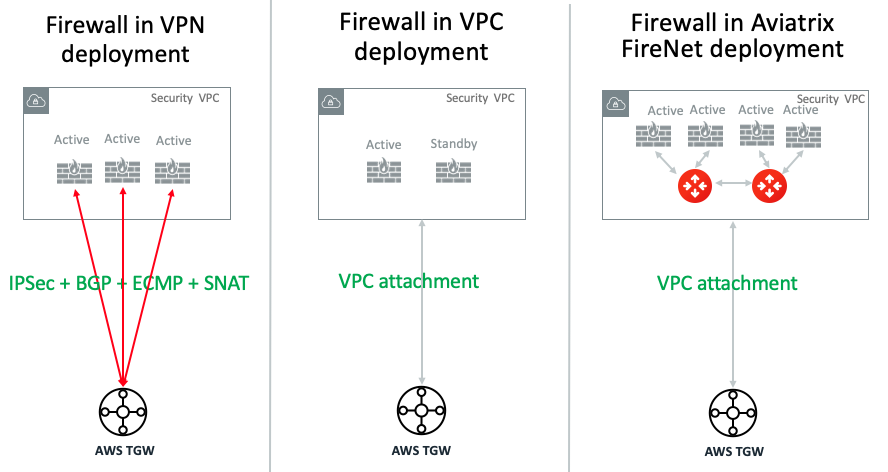

.. meta::
  :description: Firewall Network FAQ	
  :keywords: AWS Transit Gateway, AWS TGW, TGW orchestrator, Aviatrix Transit network, Firewall, DMZ, Cloud DMZ, Firewall Network, FireNet

=========================================================
Firewall Network FAQ
=========================================================

What is Aviatrix Firewall Network (FireNet)?
----------------------------------------------

Aviatrix Firewall Network (FireNet) is a turn key network solution to deploy firewall instances in the 
cloud, as shown in the diagram below. 

|firewall_network|

FireNet significantly simplifies firewall instances deployment, allows the firewall instances to inspect 
VPC to VPC (East West) traffic, VPC to Internet (Egress) traffic, VPC to on-prem (North South) traffic. 

In addition, FireNet allows you to scale firewall deployment to multi AZ and multi instances in active/active state.

How does Aviatrix FireNet compare with the native deployment in AWS Transit Gateway?
--------------------------------------------------------------------------------------

There are two native deployments: TGW VPN to connect to firewall or TGW VPC attachment to connect to firewall. 

The three different deployment model is illustrated in the diagram below. 

|firewall_deploy|

If AWS Transit Gateway connects to firewall by using its built in VPN function. It requires to run IPSec and BGP. If you run more than one firewall instances by using ECMP, each firewall instance must configure SNAT function to
ensure both source and destination initiated traffic lands on the same firewall instance. Further more, since native deployment requires IPSec VPN which limits its performance to 1Gbps, and in this scenario the per firewall instance can only perform at 500Mbps since VPN function is traversed twice.

A more detailed functional comparison is described in the table below. 

=========================================       ==================================      ==============================    =================================
**Firewall Deployment Functions**               **Firewall in VPN deployment**          **Firewall in VPC attachment**    **Firewall in Aviatrix FireNet**
=========================================       ==================================      ==============================    =================================
On-prem to VPC traffic inspection               Yes                                     Yes                               Yes
VPC to VPC traffic inspection                   Yes (requires SNAT)                     Yes                               Yes
Egress traffic inspection                       Yes                                     Yes                               Yes
Per firewall performance                        500Mpps                                 Up to 6Gbps                       Up to 6Gbsp
Multiple firewalls (scale out)                  Yes                                     No (Active/Standby)               Yes
Integrated solution                             Yes                                     No (requires external script)     Yes        
Solution complexity                             High                                    Medium                            Low
Centrally managed                               Yes                                     No (requires external script)     Yes
Multi vendor support                            Yes                                     Yes                               Yes
=========================================       ==================================      ==============================    =================================

What are the Benefits of FireNet Deployment Model?
----------------------------------------------------------------------------------------

For enterprises that wish to deploy firewall in AWS, Aviatrix’s FireNet deployment model provides the best performance and automation.

 - **Simplicity** Aviatrix Firewall Network significantly simplifies firewall deployment in the cloud while providing the maximum performance and scale. 
 - **Full Traffic Inspection** With FireNet, North South (on-prem and cloud), East West (VPC to VPC) and Internet bound egress traffic can be inspected by firewall instances.
 - **No IPSEC Tunnels** No IPSEC tunnels connecting to firewall instances as opposed to ECMP VPN deployment model, maximizing each firewall instance throughput.
 - **No SNAT** No SNAT function required to be performed by firewall instances for east west traffic inspection as opposed to the ECMP VPN deployment model, resulting in instances in Spoke VPCs having complete visibility of source traffic.
 - **No BGP** Firewall does not need to run BGP. All routes programming is done by the Controller through Palo Alto APIs.
 - **Scale Out** Multiple firewall instances can be deployed as a group to meet the demand of increasing workload. 

 - **Policy Driven** Policy driven workflow allows you to customize which VPCs traffic should be inspected. 
 - **Vendor Integration** Launch Palo Alto Networks VM-Series from the Aviatrix Controller console to simplify deployment. 
 - **Automation** The Aviatrix Controller automatically updates Palo Alto VM-Series route tables when on-prem route changes or VPC attachment changes. 

Is FireNet solution recommended by Palo Alto Networks?
-------------------------------------------------------

Yes. Aviatrix is a technology `partner of Palo Alto Networks. <https://www.paloaltonetworks.com/partners/alliance>`_ Palo Alto has published the `joint solution brief. <https://www.paloaltonetworks.com/content/dam/pan/en_US/assets/pdf/technology-solutions-briefs/palo-alto-networks-and-aviatrix.pdf>`_

Does FireNet work with other firewall appliances?
--------------------------------------------------

Yes. FireNet solution has been validated to work with Checkpoint and FortiGate. 

Click `here <https://drive.google.com/file/d/1uP77VMbTusAZFHRp0i3PKBP-lh-GAMqz/view>`_ for Checkpoint instructions.
Click `here <https://docs.google.com/document/d/1SK6Yp9qPtyqsCbZInGf_1ofATJcqqFqTHhm5vv_qx9w/edit>`_ for FortiGate instructions.

How is Firewall Network different from Transit DMZ?
------------------------------------------------------

Firewall Network is the new iteration from Transit DMZ. FireNet decouples the firewall deployment from the
path between on-prem and Aviatrix Transit VPC, yet provides the same traffic inspection functions and more 
scale out capabilities. 

How Does Aviatrix Security Domains work with FireNet?
--------------------------------------------------------

Aviatrix `Security Domain <https://docs.aviatrix.com/HowTos/tgw_faq.html#what-is-a-security-domain>`_ builds on the 
AWS Transit Gateway (TGW) route domain concepts. It provides isolation and segmentation between VPCs. With Aviatrix Security Domains, you can create a group of VPCs with similar security requirements.

There are situations where additional security measure, such as packet inspection, is required, that is, you need
to deploy firewall for certain VPCs. FireNet provides the network solution that simplifies firewall deployment and scale. 

 1. Deploy the Aviatrix FireNet in a special Security Domain with Firewall Domain attribute. 
 #. If a Security Domain has a connection policy to the Firewall Domain, then traffic going in and out of the each VPC member in that Security Domain will first be forwarded to the Firewall for inspection. In another words, the connection policy specifies which domain (or a group of VPCs) will be inspected by firewall. 
 #. VPC to VPC traffic in the same Security Domain is not inspected. 

What are the use cases for FireNet?
-------------------------------------

Example 1. VPC with PCI data
##############################

If you have a VPC that deploys applications that host Personal Information or PCI data and your compliance requries
packet inspection, you can create a Security Domain where this VPC is attached. Specify a connection policy for this 
Security Domain to connect to Firewall Domain. All packets to and from this VPC will be inspected. 

Example 2. Production VPCs
###########################

You may decide to inspect all traffic from the production data, and the production data resides in multiple VPCs. In this case you can create a Security Domain that all these VPCs attached to it. Then use connection policy to connect this 
domain to the firewall domain. 

What are the limitations of FireNet?
-------------------------------------

In Release 4.3, FireNet only supports the AWS Transit Gateway (TGW) deployment scenario. It does not support the encrypted transit deployment scenario. 

For the most cases, There can only be one Firewall Domain in a TGW. 

How does FireNet compare with ECMP/VPN based firewall deployment?
-------------------------------------------------------------------

AWS Transit Gateway (TGW) supports VPN with ECMP load balancing. With is capability, you can launch multiple firewall instances in a load balanced fashion
for Egress Inspection and VPC to VPC traffic inspection. 

One problem with this deployment is performance. The IPSEC tunnel limits each firewall instance
to be capped at 1Gbps. When this architecture is deployed for VPC to VPC inspection, traffic goes through VGW (the other end of the IPSEC tunnel) twice,
further reducing its throughput to 500Mbps. What this implies is that each firewall instance can only operate at 400Mpbs throughput. This is
much lower than what firewall instances can do without IPSEC tunnel.

Another problem is for east west traffic inspection, firewall instance must NAT the source address, otherwise the return traffic is not guaranteed to go through the same firewall instance. This is because ECMP 
makes independent decision of distributing the traffic the firewall instances for each direction of
the traffic.  

What is the minimum gateway instance size for FireNet deployment?
--------------------------------------------------------------------

The minimum gateway instance size is C5.xlarge. This is because FireNet gateway requires 4 network 
interfaces: 

 - eth0 as management interface
 - eth1 as TGW interface
 - eth2 as firewall instance interface
 - eth3 as the HA FireNet gateway interface

How does FireNet work?
-----------------------

Take an example for a VPC1 to VPC2 traffic inspection, where VPC1 and VPC2 are attached to the same TGW. 

As a packet from VPC1 arrives at FireNet gateway via TGW, it does a 4-tuple 
(source IP, destination IP, source port and destination port) hash calculation to decide if it should
forward the packet to one of the associated firewall instances or forward to the HA FireNet gateway.  

If hash calculation determines the firewall instance is associated with the HA FireNet gateway, it forwards the packet to the HA FireNet gateway through eth3 interface. 

When HA FireNet gateway receives the packet, it performs the exactly same hash calculation and decide which 
associated firewall instance it should forward the traffic to. 

How to configure FireNet?
---------------------------

Follow the `FireNet workflow <https://docs.aviatrix.com/HowTos/firewall_network_workflow.html>`_ to deploy firewall in the cloud. 

How to enable Egress inspection on FireNet?
---------------------------------------------

By default, FireNet inspect traffic between North South (on-prem and VPC) and East West (VPC to VPC). To enable
Egress traffic (Internet bound) inspection, 

Go to Firewall Network -> Advanced. Click the skewer. Scroll down to "Egress through Firewall" and click Enable.

Is there an example guide to setup Palo Alto VM-Series policies?
------------------------------------------------------------------

Yes. Follow `Example Config for Palo Alto VM-Series <https://docs.aviatrix.com/HowTos/config_paloaltoVM.html>`_ to 
setup an "ALLOW ALL" policy for test validation.

How do I test FireNet connectivity without deploying firewall instance?
-------------------------------------------------------------------------

You can test connectivity without deploying any firewall instance. When FireNet gateway has no firewall instance 
attached to it for the data path, the FireNet gateway loops the received packet and forward to destination.

Follow the FireNet workflow to complete Step 1, 2, 3, 4, 5, 6 and 8. 

If you have instance in VPC/Domain and another instance in a different VPC/Domain, and you specify connection policy between the Domains and one Domain to connect to Firewall Domain, then you should be able to ping the 
two instances. 

FireNet Deployment Model 1 - Hybrid with TGW
---------------------------------------------------

FireNet supports AWS Transit Gateway (TGW), as shown below. 

|firenet_transit|

FireNet Deployment Model 2 - Hybrid with Insane Mode
--------------------------------------------------------

FireNet supports AWS Transit (TGW) with Insane Mode,  

|firenet_insane|

FireNet Deployment Model 3 (Release 4.6 available by 5/30/2019)
------------------------------------------------------------------

In the Release 4.6, the hybrid deployment can be using native AWS Direct Connect Gateway. 

|firenet|

.. |firewall_network| image:: firewall_network_faq_media/firewall_network.png
   :scale: 30%

.. |firenet| image:: firewall_network_media/firenet.png
   :scale: 30%

.. |firenet_transit| image:: firewall_network_media/firenet_transit.png
   :scale: 30%

.. |firenet_insane| image:: firewall_network_media/firenet_insane.png
   :scale: 30%

.. |main_companion_gw| image:: transit_dmz_media/main_companion_gw.png
   :scale: 30%

.. |main_companion_subnets| image:: transit_dmz_media/main_companion_subnets.png
   :scale: 30%

.. disqus::
