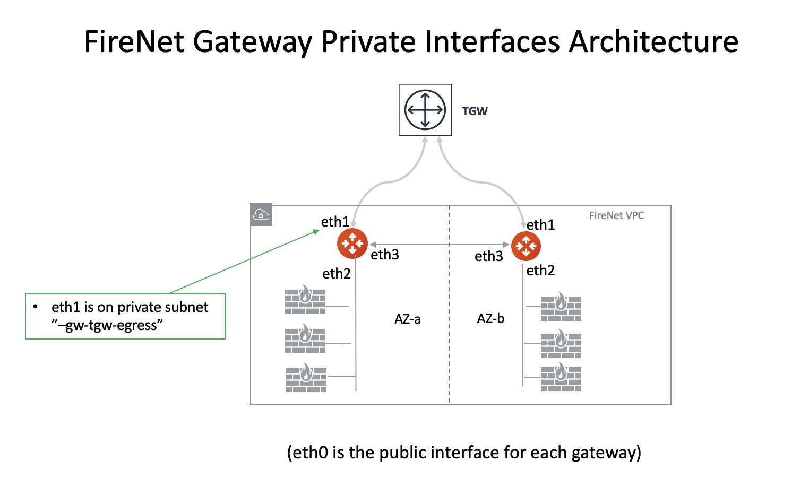
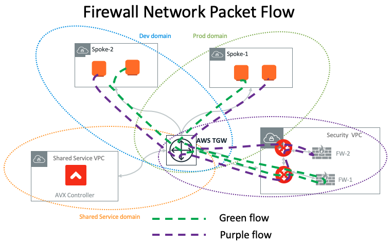

.. meta::
  :description: Firewall Network FAQ	
  :keywords: AWS Transit Gateway, AWS TGW, TGW orchestrator, Aviatrix Transit network, Firewall, DMZ, Cloud DMZ, Firewall Network, FireNet

=========================================================
Firewall Network (FireNet) FAQ
=========================================================

What is Aviatrix Firewall Network (FireNet)?
----------------------------------------------

Aviatrix Firewall Network (FireNet) is a turn key network solution to deploy firewall instances in the 
cloud, as shown in the diagram below. 

|firewall_network|

FireNet significantly simplifies firewall instance deployment and allows the firewall instances to inspect 
VPC to VPC (East West) traffic, VPC to Internet (Egress) traffic, and VPC to on-prem (North South) traffic. 

In addition, FireNet allows you to scale firewall deployment to multi AZ and multi instances in active/active state.

How does Aviatrix FireNet compare with the native deployment in AWS Transit Gateway?
--------------------------------------------------------------------------------------

There are two native deployments: TGW VPN to connect to firewall or TGW VPC attachment to connect to firewall. 

The three different deployment models are illustrated in the diagram below. 

|firewall_deploy|

If an AWS Transit Gateway connects to a firewall by using its built in VPN function, it must run IPSec and BGP. If you run more than one firewall instances by using ECMP, each firewall instance must configure SNAT function to
ensure that both source and destination initiated traffic lands on the same firewall instance. Furthermore, since native deployment requires an IPSec VPN which limits its performance to 1Gbps, in this scenario a single firewall instance can only perform at 500Mbps since the VPN function is traversed twice.

A more detailed functional comparison is described in the table below. 

=========================================       ==================================      ==============================    =================================
**Firewall Deployment Functions**               **Firewall in VPN deployment**          **Firewall in VPC attachment**    **Firewall in Aviatrix FireNet**
=========================================       ==================================      ==============================    =================================
On-prem to VPC traffic inspection               Yes                                     Yes                               Yes
VPC to VPC traffic inspection                   Yes (requires SNAT)                     Yes                               Yes
Egress traffic inspection                       Yes                                     Yes                               Yes
Per firewall performance                        500Mbps                                 Up to 6Gbps                       Up to 6Gbps
Total FireNet performance                       > 500Mbps                               Up to 6Gbps                       40Gbps
Multiple firewalls (scale out)                  Yes                                     No (Active/Standby)               Yes
Integrated solution                             Yes                                     No (requires external script)     Yes        
Solution complexity                             High                                    Medium                            Low
Centrally managed                               Yes                                     No (requires external script)     Yes
Multi vendor support                            Yes                                     Yes                               Yes
=========================================       ==================================      ==============================    =================================

What are the Benefits of FireNet Deployment Model?
----------------------------------------------------------------------------------------

For enterprises that wish to deploy a firewall in AWS, Aviatrix’s FireNet deployment model provides the best performance and automation.

 - **Simplicity** The Aviatrix Firewall Network significantly simplifies firewall deployment in the cloud while providing the maximum performance and scale. 
 - **Full Traffic Inspection** With FireNet, North South (on-prem and cloud), East West (VPC to VPC) and Internet bound egress traffic can be inspected by firewall instances.
 - **No IPSEC Tunnels** There are no IPSEC tunnels connecting to firewall instances as opposed to ECMP VPN deployment model, maximizing each firewall instance throughput.
 - **No SNAT** SNAT function is not required to be performed by firewall instances for east west traffic inspection as opposed to the ECMP VPN deployment model, resulting in instances in Spoke VPCs having complete visibility of source traffic.
 - **No BGP** The Firewall does not need to run BGP. All routes programming is done by the Controller through Palo Alto APIs.
 - **Scale Out** Multiple firewall instances can be deployed as a group to meet the demand of increasing workload. 

 - **Policy Driven** Policy driven workflow allows you to customize which VPCs traffic should be inspected. 
 - **Vendor Integration** Launch Palo Alto Networks VM-Series from the Aviatrix Controller console to simplify deployment. 
 - **Automation** The Aviatrix Controller automatically updates Palo Alto VM-Series route tables when on-prem route changes or VPC attachment changes. 

Is the FireNet solution recommended by Palo Alto Networks?
--------------------------------------------------------------

Yes. Aviatrix is a technology `partner of Palo Alto Networks. <https://www.paloaltonetworks.com/partners/alliance>`_ Palo Alto has published the `joint solution brief. <https://www.paloaltonetworks.com/content/dam/pan/en_US/assets/pdf/technology-solutions-briefs/palo-alto-networks-and-aviatrix.pdf>`_

Does FireNet work with other firewall appliances?
--------------------------------------------------

Yes. FireNet solution has been validated to work with `Checkpoint <https://docs.aviatrix.com/HowTos/config_Checkpoint.html>`_, 
`FortiGate <https://docs.aviatrix.com/HowTos/config_FortiGate.html>`_ and `Barracuda CloudGen Firewall <https://docs.aviatrix.com/HowTos/config_Barracuda.html>`_. 

How is Firewall Network different from Transit DMZ?
------------------------------------------------------

Firewall Network is the new iteration from Transit DMZ. FireNet decouples the firewall deployment from the
path between on-prem and Aviatrix Transit VPC, yet provides the same traffic inspection functions and more 
scale out capabilities. 

How Does Aviatrix Security Domains work with FireNet?
--------------------------------------------------------

Aviatrix `Security Domain <https://docs.aviatrix.com/HowTos/tgw_faq.html#what-is-a-security-domain>`_ builds on the 
AWS Transit Gateway (TGW) route domain concepts. It provides isolation and segmentation between VPCs. With Aviatrix Security Domains, you can create a group of VPCs with similar security requirements.

There are situations where additional security measures such as packet inspection are required. That is, you need
to deploy a firewall for certain VPCs. FireNet provides the network solution that simplifies firewall deployment and scale. 

 1. Deploy the Aviatrix FireNet in a special Security Domain with a Firewall Domain attribute. 
 #. If a Security Domain has a connection policy to the Firewall Domain, then traffic going in and out of each VPC member in that Security Domain will first be forwarded to the Firewall for inspection. In other words, the connection policy specifies which domain (or a group of VPCs) will be inspected by the firewall. 
 #. VPC to VPC traffic in the same Security Domain is not inspected. 

What are the use cases for FireNet?
-------------------------------------

Example 1. VPC with PCI data
##############################

If you have a VPC that deploys applications that host Personal Information or PCI data and your compliance requires
packet inspection, you can create a Security Domain where this VPC is attached. Specify a connection policy for this 
Security Domain to connect to the Firewall Domain. All packets to and from this VPC will be inspected. 

Example 2. Production VPCs
###########################

You may decide to inspect all traffic from the production data, which resides in multiple VPCs. In this case you can create a Security Domain that all of these VPCs are attached to. Then use connection policy to connect this 
domain to the firewall domain. 

What are the limitations of FireNet?
-------------------------------------

In Release 4.3, FireNet only supports the AWS Transit Gateway (TGW) deployment scenario. It does not support the encrypted transit deployment scenario. 

You can have multiple Firewall Domains. However a Security Domain cannot be connected to two 
Firewall Domains except the case when one is for Ingress/Egress and another is for East-West and North-South inspection.

How does FireNet compare with ECMP/VPN based firewall deployment?
-------------------------------------------------------------------

AWS Transit Gateway (TGW) supports VPN with ECMP load balancing. With this capability, you can launch multiple firewall instances in a load balanced fashion
for Egress Inspection and VPC to VPC traffic inspection. 

One problem with this deployment is performance. The IPSEC tunnel limits each firewall instance
to be capped at 1Gbps. When this architecture is deployed for VPC to VPC inspection, traffic goes through the VGW (the other end of the IPSEC tunnel) twice,
further reducing its throughput to 500Mbps. What this implies is that each firewall instance can only operate at 400Mpbs throughput. This is
much lower than what firewall instances can do without an IPSEC tunnel.

Another problem is that for east west traffic inspection, the firewall instance must NAT the source address, otherwise the return traffic is not guaranteed to go through the same firewall instance. This is because ECMP 
makes the independent decision of distributing the traffic of the firewall instances for each direction of
the traffic.  

What is the minimum gateway instance size for FireNet deployment?
--------------------------------------------------------------------

The minimum gateway instance size is C5.xlarge. This is because the FireNet gateway requires 4 network 
interfaces: 

 - eth0 as a management interface
 - eth1 as a TGW interface
 - eth2 as a firewall instance interface
 - eth3 as the HA FireNet gateway interface

The private interfaces on FireNet gateway are described as below.

|private_interfaces|

Can TGW send packets to both FireNet gateways?
-------------------------------------------------

Yes. Both primary and HA FireNet gateways attach its eth1 ENI to TGW. When TGW forwards packets to the FireNet VPC, it
applies AZ affinity in the best effort manner. That is, packets coming from a source VPC instance in AZ-a will be
forwarded to the gateway whose ENI is in AZ-a.

For example, two FireNet gateways, gateway-1 and gateway-2, one has eth1 in AZ-a and the other is in AZ-b, respectively.
In a healthy state, both gateways receives traffic from TGW. A Spoke VPC traffic from AZ-a will be forwarded to gateway-1
eth1 ENI for processing. Spoke VPC traffic from AZ-b will be forwarded to gateway-2 for processing.

When gateway-1 goes down, the Controller detects the failure, the Controller then reprograms the default route entry
(0.0.0.0/0) of the route table that is associated with the gateway-1 eth1 subnet (with the name like -gw-tgw-ingress)
to point to the ENI of eth1 of the gateway-2 (its subnet should have a name like -gw-hagw-tgw-ingress), thus redirecting all
AZ-a source traffic to the gateway in AZ-b.

How does FireNet work?
-----------------------

Take, for example, a VPC1 to VPC2 traffic inspection, where VPC1 and VPC2 are attached to the same TGW. 

As a packet from VPC1 arrives at the FireNet gateway via the TGW, it does a 4-tuple 
(source IP, destination IP, source port and destination port) hash calculation to decide if it should
forward the packet to one of the associated firewall instances or forward to the HA FireNet gateway.  

If the hash calculation determines the firewall instance is associated with the HA FireNet gateway, it forwards the packet to the HA FireNet gateway through its eth3 interface. 

When the HA FireNet gateway receives the packet, it performs exactly the same hash calculation and decides which 
associated firewall instance it should forward the traffic to. 

The packet flow is illustrated in the diagram below:

|firenet_packet_flow|

How do I configure FireNet?
---------------------------

Follow the `FireNet workflow <https://docs.aviatrix.com/HowTos/firewall_network_workflow.html>`_ to deploy firewall in the cloud. 

How do I enable Egress inspection on FireNet?
---------------------------------------------

By default, FireNet inspects traffic between North South (on-prem and VPC) and East West (VPC to VPC). To enable
Egress traffic (Internet bound) inspection: 

Go to Firewall Network -> Advanced. Click the skewer. Scroll down to "Egress through Firewall" and click Enable.

Note for GCE instances:
Any GCE instance (excluding controller created gateways) that needs to participate in egress control (FQDN, SNAT and FW Egress) have to be tagged as "avx-snat-noip" . The GCE network tag "avx-snat-noip" can be associated during GCE instance creation or by editing an existing instance.

How do I make Ingress inspection to work on FireNet?
-----------------------------------------------------

If the FireNet deployment is for both Egress and Ingress traffic, 
you need to SNAT on the firewall instance to its LAN or Trusted Interface IP (eth2 interface). 
The rule is that for a source IP address that comes from NLB or a vendor load balancer such as F5 private IP address, it is translated to firewall interface eth2 private IP address.

How to exclude specific CIDRs from being inspected by the firewall?
--------------------------------------------------------------------

By default, FireNet inspects all East-West (VPC to VPC) traffic but you may have an instance in the VPC which you do not want to be inspected. For example, the Aviatrix Controller deployed in the Shared Service VPC to be excluded from inspection while Shared Service VPC traffic is inspected. This improves the Controller reachability by not subjecting the Controller access to unintentional firewall policy errors.

Go to **Firewall Network --> Advanced** and put the CIDRs in the field **"Network List Excluded From East-West Inspection"** to exclude from being inspected by the firewall.

**Note:**
    1. Maximum 20 CIDRs coma-separated are supported.
    2. CIDRs are excluded from East-West inspections only.
    3. In AWS TGW FireNet, if Egress inspection is enabled, Egress traffic originated from an excluded CIDRs will be dropped. If excluded CIDRs needs to be inspected then use a separate FireNet for Egress Traffic and separate FireNet for East-West Traffic.

Is there an example guide to setup Palo Alto VM-Series policies?
----------------------------------------------------------------

Yes. Follow `Example Config for Palo Alto VM-Series <https://docs.aviatrix.com/HowTos/config_paloaltoVM.html>`_ to 
setup an "ALLOW ALL" policy for test validation.

How do I test FireNet connectivity without deploying firewall instance?
-------------------------------------------------------------------------

You can test connectivity without deploying any firewall instances. When the FireNet gateway has no firewall instance 
attached to it for the data path, the FireNet gateway loops the received packet and forwards it to its destination.

Follow the FireNet workflow to complete Steps 1, 2, 3, 4, 5, 6 and 8. 

If you have an instance in VPC/Domain and another instance in a different VPC/Domain, and you specify connection policy between the Domains and one Domain to connect to the Firewall Domain, then you should be able to ping the 
two instances. 

What is the maximum performance FireNet can achieve?
-------------------------------------------------------

For East-West (VPC to VPC) and North-South (on-prem to VPC) traffic inspection, FireNet achieves 40Gbps throughput with 
Jumbo frame size in AWS. Note the maximum TGW performance between two attached VPCs is 50Gbps.

|firewall_network_perf|

Are there any design patterns for Firewall Network deployment?
----------------------------------------------------------------

Yes, please refer to the `Firewall Network Design Patterns. <https://docs.aviatrix.com/HowTos/firewall_network_design_patterns.html>`_

Can VM-Series be launched with Bootstrap integration?
-------------------------------------------------------

Yes. When you launch a VM-Series from Aviatrix Controller console, you can select the option to launch the VM-Series instance with `bootstrap information. <https://docs.aviatrix.com/HowTos/firewall_network_workflow.html#example-configuration-for-bootstrap>`_

Can Firewall Network work with Panorama?
------------------------------------------

Yes. Follow the instructions for `Panorama integration. <https://docs.aviatrix.com/HowTos/paloalto_API_setup.html#managing-vm-series-by-panorama>`_

What is the failover time?
----------------------------

Aviatrix FireNet gateway failure detection time is 8 - 10 seconds. The switch over to alternative gateway (primary or backup) is about the same time. 

The Aviatrix Controller monitors the health of the firewall instances. For Pal Alto VM-Series, the Controller
uses Palo Alto API to periodically check the firewall instance health. The polling time is 10 seconds. However depending 
on how the instance fails, it can take over a minutes for the failure condition to be detected. For example, 
if you stop the instance from AWS console, it can take a minute before the API access fails. On the other hand, if the firewall instance interface is shutdown, the failure detection is 10 seconds.  

Why does the primary gateway send packets to backup gateway instead of sending to firewall directly?
-------------------------------------------------------------------------------------------------------

If the firewall instance is in the same AZ and on the same subnet with the primary gateway, packets are forwarded
directly from the gateway to the firewall instance. 

However if the firewall instance is in the different AZ and subnet, forwarding packets directly to the firewall instance
requires AWS route table to be programmed with target as the firewall instance, and as a result, there cannot be more
than one firewall instance in the different AZ, thus losing the scale out capability. 

Does Aviatrix Controller communicate with Palo Alto Panorama to its private IP address?
------------------------------------------------------------------------------------------

Yes. If the Panorama is reachable via private IP.

Does Aviatrix Controller check the health of Panorama?
--------------------------------------------------------

No. Aviatrix Controller only checks the health of VM-Series instances. 

How does Aviatrix Controller know which Panorama is the primary one if there are two cross sites?
----------------------------------------------------------------------------------------------------

The primary IP address is configured at the `Vendor Integration <https://docs.aviatrix.com/HowTos/paloalto_API_setup.html#managing-vm-series-by-panorama>`_ function.

.. |firewall_network| image:: firewall_network_faq_media/firewall_network.png
   :scale: 30%

.. |firewall_deploy| image:: firewall_network_faq_media/firewall_deploy.png
   :scale: 30%

.. |multi_region_firewall| image:: firewall_network_faq_media/multi_region_firewall.png
   :scale: 30%

.. |firewall_network_perf| image:: firewall_network_faq_media/firewall_network_perf.png
   :scale: 30%

.. |multi_firewall| image:: firewall_network_faq_media/multi_firewall.png
   :scale: 30%

.. |firenet| image:: firewall_network_media/firenet.png
   :scale: 30%

.. |firenet_transit| image:: firewall_network_media/firenet_transit.png
   :scale: 30%

.. |firenet_insane| image:: firewall_network_media/firenet_insane.png
   :scale: 30%

.. disqus::
