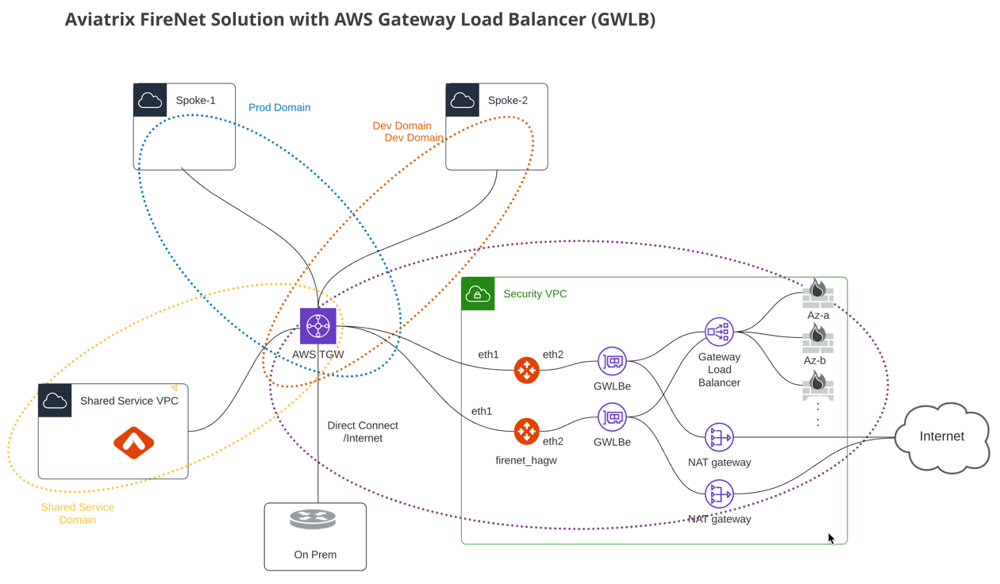
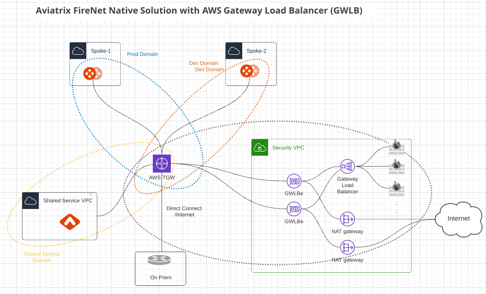

.. meta::
  :description: Firewall Network Workflow
  :keywords: AWS Transit Gateway, AWS TGW, TGW orchestrator, Aviatrix Transit network, Transit DMZ, Egress, Firewall, Firewall Network, FireNet

=========================================================
Firewall Network (FireNet) Workflow
=========================================================

FireNet is a solution for integrating firewalls in the Transit Gateway (TGW) deployment for any Cloud Service Provider CSP): AWS, Azure, GCP, or OCI. 

If you are looking for firewall integration solution on Azure or in Aviatrix Multi-Cloud transit architecture, 
your starting point is `here <https://docs.aviatrix.com/HowTos/transit_firenet_workflow.html>`_. 

For questions about FireNet, see the `FireNet FAQ <https://docs.aviatrix.com/HowTos/firewall_network_faq.html>`_.

Creating a Security VPC/VNet
------------------------------------------------

We recommend that you use the Aviatrix Useful Tools to create a VPC/VNet for a FireNet deployment. 

Select the **Aviatrix FireNet VPC** option when creating a security VPC/VNet. 

==========================================      =================
**Aviatrix FireNet VPC Public Subnet**          **Description**
==========================================      =================
-Public-gateway-and-firewall-mgmt-AZ-a          A /28 subnet (public in AWS/GCP/OCI) in AZ a for FireNet Gateway and firewall instance management interface.
-Public-gateway-and-firewall-mgmt-AZ-b          A /28 subnet (public in AWS/GCP/OCI) in AZ b for FireNet HA Gateway and firewall instance management interface. 
-Public-FW-ingress-egress-AZ-a                  A /28 subnet (public in AWS/GCP/OCI) in AZ a for firewall instance's egress interface.
-Public-FW-ingress-egress-AZ-b                  A /28 subnet (public in AWS/GCP/OCI) in AZ b for firewall instance's egress interface. 
==========================================      =================

Subscribing to a Firewall Instance (AWS Only)
----------------------------------------------------------

Before setting up Aviatrix FireNet, AWS customers need to subscribe to a firewall instance from a specific vendor on the AWS Marketplace. 

.. note::

  This document section applies to AWS customers **only**. Azure, GCP, and OCI customers can launch firewall instances directly from the Aviatrix Controller without subscriptions.

To subscribe to a firewall instance from AWS, use the following steps.

1. In your AWS account, search for **AWS Marketplace Subscriptions**.
2. On the AWS Marketplace Subscriptions page, select **Discover products**.
3. In the search bar, enter the type of firewall instance you wish to subscribe to:

* Enter “VM-series” to search for a Palo Alto firewall instance.
* Enter “CloudGuard” to search for a Check Point firewall instance.
* Enter “Fortigate” to search for a Fortinet firewall instance.

4. From the results, select a bundle and/or license option for the firewall instance you wish to subscribe to. There are different bundle/license options for each instance type that represent different costs and performance offerings. 
5. On the next page, click **Continue to subscribe** to subscribe to the instance.
6. On the next page, click **Accept terms** to accept the license terms. 

After you subscribe to the firewall instance, wait for the Effective date column to change from “Pending” to today’s date. Then, return to the Aviatrix Controller to launch the firewall instance from there.

.. note ::
  Do not launch a firewall instance from AWS itself, as you can launch it from the Aviatrix Controller in the following steps.

Creating a Firewall Domain
---------------------------------------

This step creates a Security Domain with a Firewall Domain option. 

In your Aviatrix Controller, go to TGW Orchestrator > Plan > Create an AWS Transit Gateway and then a Security Domain by selecting **Aviatrix Firewall Domain**. 

For more information, refer to `Create a New Security Domain <https://docs.aviatrix.com/HowTos/tgw_plan.html#create-a-new-security-domain>`_. 

Launching Aviatrix FireNet Gateway
------------------------------------------

This step leverages the Transit Network workflow to launch one Aviatrix Gateway for FireNet deployment. 

C5x.large is the minimum Aviatrix gateway instance size for FireNet deployment as it requires `4 interfaces. <https://docs.aviatrix.com/HowTos/firewall_network_faq.html#what-is-the-minimum-gateway-instance-size-for-firenet-deployment>`_

If your deployment requires 2-AZ HA, go through Transit Network > Setup to launch one Aviatrix gateway and enable HA which effectively launches a HA gateway (the second gateway) in a different AZ. If you select public subnet "-Public-gateway-and-firewall-mgmt-AZ-a" for the primary FireNet Gateway, 
you should select public subnet "-Public-gateway-and-firewall-mgmt-AZ-b" for the second AZ FireNet Gateway.

Do not mark the **Insane Mode Encryption** checkbox.

Enabling Aviatrix FireNet Gateway
---------------------------------------------

This step configures the gateway launched in the "Launching an Aviatrix FireNet Gateway" section above or FireNet function. If you have HA enabled, it
automatically sets up the HA gateway for FireNet deployment.

.. tip ::

  If you do not see any gateways in the dropdown menu, refresh the browser to load.

In this step, the Aviatrix Controller creates 3 more Ethernet interfaces with associated subnets on the FireNet Gateways. 

|private_interfaces|

==========================================         ==============================================   =================
**FireNet Gateway instance interfaces**            **Inbound Security Group Rule**                  **Description**
==========================================         ==============================================   =================
eth0                                               Allow SSH and HTTPS from Aviatrix Controller     Public interface for communication with Controller
eth1                                               Allow ALL (Do not change)                        Private interface for traffic to/from TGW
eth2                                               Allow ALL (Do not change)                        Private interface for traffic to firewall instances
eth3                                               Allow ALL (Do not change)                        Private interface for traffic to FireNet HA gateway
==========================================         ==============================================   =================

.. important::

  Please do not change the security group inbound and outbound rules on eth1, eth2, and eth3 of a FireNet Gateway.

If FireNet Gateway HA is enabled, the HA gateway shares the same route table as the primary for its eth1 interface. 

The new subnets created by the Controller at these steps are listed below.

==========================================      ============================
**Aviatrix FireNet VPC/VNet Private Subnet**         **Description**
==========================================      ============================
-tgw-egress                                     for FireNet Gateway eth1 to TGW
-hagw-tgw-egress                                for FireNet HA Gateway eth1 to TGW
-tgw-ingress                                    for TGW to the ENI of eth1 of FireNet Gateway 
-hagw-tgw-ingress                               for TGW to the ENI of eth1 of the FireNet HA Gateway 
-dmz-firewall                                   for FireNet Gateway eth2
-hagw-dmz-firewall                              for FireNet HA Gateway eth2 
-dmz-exchange                                   for FireNet Gateway eth3
-hagw-dmz-exchange                              for FireNet HA Gateway eth3
==========================================      ============================

Enabling the Aviatrix Gateway for FireNet Function
#############################################################

This step configures the gateway launched in the "Launching Aviatrix FireNet Gateway" section above for FireNet function with AWS Gateway Load Balancer (GWLB). If you have HA enabled, it
automatically sets up the HA gateway for FireNet deployment.

In the dropdown menu, select one Aviatrix Transit Gateway, mark the **Use AWS GWLB** checkbox and click **Enable**.

In this step, the Aviatrix Controller creates 2 more Ethernet interfaces with associated subnets on the FireNet Gateways.

==========================================         ==============================================   =================
**FireNet Gateway instance interfaces**            **Inbound Security Group Rule**                  **Description**
==========================================         ==============================================   =================
eth0                                               Allow SSH and HTTPS from Aviatrix Controller     Public interface for communication with Controller
eth1                                               Allow ALL (Do not change)                        Private interface for traffic to/from TGW
eth2                                               Allow ALL (Do not change)                        Private interface for traffic to firewall instances
==========================================         ==============================================   =================

.. important::

  Please do not change the security group inbound and outbound rules on eth1 and eth2 of a FireNet Gateway.

If FireNet Gateway HA is enabled, the HA gateway shares the same route table as the primary for its eth1 interface.

The new subnets created by the Controller at these steps are listed below.

==========================================      ============================
**Aviatrix FireNet VPC/VNet Private Subnet**         **Description**
==========================================      ============================
-tgw-egress                                     for FireNet Gateway eth1 to TGW
-hagw-tgw-egress                                for FireNet HA Gateway eth1 to TGW
-tgw-ingress                                    for TGW to the ENI of eth1 of FireNet Gateway
-hagw-tgw-ingress                               for TGW to the ENI of eth1 of the FireNet HA Gateway
-dmz-firewall                                   for FireNet Gateway eth2
-hagw-dmz-firewall                              for FireNet HA Gateway eth2
-gwlb-pool                                      for GWLB and Firewalls
-gwlb-pool-ha                                   for GWLB and Firewalls in different AZ
-gwlb-egress                                    for FireNet Gateway (if egress inspection is enabled)
-gwlb-egress-ha                                 for FireNet HA Gateway (if egress inspection is enabled)
==========================================      ============================

|gwlb_tgw_avxgw|

.. note::
    HTTPS needs to be opened on firewall appliance for health check. See `firewall health check <https://docs.aviatrix.com/HowTos/transit_firenet_workflow_azure.html#step-9-enable-health-check-policy-in-firewall>`_ for more information.

Enabling Native AWS GWLB for FireNet Function
#############################################################

This step integrates the AWS Transit Gateway (TGW) with AWS Gateway Load Balancer (GWLB) for native FireNet solution.

In the dropdown menu, select the right AWS Account and region, provide the right security VPC/VNet and click **Enable**.

The Aviatrix Controller will automatically create the new subnets, GWLB and GWLBe.

The new subnets created by the Controller at these steps are listed below.

==========================================      ============================
**Aviatrix FireNet VPC/VNet Private Subnet**         **Description**
==========================================      ============================
-tgw-ingress                                    for TGW ENI to the GWLBe
-hagw-tgw-ingress                               for TGW ENI to the GWLBe in different AZ
-dmz-firewall                                   for GWLBe
-hagw-dmz-firewall                              for GWLBe in different AZ
-gwlb-pool                                      for GWLB and Firewalls
-gwlb-pool-ha                                   for GWLB and Firewalls in different AZ
-gwlb-egress                                    for NATGW gateway (if egress inspection is enabled)
-gwlb-egress-ha                                 for NATGW HA gateway (if egress inspection is enabled)
==========================================      ============================

|gwlb_native|

.. note::
    HTTPS needs to be opened on firewall appliance for health check. Check `Firewall Health Check <https://docs.aviatrix.com/HowTos/transit_firenet_workflow_azure.html#step-9-enable-health-check-policy-in-firewall>`_ for more information.

Attaching Aviatrix FireNet Gateway to TGW Firewall Domain
---------------------------------------------------------------------------------

This step requires you have already created a Security Domain with Firewall attribute enabled.

When this step is completed, you have built the network infrastructure for FireNet deployment. This step may take a few minutes.

|gw_launch|

This step programs the relative route tables, described as below.

==========================================   =====================       =================                 
**Aviatrix FireNet VPC/VNet route table**         **key route entry**         **Description**
==========================================   =====================       =================
-tgw-egress                                  0.0.0.0/0 -> tgw            for FireNet Gateway eth1 to TGW 
-hagw-tgw-egress                             0.0.0.0/0 -> tgw            for FireNet HA gateway eth1 to TGW
-tgw-ingress                                 0.0.0.0/0 -> eth1           for TGW to eth1 of FireNet Gateway
-hagw-tgw-ingress                            0.0.0.0/0 -> eth1.          for TGW to eth1 of FireNet HA gateway
-dmz-firewall                                0.0.0.0/0 -> tgw            for firewall instance LAN interface to TGW
-hagw-dmz-firewall                           0.0.0.0/0 -> tgw            for firewall instance LAN interface to TGW 
-dmz-exchange                                0.0.0.0/0 -> eth3           for eth3 of FireNet Gateway to eth3 of HA gateway 
-hagw-dmz-exchange                           0.0.0.0/0 -> eth3           for eth3 of FireNet HA gateway to eth3 of primary gateway 
==========================================   =====================       =================

Launching and Associating Firewall Instance
----------------------------------------------------------

This approach is recommended if this is the first Firewall instance to be attached to the gateway. 

This step launches a Firewall instance and associates it with one of the FireNet Gateways. 

.. important::

The Firewall instance and the associated Aviatrix FireNet Gateway above must be in the same AZ, and, we recommend that the Management Interface Subnet and Egress (untrust dataplane) Interface Subnet should not be in the same subnet.

Launching and Attaching
##########################

==========================================      ==========
**Setting**                                     **Value**
==========================================      ==========
VPC ID                                          The Security VPC/VNet created above.
Gateway Name                                    The primary FireNet Gateway.
Firewall Instance Name                          The name that will be displayed on the AWS Console.
Firewall Image                                  The AWS AMI that subscribed to above.
Firewall Image Version                          Firewall instance current supported software versions. 
Firewall Instance Size                          Firewall instance type.  
Management Interface Subnet.                    Select the subnet whose name contains "gateway and firewall management"
Egress Interface Subnet                         Select the subnet whose name contains "FW-ingress-egress".
Username                                        Applicable to Azure deployment only. "admin" as a username is not accepted.
Password                                        Applicable to Azure deployment only.
Key Pair Name (Optional)                        The .pem file name for SSH access to the firewall instance.
Attach (Optional)                               By selecting this option, the firewall instance is inserted in the data path to receive packet. If this is the second firewall instance for the same gateway and you have an operational FireNet deployment, you should not select this option as the firewall is not configured yet. You can attach the firewall instance later at Firewall Network > Advanced page. 
Advanced (Optional)                             Click this selection to allow Palo Alto firewall bootstrap files to be specified. 
IAM Role                                        In advanced mode, create an IAM Role on the AWS account that launched the FireNet Gateway. Create a policy to attach to the role. The policy is to allow access to "Bootstrap Bucket". This option is not supported on Check Point. 
Bootstrap Bucket Name                           In advanced mode, specify a bootstrap bucket name where the initial configuration and policy file is stored. This option is not supported on Check Point. 
User Data                                       In advanced mode and applicable to Check Point and FortiGate. For FortiGate in Azure, refer to `FortiGate User Data in Azure <https://docs.aviatrix.com/HowTos/fortigate_bootstrap_example_azure.html#method-1-configure-fortigate-firewall-via-user-data>`_. For Check Point in Azure, refer to `Check Point User Data in Azure <https://docs.aviatrix.com/HowTos/checkpoint_bootstrap_azure.html#configure-check-point-security-gateway-using-custom-data>`_.
==========================================      ==========

1. Palo Alto VM-Series Specifications
**************************************

Palo instance has 3 interfaces as described below.

========================================================         ===============================          ================================
**Palo Alto VM instance interfaces**                             **Description**                          **Inbound Security Group Rule**
========================================================         ===============================          ================================
eth0 (on subnet -Public-FW-ingress-egress-AZ-a)                  Egress or Untrusted interface            Allow ALL 
eth1 (on subnet -Public-gateway-and-firewall-mgmt-AZ-a)          Management interface                     Allow SSH, HTTPS, ICMP, TCP 3978
eth2 (on subnet -dmz-firewall)                                   LAN or Trusted interface                 Allow ALL (Do not change)
========================================================         ===============================          ================================

Note that firewall instance eth2 is on the same subnet as FireNet Gateway eth2 interface.

.. important::

  For Panorama managed firewalls, you need to prepare Panorama first and then launch a firewall. Check out `Setup Panorama <https://docs.aviatrix.com/HowTos/paloalto_API_setup.html#managing-vm-series-by-panorama>`_.  When a VM-Series instance is launched and connected with Panorama, you need to apply a one time "commit and push" from the Panorama console to sync the firewall instance and Panorama.

.. Tip::

    If VM-Series are individually managed and integrated with the Controller, you can still use Bootstrap to save initial configuration time. Export the first firewall's configuration to bootstrap.xml, create an IAM role and Bootstrap bucket structure as indicated above,
    then launch additional firewalls with IAM role and the S3 bucket name to save the time of the firewall manual initial configuration.

2. Fortigate Specifications
*******************************
    
Fortigate Next Generation Firewall instance has 2 interfaces as described below.

========================================================         ===============================          ================================
**Fortigate VM instance interfaces**                             **Description**                          **Inbound Security Group Rule**
========================================================         ===============================          ================================
eth0 (on subnet -Public-FW-ingress-egress-AZ-a)                  Egress or Untrusted interface            Allow ALL 
eth1 (on subnet -dmz-firewall)                                   LAN or Trusted interface                 Allow ALL (Do not change)
========================================================         ===============================          ================================

Note that firewall instance eth1 is on the same subnet as FireNet Gateway eth2 interface.

.. Tip::

  Starting from Release 5.4, Fortigate bootstrap configuration is supported. 

3. CheckPoint Specification
******************************

CheckPoint Firewall instance has 2 interfaces as described below. 

========================================================         ===============================          ================================
**CheckPoint VM instance interfaces**                             **Description**                          **Inbound Security Group Rule**
========================================================         ===============================          ================================
eth0 (on subnet -Public-FW-ingress-egress-AZ-a)                  Egress or Untrusted interface            Allow ALL 
eth1 (on subnet -dmz-firewall)                                   LAN or Trusted interface                 Allow ALL (Do not change)
========================================================         ===============================          ================================

Note that firewall instance eth1 is on the same subnet as FireNet Gateway eth2 interface.

.. important::

  Starting from Release 5.4, launching CheckPoint firewall instances from the Aviatrix Controller automatically initiates its onboarding process. For initial login information, go to `Credentials for Checkpoint Initial Login <https://aviatrix.zendesk.com/hc/en-us/articles/4417552852109>`_. You must be registered to access the Aviatrix Customer Support website. If you are not already registered, you can sign-up at https://support.aviatrix.com. 

Launch and Associate More
#################################

Repeat the previous step to launch the second firewall instance to associate with the HA FireNet Gateway. 
Or repeat this step to launch more firewall instances to associate with the same FireNet Gateway.

Example Setup for "Allow All" Policy
###########################################

After a firewall instance is launched, wait for 15 minutes for it to come up. 
In addition, please follow example configuration guides as below to build a simple policy on the firewall instance for a test validation that traffic is indeed being routed to firewall instance. 

Palo Alto
**********
For basic configuration, please refer to `this example configuration guide <https://docs.aviatrix.com/HowTos/config_paloaltoVM.html>`_.

For implementation details on using Bootstrap to launch and initiate VM-Series, refer to `Bootstrap Configuration Example <https://docs.aviatrix.com/HowTos/bootstrap_example.html>`_. 

FortiGate
**********
For basic configuration, please refer to `this example configuration guide <https://docs.aviatrix.com/HowTos/config_FortiGateVM.html>`_.

CheckPoint
**********
For basic configuration, please refer to `this example configuration guide <https://docs.aviatrix.com/HowTos/config_CheckPointVM.html>`_

Associate an Existing Firewall Instance
--------------------------------------------

This step is the alternative step to the previous step. If you already launched VM-Series from the AWS Console, you can still
associate it with the FireNet Gateway. 

If the firewall instance is by a vendor other than Palo Alto Network, for example, Checkpoint or Fortinet, you should launch the firewall 
instances from the AWS Console and associate them to the Aviatrix FireNet Gateway. The Management Interface Subnet may be the same as the Egress Interface Subnet.

Launching & Associating Aviatrix FQDN Gateway
------------------------------------------------------------------

If you perform one of the previous two steps, then you must be using a third party firewall instance. Skip this step.

This option is to deploy `Aviatrix FQDN gateway <https://docs.aviatrix.com/HowTos/fqdn_faq.html>`_ in a FireNet environment for a centralized scale out egress whitelist solution, as shown below. 

.. important::

  If a deployed Aviatrix FQDN gateway has no FQDN whitelist attached to it, the FQDN gateway acts as a NAT gateway and it will pass all traffic to all destination sites. To add whitelist policies, follow `how to configure FQDN instructions <https://docs.aviatrix.com/HowTos/FQDN_Whitelists_Ref_Design.html>`_.

This option is available in AWS and Azure. It applies to multi-cloud transit, Azure native Spoke transit, and TGW based transit. 

|fqdn_egress|

|fqdn_in_firenet| 

==========================================      ==========
**Setting**                                     **Value**
==========================================      ==========
VPC ID                                          The Security VPC/VNet created in Step 1.
Gateway Name                                    The primary FireNet Gateway.
FQDN Gateway Subnet                             The public subnet on which Aviatrix FQDN gateway will be launched.
FQDN Gateway Size                               The Aviatrix FQDN gateway instance size, starting from t2.micro.
FQDN Gateway Name                               The Aviatrix FQDN gateway name. Note you cannot change the name once the gateway instance is launched. 
Attach                                          Attach this FQDN gateway to the primary FireNet Gateway.
==========================================      ==========

Specify Security Domain for Firewall Inspection
-------------------------------------------------------------------

There are two inspection modes. One is Domain-based inspection, which is the default. The other is Connection Policy based inspection. 
The Connection Policy based inspection mode (connection based inspection) is available in Release 6.3 and later. 

Domain-based inspection
###############################

In domain-based inspection, to specify a Spoke VPC/VNet that needs inspection is to define a connection policy of the Security Domain, where the Spoke VPC/VNet is a member, 
to the Firewall Domain.

For example, if you wish to inspect traffic between on-prem to VPC/VNet, connect Aviatrix Edge Domain to the 
Firewall Domain. This means on-prem traffic to any Spoke VPC/VNet is routed to the firewall first and then it is forwarded
to the destination Spoke VPC/VNet. Conversely, any Spoke VPC/VNet traffic destined to on-prem is routed to the firewall first and then forwarded to on-prem. 

Connection-based inspection
#################################

Connection-based inspection only applies to TGW-based Transit solution. 

Connection-based inspection is available from Release 6.3 and later. Connection-based inspection allows you to inspect traffic going
across a specific pair of Security Domains. For example, Domain A has connection policy to Domain B and Domain C, you can specify to
inspect traffic between Domain A and Domain B, but not Domain A and Domain C. This inspection mode reduces the amount of traffic being 
inspected and reduces the instances size requirements on both FireNet Gateways and firewalls.

.. note::

  Connection-based inspection is not applicable to `intra-domain inspection <https://docs.aviatrix.com/HowTos/tgw_list.html#edit-intra-domain-inspection>`_ where all VPC/VNet to VPC/VNet traffic in the same domain is inspected. 

Here are the steps to enable and configure connection-based inspection. 

Enabling Connection-Based Inspection
*********************************************

#. Go to Controller > TGW Orchestrator > List. 
#. Click TGW, select one TGW, click Action > Edit Inspection Mode. 
#. Select **Connection-based** and click **Update**. 

Configuring East-West Inspection
******************************************

`A firewall security domain <https://docs.aviatrix.com/HowTos/firewall_network_workflow.html#create-a-firewall-domain>`_ must be created first before configuring east-west inspection. 

#. Go to Controller > TGW Orchestrator > List. 
#. Click **Connection** to display all Connection Policies in rows. 
#. Select **Connection Policy** and click Action > Enable Inspection. 
#. In the popup dropdown menu, select a firewall domain to associate the Connection Policy with. 
#. Click **Update**. 

Repeat these steps for other Connection Policies. 

Configuring Egress Inspection
*************************************

The Firewall Domain must have `Egress Inspection <https://docs.aviatrix.com/HowTos/firewall_advanced.html#egress-through-firewall>`_ enabled before configuring Egress Inspection. 

#. Go to Controller > TGW Orchestrator > List. 
#. Click Security Domains which displays all Security Domains configured on the TGW. 
#. Select one domain and click Action > Enable Egress Inspection. 
#. In the popup dropdown menu, select a firewall domain to associate the domain with. 
#. Click **Update**.

.. |firewall_domain| image:: firewall_network_workflow_media/firewall_domain.png
   :scale: 30%

.. |gw_launch| image:: firewall_network_workflow_media/gw_launch.png
   :scale: 30%

.. |private_interfaces| image:: firewall_network_workflow_media/private_interfaces.png
   :scale: 30%

.. |panvm_bucket| image:: firewall_network_workflow_media/panvm_bucket.png
   :scale: 30%

.. |fqdn_in_firenet| image:: firewall_network_workflow_media/fqdn_in_firenet.png
   :scale: 30%

.. |fqdn_egress| image:: transit_firenet_design_patterns_media/fqdn_egress.png
   :scale: 30%

.. disqus::
