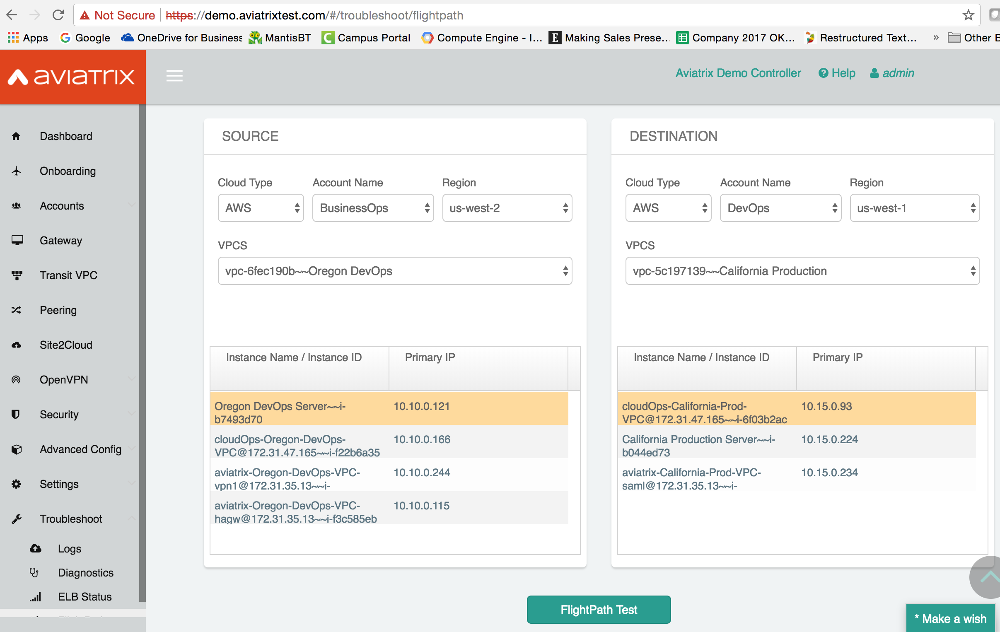
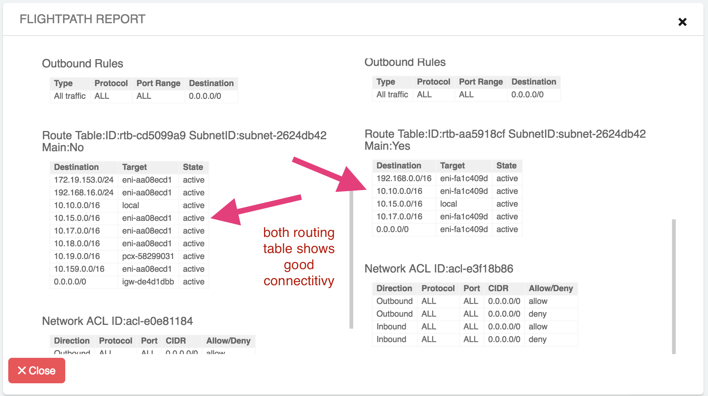
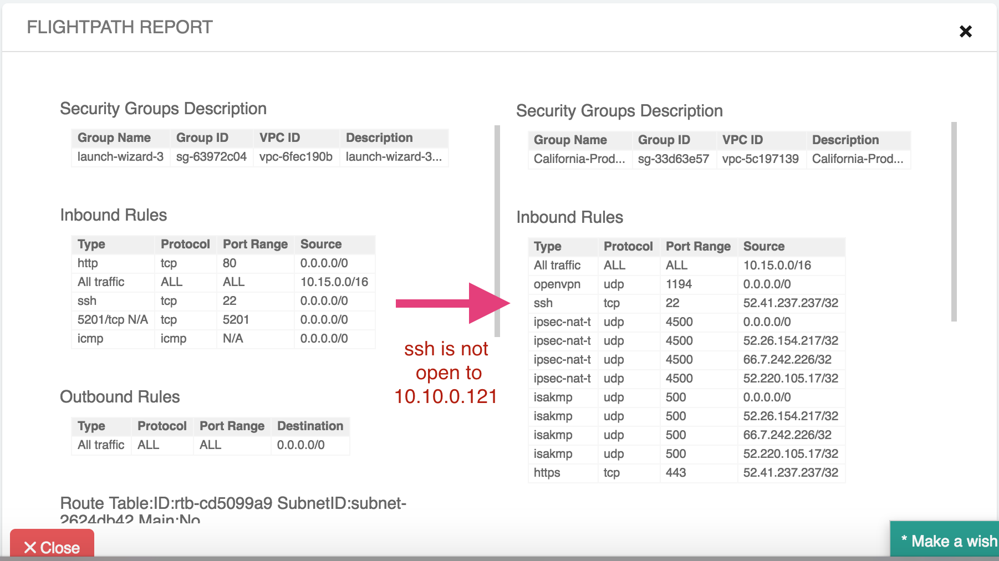

.. meta::
   :description: FlightPath is a troubleshooting tool
   :keywords: Flightpath, troubleshooting, Aviatrix, AWS VPC 

###################################
FlightPath
###################################

FlightPath is a troubleshooting tool. It retrieves and displays, in a side by side fashion, AWS EC2 related information such as Security Groups, 
Route table and route table entries and network ACL. This helps you to identify connectivity problems.

What you need
--------------

You do not need to launch Aviatrix gateways to use this tool, but you need to create Aviatrix accounts 
so that the Controller can use the account credential to execute AWS APIs to retrieve relevant information.

 

How to use it
-----------------

Click FlightPath icon on the onboarding page or Troubleshooting -> FlightPath.

Select on Source side cloud type, account, region, vpc name and click one instance. 
Do the same for the Destination side. 

Run FightPath Test, a report will appear. The information is arranged in three sections, Security Groups, Route table entries and Network ACL. The Security Group is what is associated with the instance, 
both the route table and the Network ACL are associated with the subnet that the instance is deployed. 

.. Note:: If you just need to check information on one instance, for example, check Internet reachability on an instance on a private subnet, select any instance in the Destination field, as it does not matter in this case. 

Example
--------

Here is one example to show how FlightPath works. Say a developer from BusinessOps account filed a ticket that says one instance “DevOps Server” in Oregon region cannot run “ssh” into the Prod instance in California region.

From the Controller browser console, click FlighPath under Troubleshooting on the navigation menu. Specify the above info and you’ll see something like the screenshot below. The highlights on each panel are the instances in question. Note the DevOps Server has IP address 10.10.0.121.

|image0|

Now run FlightPath Test, you’ll see the FlightPath Report.

First check the routing table, it shows good connectivity:

|image1|

Scroll up and down the FlightPath Report to check other fields. Next check the Security Group. And of course, the California Prod instance does not have its “ssh” port open to the Oregon DevOps instance IP address 10.10.0.121.

|image2|

Problem Solved in minutes!

Upon further inspection, you’ll notice the complaining instance has a “ssh” open to the entire world. You may need to notify the ticket issuer to reduce the source address scope.

.. disqus::
