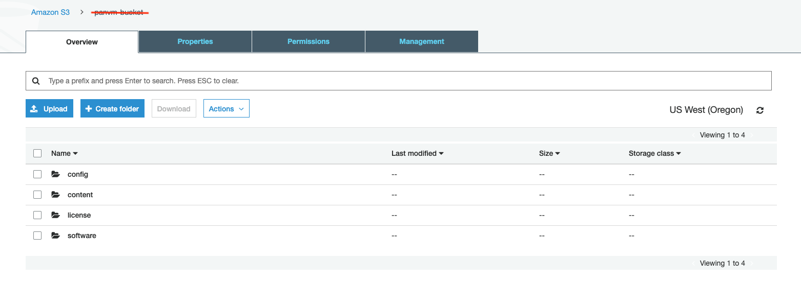

=================================================================
Bootstrap Configuration Example for FortiGate Firewall in AWS
=================================================================

Using the bootstrap option significantly simplifies Fortinet FortiGate initial configuration setup. 

In this document, we provide a bootstrap example to set up an "Allow All" and Egress NAT policy for the FortiGate to validate 
that traffic is indeed sent to the FortiGate for VPC-to-VPC traffic inspection.

For a manual setup, follow `manual setup example <https://docs.aviatrix.com/HowTos/config_FortiGateVM.html>`_.

FortiGate also supports the User Data method as an alternative bootstrap mechanism. This mechanism is same for both
AWS and Azure. To use the User Data method, see 
`Bootstrap with User Data on FortiGatew in Azure <https://docs.aviatrix.com/HowTos/fortigate_bootstrap_example_azure.html#method-1-configure-fortigate-firewall-via-user-data>`_.

Creating an IAM Role and Policy
--------------------------------------

1. Log in to the AWS console and  create an IAM role with the name: for example, "bootstrap-FortiGate-S3-role". 
2. Attach an IAM policy with the name: for example, "bootstrap-FortiGate-S3-policy". The policy has the following statements. 

::

    {
        "Version": "2012-10-17",
        "Statement": [
            {
                "Effect": "Allow",
                "Action": [
                    "s3:ListBucket"
                ],
                "Resource": [
                    "arn:aws:s3:::*"
                ]
            },
            {
                "Effect": "Allow",
                "Action": [
                    "s3:GetObject"
                ],
                "Resource": [
                    "arn:aws:s3:::*"
                ]
            }
        ]
    }

Creating bootstrap Bucket Structure
---------------------------------------------

In AWS S3, at the top level create a bucket for bootstrap with a **unique** name, for example "bootstrap-fortigate-bucket", with the following structure:

::

    bootstrap-fortigate-bucket/
        init.conf
        license.lic

Upload Config Giles
-------------------------------

1. The example init.conf file contains the "Allow All" setup. To download the file, click :download:`init.conf <fortigate_bootstrap_example_media/init.conf>`. 

2. For the example license.lic file, click :download:`license.lic <fortigate_bootstrap_example_media/license.lic>`. For Metered AMI, this file is not required. 

.. Note::

  You must specify the password in the example init.conf file. For initial Fortigate login information, go to `Credentials for FortiGate Initial Login <https://aviatrix.zendesk.com/hc/en-us/articles/4417531104781>`_. You must be registered to access the Aviatrix Customer Support website. If you are not already registered, you can sign-up at https://support.aviatrix.com.

3. Upload these two files to your config folder in the bootstrap-fortigate-bucket. 

Launching the Fortigate Instance
----------------------------------------------

Follow the Aviatrix Firewall Network (FireNet) workflow 
to `this step <https://docs.aviatrix.com/HowTos/firewall_network_workflow.html#launching-and-associating-firewall-instance>`_.

Fill in the required fields. Click **Advanced**. Fill in the following parameters.

================================  ======================
**Advanced Field**                **Example Value**
================================  ======================
IAM Role                          bootstrap-FortiGate-S3-role 
Bootstrap Bucket Name             fortigate-bootstrap-bucket (must be a unique name in S3)
================================  ======================

Launch the instance. Wait for 15 minutes for it to boot up and initialize. 

Log in to the HTTPS interface of the public IP with username "admin" and the password specified in the example init.conf file. You should change the username and password after the initial login.

Configuring Static Routes
--------------------------------------

Follow `the instructions here <https://docs.aviatrix.com/HowTos/config_FortiGateVM.html#create-static-routes-for-routing-of-traffic-vpc-to-vpc>`_ to configure the static
routes. 

Ready to Go
--------------------

Now your firewall instance is ready to receive packets.

The next step is to specify which Security Domain needs packet inspection by defining a connection policy that connects to
the firewall domain. This is done by `this step <https://docs.aviatrix.com/HowTos/firewall_network_workflow.html#specify-security-domain-for-firewall-inspection>`_ in the Firewall Network workflow. 

For example, deploy Spoke-1 VPC in Security_Domain_1 and Spoke-2 VPC in Security_Domain_2. Build a connection policy between the two domains. Build a connection between Security_Domain_2 to Firewall Domain. 

Launch one instance in Spoke-1 VPC and Spoke-2 VPC. From one instance, ping the other instance. The ping should go through.  

.. disqus::
