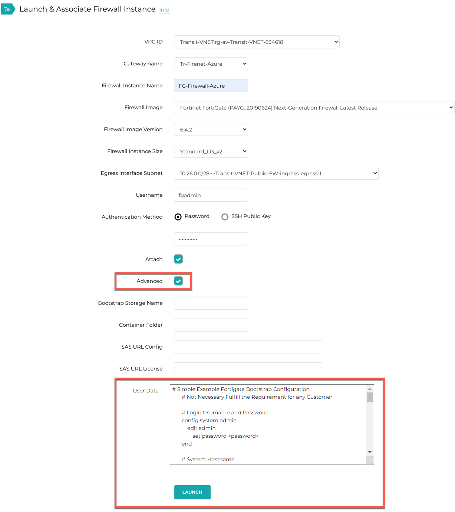

.. meta::
  :description: Firewall Network
  :keywords: Azure Transit Gateway, Aviatrix Transit network, Transit DMZ, Egress, Firewall, Bootstrap, Fortigate

=================================================================
Bootstrap Configuration Example for FortiGate Firewall in Azure
=================================================================

Using bootstrap option significantly simplifies Fortinet FortiGate initial configuration setup.

In this document, we provide a bootstrap example to set up an "Allow All" firewall policy, firewall health check policy and static routes for the FortiGate to validate
that traffic is indeed sent to the FortiGate for VNET to VNET traffic inspection.

For a manual setup, follow `manual setup example. <https://docs.aviatrix.com/HowTos/config_FortiGateAzure.html>`_

There are two ways to configure Fortinet Fortigate via Bootstrap Configuration:

Method 1: Configure Fortigate Firewall via User Data
~~~~~~~~~~~~~~~~~~~~~~~~~~~~~~~~~~~~~~~~~~~~~~~~~~~~~~~

Follow the Aviatrix Firewall Network (FireNet) workflow
to `Step 7a. <https://docs.aviatrix.com/HowTos/firewall_network_workflow.html#a-launch-and-associate-firewall-instance>`_. to launch the firewall instance.

To Configure FortiGate using Custom Data, go to the Aviatrix Controller -> Firewall Network  -> Setup -> Launch & Associate Firewall Instance.

Fill in the required fields. Click Advanced. Fill in the following parameters.

================================  ======================
**Advanced Field**                **Example Value**
================================  ======================
User Data                          Bootstrap Configuration
================================  ======================

Sample Fortigate Bootstrap Configuration to configure firewall "Allow-all" policy, health check policy and RFC 1918 static routes is shown below:

    ::

        # Simple Example Fortigate Bootstrap Configuration
        # Not Necessary Fulfill the Requirement for any Customer

        # Login Username and Password
        config system admin
            edit admin
                set password <password>
        end

        # System Hostname
        config system global
            set hostname myhost
            set timezone 04
        end

        # Important HTTPS needs to be allowed on LAN interface for Firewall Health Check
        config system interface
            edit port2
                set allowaccess https
            next
        end

        #RFC 1918 Routes and Subnet Default Gateway
        config router static
            edit 1
                set dst 10.0.0.0 255.0.0.0
                set gateway 10.26.0.81
                set device port2
            next
            edit 2
                set dst 192.168.0.0 255.255.0.0
                set gateway 10.26.0.81
                set device port2
            next
            edit 3
                set dst 172.16.0.0 255.240.0.0
                set gateway 10.26.0.81
                set device port2
            next
            # LoadBalancer IP
            edit 4
                set dst 168.63.129.16 255.255.255.255
                set gateway 10.26.0.81
                set device port2
            next
        end

        # Firewall Allow All Policy Example
        config firewall policy
            edit 1
                set name allow_all
                set srcintf port2
                set dstintf port2
                set srcaddr all
                set dstaddr all
                set action accept
                set schedule always
                set service ALL
            next
        end

|fortigate_bootstrap_example|

Launch the instance. Wait for 15 minutes for it to boot up and initialize.

Login to the HTTPS interface of the public IP with username "admin" and the password specified in the example Fortigate Bootstrap Configuration. For initial Fortigate login information, go to `Credentials for FortiGate Initial Login <https://aviatrix.zendesk.com/hc/en-us/articles/4417531104781>`_. You must be registered to access the Aviatrix Customer Support website. If you are not already registered, you can sign-up at https://support.aviatrix.com.

Method 2: Configure Fortigate using Azure Blob
~~~~~~~~~~~~~~~~~~~~~~~~~~~~~~~~~~~~~~~~~~~~~~~~~

1. Create Storage Account and Private Container
--------------------------------------------------

Login to Azure's console and create a storage account, and private container in the Azure blob for bootstrap with a **unique** name, for example "bootstrap-fortigate", using this `guide <https://docs.fortinet.com/document/fortigate/6.0.0/deploying-fortigate-on-azure/61731/bootstrapping-the-fortigate-cli-and-byol-license-at-initial-boot-up-using-user-data>`_ Step 2 and 3 with the following structure:

::

    Storage Account
        Container
            fortigatebootstrap/
                init.txt
                license.txt

2. Upload config files
------------------------

**2.1** The example init.conf file contains the "Allow All" setup. To download the file, click :download:`init.txt <fortigate_bootstrap_example_media/init-azure.txt>`.

**2.2** For the example license.lic file (optional), click :download:`license.txt <fortigate_bootstrap_example_media/license.lic>`.

**2.3** upload these two files in the blob. Please follow Step 4 in `this <https://docs.fortinet.com/document/fortigate/6.0.0/deploying-fortigate-on-azure/61731/bootstrapping-the-fortigate-cli-and-byol-license-at-initial-boot-up-using-user-data>`_ guide.

3. Launch the Fortigate instance
-----------------------------------

First follow `Step 5 <https://docs.fortinet.com/document/fortigate/6.0.0/deploying-fortigate-on-azure/61731/bootstrapping-the-fortigate-cli-and-byol-license-at-initial-boot-up-using-user-data>`_ to get the SAS URL for Configuration and License.

Follow the Aviatrix Firewall Network (FireNet) workflow
to `Step 7a. <https://docs.aviatrix.com/HowTos/firewall_network_workflow.html#a-launch-and-associate-firewall-instance>`_

Fill in the required fields. Click Advanced. Fill in the following parameters.

================================  ======================
**Advanced Field**                **Example Value**
================================  ======================
Bootstrap Storage Name            Azure Storage Name (e.g. transitbootstrapsotrage)
Container Folder                  Private Container Name (e.g. fortigatebootstrap)
SAS URL Config                    SAS Config URL (Follow the given guide)
SAS URL License                   SAS License URL (Follow the given guide)
================================  ======================

Example Screenshot:
|fortigate_method2_example|

Launch the instance. Wait for 15 minutes for it to boot up and initialize. Please make sure to verify the RFC 1918 and Internet static route in Fortigate firewall.

Login to the HTTPS interface of the public IP with username "admin" and the password specified in the example Fortigate Bootstrap Configuration. For initial Fortigate login information, go to `ZENDESK_TITLE <ZENDESK_TITLE>`_. You must be registered to access the Aviatrix Customer Support website. If you are not already registered, you can sign-up at https://support.aviatrix.com.

Ready to go!
~~~~~~~~~~~~~~~

Now your firewall instance is ready to receive packets!

Next step is to validate your configurations and polices using FlightPath and Diagnostic Tools (ping, traceroute etc.).

Launch one instance in PROD Spoke VNET and DEV Spoke VNET. Start ping packets from a instance in DEV Spoke VNET to the private IP of another instance in PROD Spoke VNET. The ICMP traffic should go through the firewall and be inspected in firewall.

.. |fortigate_method2_example| image:: fortigate_bootstrap_example_media/fortigate_method2_example.png
   :scale: 40%

.. disqus::
