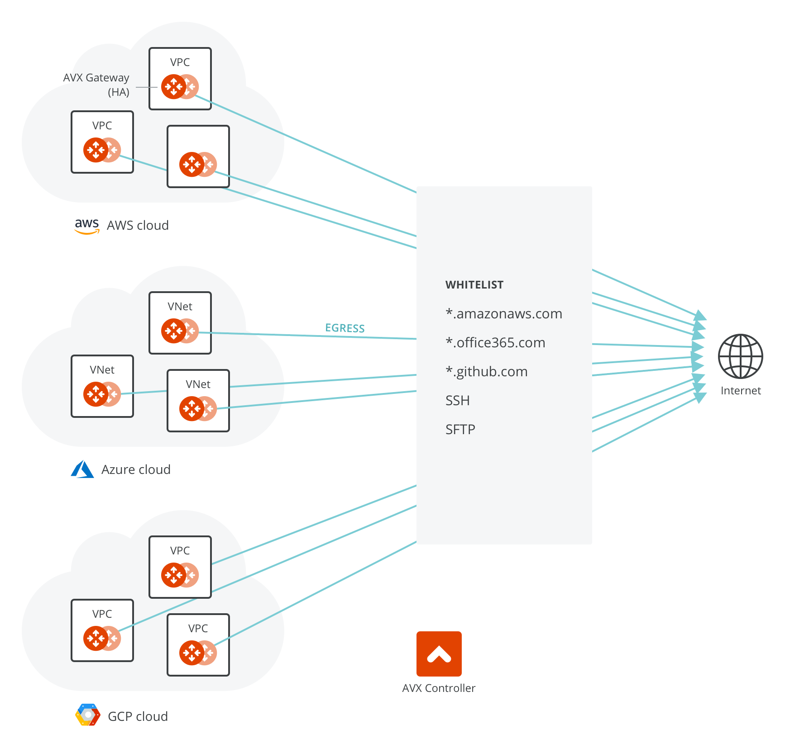
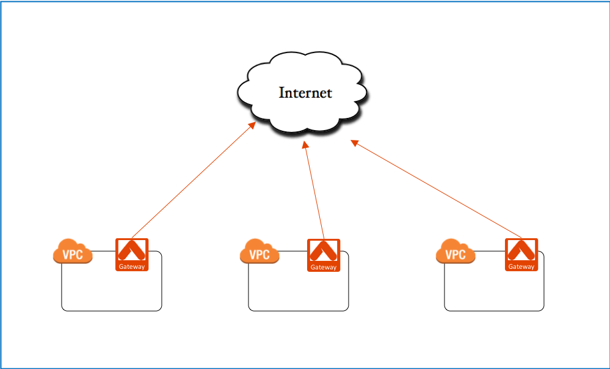
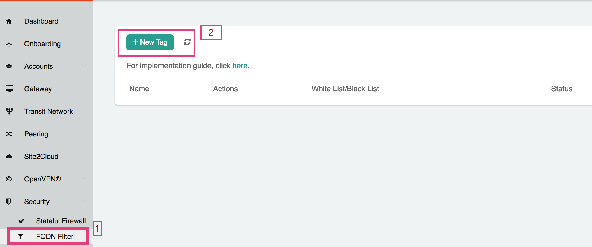
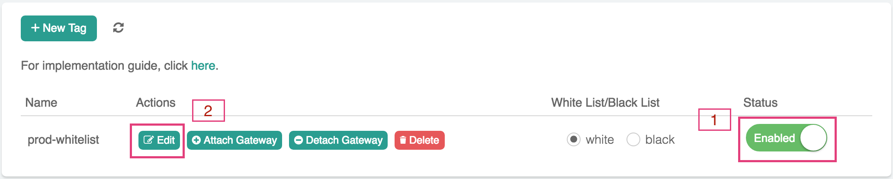
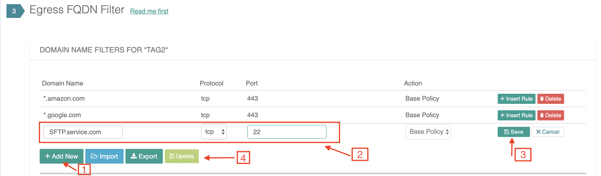
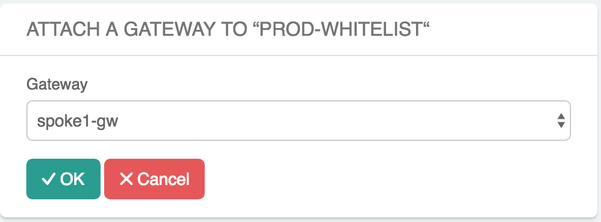
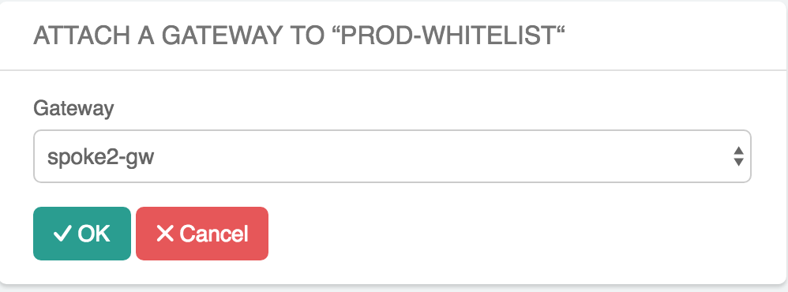
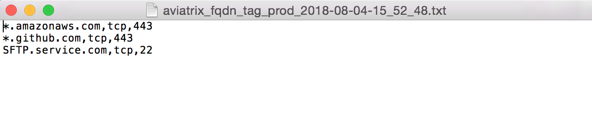

.. meta::
   :description: FQDN whitelists reference design
   :keywords: FQDN, whitelist, Aviatrix, Egress Control, AWS VPC

.. raw:: html

   

=================================
 Egress FQDN FAQ
=================================

Why is Egress Control Filter needed?
========================================

|egress_overview|

For Internet bound egress traffic, specifying outbound policy at the IP address level is not
sufficient as the domain names of a site can be translated to many
different IP addresses.

An AWS NAT gateway does not offer security group functions;
it relies on security groups by each instance. An AWS NAT instance's security group does not have enough entries to support the large set of IP address lists. The egress filtering needs to happen at Layer 7.

On the other hand, workloads in AWS are mostly applications or programs where it is deterministic which
outbound APIs the application program calls. For example, an application runs API queries to *www.salesforce.com* for data retrieving and runs API queries to *www.google.com* for app authentication. In these cases, making sure that only these sites are allowed for egress
traffic is sufficient from a security point of view. Note that this is very different from on-prem situations where end user traffic and application traffic are mingled together; you may need a full fledged firewall for Internet bound traffic.

Another use case is for PCI DSS compliance. PCI DSS specifies that if you handle any payment and sensitive data, there must be firewall policy enforcement at the egress. In the cloud, the logical egress point is per VPC.

What does the Aviatrix FQDN feature do?
========================================

Aviatrix Fully Qualified Domain Name (FQDN)
is a security service specifically designed for workloads or applications in the public cloud. It filters Internet bound egress traffic initiated from workloads in a VPC. This service is centrally managed by the Controller and executed by an Aviatrix gateway instance in the VPC in the distributed architecture..

Aviatrix FQDN filters any TCP and UDP traffic
including HTTP, HTTPS and SFTP traffic. The filtering function allows
only the destination host
names (whitelist) specified in the list to pass and drop all other
destinations. 

Each destination is specified as fully qualified domain
name. For example, if you only allow Internet bound traffic to
`www.salesforce.com <http://www.salesforce.com>`__, you can list the
domain name www.salesforce.com in the whitelist.

For HTTP/HTTPS (TCP port 80/443), FQDN feature also supports wild cards, such as \*. In
this example, you can specify \*.salesforce.com to allow traffic to any
domain names that ends in "salesforce.com".

How does it work?
=================

The function is transparent to individual instances and is carried out inline without requiring any certificate or keys to decrypt the traffic.

Non-HTTP/HTTPS traffic can also be filtered based on exact domain names. Use cases are secure file transfer (SFTP) to external sites, secure login in (SSH) to external sites.

A tag is defined as a list of FQDNs and it is created and managed on the Controller
console. One or more gateways may be attached to
a tag; each gateway can be attached to more than one tag. Any updates to a tag on the Controller automatically triggers updates to all
gateways attached to the tag.

Multiple tags can be defined for the
Controller. The domains in the tag are the destinations that are allowed
for traffic to pass.

For configuration details, refer to `this doc. <https://docs.aviatrix.com/HowTos/FQDN_Whitelists_Ref_Design.html>`_

How do I Enable 2 AZ HA for FQDN gateways?
============================================

Go to Gateway page, highlight the gateway, and click Edit.

At "Gateway for High Availability Peering", select a public subnet in the drop down menu, click create. A backup gateway with the name extension -hagw will be created. Note that this takes a few minutes of time.

For FQDN function, the primary gateway and backup gateway load balance the
Internet bound traffic from different subnets based on a route table.

How do I enable 3 AZ HA for FQDN gateways?
============================================

Her are the steps to enable 3 AZ HA FQDN gateways:

 1. Launch an Aviatrix gateway in AZ1
 #. Launch an Aviatrix gateway in AZ2
 #. Launch an Aviatrix gateway in AZ3
 #. Attach the same FQDN tag to each gateway launched in the above steps.
 #. Enable the FQDN tag. 

Following the above instructions, Aviatrix Controller will try to load balance the route tables to point to the gateways with AZ affinity. 
When a gateway fails, the Controller will reprogram the VPC route table to redistribute the traffic to the remaining gateways. 

How does Aviatrix Egress FQDN compare to Squid and other solutions?
===============================================================================

Squid is a popular open source software that can be configured to do transparent HTTP/HTTPS filtering. Squid does not process non HTTP/HTTPS traffic. For example, if you need to filter on a SFTP site that runs on TCP port 22, Squid does not work. Below is a more comprehensive comparison between Aviatrix FQDN and Squid. 

=============================================      =============================================================    ===============   ================     =============
**Functions**                                      **Aviatrix FQDN**                                                AWS NAT Gateway   Azure Firewall       **Squid**
=============================================      =============================================================    ===============   ================     =============
Requires instance configuration                    No                                                               No                No                   No
HTTP and HTTPS FQDN filter                         Yes (support wildcard)                                           No                Yes                  Yes
non HTTP/HTTPS FQDN filter                         Yes                                                              No                No                   No
Multi AZ High Availability                         Yes (load balanced)                                              Yes               Yes                  No
Centrally Managed                                  Yes                                                              Yes               Yes                  No
Egress Discovery                                   `Yes <https://docs.aviatrix.com/HowTos/fqdn_discovery.html>`_    No                No                   No 
API support                                        Yes                                                              Yes               Yes                  No
Terraform support                                  Yes                                                              Yes               No                   No
Out-of-box log integration                         Yes                                                              No                Yes                  No
Allow private network to be filtered               Yes                                                              No                No                   No
Allow specified source CIDR to bypass a rule       Yes                                                              No                No                   No
Allow specified source CIDR to apply to rule       Yes                                                              No                No                   No  
Visibility on allowed/Denied sessions              Yes                                                              No                No                   No
Search a specified rule match history              Yes                                                              No                No                   No
Vendor product support                             Yes                                                              Yes               Yes                  No 
=============================================      =============================================================    ===============   ================     =============

How do I Troubleshoot FQDN Problems?
======================================

If you have problems with FQDN on a specific gateway, follow the instructions below to troubleshoot:

 1. Make sure the corresponding AWS or Azure route table has the route entry 0.0.0.0/0 which points to the gateway instance.
 #. To verify that the above step is set up properly, disable the FQDN function of the problem gateway by detaching it from the associated tag, and run a ping test to www.yahoo.com from an instance in the private subnet to make sure Internet egress works.
 #. Attach the problem gateway to the tag. Make sure the tag has Enabled button on. Make sure the Whitelist or Blacklist is selected as intended.
 #. Check the tag to make sure it has the intended URL configured.
 #. Run a "wget" test from a private instance in the VPC to a URL configured in the tag.
 #. Use "Step 4" at Egress FQDN View Log, select the problem gateway and download the log. Review the log file and analyze if the intended URL is in the log entry, why it is being accepted or denied.
 #. Note: if a tag has the "White list" option selected, all URLs in the tag will be accepted. On the other hand, if a tag has a "Black list" option selected, all URLs in the tag will be dropped.
 #. If none of the above work, try to Disable and Enable the tag again. This will restart the FQDN function on all attached gateways.
 #. If all above steps failed, get help from the Aviatrix support team and upload `tracelog <https://docs.aviatrix.com/HowTos/troubleshooting.html#upload-tracelog>`_.

Any vendor specific comments to be noted?
---------------------------------------------------------------------------------------------
Any GCE instance (excluding controller created gateways) that needs to participate in egress control (FQDN, SNAT and FW Egress) have to be tagged as "avx-snat-noip" . The GCE network tag "avx-snat-noip" can be associated during GCE instance creation or by editing an existing instance.

What happens if I enable FQDN and there are route tables that have an existing default route?
---------------------------------------------------------------------------------------------

When enabling egress filtering on a VPC, each subnet's route table is reviewed.  If there is an existing default route (0.0.0.0/0) in the route table, the following logic is used:

  +----------------------+-----------------------------------------------------+
  | Target               | Aviatrix action                                     |
  +======================+=====================================================+
  | **igw-***            | Ignore this route table                             |
  +----------------------+-----------------------------------------------------+
  | anything other than  | Update the **Target** to point to the AVX GW ENI    |
  | **igw-***            | and remember the current value of **Target**.       |
  |                      | (see note below)                                    |
  +----------------------+-----------------------------------------------------+

  .. note::
     If the Gateway is detached from the VPC (via the egress configuration page), the route table will be updated with the original values.

Can FQDN gateway be deployed in central place?
-------------------------------------------------

Yes. Available in Release 5.0 and later, Aviatrix FQDN gateway can be deployed centrally in the TGW environment as shown in the diagram below. 

|fqdn_in_firenet|

One use case is if you need 
to limit the public IP addresses to a third party public service. Follow the `Firewall Network  workflow <https://docs.aviatrix.com/HowTos/firewall_network_workflow.html#c-launch-associate-aviatrix-fqdn-gateway>`_ to deploy. 

How does FQDN and Stateful Firewall work together?
----------------------------------------------------

If FQDN service is enabled on a gateway for any TCP port 80 and 443 traffic, all forwarding traffic to destination 
TCP port 80 and 443 are processed by FQDN engine 
and the decision to drop or accept the session is reached by FQDN engine. Stateful firewall can only process traffic destined 
to non TCP port 80 and 443. 

How does FQDN rules are processed in order?
----------------------------------------------

Since you can create multiple tags with each consisting of a list of FQDN rules, the Controller must merge these rules in a specific order before sending these rules to FQDN gateway for processing. 

The Controller merges all FQDN rules by this order:

  1. If the rule ACTION is `Deny`, it is placed in the first block for processing, that is, they are processed first. 
  #. Within each block (`Deny`, `Allow`, `Base Policy`), the more specific rules are processed or examined first. For example, salesforce.com is more specific than *.salesforce.com therefore salesforce.com is processed first. 
  #. Each rule has a verdict, Accept or Drop. When the FQDN processing engine finds a match, the verdict is reached and the packet is either dropped or accepted. The processing engine does not continue on to the next rule. 
  
  
FQDN Option for Exact Match 
----------------------------------------------------
  
This is a  new feature where if a FQDN rule does not have * an exact match is expected. If this global option is not enabled, FQDN rules use regex to match any FQDN names that are subset of the name. For example, if salesforce.com is a rule and Exact Match option is enabled, finance.salesforce.com is not a match and will be dropped.

.. |fqdn-add-new-tag| image::  FQDN_Whitelists_Ref_Design_media/fqdn-add-new-tag.png
   :scale: 50%

.. |fqdn_in_firenet| image:: firewall_network_workflow_media/fqdn_in_firenet.png
   :scale: 30%

.. add in the disqus tag

.. disqus::
