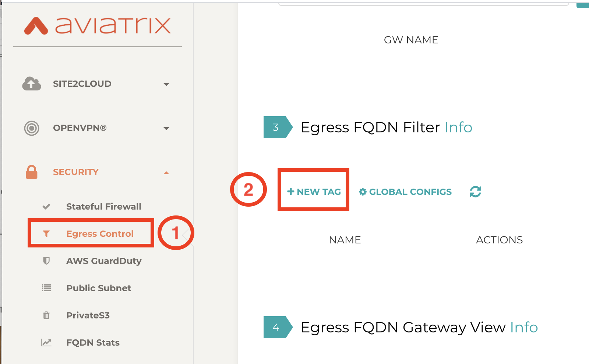

.. meta::
   :description: FQDN View Log
   :keywords: FQDN, whitelist, Aviatrix, Egress Control, AWS VPC

=================================
 Egress FQDN View Log 
=================================

The FQDN View Log allows you to immediately view what hostnames and sites that have been blocked 
or passed on the `FQDN gateway. <http://docs.aviatrix.com/HowTos/FQDN_Whitelists_Ref_Design.html>`_ Select the gateway and download the text file for the FQDN log. 

For audit and compliance, we recommend that you to use one of our integrated `logging tools <http://docs.aviatrix.com/HowTos/AviatrixLogging.html>`_

Thee are additional functions associated with the FQDN View page. 

Detach or Disable FQDN
--------------------------

To disable FQDN function for a specific VPC, select the gateway, click Actions -> Detach/Disable FQDN.

Remove Tag
-----------

If you like to remove a specific tag associated with a FQDN tag, select the gateway, click Actions -> Remove Tag.

Download Logs
--------------

For FQDN log on a specific gateway, select the gateway, click Actions -> Download Logs. 

Edit Pass-through
--------------------

This feature allows you to specify traffic originated from certain subnets to only be NATed and bypass FQDN filter function.

This configuration applies to a specific FQDN gateway.

To configure, go to Security -> Egress Control -> Egress FQDN Gateway View. Select a gateway,
click Actions -> Edit Pass-through. Select subnet or multi select subnets to allow bypass the filter. 

To configure, select one gateway, click Actions -> Edit Pass-through. Select one or multiple source subnets in the VPC and click Add to allow these subnets to be bypassed. You can also enter IP address range manually. Enter a list of IPs separated by comma.. 

.. |discovered_sites| image::  fqdn_discovery_media/discovered_sites.png
   :scale: 50%

.. |fqdn-add-new-tag| image::  FQDN_Whitelists_Ref_Design_media/fqdn-add-new-tag.png
   :scale: 50%

.. |fqdn-enable-edit| image::  FQDN_Whitelists_Ref_Design_media/fqdn-enable-edit.png
   :scale: 50%

.. |fqdn-add-domain-names| image::  FQDN_Whitelists_Ref_Design_media/fqdn-add-domain-names.png
   :scale: 50%

.. |fqdn-attach-spoke1| image::  FQDN_Whitelists_Ref_Design_media/fqdn-attach-spoke1.png
   :scale: 50%

.. |fqdn-attach-spoke2| image::  FQDN_Whitelists_Ref_Design_media/fqdn-attach-spoke2.png
   :scale: 50%

.. add in the disqus tag

.. disqus::
