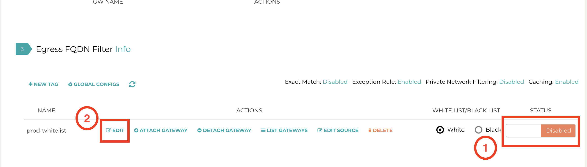

.. meta::
   :description: FQDN View Log
   :keywords: FQDN, whitelist, Aviatrix, Egress Control, AWS VPC

=================================
 FQDN View Log 
=================================

FQDN View Log allows you to immediately view what hostnames and sites that have been blocked 
or passed on the `FQDN gateway. <http://docs.aviatrix.com/HowTos/FQDN_Whitelists_Ref_Design.html>`_ Select the gateway and download the text file for FQDN log. 

For audit and compliance, we recommend you to use one of our integrated `logging tools <http://docs.aviatrix.com/HowTos/AviatrixLogging.html>`_

.. |discovered_sites| image::  fqdn_discovery_media/discovered_sites.png
   :scale: 50%

.. |fqdn-new-tag| image::  FQDN_Whitelists_Ref_Design_media/fqdn-new-tag.png
   :scale: 50%

.. |fqdn-add-new-tag| image::  FQDN_Whitelists_Ref_Design_media/fqdn-add-new-tag.png
   :scale: 50%

.. |fqdn-add-domain-names| image::  FQDN_Whitelists_Ref_Design_media/fqdn-add-domain-names.png
   :scale: 50%

.. |fqdn-attach-spoke1| image::  FQDN_Whitelists_Ref_Design_media/fqdn-attach-spoke1.png
   :scale: 50%

.. |fqdn-attach-spoke2| image::  FQDN_Whitelists_Ref_Design_media/fqdn-attach-spoke2.png
   :scale: 50%

.. add in the disqus tag

.. disqus::
