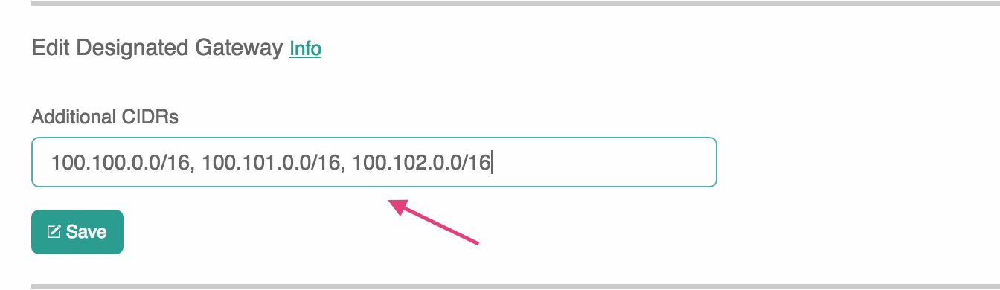
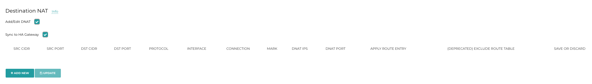
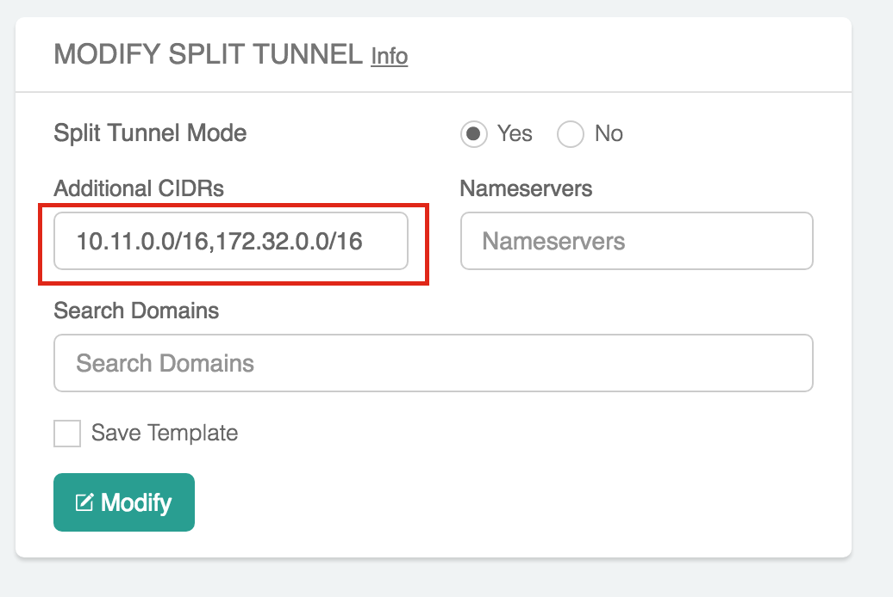
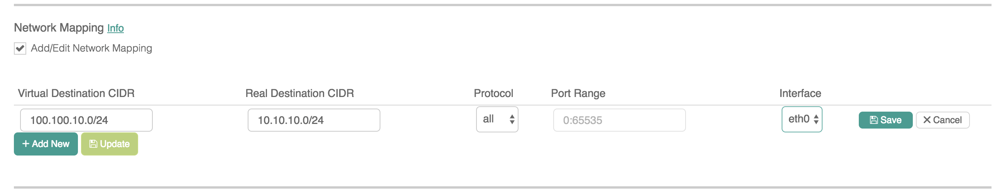
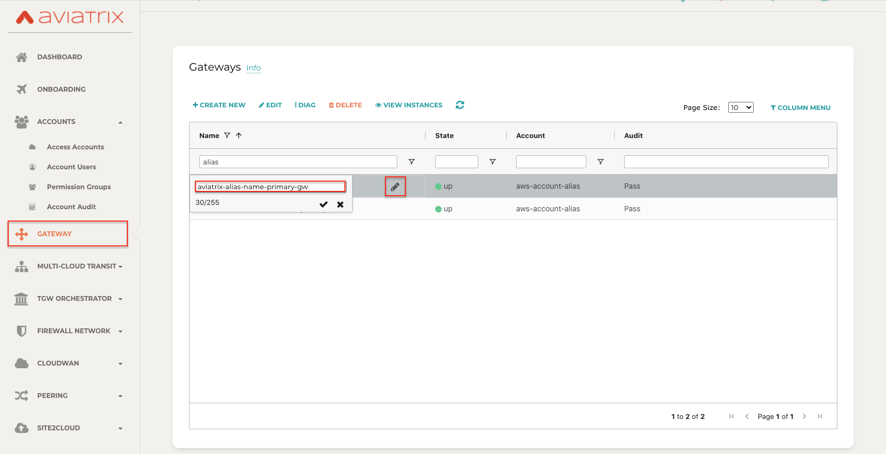

.. meta::
   :description: launch a gateway and edit it
   :keywords: security policies, Aviatrix, AWS VPC, stateful firewall, UCX, controller, gateway

#######
Gateway
#######

.. raw:: html

   

Launch a gateway
-----------------

Click "Gateway" on the navigation panel. Click "New" to set up launching a new gateway. To launch a gateway with OpenVPN® capability, refer to `this link. <http://docs.aviatrix.com/HowTos/uservpn.html>`__

Public Subnet
--------------

Aviatrix gateways are launched in a public subnet.

A public subnet in AWS VPC is defined as
a subnet whose associated route table has a default route entry that points to IGW. To learn
more about VPC and subnets, check out `this link. <https://docs.aws.amazon.com/AmazonVPC/latest/UserGuide/VPC_Subnets.html>`_

If you do not have a VPC with public subnet, you can use our `"Create a VPC" <https://docs.aviatrix.com/HowTos/create_vpc.html>`_ tool to create a VPC with fully populated public and private subnet in each AZ.

Select Gateway Size
-------------------

When selecting the gateway size, note the following guidelines of IPsec performance
based on iperf tests conducted between two gateways of the same size:

AWS Performance Numbers: 

+----------------------------+-------------------------------------------------+
| AWS Instance Size          | Expected Throughput                             |
+============================+=================================================+
| T2 series                  | Not guaranteed; it can burst up to 130Mbps      |
+----------------------------+-------------------------------------------------+
| M3 series                  | 300 - 500Mbps                                   |
+----------------------------+-------------------------------------------------+
| m4.xlarge, c4.xlarge       | approximately 500Mbps                           |
+----------------------------+-------------------------------------------------+
| c3.2xlarge, m4.2xlarge     | approximately 1Gbps                             |
+----------------------------+-------------------------------------------------+
| c3.4xlarge                 | approximately 1.2Gbps                           |
+----------------------------+-------------------------------------------------+
| c4.2xlarge                 | 1.2Gbps - 1.5Gbps                               |
+----------------------------+-------------------------------------------------+
| c5.2xlarge, c5.4xlarge     | 2Gbps - 2.5Gbps                                 |
+----------------------------+-------------------------------------------------+
| c5n.4xlarge                | 25Gbps (with InsaneMode)                        |
+----------------------------+-------------------------------------------------+
| c5n.9xlarge                | 70Gbps (with InsaneMode)                        |
+----------------------------+-------------------------------------------------+
| c5n.18xlarge               | 70Gbps (with InsaneMode)                        |
+----------------------------+-------------------------------------------------+

Azure Performance Numbers (without Insane mode):

+----------------------------+-------------------------------------------------+
| Azure Instance Size        | Expected Throughput                             |
+============================+=================================================+
| B series                   | Not guaranteed; it can burst up to 260Mbps      |
+----------------------------+-------------------------------------------------+
| D/Ds series                | 480Mbps - 1.2Gbps                               |
+----------------------------+-------------------------------------------------+
| F Series                   | approximately 450Mbps - 1.2Gbps                 |
+----------------------------+-------------------------------------------------+

GCP Performance Numbers (without Insane mode):

+--------------------------------------------+-----------------------+
| GCP Instance Size                          | Expected Throughput   |
+============================================+=======================+
| n1-standard-1, n1-standard-2, n1-highcpu-2 | 1.0 - 1.2 Gbps        |
+--------------------------------------------+-----------------------+
| n1-standard-4, n1-highcpu-2                | 2.3 - 2.5 Gbps        |
+--------------------------------------------+-----------------------+

OCI Expected Throughput Numbers: 

+----------------------------+--------------------------------------+------------------------------------------+
| OCI Instance Shape         |  Throughput with Active Mesh         |  Throughput without Active Mesh          |
+============================+======================================+==========================================+
| VM.Standard2.2 or larger   |  1.8G                                |  900 Mbps                                |
+----------------------------+--------------------------------------+------------------------------------------+

.. note::

   If you need IPSec performance beyond 2Gbps, refer to `Aviatrix Insane Mode. <https://docs.aviatrix.com/HowTos/insane_mode.html>`_

Specify a Reachable DNS Server IP Address
------------------------------------------

Aviatrix gateways are launched with a default public DNS server IP address 8.8.8.8 to
ensure the gateway has access to AWS public resources such as SQS for Controller and gateway communication.
If you want to change to a different DNS server, select the box for "Specify a Reachable DNS Server IP Address"
to enter an alternative DNS IP address.

Enable NAT
-------------

The Aviatrix gateway performs Source NAT (SNAT) function when this option is selected. All VPC routing tables for
private subnets are automatically programmed with 0.0.0.0/0 points to the gateway.

The function can be enabled at gateway launch time, or any time afterwards.

For example, you may already have a NAT gateway configured for the VPC. To minimize downtime, follow the steps below:

 1. Launch a gateway without the SNAT option selected.
 #. Go to AWS Console to remove the existing 0.0.0.0/0 route entry from the route table.
 #. Go to the Gateway page, highlight the desired gateway, click Edit, Scroll down to SNAT and click Enable.

Allocate New EIP
-----------------

If this option is selected, the Aviatrix gateway allocates a new EIP for the gateway from AWS. When the Aviatrix gateway is deleted, the
Controller will release this EIP. If this option is unchecked, the gateway will be allocated an unassociated EIP from the AWS account from which the gateway is launched.
When the Aviatrix gateway is deleted, the Controller will return this EIP to your AWS account without releasing it.

VPN Access
-------------

When this option is selected, the Aviatrix gateway will used for SSL VPN termination. It supports OpenVPN® client and Aviatrix SAML client. For more details, check out `this link. <http://docs.aviatrix.com/HowTos/openvpn_features.html>`_

Enable SAML
===================

When SAML is enabled, a VPN client/user authenticates to an identity provider
(IDP) directly, instead of the gateway doing it on behalf of the user.

In this case, you must use Aviatrix VPN Clients.

Check out the `details <http://docs.aviatrix.com/HowTos/VPN_SAML.html>`_  on how to configure and use Aviatrix VPN Clients for SAML.

VPN CIDR Block
===============

When a VPN user connects to the VPN gateway, the user will be assigned a virtual IP address from a pool of IP addresses.
This pool of IP addresses is defined as the `VPN <https://www.aviatrix.com/learning/glossary/cidr.php>`_ CIDR Block.
The default IP address pool is 192.168.43.0/24.

The only reason you would want to change this address pool is if 192.168.43.0/24 overlaps with your desktop or laptop network address range.
For example, if you are on a LAN with a network CIDR 10.0.0.0/24, your desktop IP address will never conflict
with your VPN virtual IP address. On the other hand, if your desktop is on a LAN with a network CIDR 192.168.20.0/16,
your VPN virtual IP address might conflict with your LAN address. In this case, change the VPN CIDR Block to a different address range,
for example, 10.10.0.0/24.

Note a /24 VPN CIDR block supports about 64 simultaneous VPN clients. This is because for each connected VPN client, VPN gateways reserves 3 virtual addresses. For larger number of clients per VPN gateway, consider making the VPN CIDR block to a /22 or /20 network. 

MFA Authentication
=====================

You can select either Duo or Okta for the VPN gateway to authenticate to these two services on behalf of a VPN user.

In this case, you can use OpenVPN® clients such as Tunnelblick for iOS and OpenVPN for Windows.

For how to configure Duo, check out: `How to configure Duo. <http://docs.aviatrix.com/HowTos/duo_auth.html>`_

For how to configure Okta, check out: `How to configure Okta. <http://docs.aviatrix.com/HowTos/HowTo_Setup_Okta_for_Aviatrix.html>`_

Max Connections
=================

Maximum number of active VPN users allowed to be connected to this gateway. The default is 100.

When you change this address, make sure the number is smaller than the VPN CIDR block.
The OpenVPN® VPN CIDR Block allocates 4 IP addresses for each connected VPN user;
when the VPN CIDR Block is a /24 network, it supports about 60 users.

Split Tunnel Mode
==================

Split Tunnel Mode is enabled by default. When Split Tunnel mode is enabled, only
traffic that is destined to the VPC/VNet CIDR where the VPN gateway is
deployed is going into the VPN tunnel when a user is
connected to the VPN gateway.

When Split Tunnel Mode is disabled (Full Tunnel Mode), all laptop traffic,
including Internet traffic (such as a visit to www.google.com),
is going through the VPN tunnel when a user is connected to the VPN gateway.

Disabling Split Tunnel Mode should be a deliberate decision. You will be
charged for all Internet traffic as they are considered egress traffic by
the cloud provider (AWS/Azure/GCP).

Additional CIDRs
==================

This is an optional parameter. The VPC CIDR where the VPN gateway is
deployed is the default CIDR that VPN gateway pushes to the VPN client. Leave it blank if you do not need it.

When Split Tunnel Mode is enabled, the Additional CIDRs specifies a list of
destination CIDR ranges that will also go through the VPN tunnel.

This is a useful field when you have `multiple VPCs <http://docs.aviatrix.com/HowTos/Cloud_Networking_Ref_Des.html>`_ that the VPN user needs to access.

Enter all network ranges in CIDR blocks separated by commas, as shown below:

|additional_cidr|

Nameservers
=============

This is an optional parameter. Leave it blank if you do not need it.

When Split Tunnel Mode is enabled, you can instruct the VPN gateway to push down
a list of DNS servers to your desktop, so that a VPN user is connected, it will
use these DNS servers to resolve domain names.

Search Domains
=================

This is an optional parameter. Leave it blank if you do not need it.

When Split Tunnel Mode is enabled, Search Domains let you specify a list of domain names that will use the Nameserver when a specific name is not in the destination.

Enable ELB
============

"Enable ELB" is turned on by default.

When ELB is enabled, the domain name of the cloud provider's
load balancer, such as AWS ELB, will be the connection IP address when a
VPN user connects to the VPN gateway. This connection IP address is part of
the .ovpn cert file the Controller sends to the VPN client. Even when you
delete all VPN gateways, you can re-launch them without having to reissue a
new .ovpn cert file. This helps reduce friction to VPN users.

When ELB is enabled, you can launch multiple VPN gateways behind ELB, thus
achieving a scale out VPN solution.

ELB Name
==========

ELB Name is generated automatically if it is left blank.
If it is left blank and there is already a load balancer in the specified VPC, it will choose that load balancer's name.

You can set the ELB name if there is no existing ELB in the specified VPC.

VPN Protocol
=============

When TCP is checked, the VPN gateway will accept the VPN TCP connection only.
If UDP is checked, only the VPN UDP connection is allowed.
These options are only available on the AWS.
For all cloud types, the VPN protocol is TCP by default if ELB is enabled.
If the ELB is disabled, the VPN protocol is UDP always.

Enable Client Certificate Sharing
==================================

This is disabled by default.

By enabling the client certificate sharing, all VPN users share one .ovpn file. You must have MFA (such as SAML, DUO + LDAP) configured to make VPN access secure.

Enable Duplicate Connections
============================

This was introduced in controller version 4.3. This controls whether users sharing the same common name can connect at the same time to the VPN Gateway.
If this is disabled, when a user attempts to connect to the gateway through a different device, his existing VPN connection from the current device gets disconnected.

Note that the users can still land on different VPN Gateways under a load balancer, even though the feature is enabled.

Prior to 4.3, This setting was coupled with Client Certificate Sharing. 

VPN NAT
=======
This features was introduced in controller version 4.6 . This controls whether the VPN connection uses NAT(Network Address Translation) while the VPN traffic leaves the Aviatrix VPN Gateway.

VPN NAT is enabled by default. If you want to disable it, you can do so from OpenVPN->Edit Config->VPN NAT. 

If NAT is disabled, the traffic would appear to originate from the virtual IP of the VPN user rather than the VPN Gateway itself. Note that you would need to open up the security groups of the target instance to the VPN CIDR for the traffic to flow through. 
Any peering connection to this VPN gateway would additionally require traffic for the VPN CIDR to be forwarded to the gateway as well

If you have multiple gateways under the load balancer, you would also need to ensure that the VPN CIDR of the gateways do not overlap, so that the traffic can be routed back to the respective gateway.

Enable Policy Based Routing (PBR)
=====================================

PBR enables you to route VPN traffic to a different subnet with its default
gateway.

By default, all VPN traffic is NATed and sent to VPN gateway's eth0 interface.
If you want to force the VPN traffic to go out on a different subnet other than
VPN gateway eth0 subnet, you can specify a PBR Subnet in the VPC and the
PBR Default gateway.

One use case for this feature is `Anonymous Internet Surfing <http://docs.aviatrix.com/HowTos/Anonymous_Browsing.html>`_.

Enable LDAP
============

When LDAP authentication is enabled, the VPN gateway will act as a LDAP client
on behalf of the VPN user to authenticate the VPN user to the LDAP server.

Minimum VPN Client Version
============================

Set a minimum Aviatrix VPN client software version that is allowed to connect successfully. To configure, go to OpenVPN -> Edit Config -> MINIMUM VPN CLIENT VERSION to set the Aviatrix VPN client version.

Available for Aviatrix VPN client only.

Add/Edit Tags
---------------

The Aviatrix gateway is launched with a default tag name avx-gateway@private-ip-address-of-the-gateway. This option allows you to add additional AWS/Azure tags at gateway launch time that you
can use for automation scripts.

Designated Gateway
--------------------

If a gateway is launched with the **Designated Gateway** feature enabled, the Aviatrix Controller will insert an entry for each address space defined by RFC1918:

   * 10.0.0.0/8,
   * 192.168.0.0/16, and
   * 172.16.0.0/12

The target of each of these entries will point to the Aviatrix Gateway instance.

Once enabled, Transit VPC, Site2Cloud and Encrypted Peering connections will no longer add additional route entries to the route table if the destination range is within one of these RFC1918 ranges.  Instead, the Aviatrix Gateway will maintain the route table internally and will handle routing for these ranges.

.. note::
   The Designated Gateway feature is automatically enabled on spoke gateways created by the `Transit Network workflow <./transitvpc_workflow.html>`__.

Starting with `release 3.3 <./UCC_Release_Notes.html#r3-3-6-10-2018>`__, you can configure the CIDR range(s) inserted by the Aviatrix Controller when the Designated Gateway feature is enabled.  To do this, follow these steps:

#. Login to your Aviatrix Controller
#. Go to the **Gateway** page
#. Select the designated gateway to modify from the list and click **Edit**

   .. note::
      You must enable the Designated Gateway feature at gateway creation time

#. Scroll down to the section labeled **Edit Designated Gateway**
#. Enter the list of CIDR range(s) (separate multiple values with a comma) in the **Additional CIDRs** field
#. Click **Save**

|edit-designated-gateway|

Once complete, your route table(s) will be updated with the CIDR range(s) provided.

Security Policy
--------------------

Starting Release 3.0, gateway security policy page has been moved Security -> Stateful Firewall. Check out `this guide. <http://docs.aviatrix.com/HowTos/tag_firewall.html>`_

High Availability
------------------------------

There are 3 types of high availability on Aviatrix: "Gateway for High Availability", "Gateway for High Availability Peering" and Single AZ HA.

Gateway for High Availability
------------------------------------------

::

  This feature has been deprecated. It is listed here for backward compatibility reasons.

When this option is selected, a backup gateway instance will be deployed in a different AZ if available.
This backup gateway keeps its configuration in sync with the primary
gateway, but the configuration does not take effect until the primary gateway
fails over to the backup gateway.

::

  When using Terraform, this option is described by parameter "ha_subnet" by resource gateway.

Gateway for High Availability Peering
--------------------------------------

When this option is selected, a backup gateway instance will be deployed in a different AZ if available.

If you have built `Aviatrix Encrypted Peering <http://docs.aviatrix.com/HowTos/peering.html>`_ and need HA function for tunnel down fail over, you can select this option. This backup gateway keeps backup VPN tunnels up, ready for fail over.

If you use Aviatrix gateway for `Egress Control function <http://docs.aviatrix.com/HowTos/FQDN_Whitelists_Ref_Design.html>`_ and need HA function, you should select this option. This option will try to load balance the traffic from different route tables to primary and backup gateways.

If you consider to deploy `Aviatrix Transit Network <http://docs.aviatrix.com/HowTos/transitvpc_workflow.html>`_, high availability is built into the workflow, you do not need to come to this page.

::

  When using Terraform, this option is described by parameter "peering_ha_subnet" by resource gateway.

Gateway Single AZ HA
---------------------

When enabled, the Controller monitors the health of the gateway and restart the
gateway if it becomes unreachable. No secondary gateway is launched in this case.

::

  When using Terraform, this option is described by parameter "single_az_ha" by resource gateway.

Gateway Resize
---------------

You can change Gateway Size if needed to change gateway throughput. The gateway will restart with a different instance size.

To configure, click Gateway on the left navigation panel, select the desired gateway, click Edit. Scroll down to "Gateway Resize" and in the drop down menu,
select the new gateway instance size. Click "Change". The gateway instance will be stopped and restarted again with the new instance size.
o

::

  If you use Availability Set when launching Azure gateways, different classes of VM sizes can be resized interchangeably. 

Source NAT
------------

You can enable and disable NAT function after a gateway is launched.
NAT function enables instances on private subnet to access the Internet.
When NAT is enabled, all route tables for private subnets in the VPC
are programmed with a route entry that points the gateway as the
target for route entry 0.0.0.0/0.

Three modes of Source NAT are supported:

1. Single IP
==============

When "Single IP" is selected, the gateway's primary IP address is used as source address for source NAT function. This is the simplest and default mode when you enable NAT at gateway launch time.

2. Multiple IPs
=================
When "Multiple IPs" is selected, the gateway translates the source address to the pool of the multiple IPs in a round robin fashion. The multiple IPs are the secondary IP addresses of the gateway that you need to `setup <https://docs.aviatrix.com/HowTos/gateway.html#edit-secondary-ips>`_ first.

3. Customized SNAT
====================

When "Customized SNAT" is selected, the gateway can translate source IP address ranges to different SNAT address and ports, as shown below. Check out `this link <https://docs.aviatrix.com/Solutions/egress_nat_pool.html#step-4-configure-snat>`_ for an example configuration.

|SNAT-customize|

Sync to HA Gateway feature is an option to help users automatically duplicating NAT rules to HA peer gateway. By default, this function is disabled on Customized SNAT meaning users need to configure NAT rules manually on HA peer gateway even NAT rules are same.

================================       =======================
**Field**                              Value
================================       =======================
SRC CIDR	                              This is a qualifier condition that specifies a source IP address range where the rule applies. When left blank, this field is not used.
SRC PORT                               This is a qualifier condition that specifies a source port that the rule applies. When left blank, this field is not used.
DST CIDR                               This is a qualifier condition that specifies a destination IP address range where the rule applies. When left blank, this field is not used and a default route 0.0.0.0/0 pointing to Aviatrix Gateway will be programmed into Cloud platform routing table.
DST PORT                               This is a qualifier condition that specifies a destination port where the rule applies. When left blank, this field is not used.
PROTOCOL                               This is a qualifier condition that specifies a destination port protocol where the rule applies. When left blank, this field is not used.
INTERFACE                              This is a qualifier condition that specifies output interface where the rule applies. When left blank, this field is not used.
CONNECTION                             This is a qualifier condition that specifies output connection where the rule applies. When left blank, this field is not used.
MARK                                   This is a qualifier condition that specifies a tag or mark of a TCP session where the rule applies. When left blank, this field is not used.
SNAT IPS                               This is a rule field that specifies the changed source IP address when all specified qualifier conditions meet. When left blank, this field is not used. One of the rule fields must be specified for this rule to take effect. Multiple translated source IP addresses are supported, they are specified as a range, for example, 100.100.1.5 - 100.100.1.10
SNAT PORT                              This is a rule field that specifies the changed source port when all specified qualifier conditions meet.. When left blank, this field is not used. One of the rule fields must be specified for this rule to take effect.
APPLY ROUTE ENTRY                      This is an option to program the route entry "DST CIDR pointing to Aviatrix Gateway" into Cloud platform routing table.
(DEPRECATED) EXCLUDE ROUTE TABLE       This field specifies which VPC private route table will not be programmed with the default route entry. This is a depracated function, but users still can combine this with APPLY ROUTE ENTRY enabled.
================================       =======================

Destination NAT
----------------

Destination NAT (DNAT) allow you to change the destination to a virtual address range.

There are multiple optional parameters you can configure to meet your requirement. Follow `this example <https://docs.aviatrix.com/Solutions/egress_nat_pool.html#step-3-mark-and-map-destination-port>`_ to see how DNAT can be used, as shown below:

|dnat-port-mapping|

Sync to HA Gateway feature is an option to help users automatically duplicating NAT rules to HA peer gateway. By default, this function is enabled on DNAT.

================================       =======================
**Field**                              Value
================================       =======================
SRC CIDR                               This is a qualifier condition that specifies a source IP address range where the rule applies. When left blank, this field is not used.
SRC PORT                               This is a qualifier condition that specifies a source port that the rule applies. When left blank, this field is not used.
DST CIDR                               This is a qualifier condition that specifies a destination IP address range where the rule applies. When left blank, this field is not used and a default route 0.0.0.0/0 pointing to Aviatrix Gateway will be programmed into Cloud platform routing table.
DST PORT                               This is a qualifier condition that specifies a destination port where the rule applies. When left blank, this field is not used.
PROTOCOL                               This is a qualifier condition that specifies a destination port protocol where the rule applies. When left blank, this field is not used.
INTERFACE                              This is a qualifier condition that specifies output interface where the rule applies. When left blank, this field is not used.
CONNECTION                             This is a qualifier condition that specifies output connection where the rule applies. When left blank, this field is not used.
MARK                                   This is a rule field that specifies a tag or mark of a TCP session when all qualifier conditions meet. When left blank, this field is not used.
DNAT IPS                               This is a rule field that specifies the translated destination IP address when all specified qualifier conditions meet. When left blank, this field is not used. One of the rule field must be specified for this rule to take effect. Multiple translated source IP addresses are supported, they are specified as a range, for example, 100.101.2.5 - 100.101.2.10
DNAT PORT                              This is a rule field that specifies the translated destination port when all specified qualifier conditions meet. When left blank, this field is not used. One of the rule field must be specified for this rule to take effect.
APPLY ROUTE ENTRY                      This is an option to program the route entry "DST CIDR pointing to Aviatrix Gateway" into Cloud platform routing table.
(DEPRECATED) EXCLUDE ROUTE TABLE       This field specifies which VPC private route table will not be programmed with the default route entry. This is a depracated function, but users still can combine this with APPLY ROUTE ENTRY enabled.
================================       =======================

Network Mapping
-----------------

Networking mapping is a destination address translation scheme where the destination address range is one to one mapped to
a virtual address range. A configuration example can be shown below, where "Real Destination CIDR" 10.10.10.0/24 is mapped to
"Virtual Destination CIDR" 100.100.10.0/24.

|network_mapping|

Monitor Gateway Subnet
-----------------------

This feature allows you to enforce that no unauthorized EC2 instances are being launched on the
gateway subnet. Since an Aviatrix gateway must be launched on a public subnet, if you have policies that no
EC2 instances can be launched on public subnets, this feature addresses that concern.

When it is enabled, the Controller periodically monitors the selected subnet where
gateway is launched from. If it detects EC2 instances being launched, the Controller sends an alert email
to admin and immediately stops the instance(s).

You can exclude certain instances by entering instance IDs separated by commas.

To configure:

#. Go to **Gateway** page
#. Highlight a gateway, click **Edit**.
#. Scroll down to **Monitor Gateway Subnet**.
#. Click **Enable** and then optionally enter excluding instance ID(s). Click **OK** when finished.

Click **Disable** to remove all excluding instance ID(s).

Gateway State
--------------
Gateway state is dictated by the following factors.

-  State of the gateway as reported by the cloud provider.
-  Connectivity between Controller and gateway over HTTPS (TCP port 443).
-  Status of critical services running on the gateway.

An Aviatrix Gateway could be in any of the following states over its lifetime.

**WAITING**: This is the initial state of a gateway immediately after the launch. The gateway will transition to **UP** state when the controller starts receiving keepalive messages from the newly launched gateway.

**UP**: The gateway is fully functional. All critical services running on the gateway are up and the gateway and the controller are able to exchange messages with each other.

**DOWN**: A gateway can be down under the following circumstances.

-  The Gateway and the controller could not communicate with each other over HTTPS(443).
-  The Gateway instance (VM) is not in running state.
-  Critical services are down on the gateway.

**CHECK**: The Controller did not receive expected number of keepalive messages from the gateway during a health check. This is usually caused by the controller security group port 443 not being open to the gateway's EIP.

**UPGRADE-FAIL**: The gateway could not be upgraded due to some failure encountered during the upgrade process. To upgrade the gateway again, go to the section "FORCE UPGRADE" which can be found here.

::

  Troubleshoot -> Diagnostics -> Gateway

**CONFIG-FAIL**: Gateway could not process a configuration command from the controller successfully. Please contact support@aviatrix.com for assistance.

If a gateway is not in **UP** state, please perform the following steps.

-  Examine the security policy of the Aviatrix Controller instance and make sure TCP port 443 is opened to traffic originating from gateway public IP address.
-  Examine the security policy of the gateway and make sure that TCP port 443 is opened to traffic originating from controller public IP address. This rule is inserted by the Aviatrix controller during gateway creation. Please restore it if  was removed for some reason.
-  Make sure network ACLs or other firewall rules are not configured to block traffic between controller and gateway over TCP port 443.

Gateway keepalives
------------------
As mentioned in the previous section, gateway sends periodic keepalive messages to the Controller. The following templates can be used to control how frequently
gateways send keepalives and how often the Controller processes these message, which in turn will determine how quickly the Controller can detect gateway state changes.

===========================      =======================   =============================
**Template name**                Gateway sends keepalive   Controller runs health checks
===========================      =======================   =============================
Fast                             every 3 seconds           every 7 seconds
Medium                           every 12 seconds          every 1 minute
Slow                             every 1 minute            every 5 minute
===========================      =======================   =============================

Medium is the default configuration.

A gateway is considered to be in **UP** state if controller receives at least 2 (out of a possible 5) messages from that gateway between two consecutive health checks.

For **Fast** configuration, the Controller determines the gateway state on 2 samples, so the gateway failure 
detection time is between 7 seconds and 14 seconds. 

For example, with medium setting, gateway down detection time is between 1 minute plus 36 seconds to 2 minutes.

The keepalive template is a global configuration on the Controller for all gateways. To change the keep alive template, go to

::

  Settings -> Advanced -> Keepalive.

In the drop down menu, select the desired template.

Edit Secondary IPs
-------------------

This feature allows you to add `secondary IP addresses <https://docs.aws.amazon.com/AWSEC2/latest/UserGuide/MultipleIP.html>`_ to the gateway instance. The format to enter the field is, for example,

::

  172.32.0.20 (for single secondary IP address)
  172.32.0.20-172.32.0.22 (for a multiple consecutive secondary IP addresses)

The main use case for this feature is to enable you to configure source NAT function that maps to multiple IP addresses, instead of a single one. When used for this purpose,
you need to go to AWS console to first allocate an `EIP <https://docs.aws.amazon.com/AmazonVPC/latest/UserGuide/vpc-eips.html>`_, then `associate each secondary IP with an
EIP <https://docs.aws.amazon.com/AWSEC2/latest/UserGuide/elastic-ip-addresses-eip.html#using-instance-addressing-eips-associating>`_ to complete the function.

This feature is currently available for AWS.

Use VPC/VNet DNS Server
------------------------

When enabled, this feature removes the default DNS server for the Aviatrix gateway and instructs the gateway to use the VPC DNS server configured in VPC DHCP option.

When disabled, the Aviatrix gateway will revert to use its built-in (default) DNS server.

Here is one example use case to enable this feature:

If you enable `Logging <https://docs.aviatrix.com/HowTos/AviatrixLogging.html>`_ on the
Aviatrix Controller, all Aviatrix gateways forward their log information to the
configured log server. But if the log server is deployed on-prem with a private DNS name,
the Aviatrix gateway's default DNS server cannot resolve
the domain name of the private log server. By enabling the VPC DNS server, the gateway will start
to use the VPC DNS server which should resolve the private DNS name of the log server.

.. note::

  When enabling this feature, we check to make sure the gateway can indeed
  reach the VPC/VNet DNS server; if not, this command will return an error.

`A caveat is noted <https://docs.aviatrix.com/HowTos/transitvpc_faq.html#how-does-spoke-gateway-and-vpc-private-dns-work-together>`_ when this feature is applied to a Transit Network.

Insane Mode Encryption
------------------------

When this option is selected, the Aviatrix Controller will look for a spare /26 subnet segment to create a new public 
subnet "-insane" 
and launch the gateway on this subnet. The instance sizes that support Insane Mode are c5 series and m5 series.

Insane Mode encryption is an Aviatrix technology that enables 10Gbps and higher IPSEC performance between two single Aviatrix gateway instances or between a single Aviatrix gateway instance and on-prem Aviatrix appliance.

For more info, read `this document <https://docs.aviatrix.com/HowTos/insane_mode.html>`_ to learn all about Aviatrix Insane Mode
for high performance Transit Network.

Encrypt EBS Volume
---------------------

This feature only applies to AWS gateway. When enabled, the gateway EBS volume is encrypted. To configure, go to Gateway page, select the gateway, click Edit. Scroll down to Encrypt Volume, click Encrypt. Note the encrypting  action takes up to 15 minutes. `more detail <https://docs.aviatrix.com/HowTos/encrypt_ebs_volume.html>`_

Customize Spoke VPC Routes
------------------------------

This feature allows you to customize Spoke VPC route table entry by specifying a list of comma separated CIDRs. When a CIDR is inserted in this field, automatic route propagation to the Spoke(s) VPC will be disabled, overriding  propagated CIDRs from other spokes, transit gateways and on-prem network. One use case of this feature is for a Spoke VPC that is customer facing and your customer is propagating routes that may conflict with your on-prem routes.

When this is enabled on an Aviatrix Transit Gateway, all Spoke VPCs route tables are customized.

When it is enabled on an Spoke gateway, only that gateway VPC route table is applied. This feature does not apply to AWS Transit Gateway (TGW)  attached Spoke VPCs.

To disable this feature, empty the field and click Save. The on-prem learned routes will be propagated in to the Spoke VPC routes.

Filter Learned Routes to Spoke VPC
----------------------------------

This feature allows you to filter on-prem network CIDRs to Spoke VPC route table entry. The unwanted list of CIDRs should be entered as input. This list of
CIDRs should be comma separated. One use case of this feature is for a Spoke VPC that is customer facing and you do not wish your customer to access all your on-prem network CIDRs.

The list of the filtered out CIDRs can be a super set of on-prem learned routes. For example, if the on-prem learned routes are 100.10.0.0/24 and 100.10.1.0/24,
you can enter 100.10.0.0/16 to filter out both routes.

If the filtered out CIDR is a subnet of on-prem learned CIDR, the filtered CIDR won't work.

When it is applied to the Aviatrix Transit Gateway, all attached Spoke VPCs will filter on the configured routes.

When it is applied to a specific Spoke VPC, only the Spoke VPC route table is affected. This feature does not apply to AWS Transit Gateway (TGW) attached Spoke VPCs.

Customize Advertised Spoke VPC CIDRs
--------------------------------------

This route policy enables you to selectively exclude some VPC CIDRs from being advertised to on-prem.

One use case is if you have Spoke VPCs that have multiple CIDR blocks, among which some of them are overlapping. If
you attach these Spoke VPCs, the Aviatrix Controller will reject them as there are overlapping CIDRs. By excluding the
overlapping CIDRs, you will be able to attach the Spoke VPCs.

When this policy is applied to an Aviatrix Transit Gateway, the list is an "Exclude list" meaning the CIDRs in the input fields will be excluded from advertising to on-prem.

When this policy is applied to an Aviatrix Spoke gateway, the list is an "Include list" meaning only the CIDRs in the input fields are advertised to on-prem. In Release 4.7 and later, the "Include list" can be network ranges that are outside of the Spoke VPC CIDR.

Transit Peers As Backup to Onprem
-----------------------------------

When this feature is enabled on a Transit Gateway, every one of its remote Transit Peers does not advertise to its on-prem network all the Spoke VPCs and on-prem routes learned by this Transit Gateway, except when the link to the on-prem
goes down at which point one of the remote Transit Peers starts to advertise to its on-prem network all the Spoke VPCs
and on-prem routes learned by this Transit Gateway.

One use case is a connected multi site on-prem network, where each site is connected to the cloud via
Aviatrix Transit Gateways and the Transit Gateways are full mesh connected. In such case, each Transit Gateway
learns all Spoke VPCs and on-prem network CIDRs. Without enabling this feature, route conflicts happen for the on-prem network. With this feature enabled, there is no route conflict to on-prem and any Spoke VPC has a redundant route to on-prem.

IPv6
------

IPv6 can be enabled on an Aviatrix gateway deployed in AWS. One use case is to use IPv6 to resolve overlapping VPC CIDRs when doing encrypted peering. This use case requires both the VPC and EC2 instances have IPv6 enabled. 

When this option is enabled, Controller automatically enables IPv6 on the VPC CIDR and the subnet where the gateway is launched. It is your responsibility to enable IPv6 on any other subnets and instances. Use `Migrating to IPv6 <https://docs.aws.amazon.com/vpc/latest/userguide/vpc-migrate-ipv6.html>`_ if you need help. 

When building an encrypted tunnel between two identical VPC CIDRs to for networking between the instances in each VPC, the Controller uses the gateway's IPv4 EIP as tunnel end point. Find out more in `Use IPv6 for User VPN Access <https://docs.aviatrix.com/HowTos/ipv6_multivpc_vpn.html>`_.

ActiveMesh Mode
----------------

ActiveMesh is officially supported in 5.1 release. If you deploy ActiveMesh gateway in the 5.0 beta code, please upgrade to the latest 5.1 before running it in production environment. 

When an Aviatrix Transit Gateway has ActiveMesh mode enabled, both primary and backup gateway forward packets in ECMP and active/active state.

New and advanced features such as Multi sites Transit solution where the Aviatrix Transit Gateway connects to multiple remote sites is only supported with ActiveMesh mode enabled on the Aviatrix Transit GW. 

To enable ActiveMesh mode after the Transit Gateway or Spoke gateway is enabled, go to Gateway, highlight the gateway
and click Edit. Scroll down to find ActiveMes Mode, click Enable. 

OpenVPN is a registered trademark of OpenVPN Inc.

   

.. disqus::
