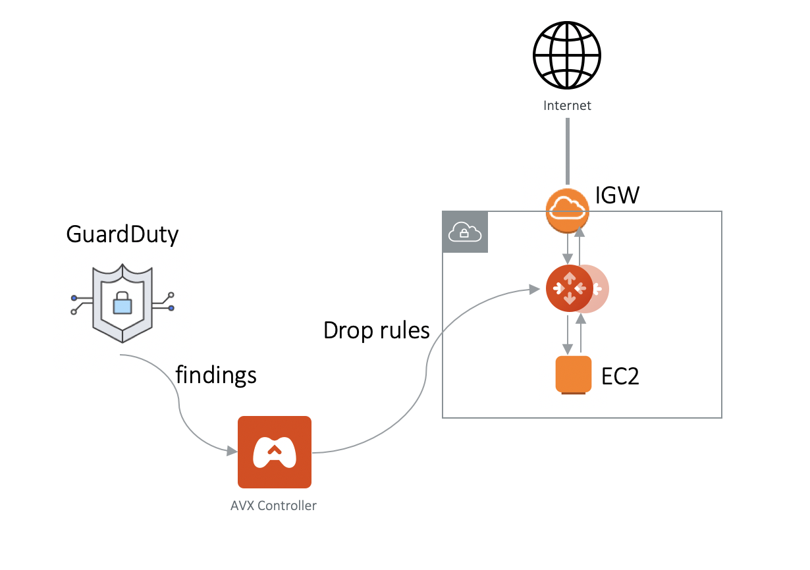

.. meta::
   :description: Amazon GuardDuty Integration
   :keywords: AWS Guard Duty, FQDN, Egress Control, IDS/IPS 

=================================
 Amazon GuardDuty Integration 
=================================

The Aviatrix Controller integrates with `Amazon GuardDuty <https://aws.amazon.com/guardduty/>`__ to provide you the IDS protection on a per account and region basis. 

Amazon GuardDuty continuosly monitors an account's AWS environment and reports findings. 
GuardDuty sifts through CloudTrail logs, VPC Flow logs and DNS logs to assess risk and generate findings. To learn more about GuardDuty, read `Amazon GuardDuty FAQ <https://aws.amazon.com/guardduty/faqs/>`__.

.. note::
   While there are no additional Aviatrix charges to use this feature, there are AWS charges associated with using Amazon GuardDuty.  For more information, see `Amazon GuradDuty Pricing <https://aws.amazon.com/guardduty/pricing/>`__.

Configuration
--------------

To enable GuardDuty Integration, login to Aviatrix Controller and follow these steps:

.. note::

   Additional permissions must be granted in the **aviatrix-app-policy** IAM policy for each account where this feature is enabled.  You may need to `update IAM policies <iam_policies.html>`__ prior to enabling this feature.

#. Go to **Security** > **AWS GuardDuty**
#. Click **+ New**
#. Select the **Account Name** of the AWS account where you would like to enable GuardDuty integration
#. Select the **AWS Region**
#. Click **Enable**

|guardduty_config|
   
.. note::
   If you have already enabled GuardDuty on AWS Console, the Controller will detect, pull the information and proceed.  

Integration and Enforcements
-------------------------------

The Aviatrix Controller provides additional monitoring, logging and enforcement services when you enable Amazon GuardDuty from the Aviatrix Controller Console, 
as listed below. 

 - Aviatrix Controller periodically polls Amazon `GuardDuty findings <https://docs.aws.amazon.com/guardduty/latest/ug/guardduty_finding-types-active.html>`_. The polling time is configurable between 5 minutes to 60 minutes. 
 - Findings from Amazon GuardDuty are `logged <AviatrixLogging.html#id13>`__ to the Controller syslog. (Syslog can be exported to `Aviatrix supported Logging services <AviatrixLogging.html>`__.)
 - Findings from Amazon GuardDuty are displayed in Alert Bell on the Controller console.  
 - In addition, if a finding is about instances in a VPC being probed by a malicious IP address, this IP address is blocked by deploying `Public Subnet Filtering Gateway <https://docs.aviatrix.com/HowTos/public_subnet_filtering_faq.html>`_, as shown in the diagram below. 

|public_subnet_filter| 

Polling Time
-------------

Go to Security -> AWS GuardDuty -> Change Scanning Interval. Select a time and click Apply. 

.. |guardduty_config| image::  guardduty_media/guardduty_config.png
   :scale: 30%

.. |guardduty_acl| image::  guardduty_media/guardduty_acl.png
   :scale: 30%

.. add in the disqus tag

.. disqus::
