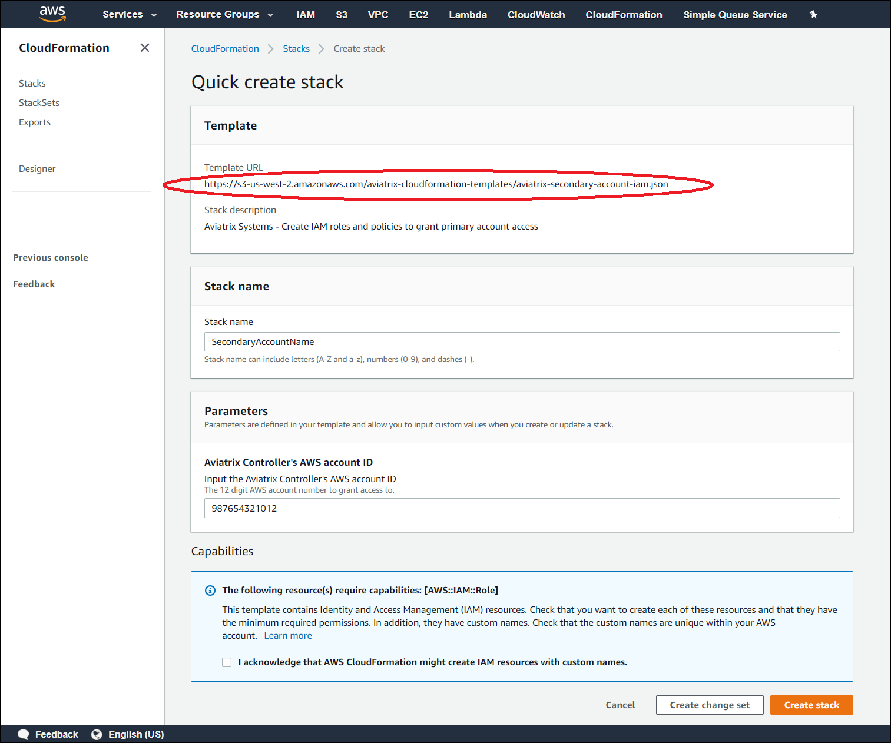
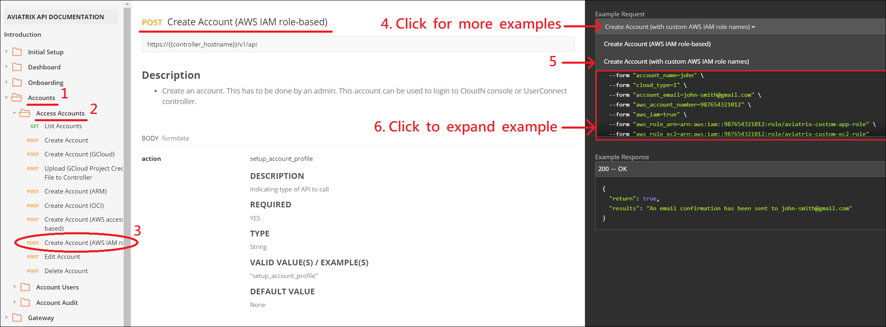
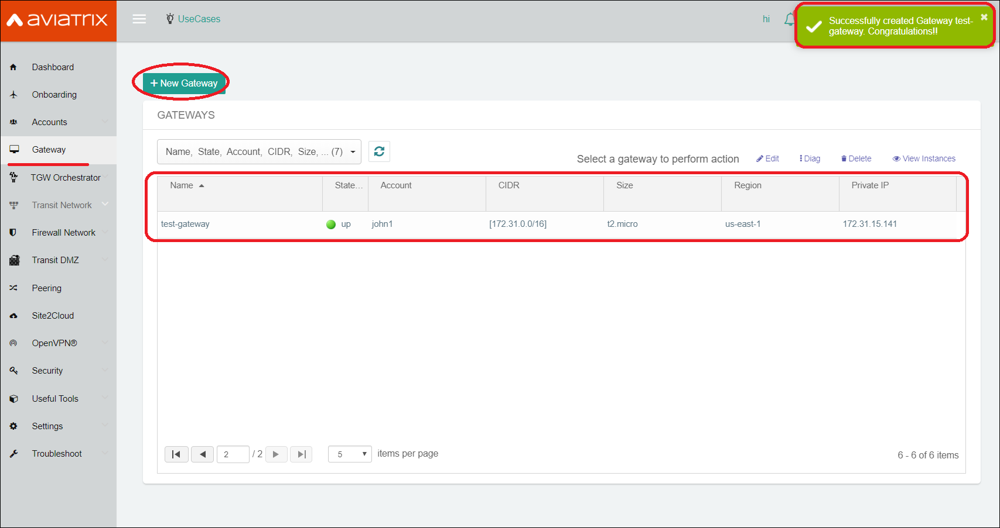

.. meta::
   :description: How to Use Custom IAM Role Names for Secondary Account
   :keywords: access account, cloud account, iam role, secondary account, custom

==========================================================
Use Custom IAM Role Names for Secondary Accounts
==========================================================

Step 01: Navigate to AWS CloudFormation with Aviatrix CFT
--------------------------------------------------------------------

+ Login to Aviatrix controller GUI console

+ Navigate to **Access-Account** page by clicking [Accounts] --> [Account Users] on the left

+ Click [+ Add new] and [Launch CloudFormation Script]

    |image1|

|

Step 02: Download Aviatrix CFT
----------------------------------

+ Use the URL shown in the screenshot below to download Aviatrix CFT to your local computer

    |image2|

|

Step 03: Modify/Customize CFT
---------------------------------

+ Modify/Replace the following highlighted string with your desired role name in order to create your own IAM role, which is equivalent to **"aviatrix-role-ec2"**

    |image3|

    |image4|

+ Modify/Replace the following highlighted string with your desired role name in order to create your own IAM role, which is equivalent to **"aviatrix-role-app"**

    |image5|

|

Step 04: Create CFT Stack
-----------------------------

+ Use the CFT you customized from the previous step to create a CFT-Stack

    |image6|

+ Enter AWS-Account-ID of the controller

    |image7|

+ Click [Next] then use default configurations to create the stack

|

Save the 2 IAM role ARNs
-----------------------------

+ After stack creation has been completed, click [Outputs] tab and copy the 2 ARNs for your roles

    |image8|

|

Invoke Aviatrix API to Create Access Account
------------------------------------------------

`Refer to Aviatrix API documentation for API example <https://api.aviatrix.com/?version=latest#345322bd-9bd8-4644-8231-25d85ca6a924>`_

    |image9|

|

Verify the work by creating an Aviatrix Gateway
---------------------------------------------------

    |image10|

|

END

.. |image1| image:: ./img/img_01_click_2ndary_cft_from_ucc_gui.png

.. |image3| image:: ./img/img_03_customize_cft_for_ec2_role_01.png
.. |image4| image:: ./img/img_04_customize_cft_for_ec2_role_02.png
.. |image5| image:: ./img/img_05_customize_cft_for_app_role.png
.. |image6| image:: ./img/img_06_create_cft_stack_using_custom_cft_01.png
.. |image7| image:: ./img/img_07_enter_controller_aws_account_id.png
.. |image8| image:: ./img/img_08_save_2_iam_role_ARNs.png

.. disqus::
