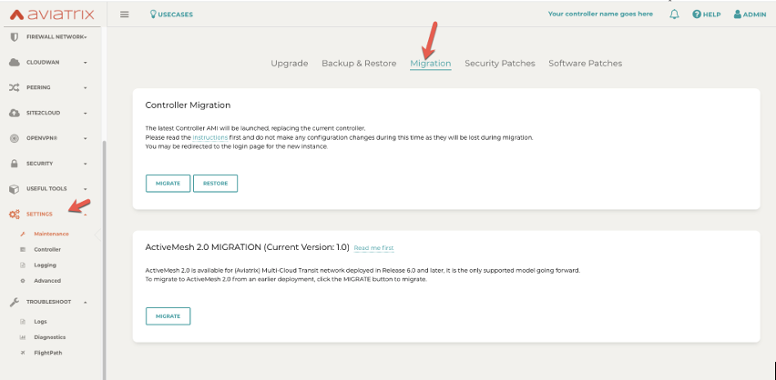
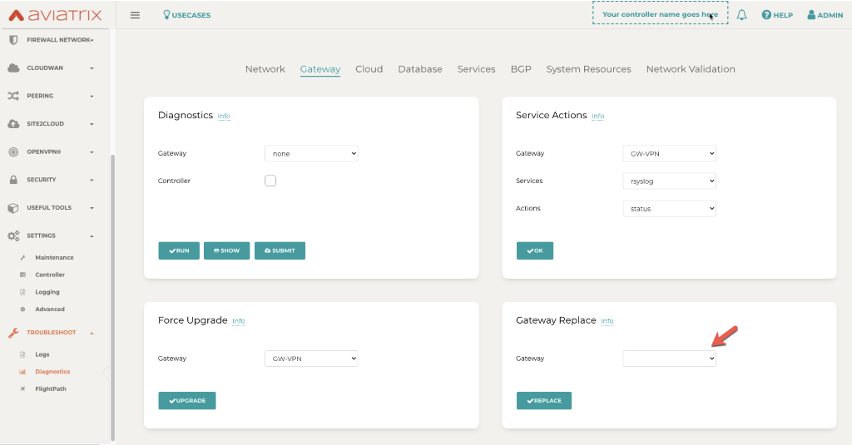

====================================================
Aviatrix Controller and Gateway Image Release Notes
====================================================

To migrate your Controller to the latest image for AWS, Azure, GCP, or OCI, see `this document <https://docs.aviatrix.com/HowTos/Migration_From_Marketplace.html>`_.

To migrate your Gateways to the latest images, see `this document <https://docs.aviatrix.com/HowTos/gateway-image-migration.html>`_.

.. important::

  New and existing customers should `migrate <https://docs.aviatrix.com/HowTos/Migration_From_Marketplace.html>`_ to the Aviatrix Secure Networking Platform Metered 2208-Universal 24x7 Support image as soon as possible to access upcoming new features and flexible billing options.

Built-In Images for each Software Version
===================================================================

+---------------------+-----------+------------------------------------------------------------------------+
|**Software Version** |**Release  |**Built-In Images for this version**                                    |
|                     |Date**     |                                                                        |
+---------------------+-----------+------------------------------------------------------------------------+
|6.8.1311             |09/12/2022 |AWS: hvm-cloudx-aws-080322, hvm-cloudx-aws-china-080422                 |
|                     |           |Azure: aviatrix-companion-gateway-v11,                                  |
|                     |           |aviatrix-companion-gateway-china-v11                                    |
|                     |           |GCP: gw-base-08032022                                                   |
|                     |           |OCI: aviatrix_gateway_54_20220323                                       |
+---------------------+-----------+------------------------------------------------------------------------+
|6.8.1149             |08/17/2022 |AWS: hvm-cloudx-aws-080322, hvm-cloudx-aws-china-080422                 |
|                     |           |Azure: aviatrix-companion-gateway-v10,                                  |
|                     |           |aviatrix-companion-gateway-china-v10                                    |
|                     |           |GCP: gw-base-08032022                                                   |
|                     |           |OCI: aviatrix_gateway_54_20220323                                       |
+---------------------+-----------+------------------------------------------------------------------------+
|6.7.1436             |08/16/2022 |AWS: hvm-cloudx-aws-031722, hvm-cloudx-aws-050422                       |
|                     |           |Azure: aviatrix-companion-gateway-v10.vhd,                              |
|                     |           |av-gw-1804-03302021-osDisk.vhd                                          |
|                     |           |GCP: gw-base-04092022                                                   |
|                     |           |OCI: aviatrix_gateway_54_20220323                                       |
+---------------------+-----------+------------------------------------------------------------------------+
|6.6.5721             |08/16/2022 |AWS: hvm-cloudx-aws-031222, hvm-cloudx-aws-031021                       |
|                     |           |Azure: aviatrix-companion-gateway-v8                                    |
|                     |           |GCP: gw-base-04102021                                                   |
|                     |           |OCI: aviatrix_gateway_54_1042_20210426_patched_v2                       |
+---------------------+-----------+------------------------------------------------------------------------+
|6.8.1148             |08/09/2022 |AWS: hvm-cloudx-aws-080322, hvm-cloudx-aws-china-080422                 |
|                     |           |Azure: aviatrix-companion-gateway-v10,                                  |
|                     |           |aviatrix-companion-gateway-china-v10                                    |
|                     |           |GCP: gw-base-08032022                                                   |
|                     |           |OCI: aviatrix_gateway_54_20220323                                       |
+---------------------+-----------+------------------------------------------------------------------------+
|6.7.1376             |08/02/2022 |AWS: hvm-cloudx-aws-031722, hvm-cloudx-aws-050422                       |
|                     |           |Azure: aviatrix-companion-gateway-v10.vhd,                              |
|                     |           |av-gw-1804-03302021-osDisk.vhd                                          |
|                     |           |GCP: gw-base-04092022                                                   |
|                     |           |OCI: aviatrix_gateway_54_20220323                                       |
+---------------------+-----------+------------------------------------------------------------------------+
|6.6.5712	          |08/02/2022 |AWS: hvm-cloudx-aws-031222, hvm-cloudx-aws-031021                       |
|                     |           |Azure: aviatrix-companion-gateway-v8.vhd, av-gw-1804-03302021-osDisk.vhd|
|                     |           |GCP: gw-base-04102021                                                   |
|                     |           |OCI: aviatrix_gateway_54_1042_20210426_patched_v2                       |
+---------------------+-----------+------------------------------------------------------------------------+
|6.7.1325	          |07/25/2022 |AWS: hvm-cloudx-aws-031722, hvm-cloudx-aws-032422                       |
|                     |           |Azure: aviatrix-companion-gateway-v9.vhd, av-gw-1804-03302021-osDisk.vhd|
|                     |           |GCP: gw-base-03142022                                                   |
|                     |           |OCI: aviatrix_gateway_54_20220323                                       |
+---------------------+-----------+------------------------------------------------------------------------+
|6.6.5667	          |07/25/2022 |AWS: hvm-cloudx-aws-031222, hvm-cloudx-aws-031021                       |
|                     |           |Azure: aviatrix-companion-gateway-v8.vhd, av-gw-1804-03302021-osDisk.vhd|
|                     |           |GCP: gw-base-04102021                                                   |
|                     |           |OCI: aviatrix_gateway_54_1042_20210426_patched_v2                       |
+---------------------+-----------+------------------------------------------------------------------------+
|6.7.1324	          |07/06/2022 |AWS: hvm-cloudx-aws-031722, hvm-cloudx-aws-032422                       |
|                     |           |Azure: aviatrix-companion-gateway-v9.vhd, av-gw-1804-03302021-osDisk.vhd|
|                     |           |GCP: gw-base-03142022                                                   |
|                     |           |OCI: aviatrix_gateway_54_20220323                                       |
+---------------------+-----------+------------------------------------------------------------------------+
|6.6.5662             |06/15/2022 |AWS: hvm-cloudx-aws-031222, hvm-cloudx-aws-031021                       |
|                     |           |Azure: aviatrix-companion-gateway-v8.vhd, av-gw-1804-03302021-osDisk.vhd|
|                     |           |GCP: gw-base-04102021                                                   |
|                     |           |OCI: aviatrix_gateway_54_1042_20210426_patched_v2                       |
+---------------------+-----------+------------------------------------------------------------------------+
|6.7.1319	          |06/10/2022 |AWS: hvm-cloudx-aws-031722, hvm-cloudx-aws-032422                       |
|                     |           |Azure: aviatrix-companion-gateway-v9                                    |
|                     |           |GCP: gw-base-03142022                                                   |
|                     |           |OCI: aviatrix_gateway_54_20220323                                       |
+---------------------+-----------+------------------------------------------------------------------------+
|6.4.3057             |05/26/2022 |AWS: hvm-cloudx-aws-022021, hvm-cloudx-aws-031021                       |
|                     |           |Azure: aviatrix-companion-gateway-v8.vhd, av-gw-1804-03302021-osDisk.vhd|
|                     |           |GCP: gw-base-02112020                                                   |
+---------------------+-----------+------------------------------------------------------------------------+
|6.5.3233             |05/26/2022 |AWS: hvm-cloudx-aws-022021, hvm-cloudx-aws-031021                       |
|                     |           |Azure: aviatrix-companion-gateway-v8.vhd, av-gw-1804-03302021-osDisk.vhd|
|                     |           |GCP: gw-base-02112020                                                   |
|                     |           |OCI: aviatrix_gateway_54_1042_20210426_patched_v2                       |
+---------------------+-----------+------------------------------------------------------------------------+
|6.6.5612             |05/12/2022 |AWS: hvm-cloudx-aws-031222, hvm-cloudx-aws-031021                       |
|                     |           |Azure: aviatrix-companion-gateway-v8.vhd, av-gw-1804-03302021-osDisk.vhd|
|                     |           |GCP: gw-base-04102021                                                   |
|                     |           |OCI: aviatrix_gateway_54_1042_20210426_patched_v2                       |
+---------------------+-----------+------------------------------------------------------------------------+
|6.7.1186             |05/11/2022 |AWS: hvm-cloudx-aws-031722, hvm-cloudx-aws-032422                       |
|                     |           |Azure: aviatrix-companion-gateway-v9.vhd, av-gw-1804-03302021-osDisk.vhd|
|                     |           |GCP: gw-base-03142022                                                   |
|                     |           |OCI: aviatrix_gateway_54_20220323                                       |
+---------------------+-----------+------------------------------------------------------------------------+
|6.7.1185             |05/09/2022 |AWS: hvm-cloudx-aws-031722, hvm-cloudx-aws-032422                       |
|                     |           |Azure: aviatrix-companion-gateway-v9.vhd, av-gw-1804-03302021-osDisk.vhd|
|                     |           |GCP: gw-base-03142022                                                   |
|                     |           |OCI: aviatrix_gateway_54_20220323                                       |
+---------------------+-----------+------------------------------------------------------------------------+
|6.4.3049             |04/08/2022 |AWS: hvm-cloudx-aws-022021, hvm-cloudx-aws-031021                       |
|                     |           |Azure: aviatrix-companion-gateway-v8.vhd, av-gw-1804-03302021-osDisk.vhd|
|                     |           |GCP: gw-base-02112020                                                   |
+---------------------+-----------+-------------------------------------------------------------------------+
|6.5.3166             |04/06/2022 |AWS: hvm-cloudx-aws-022021, hvm-cloudx-aws-031021                       |
|                     |           |Azure: aviatrix-companion-gateway-v8.vhd, av-gw-1804-03302021-osDisk.vhd|
|                     |           |GCP: gw-base-02112020                                                   |
|                     |           |OCI: aviatrix_gateway_54_1042_20210426_patched_v2                       |
+---------------------+-----------+------------------------------------------------------------------------+
|6.6.5545             |03/31/2022 |AWS: hvm-cloudx-aws-031222, hvm-cloudx-aws-031021                       |
|                     |           |Azure: aviatrix-companion-gateway-v8.vhd, av-gw-1804-03302021-osDisk.vhd|
|                     |           |GCP: gw-base-04102021                                                   |
|                     |           |OCI: aviatrix_gateway_54_1042_20210426_patched_v2                       |
+---------------------+-----------+------------------------------------------------------------------------+
|6.6.5413             |03/18/2022 |AWS: hvm-cloudx-aws-022021, hvm-cloudx-aws-031021                       |
|                     |           |Azure: aviatrix-companion-gateway-v8.vhd, av-gw-1804-03302021-osDisk.vhd|
|                     |           |GCP: gw-base-04102021                                                   |
|                     |           |OCI: aviatrix_gateway_54_1042_20210426_patched_v2                       |
+---------------------+-----------+------------------------------------------------------------------------+
|6.5.3012             |03/17/2022 |AWS: hvm-cloudx-aws-022021, hvm-cloudx-aws-031021                       |
|                     |           |Azure: aviatrix-companion-gateway-v8.vhd, av-gw-1804-03302021-osDisk.vhd|
|                     |           |GCP: gw-base-02112020                                                   |
|                     |           |OCI: aviatrix_gateway_54_1042_20210426_patched_v2                       |
+---------------------+-----------+------------------------------------------------------------------------+
|6.4.3015             |03/17/2022 |AWS: hvm-cloudx-aws-022021, hvm-cloudx-aws-031021                       |
|                     |           |Azure: aviatrix-companion-gateway-v8.vhd, av-gw-1804-03302021-osDisk.vhd|
|                     |           |GCP: gw-base-02112020                                                   |
+---------------------+-----------+------------------------------------------------------------------------+
|6.6.5409             |03/13/2022 |AWS: hvm-cloudx-aws-022021, hvm-cloudx-aws-031021                       |
|                     |           |Azure: aviatrix-companion-gateway-v8.vhd, av-gw-1804-03302021-osDisk.vhd|
|                     |           |GCP: gw-base-04102021                                                   |
|                     |           |OCI: aviatrix_gateway_54_1042_20210426_patched_v2                       |
+---------------------+-----------+------------------------------------------------------------------------+
|6.6.5404             |02/28/2022 |AWS: hvm-cloudx-aws-022021, hvm-cloudx-aws-031021                       |
|                     |           |Azure: aviatrix-companion-gateway-v8.vhd, av-gw-1804-03302021-osDisk.vhd|
|                     |           |GCP: gw-base-04102021                                                   |
|                     |           |OCI: aviatrix_gateway_54_1042_20210426_patched_v2                       |
+---------------------+-----------+------------------------------------------------------------------------+
|6.6.5230             |02/09/2022 |AWS: hvm-cloudx-aws-022021                                              |
|                     |           |Azure: aviatrix-companion-gateway-v8                                    |
|                     |           |GCP gw-base-04102021                                                    |
|                     |           |OCI: aviatrix_gateway_54_1042_20210426_patched_v2                       |
+---------------------+-----------+------------------------------------------------------------------------+
|6.5.3006             |02/09/2022 |AWS: hvm-cloudx-aws-022021, hvm-cloudx-aws-031021                       |
|                     |           |Azure: aviatrix-companion-gateway-v8.vhd, av-gw-1804-03302021-osDisk.vhd|
|                     |           |GCP: gw-base-02112020                                                   |
|                     |           |OCI: aviatrix_gateway_54_1042_20210426_patched_v2                       |
+---------------------+-----------+------------------------------------------------------------------------+
|6.4.3008             |02/09/2022 |AWS: hvm-cloudx-aws-022021, hvm-cloudx-aws-031021                       |
|                     |           |Azure: aviatrix-companion-gateway-v8.vhd, av-gw-1804-03302021-osDisk.vhd|
|                     |           |GCP: gw-base-02112020                                                   |
+---------------------+-----------+------------------------------------------------------------------------+
|6.6.5224             |01/23/2022 |AWS: hvm-cloudx-aws-022021, hvm-cloudx-aws-031021                       |
|                     |           |Azure: aviatrix-companion-gateway-v8.vhd, av-gw-1804-03302021-osDisk.vhd|
|                     |           |GCP: gw-base-04102021                                                   |
|                     |           |OCI: aviatrix_gateway_54_1042_20210426_patched_v2                       |
+---------------------+-----------+------------------------------------------------------------------------+
|6.5.2898             |01/11/2022 |AWS: hvm-cloudx-aws-022021, hvm-cloudx-aws-031021                       |
|                     |           |Azure: aviatrix-companion-gateway-v8.vhd, av-gw-1804-03302021-osDisk.vhd|
|                     |           |GCP: gw-base-02112020                                                   |
|                     |           |OCI: aviatrix_gateway_54_1042_20210426_patched_v2                       |
+---------------------+-----------+------------------------------------------------------------------------+
|6.4.2995             |01/11/2022 |AWS: hvm-cloudx-aws-022021, hvm-cloudx-aws-031021                       |
|                     |           |Azure: aviatrix-companion-gateway-v8.vhd, av-gw-1804-03302021-osDisk.vhd|
|                     |           |GCP: gw-base-02112020                                                   |
+---------------------+-----------+------------------------------------------------------------------------+
|6.5.2835	          |12/10/2021 |AWS: hvm-cloudx-aws-022021, hvm-cloudx-aws-031021                       |
|                     |           |Azure: aviatrix-companion-gateway-v8.vhd, av-gw-1804-03302021-osDisk.vhd|
|                     |           |GCP: gw-base-02112020                                                   |
|                     |           |OCI: aviatrix_gateway_54_1042_20210426_patched_v2                       |
+---------------------+-----------+------------------------------------------------------------------------+
|6.4.2973             |11/19/2021 |AWS: hvm-cloudx-aws-022021, hvm-cloudx-aws-031021                       |
|                     |           |Azure: aviatrix-companion-gateway-v8                                    |
|                     |           |GCP: gw-base-02112020                                                   |
+---------------------+-----------+------------------------------------------------------------------------+

AWS Controller Images
===================================

AWS Controller Images: 05112022_AWS_utility_controller Version: 051022 (6/09/2022)
^^^^^^^^^^^^^^^^^^^^^^^^^^^^^^^^^^^^^^^^^^^^^^^^^^^^^^^^^^^^^^^^^^^^^^^^^^^^^

Release 05112022_AWS_utility_controller includes the following updates:

* Upgraded Apache, LibNSS3, OpenSSL, Zlib, and Rsync

This image also replaces the 122520, 100621, and 110421 Controller versions of BYOL images, which were delisted from the AWS marketplace on May 26.

AWS Controller Images: 05112022_AWS_utility_controller Version: 051022 (6/09/2022)
^^^^^^^^^^^^^^^^^^^^^^^^^^^^^^^^^^^^^^^^^^^^^^^^^^^^^^^^^^^^^^^^^^^^^^^^^^^^^

Release version 05112022_AWS_utility_controller includes the following updates:

* Upgraded Apache, LibNSS3, OpenSSL, Zlib, and Rsync

This image also replaces the 122520, 100621, and 110421 Controller versions of utility images, which were delisted from the AWS marketplace on May 26.

AWS Controller Images: 05112022_AWS_metered_controller Version: 051022 (6/09/2022)
^^^^^^^^^^^^^^^^^^^^^^^^^^^^^^^^^^^^^^^^^^^^^^^^^^^^^^^^^^^^^^^^^^^^^^^^^^^^^

Release version 05112022_AWS_metered_controller includes the following updates:

* Upgraded Apache, LibNSS3, OpenSSL, Zlib, and Rsync

This image also replaces the 122520, 100621, and 110421 Controller versions of utility images, which were delisted from the AWS marketplace on May 26.

AWS Controller Images: 05112022_AWS_utility_controller Version: 051022 (6/2/2022)
^^^^^^^^^^^^^^^^^^^^^^^^^^^^^^^^^^^^^^^^^^^^^^^^^^^^^^^^^^^^^^^^^^^^^^^^^^^^^

This image addresses multiple public vulnerabilities impacting Apache, LibNSS3, OpenSSL, Zlib, and Rsync which is included on our Controller: `CVE-2022-22719 <https://cve.mitre.org/cgi-bin/cvename.cgi?name=CVE-2022-22719>`_, `CVE-2022-22720 <https://cve.mitre.org/cgi-bin/cvename.cgi?name=CVE-2022-22720>`_, `CVE-2021-43527 <https://cve.mitre.org/cgi-bin/cvename.cgi?name=CVE-2021-43527>`_, `CVE-2022-0778 <https://cve.mitre.org/cgi-bin/cvename.cgi?name=CVE-2022-0778>`_, and `CVE-2018-25032 <https://cve.mitre.org/cgi-bin/cvename.cgi?name=CVE-2018-25032>`_.

This image replaces the 122520, 100621, and 110421 BYOL Controller versions, which were removed from the AWS marketplace on May 26 and are no longer installable.

AWS Controller Images: 05112022_AWS_metered_controller Version: 051022 (6/2/2022)
^^^^^^^^^^^^^^^^^^^^^^^^^^^^^^^^^^^^^^^^^^^^^^^^^^^^^^^^^^^^^^^^^^^^^^^^^^^^^

This image addresses multiple public vulnerabilities impacting Apache, LibNSS3, OpenSSL, Zlib, and Rsync which is included on our Controller: `CVE-2022-22719 <https://cve.mitre.org/cgi-bin/cvename.cgi?name=CVE-2022-22719>`_, `CVE-2022-22720 <https://cve.mitre.org/cgi-bin/cvename.cgi?name=CVE-2022-22720>`_, `CVE-2021-43527 <https://cve.mitre.org/cgi-bin/cvename.cgi?name=CVE-2021-43527>`_, `CVE-2022-0778 <https://cve.mitre.org/cgi-bin/cvename.cgi?name=CVE-2022-0778>`_, and `CVE-2018-25032 <https://cve.mitre.org/cgi-bin/cvename.cgi?name=CVE-2018-25032>`_.

This image replaces the 122520, 100621, and 110421 BYOL Controller versions, which were removed from the AWS marketplace on May 26 and are no longer installable.

AWS Controller Images: AWS AMI – Version: 110421 (11/8/2021)
^^^^^^^^^^^^^^^^^^^^^^^^^^^^^^^^^^^^^^^^^^^^^^^^^^^^^^^^^^^^^^^^^^^^^^^^^^^^^

Release version 110421 includes the following updates:

- Added support for AWS IMDSv2.
- Corrected issue with the Aviatrix Controller initialization hanging after image migrating to a new image.
- Closed potential vulnerability in old opensource OS versions.

AWS Controller Images: AWS AMI – Version: 100621 (10/13/2021)
^^^^^^^^^^^^^^^^^^^^^^^^^^^^^^^^^^^^^^^^^^^^^^^^^^^^^^^^^^^^^^^^^^^^^^^^^^^^^

This release addresses vulnerabilities fixed by Apache version 2.4.51.

- Controller image version 100621 includes Apache version 2.4.51 which closed vulnerabilities `CVE-2021-40438 <https://cve.mitre.org/cgi-bin/cvename.cgi?name=CVE-2021-40438>`_, `CVE-2021-33193 <https://cve.mitre.org/cgi-bin/cvename.cgi?name=CVE-2021-33193>`_ and vulnerabilities closed in previous Apache releases.
- Controller image version 100621 closes a potential denial-of-service vulnerability and corrects an issue with launching controller HA.

AWS Controller Images: AWS AMI – Version 050120 (8/17/2020) 
^^^^^^^^^^^^^^^^^^^^^^^^^^^^^^^^^^^^^^^^^^^^^^^^^^^^^^^^^^^^^^^^^^^^^^^^^^^^^

Release version 050120 includes the following updates:

- R6.1.1280 Software Version is required
- Update Linux kernel and packages versions 
- Remove packages no longer used by the product 
- Set X-XSS-Protection and X-Content-Type-Options by default 
- Fix all vulnerabilities up to Jun/2020 (mid ref: 15727) 

AWS Gateway Images
============================================

AWS Gateway Image: hvm-cloudx-aws-080322 (09/09/2022)
^^^^^^^^^^^^^^^^^^^^^^^^^^^^^^^^^^^^^^^^^^^^^^^^^^^^^^^^^^^^^^^^^^^^^^^^^^^^^^^^^^^^^^^^^^^^^^

*Released with software version 6.8.1148*

This image includes the following updates:

* Updated the kernel version to 5.4.0-1080-aws.
* Upgraded the version of an opensource OS versions.
* Hardened to 80% of CIS Server L1 benchmark.
* Passed a vulnerability scan up to July 2022.

AWS Gateway Images: hvm-cloudx-aws- Version 022021, hvm-cloudx-aliyun-122520 (5/10/2021) 
^^^^^^^^^^^^^^^^^^^^^^^^^^^^^^^^^^^^^^^^^^^^^^^^^^^^^^^^^^^^^^^^^^^^^^^^^^^^^^^^^^^^^^^^^^^^^^
Both release versions include the following updates:

- R6.4.2499 Software Version is required
- Support new IPSec encryption mechanism
- Update security patches to date 
- Introduced the gateway in AWS China and Ali Cloud
- Fix and pass vulnerabilities scan to Feb/2021

AWS Gateway Images: hvm-cloudx-aws-102320 (11/10/2020)
^^^^^^^^^^^^^^^^^^^^^^^^^^^^^^^^^^^^^^^^^^^^^^^^^^^^^^^^^^^^^^^^^^^^^^^^^^^^^

Release version 102320 includes the following updates:

- R6.2.1837 Software Version is required
- New image fetch mechanism 
- Update security patches to date 
- Linux Kernel update and package upgrade 
- New network drivers 
- Fix and pass vulnerabilities scan to Sep/2020 (mid ref: 18262) 

AWS GovCloud Gateway Images
=============================================

AWS Gateway Image: hvm-cloudx-aws-080322 (09/09/2022)
^^^^^^^^^^^^^^^^^^^^^^^^^^^^^^^^^^^^^^^^^^^^^^^^^^^^^^^^^^^^^^^^^^^^^^^^^^^^^^^^^^^^^^^^^^^^^^

*Released with software version 6.8.1148*

This image includes the following updates:

* Updated the kernel version to 5.4.0-1080-aws.
* Upgraded the opensource OS versions.
* Hardened to 80% of CIS Server L1 benchmark.
* Passed a vulnerability scan up to July 2022.

Alibaba Gateway Images
============================================

Alibaba Gateway Images: Alibaba AMI - Version: 042322 (6/09/2022)
^^^^^^^^^^^^^^^^^^^^^^^^^^^^^^^^^^^^^^^^^^^^^^^^^^^^^^^^^^^^^^^^^^^^^^^^^^^^^

Release version hvm-cloudx-aliyun-042322 includes the following updates:

* Upgraded Apache, LibNSS3, OpenSSL, Zlib, and Rsync

.. disqus::
