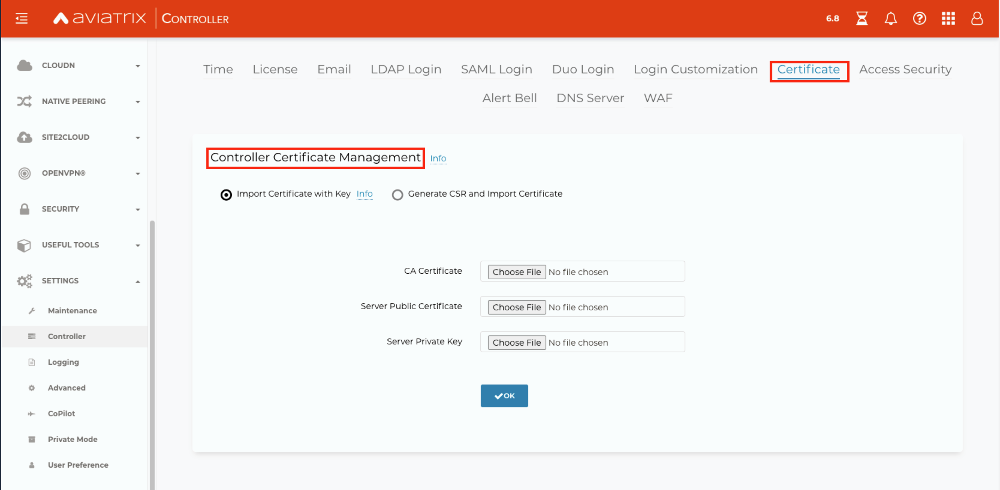

###################################
Controller Certificate Management
###################################

The Aviatrix Controller uses a self-signed certificate by default. That is why you see "Not Secure" 
In the browser. You can make it secure by importing a signed certificate. This documentation outlines the **Import a Certificate with Key** method. This example utilizes Godaddy as the CA. However, steps 1 and 3 should be universal for any certificate provider.

Import a Certificate with Key
-------------------------------------

Create Private Key and Certificate Signing Request 
^^^^^^^^^^^^^^^^^^^^^^^^^^^^^^^^^^^^^^^^^^^^^^^^^^^^

1. Log into SSH on a Linux or macOS device and run the following command to create the private key:
 
mymac$ **openssl genrsa -out my_prv.key 4096** 

2. Create the CSR:

 - Run the following command and fill out the necessary information as it relates to your company.   
 - Leave the password blank.
 
mymac$ **openssl req -new -sha256 -key my_prv.key -out controller.csr** 

Upload the CSR to Go Daddy and Retrieve the Certificates
^^^^^^^^^^^^^^^^^^^^^^^^^^^^^^^^^^^^^^^^^^^^^^^^^^^^^^^^^

1. Upload the CSR.

Site Path: GoDaddy.com > SSL > Certificates > Your Desired Domain Name > Rekey & Manage > Re-Key Certificate 
 
2. Paste the Certificate Signing Request (CSR) into the entry field.

|godaddy_1|

3. Retrieve the Certificate:

Site Path: GoDaddy.com > SSL > Certificates > Your Desired Domain Name > Download 

4. Wait for GoDaddy to respond with Certs. This usually takes ten minutes (an email confirmation is sent). 
5. Download the Certificates.

|godaddy_2|

Uploading the Certificates to the Controller
^^^^^^^^^^^^^^^^^^^^^^^^^^^^^^^^^^^^^^^^^^^^^

Path: Controller > Certificate > Controller Certificate Management > Import Certificate with Key

1. Select “Import Certificate with Key”

   - The CA certificate – the file named gd_bundle
   - The Server certificate - the other file ending in .crt
   - The Private Key – the file produced in step 1 of this documentation

|controller_cert_1|

|controller_cert_2|

The Controller signed certificate procedure is complete.

Additional Notes
^^^^^^^^^^^^^^^^
 - If a certificate is already present on the Controller you must disable “Import Certificate” before uploading the new certificates, otherwise an error occurs. 

|controller_cert_3| 

 - The Controller will perform a validity check between the Server Certificate and the Private Key.

.. |godaddy_1| image::  controller_certificate_media/godaddy_1.png
    :scale: 60%

.. |godaddy_2| image::  controller_certificate_media/godaddy_2.png
    :scale: 60%

.. |controller_cert_2| image::  controller_certificate_media/controller_cert_2.png
    :scale: 100%

.. |controller_cert_3| image:: controller_certificate_media/controller_cert_3.png
    :scale: 100%

.. disqus::
	  
