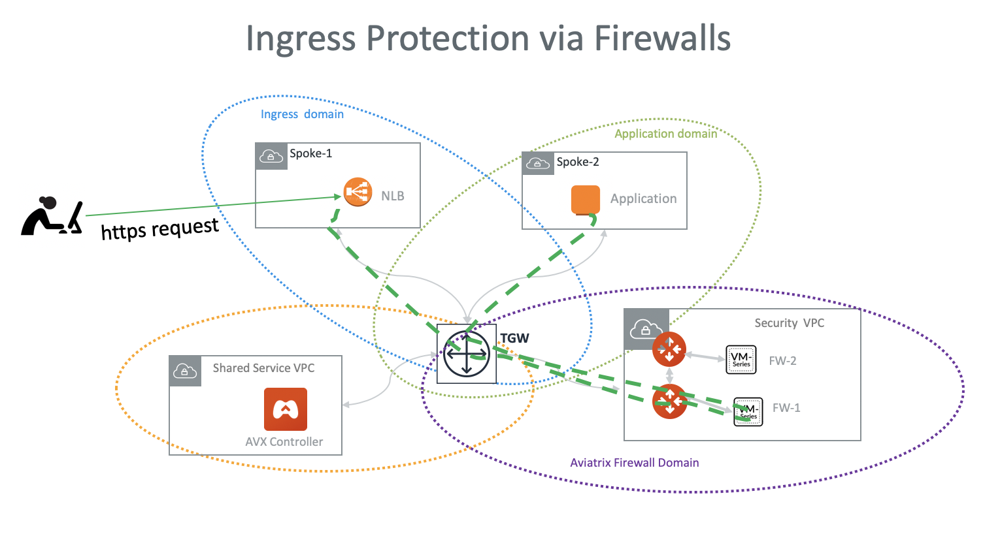

=========================================================
AWS Ingress Firewall Setup Solution 
=========================================================

This document illustrates a simple architecture for Ingress traffic inspection firewall that leverages AWS Load Balancers, `Aviatrix TGW Orchestrator <https://docs.aviatrix.com/HowTos/tgw_faq.html>`_ and `Aviatrix Firewall Network <https://docs.aviatrix.com/HowTos/firewall_network_faq.html>`_. The solution also allows 
you to view the client IP address.

The deployment is shown as the diagram below. 

|ingress_firewall|

The key idea is from FireNet point of view, the ingress inspection is simply a VPC-to-VPC traffic inspection. This is accomplished by 

 a. Placing an Internet-facing AWS ALB/NLB in a spoke VPC in a separate domain (in the diagram, this domain is called Ingress domain.) from the domains where applications reside (Application domain). 
 #. Build a connection policy to connect the Ingress domain with the Application domain. 
 #. Connect the Application domain traffic that requires inspection with the Aviatrix Firewall Domain.

In this unified architecture, firewalls can be used for Ingress, Egress, North-South and VPC-to-VPC filtering. The solution does not need AWS ALB/NLB to directly attach to firewall instances which then requires firewall instances to source NAT the incoming traffic from the Internet. Firewall instances can scale out as applications scale for all traffic types. 

.. Note::

  This architecture works for both `AWS Network Load Balancer <https://docs.aws.amazon.com/elasticloadbalancing/latest/network/introduction.html>`_ and `AWS ALB. <https://docs.aws.amazon.com/elasticloadbalancing/latest/application/create-application-load-balancer.html>`_. NLB is used for illustration purpose. 

  You can create multiple load balancers in the Ingress VPC. 

1. Prerequisite Setup
--------------------------------

 - Follow `Aviatrix Firewall Network workflow <https://docs.aviatrix.com/HowTos/firewall_network_workflow.html>`_ to launch FireNet gateways and firewall instances. Enable `Egress <https://docs.aviatrix.com/HowTos/firewall_network_faq.html#how-do-i-enable-egress-inspection-on-firenet>`_ if desired.

 - Follow `Aviatrix TGW Orchestrator workflow <https://docs.aviatrix.com/HowTos/tgw_plan.html>`_ to:
	- Create an Ingress domain (this domain can be named something else and can be an existing domain, just make sure it is in a different domain than Application domain). 
	- Build Connection policy between the Ingress domain and the Application domain. 
	- Build Connection policy between Application domain and Firewall domain so that traffic in and out of the domain is inspected. 
 	- Attach the Application domain VPC (Spoke-2 in the diagram) to the TGW. 
	- Attach the Ingress domain VPC (Spoke-1 in the diagram) to the TGW.  

2. Create AWS NLB
-------------------------------------

In Ingress domain VPC (Spoke-1), create an AWS NLB, make sure you select the following. 

 - Select **Internet-facing**.
 - Routing Target group should be IP.

3. Ready to go!
---------------

 - From the AWS Console, make sure NLB target group is in healthy state.
 - Run a https request on the NLB DNS name
- The application can also reach Internet through firewall instances if you enable Egress on the FireNet.  

4. Capturing Client IP
-------------------------

4.1 Using AWS ALB
^^^^^^^^^^^^^^^^^^

AWS ALB automatically preserves client IP address, you can find the client IP address in the HTTP header 
field "X-Forwarded-For". 

To view the client IP address in the access log, 
follow the instructions in `How to save client IP in access logs <https://aws.amazon.com/premiumsupport/knowledge-center/elb-capture-client-ip-addresses/>`_. 

4.2 Using AWS NLB
^^^^^^^^^^^^^^^^^^^^

When NLB uses IP address as target group, the client IP address of the packet reaching to the application is one of the NLB node private IP address. If you like to get the original client IP address, you need to enable function `proxy_protocol_v2.enabled under Target Group Attributes <https://docs.aws.amazon.com/elasticloadbalancing/latest/network/load-balancer-target-groups.html#target-group-attributes>`_ on the NLB. Review the section "Enable Proxy Protocol" in the above AWS document or follow the same steps as below to enable this function on NLB using the AWS console.

1. Open the Amazon EC2 console at https://console.aws.amazon.com/ec2/.
#. On the navigation pane, under Load Balancing, select **Target Groups**.
#. Select the target group.
#. Choose Description > Edit attributes.
#. Select **Enable proxy protocol v2**, and then click **Save**.

Also, you need to configure/support Proxy Protocol feature on your web server to retrieve the client original IP address. Please follow the steps below which are referring to the AWS document `How do I capture client IP addresses in my ELB access logs? <https://aws.amazon.com/premiumsupport/knowledge-center/elb-capture-client-ip-addresses/>`_.
 
	- Take Apache/2.4.41 (Ubuntu) for example.
	
	- Find and open Apache configuration file.
	
		::
			
			/etc/apache2/apache2.conf
	
	- Edit/add remoteip module configuration into Apache configuration file as below:
			
		::
		
			LoadModule remoteip_module /usr/lib/apache2/modules/mod_remoteip.so

		- https://httpd.apache.org/docs/2.4/mod/mod_remoteip.html
		
		- https://httpd.apache.org/docs/2.4/mod/mod_remoteip.html#remoteipproxyprotocol

	- Confirm that the mod_remoteip module loads by issuing command as below
	
		::
		
			$sudo apachectl -t -D DUMP_MODULES | grep -i remoteip
		
	- Review the output and verify that it contains a line similar to:
	
		::
		
			remoteip_module (shared)

		- Notes: If you are not able to view the prompt message, please make sure that your apache version support that module or attempt to load that module into the apache configuration.

	- Configure the following line to your Apache configuration file (take /etc/apache2/sites-available/000-default.conf for example) to enable Proxy Protocol support. 
		
		::
		
			RemoteIPProxyProtocol On
			
	- To view client IP address in the access log, edit/add commands into LogFormat section as below:

		::
		
			LogFormat "%h %p %a %{remote}p %l %u %t \"%r\" %>s %b \"%{Referer}i\" \"%{User-Agent}i\"" combined

	- Save the changes

	- Reload the Apache service by issuing command.
	
		::
		
			#systemctl reload apache2

	- Open the Apache access logs on your Apache server.

	- Verify that client IP addresses are now recorded under the X-Forwarded-For header.

	- Notes: 
	
		- Commands and file location varies by configuration
	
		- For other OSs and web services, please find detail in the document `How do I capture client IP addresses in my ELB access logs? <https://aws.amazon.com/premiumsupport/knowledge-center/elb-capture-client-ip-addresses/>`_

.. disqus::
