.. meta::
  :description: Ingress Protection via Aviatrix Transit FireNet with Palo Alto
  :keywords: AVX Transit Architecture, Aviatrix Transit network, Transit DMZ, Ingress, Firewall, Palo Alto, GCP, Google Cloud

=====================================================================
Ingress Protection via Aviatrix Transit FireNet with Palo Alto in GCP
=====================================================================

This document describes how to configure ingress in GCP with traffic inspection, deployed directly in FireNet. In this configuration you use the native GCP load balancer in FireNet.

The solution described below shows how to implement NLB based ingress with Palo Alto firewalls in GCP.

|gcp_ingress|

.. note::

  In this NLB based deployment in Google Cloud the original source address is preserved. The firewall then has to NAT the traffic source to its LAN interface IP, so that’s where the original source IP is rewritten (SNAT).

This document describes a step-by-step guide for application ingress protection via Aviatrix Transit FireNet using Palo Alto firewalls for Aviatrix Controller version R6.6 and later. 

For more information about Transit FireNet, please see the following documents:

  `Transit FireNet FAQ <https://docs.aviatrix.com/HowTos/transit_firenet_faq.html>`_
  
  `Firewall Network Design Patterns <https://docs.aviatrix.com/HowTos/firewall_network_design_patterns.html>`_

Design Considerations
=====================

This document describes NLB based ingress in GCP. However, there are options available for other traffic types. For HTTP/HTTPS load balancing, HTTP(S) load balancer with Network Endpoint groups could be another option although that doesn’t preserve the source IP address until the firewall is reached. For a limited list of supported ports you can also use a TCP proxy-based load balancer with Network Endpoint Groups.

Today in GCP you cannot put a HTTP(S) or other form of load balancer into a spoke VPC, as load balancers are not tied to a subnet and would deliver traffic directly to backend services instead of Spoke Gateways. A third party appliance such as F5 could be used to do this in a spoke network if needed.

Deployment Steps
====================

Step 1. Deploy a Transit FireNet in GCP
~~~~~~~~~~~~~~~~~~~~~~~~~~~~~~~~~~~~~~~

Set up a Transit FireNet in GCP and enable centralized egress. For details on setting up Transit FireNet see the below document:

  `Transit FireNet Workflow <https://docs.aviatrix.com/HowTos/transit_firenet_workflow.html>`_

Step 2. Set up firewall instances for egress
~~~~~~~~~~~~~~~~~~~~~~~~~~~~~~~~~~~~~~~~~~~~

Set up the firewall instances according to the documentation here:

  `Example Config for Palo Alto Network VM-Series in GCP <https://docs.aviatrix.com/HowTos/config_paloaltoGCP.html>`_

Enable vendor integration with the firewalls according to the documentation here:

  `Setup API Access to Palo Alto Networks VM-Series <https://docs.aviatrix.com/HowTos/paloalto_API_setup.html>`_

Enable egress through the firewalls according to the documentation here: 

  `Egress through firewall <https://docs.aviatrix.com/HowTos/firewall_advanced.html#egress-through-firewall>`_

The following screenshots show how to enable egress:

|enable_egress1|

|enable_egress2|

Step 3. Verify health probe status
~~~~~~~~~~~~~~~~~~~~~~~~~~~~~~~~~~~

In the GCP console open the Load balancing menu and check the health of the load balancers used by the Transit FireNet. These load balancers are created during the Transit FireNet setup for GCP. There will be one UDP and one TCP load balancer. Backends should show as healthy.

|gcp_be_lb_health|

Step 4. Set up Palo Alto firewalls for ingress load balancing
~~~~~~~~~~~~~~~~~~~~~~~~~~~~~~~~~~~~~~~~~~~~~~~~~~~~~~~~~~~~~

Step 4.1. Update management profile
-------------------------------------

Edit the management profile to restrict access to firewall management access over WAN and LAN interfaces to only health probes. 
Enable HTTP access since the legacy health probes in GCP only support HTTP and not HTTPS. 

The IP address ranges to add are:

- 169.254.169.254 (legacy health probe for External load balancer)
- 35.191.0.0/16 and 130.211.0.0/22 (health probes for Internal load balancer)

|palo_alto_mfmt_profile_details|

Add the management profile you have updated to the WAN interface of the firewall.

|palo_alto_mgmt_profile|

Step 5. Create ingress load balancer in GCP
~~~~~~~~~~~~~~~~~~~~~~~~~~~~~~~~~~~~~~~~~~~

Create a Load Balancer in GCP that points to the WAN interface of your firewalls. A Network Load Balancer can terminate any kind of application.

a. Click Create Load Balancer on the Load balancing page.

|gcp_create_lb_1|

Select TCP Load Balancing > Start Configuration.

|gcp_create_lb_2|

b. Select the load balancer options as shown below: From internet to my VMs, Single region only, and Target Pool or Target Instance.

|gcp_create_lb_3|

c. Enter a Name, select a Region (must match Transit FireNet’s region), click Select Existing Instances and select the firewall instances.

|gcp_create_lb_4|

d. In the Health Check area, create a health probe for the Load Balancer. Use port 80 and enter this path: /php/login.php. This path must be set for the health probe to succeed. Click Save.

|gcp_create_lb_5|

e. Click Frontend configuration on the Load Balancer Page and set up a frontend for the ingress public IP. 

   - Set up one frontend per application (or per public IP needed). 
   - Specify the port needed for the application. Note that you cannot modify this port later, so if you are unsure, set up 1-65535 as this allows all ports to be forwarded to the firewall for this IP address. 
   - Click Create to create the load balancer.

|gcp_create_lb_6|

Step 6. Set up firewalls for ingress application traffic
~~~~~~~~~~~~~~~~~~~~~~~~~~~~~~~~~~~~~~~~~~~~~~~~~~~~~~~~

Step 6.1. Create NAT rules
---------------------------

Now that the load balancer is created, you must create a NAT rule for the firewall to answer those probes destined for the frontend IP address of the load balancer.

In the firewall UI, create a DNAT rule for each frontend IP, to ensure that the health check will work. Then create a DNAT/SNAT rule for each application to DNAT/SNAT traffic to the actual application IP in the Spoke. The following screenshot shows an example for these rules.

This example uses the following parameters:

  - Fronted IP: 35.187.7.41
  - Ingress application port: 80 (this must always be 80 for the health probe NAT rule)
  - Firewall’s WAN interface IP address: 10.0.1.19
  - Application IP in spoke: 10.0.2.18
  
  You need to SNAT traffic to the firewall’s LAN port to make sure returning traffic hits the same firewall. 
  

  Make sure you always add the health probe NAT rule above the ingress app rule, as that is more specific in case the application and the health probe use the same port.

|palo_alto_dnat_1|

Step 6.2. Update firewall policy
--------------------------------

- Update the security policy on the firewall to enable access to the Frontend IP address of your load balancer from the health probe address (169.254.169.254) using HTTP (this will be the original healthprobe packet).
- Set up the firewall's security policy to enable the application ingress traffic.

Step 7. Set up GCP firewall rules for ingress
~~~~~~~~~~~~~~~~~~~~~~~~~~~~~~~~~~~~~~~~~~~~~

- Add an ingress firewall rule to the GCP firewall to allow ingress traffic to the firewall for the application. Use the tag  avx-<egress_vpc_name>-gbl for matching the firewall instances. Allow the application’s port from 0.0.0.0/0 in.
- Use the name of your egress VPC as a parameter in the tag's <egress_vpc_name>. In the example below the egress VPC name is "gcp-fw-egress-vpc" resulting in the tag name of "avx-gcp-fw-egress-vpc-gbl".

|gcp_fwrule_ingress|

|gcp_fwrule_ingress_2|

Step 8. Validate the setup
~~~~~~~~~~~~~~~~~~~~~~~~~~~~~

Check that the load balancer in the GCP console shows the backend as healthy for the firewalls. Note that when you reboot a firewall, it might take up to 30 minutes to respond to health checks on port 80.

|gcp_health_check|

Initiate traffic from the internet toward your application hosted in the spoke VPC. To do so, use the frontend IP address of the load balancer you created and the defined frontend port. Your application should respond.

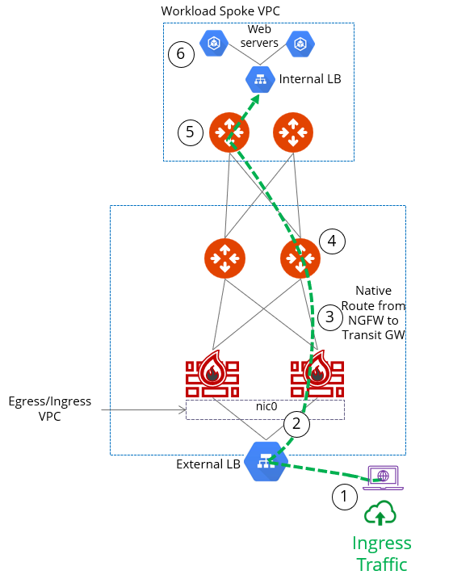

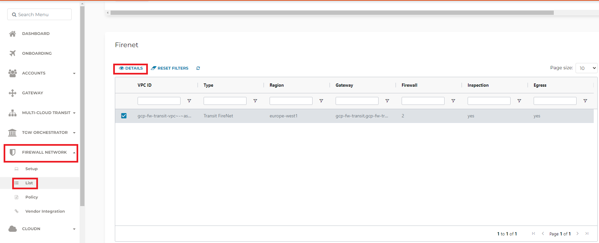

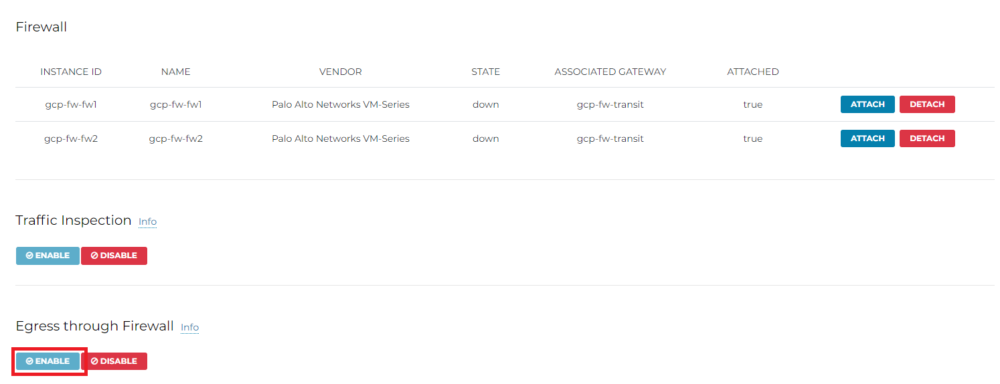

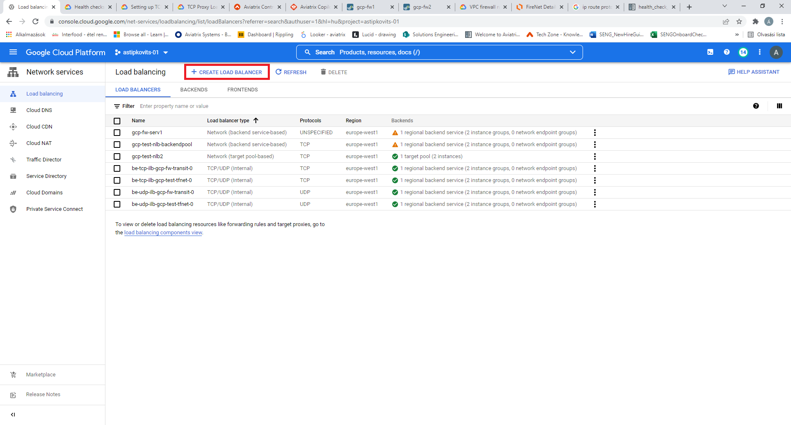

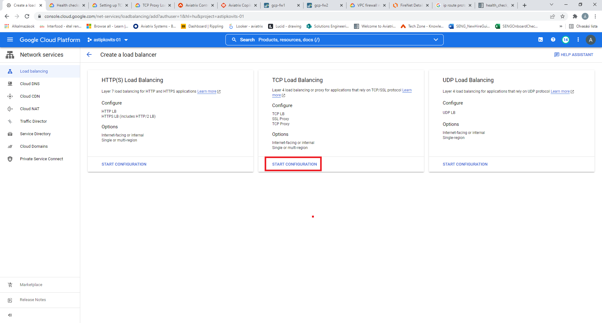

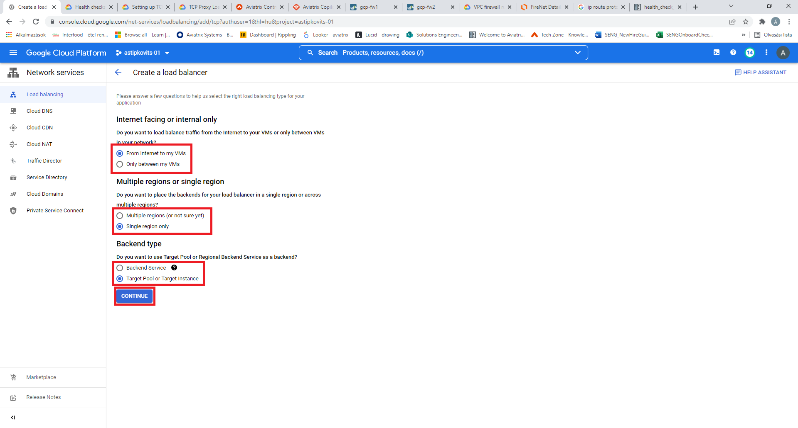

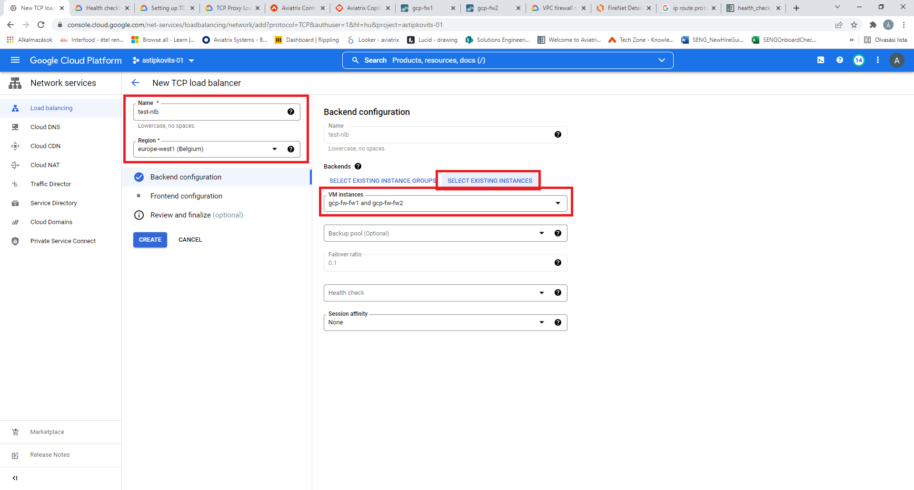

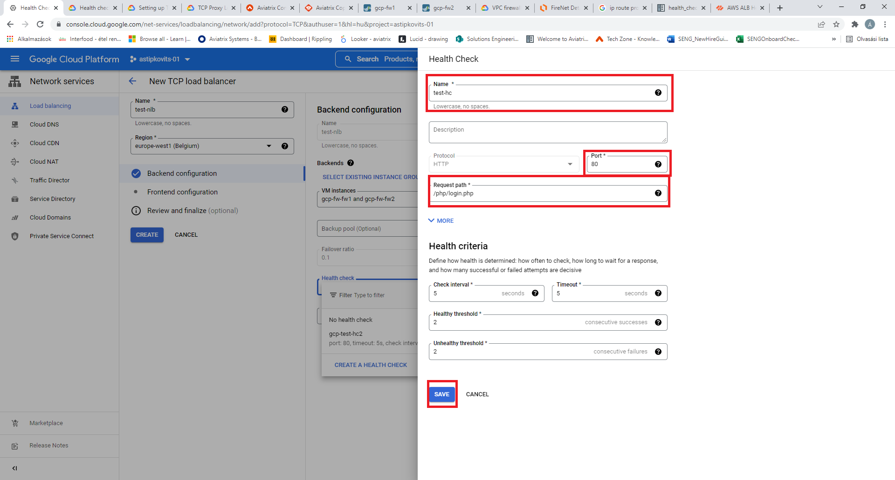

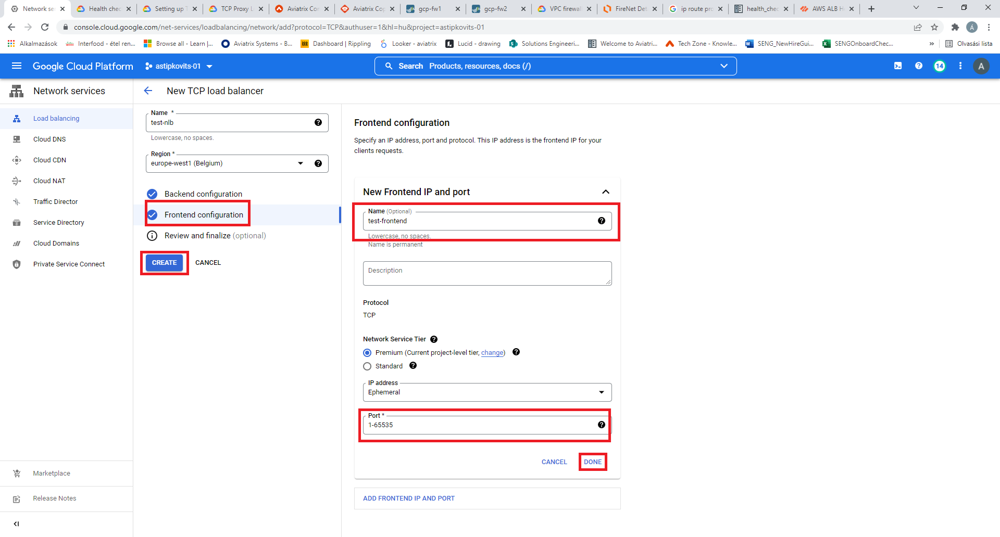

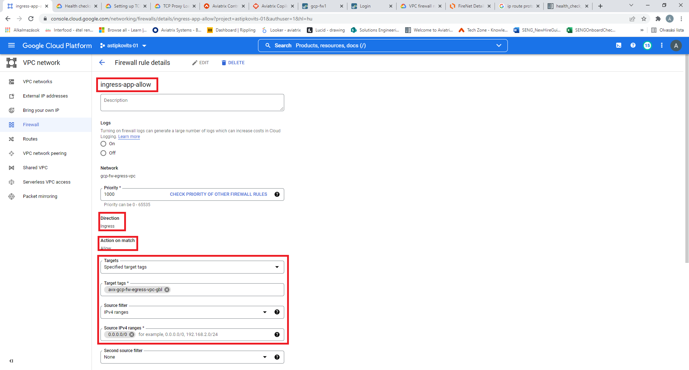

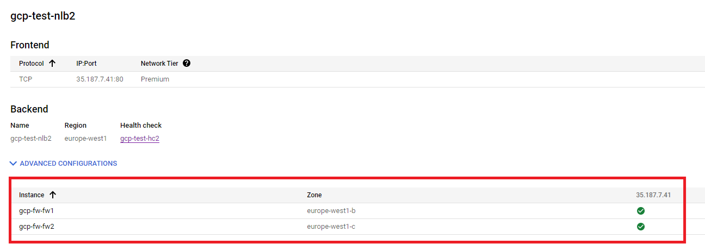

.. |palo_alto_dnat_1| image:: ingress_protection_gcp_transit_firenet_pan_media/palo_alto_dnat_1.png
   :scale: 50% 

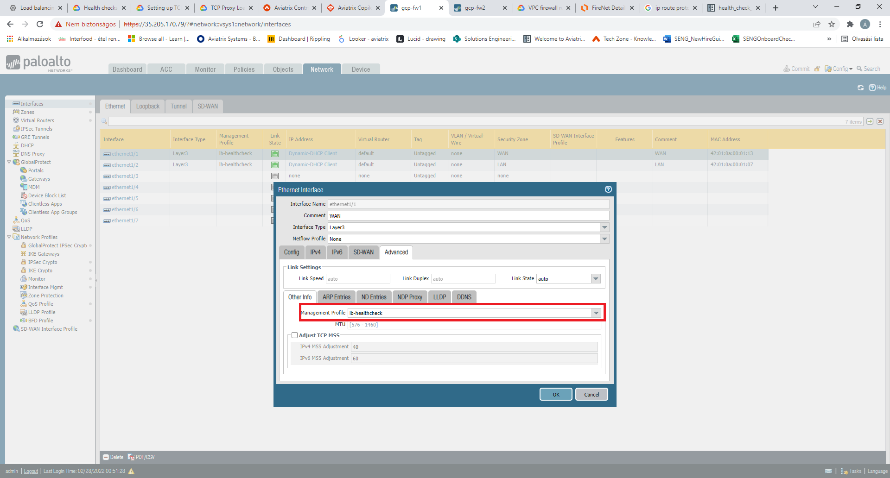

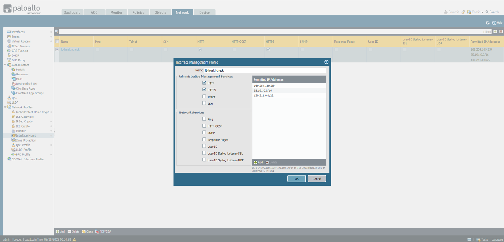

.. disqus::
