.. meta::
  :description: Ingress Protection via Aviatrix Transit FireNet with Fortigate
  :keywords: AVX Transit Architecture, Aviatrix Transit network, Transit DMZ, Ingress, Firewall, Palo Alto

==============================================================
Ingress Protection via Aviatrix Transit FireNet with Palo Alto in GCP
==============================================================

The solution described below shows how to implement NLB based ingress with Palo Alto firewalls in Google Cloud.

|gcp_ingress|

.. note::

  In this NLB based deployment in GCP the original source address is preserved. The firewall then has to NAT the traffic source to its LAN interface IP, so that’s wherethe original source IP is lost.

This document describes a step-by-step Ingress Protection via Aviatrix Transit FireNet with Palo Alto deployment workflow for R6.6 and later. 
In this note you learn how to:
  
	#. Workflow on GCP Network Load Balancer deployment
	
	#. Workflow on Firewall Instances - Palo Alto

For more information about Transit FireNet, please check out the below documents:

  `Transit FireNet FAQ <https://docs.aviatrix.com/HowTos/transit_firenet_faq.html>`_
  
  `Firewall Network Design Patterns <https://docs.aviatrix.com/HowTos/firewall_network_design_patterns.html>`_

Design considerations
====================

This document describes NLB based ingress in GCP, however there are other options available for other traffic types. For HTTP/HTTPS load balancing, HTTP(S) load balancer with Network Endpoint groups could be another option although that doesn’t preserve source IP address until the firewall. For a limited list of ports supported you can also use TCP proxy based load balancer with Network Endpoint Groups.
Unlike other clouds, today you cannot put a HTTP(S) or other form of load balancer into a spoke VPC as load balancers in GCP are not tied to a subnet and would deliver traffic directly to backend services instead of spoke gateways. A third party appliance, like F5 could be used to do this in a spoke network if needed.

Deployment Steps
====================

Step 1 Deploy a Transit Firenet in Google Cloud
-----------------------------------------------------------------

Set up a Transit Firenet in Google Cloud and enable centralized egress.

Step 2 Set up firewall instances for egress
-----------------------------------------------------------------

Set up the firewall instances (Interfaces, health probes (NAT+Interface mgmt. policy), traffic policy) according to the documentation here:

Step 3 Enable vendor integration with the firewalls
-----------------------------------------------------------------

Step 4 Verify health probe status
-----------------------------------------------------------------

Step 5 Set up Palo Alto firewalls for ingress traffic
-----------------------------------------------------------------

Step 6 Create ingress load balancer in Google Cloud
-----------------------------------------------------------------

Step 7 Set up firewalls for ingress traffic
-----------------------------------------------------------------

Step 8 Set up Google Cloud firewall rules for ingress
-----------------------------------------------------------------

Step 9 Validate the setup
-----------------------------------------------------------------

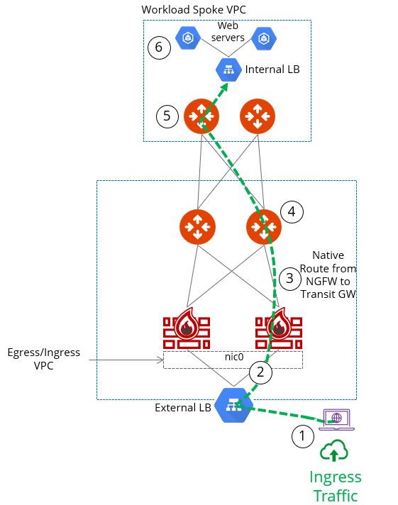

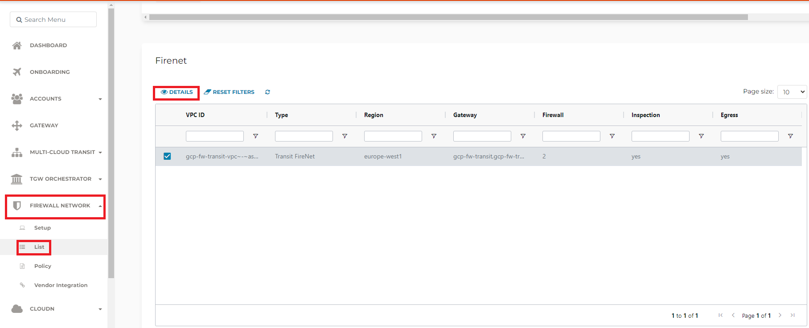

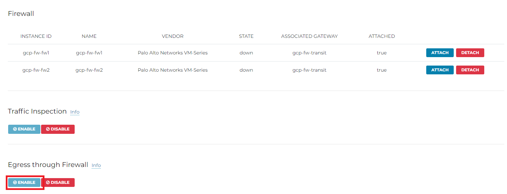

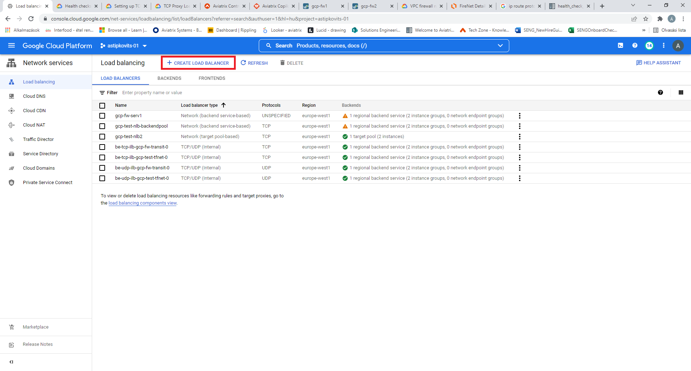

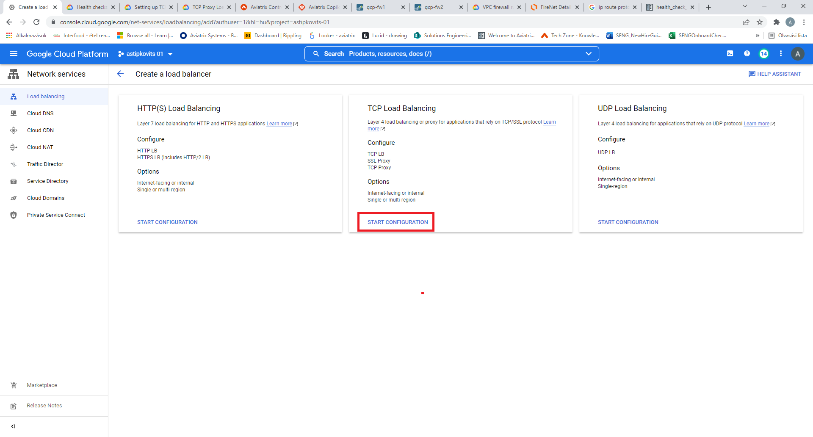

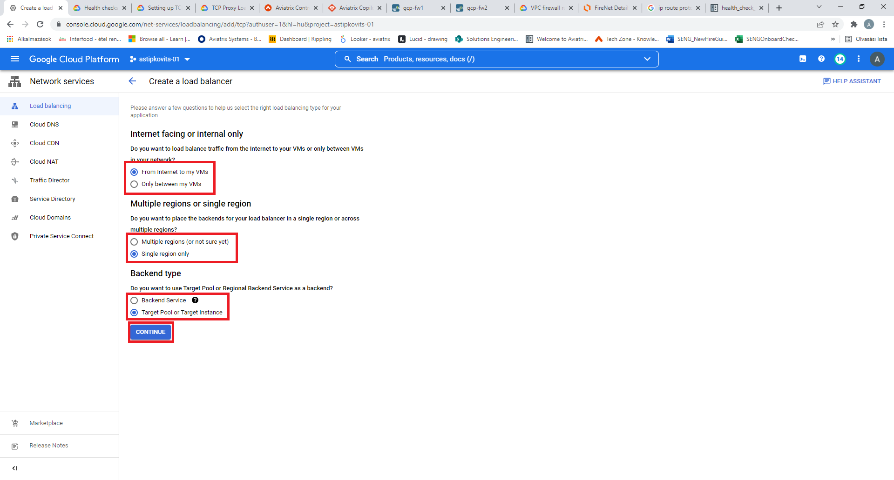

.. |gcp_create_lb_4| image:: ingress_protection_gcp_transit_firenet_pan_media/gcp_create_lb_4.png
   :scale: 50% 

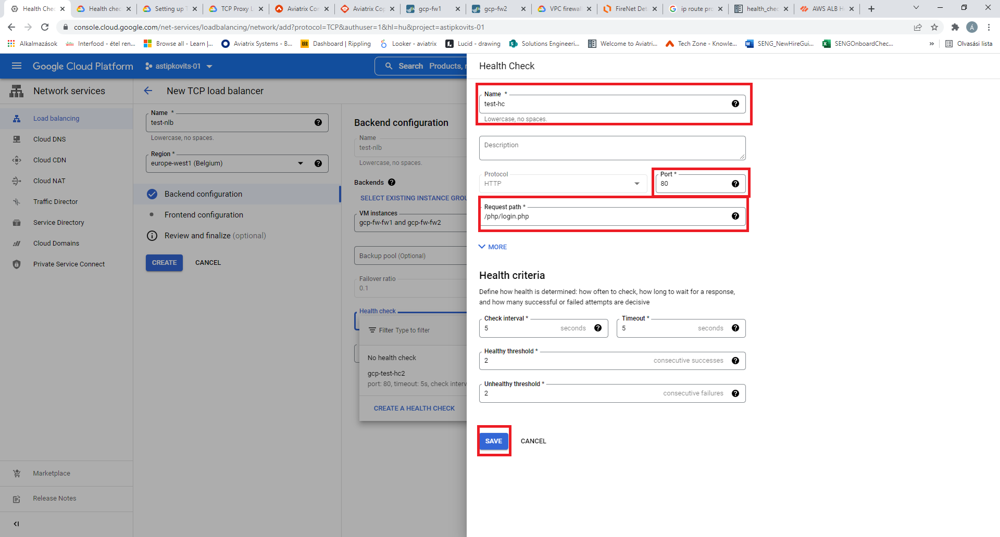

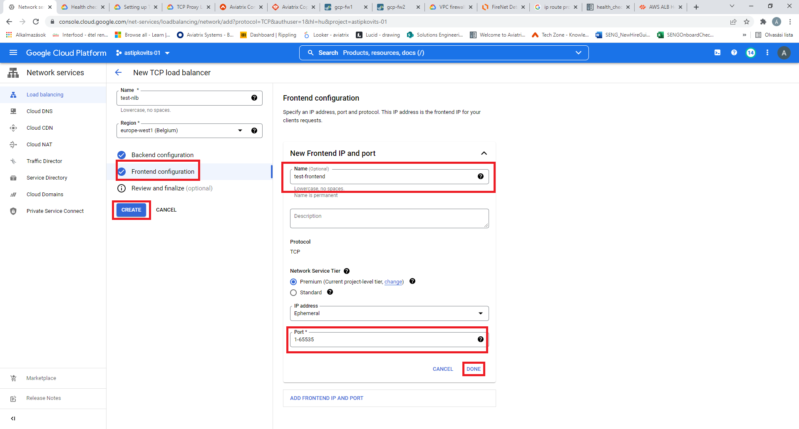

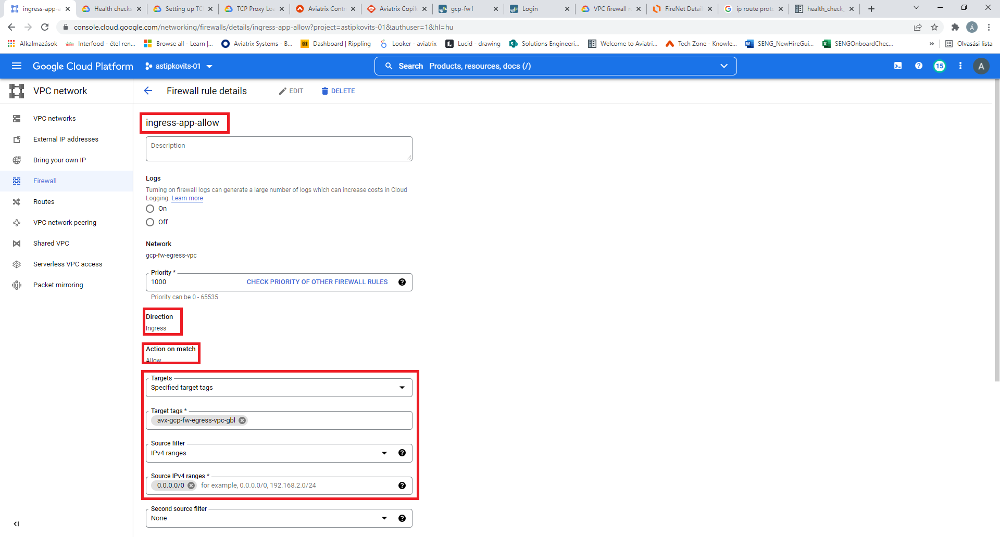

.. |gcp_fwrule_ingress_2| image:: ingress_protection_gcp_transit_firenet_pan_media/gcp_fwrule_ingress2.png
   :scale: 50% 

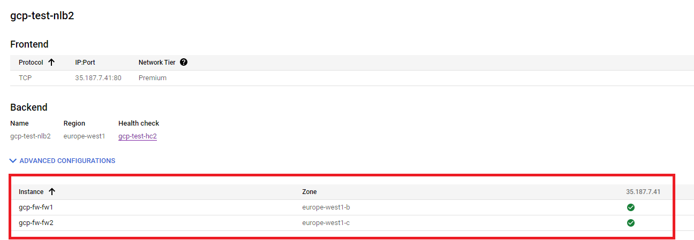

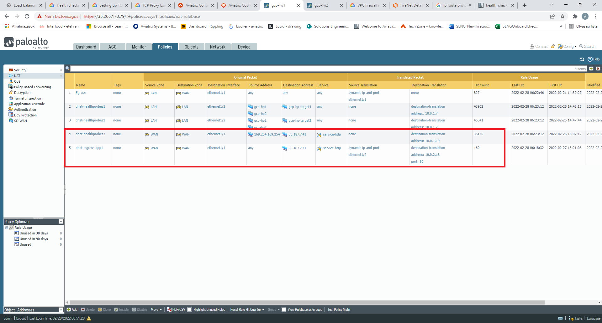

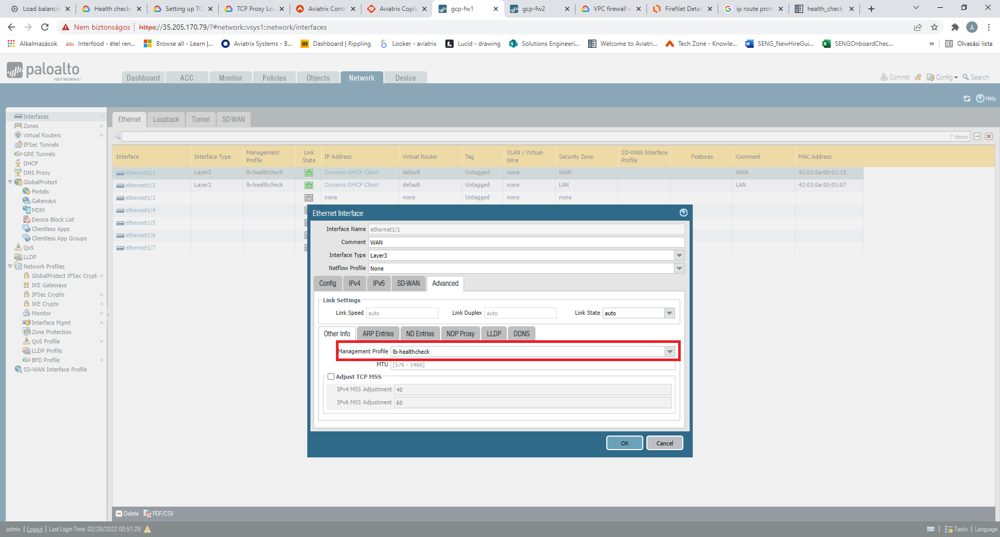

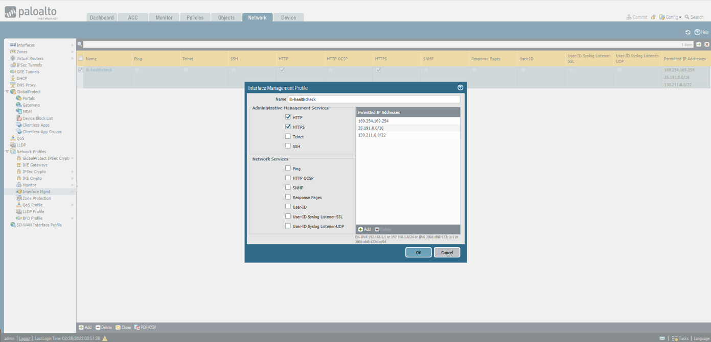

.. disqus::

