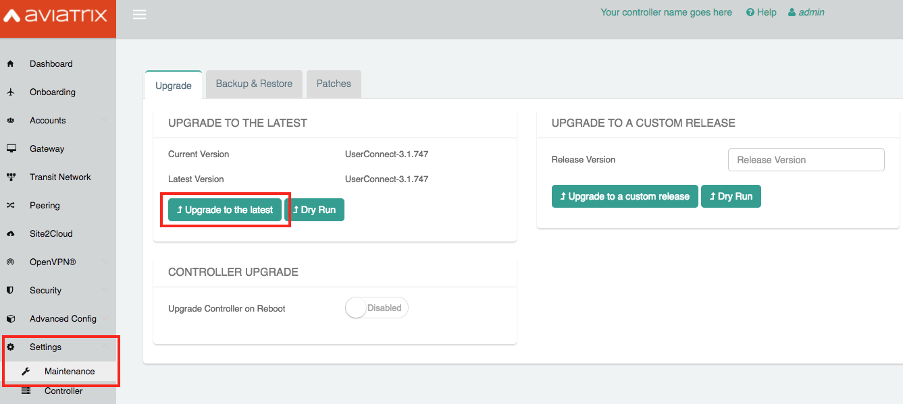
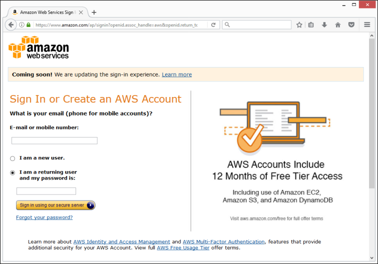
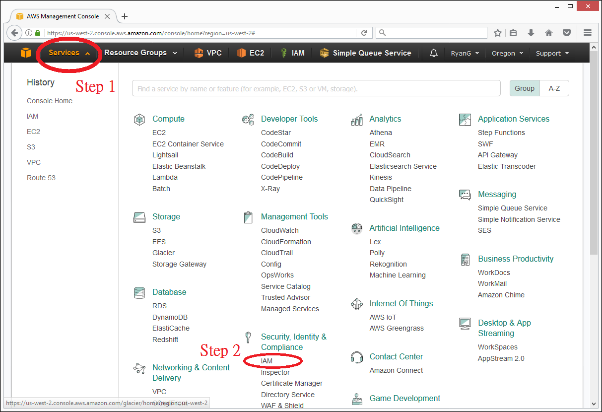
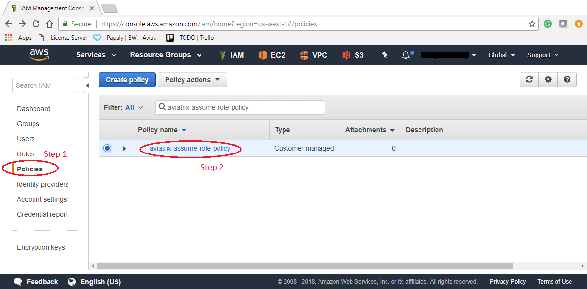
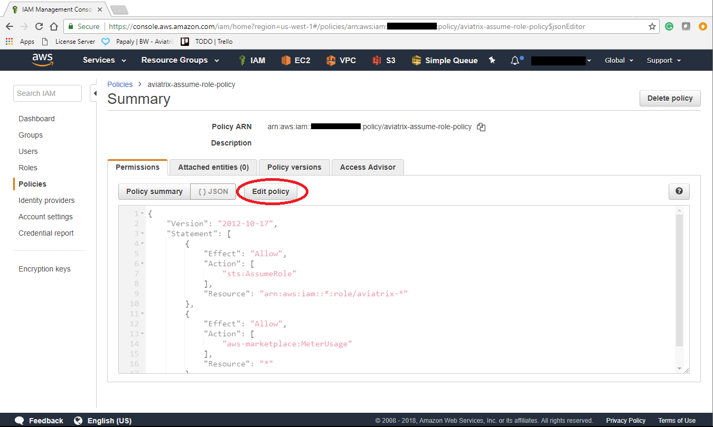
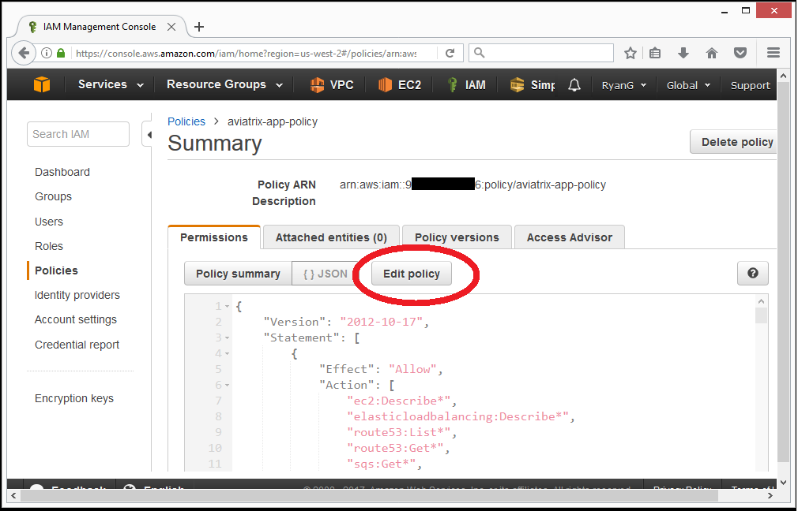

.. meta::
   :description: software upgrade of controller and gateways
   :keywords: hitless upgrade, inline upgrade, upgrade gateway software, no packet loss upgrade

###################################
Inline Software Upgrade
###################################

Aviatrix software is released frequently every 6 - 8 weeks.

When upgrading a controller software, all gateways are upgraded with the new software at the same time. This is done by controller pushing new software to gateways directly and automatically once requested.

.. note::
   
   We strongly recommend that you take a backup before you start the upgrade process. Please follow the directions `here <https://docs.aviatrix.com/HowTos/controller_backup.html>`__.

How to upgrade software
------------------------

Upgrades are done from the Controller UI.  To check for an available update and perform an upgrade, follow these steps:

#. Login to your Controller
#. Expand `Settings` navigation menu item
#. Click `Maintenance`
#. Click `Dry Run` to make sure controller and gateway are in contact and allowed to download our software from our release server. If the `Dry Run` is unsuccessful, you may want to check controller/gateway security groups, VPC DNS settings to make sure their outbound traffic to Internet is allowed. 
#. Click `Upgrade to the latest` to upgrade your software to the latest version

.. note::
   
     To reduce issues related to upgrade, starting version 3.3, the controller will let you upgrade only to the next maintenance release. For example, from 3.3.x, you can only upgrade to 3.4 first and can then upgrade again to get to 3.5. If you are running a version earlier than 3.3, please upgrade to next higher version first and repeat till you get to 3.3, using the “Upgrade to a Custom Release” function. If you are running version 3.3 or later, you can upgrade using the “Upgrade to the Latest” method as mentioned above – but note that you might have to upgrade multiple times to get to the latest release.

     Example: A controller running 3.1 can go to the latest release(lets say, 3.5) using the following steps:
      - Backup. Upgrade to 3.2 using “Upgrade to a Custom Release”
      - Backup. Upgrade to 3.3 using “Upgrade to a Custom Release”
      - Backup. Upgrade to 3.4 using “Upgrade to the Latest”
      - Backup. Upgrade to 3.5 using “Upgrade to the Latest”

   |imageUpgrade|
   
.. note::
   
   If you have been provided a custom release version, please enter that version into the `Release Version` field and click `Upgrade to a custom release` button.

Inline and hitless software upgrade
-----------------------------------

Aviatrix software upgrade happens inline without taking down the controller.

In addition, gateway upgrades are hitless.  That is, all gateway encrypted tunnels stay up during the upgrade process. There is no packet loss when upgrading the software.

Upgrade impact on OpenVPN® users
--------------------------------

Most upgrades do not impact connected OpenVPN® users. In some cases, OpenVPN® service needs to be restarted as part of software upgrade, for example, upgrade to a new SSL version for security patch. In these cases, connected OpenVPN® users will be disconnected and will need to connect again.

When a release affects OpenVPN® users, the Release Note will make a note of it.
Make sure you read Release Notes before applying an upgrade.

OpenVPN is a registered trademark of OpenVPN Inc.

How to update AWS-IAM-Policy
----------------------------------------

Please also keep your AWS IAM Policies updated to the latest (preferably before upgrading controller software).

Step 01: Login to your AWS GUI console

|common_image1|

Step 02: Go to IAM service

|common_image2|

A. Update “aviatrix-assume-role-policy”:
~~~~~~~~~~~~~~~~~~~~~~~~~~~~~~~~~~~~~~~~~

Step 03: Click "Policies" and search for the policy "aviatrix-assume-role-policy"

If you have not created "aviatrix-assume-role-policy", please see
`here <http://docs.aviatrix.com/HowTos/HowTo_IAM_role.html#create-aviatrix-assume-role-policy>`__.

|aviatrix-assume-role-policy_image3|

Step 04: Click Edit Policy

|aviatrix-assume-role-policy_image4|

Step 05: Click tab "JSON"

Step 06: Update Policy: copy and paste the policy text from `this link <https://s3-us-west-2.amazonaws.com/aviatrix-download/iam_assume_role_policy.txt>`__ and then click button "Review policy" and button "Save changes".

B. Update “aviatrix-app-policy”:
~~~~~~~~~~~~~~~~~~~~~~~~~~~~~~~~~

Step 07: Click "Policies" and search for the policy "aviatrix-app-policy"

If you have not created "aviatrix-app-policy", please see
`here <http://docs.aviatrix.com/HowTos/HowTo_IAM_role.html#create-aviatrix-app-policy>`__.

|aviatrix-app-policy_image5|

Step 08: Click Edit Policy

|aviatrix-app-policy_image6|

Step 09: Click tab "JSON"

Step 10: Update Policy: copy and paste the policy provided by `this link <https://s3-us-west-2.amazonaws.com/aviatrix-download/IAM_access_policy_for_CloudN.txt>`__ and then click button "Review policy" and button "Save changes".

.. note::
   
   Please also update the AWS-IAM-Policy for all Secondary Access Accounts.

.. disqus::

.. |aviatrix-app-policy_image5| image:: customize_aws_iam_policy_media/image4.png
   :width: 5.13900in
   :height: 3.28302in

