===============================================
Insane Mode Encryption FAQ
===============================================

This document discusses Aviatrix High Performance Multi-Cloud Transit Network and answers related questions.

Why is Transit VPC/VNet performance capped at 1.25Gbps?
-------------------------------------------------------------------------

In the current Transit VPC/VNet solution, the throughput is capped at 1.25Gbps regardless if you have a 10Gbps connection between an on-prem network and the cloud (Direct Connect (DX)/ExpressRoute/FastConnect/InterConnect) link. The reason is that in the Transit VPC/VNet deployment there is
an IPsec session between VGW/VPN Gateway and Transit Gateway and VGW/VPN Gateway has a performance limitation.

`AWS VGW <https://aws.amazon.com/vpc/faqs/>`_ and other Cloud Service Providers' IPsec VPN solutions have a `published performance cap <https://aws.amazon.com/vpc/faqs/>`_ of 1.25Gbps.
Why is that?

Most virtual routers or software-based routers are built with general purpose CPUs. Despite the vast CPU technology advancement, why doesn't IPsec performance scale further?

It turns out the problem lies in the nature of tunneling, a common technique in networking to connect two endpoints. 

When two general purpose server or virtual machine-based routes are connected by an IPsec tunnel, 
there is one UDP or ESP session going between the two machines, as shown below. 

|tunnel_diagram|

In the above diagram, the virtual router has multiple CPU cores, but since there is only one tunnel established, the
Ethernet Interface can only direct incoming packets to a single core, thus the performance is limited to one
CPU core, regardless how many CPU cores and memory you provide.

This is true not only for IPsec, but also for all tunneling protocols, such as GRE and IPIP.

What is Aviatrix high performance Insane Mode Encryption?
---------------------------------------------------------------------------

Aviatrix Insane Mode tunneling techniques establishes multiple tunnels between the two virtual routers, thus allowing
all CPU cores to be used for performance scaling with the CPU resources, as shown below. 

|insane_tunnel_diagram|

With Aviatrix Insane Mode tunneling, IPsec encryption can achieve 10Gbps, 25Gbps 
and beyond, leveraging the multiple CPU cores in a single instance, VM or host. 

What are the use cases for Insane Mode?
-------------------------------------------------------

 - High performance `Encrypted Transit <https://docs.aviatrix.com/HowTos/transitvpc_workflow.html>`_
 - High performance `Encrypted Peering <https://docs.aviatrix.com/HowTos/peering_faq.html>`_ performance
 - High performance encryption over Direct Connect/ExpressRoute/FastConnect/InterConnect
 - Overcome VGW performance limit and 100 route limits

How can I deploy Aviatrix Insane Mode?
-----------------------------------------------------------

Aviatrix Insane Mode is integrated into the Transit Network solution to provide 10Gbps performance between on-prem and Transit VPC/VNet with encryption. For VPC/VNet to VPC/VNet, Insane Mode can achieve 25 - 30Gbps. 

Insane Mode can also be deployed in a flat (as opposed to Transit VPC/VNet) architecture for 10Gbps encryption. 

The diagram below illustrates the high performance encryption between Transit VPC/VNet and on-prem, between Transit VPC/VNet and Spoke VPC/VNet. 

|insane_transit|

What are the performance benchmarks? 
---------------------------------------------

Insane Mode is available on AWS, Azure, GCP, and OCI. For more performance test results and information about how to
tune your environment to get the best performance, see `this document. <https://docs.aviatrix.com/HowTos/insane_mode_perf.html?highlight=performance%20benchmark#activemesh-insane-mode-encryption-performance>`_

How does Insane Mode work?
-----------------------------

When a gateway is launched with `Insane Mode enabled <https://docs.aviatrix.com/HowTos/gateway.html#insane-mode-encryption>`_, 
a new /26 public subnet is created where the Insane Mode gateway is launched on.

Insane Mode builds high performance encryption tunnel over private network links. The private network links are 
Direct Connect (DX)/AWS Peering (PCX), Azure ExpressRoute, GCP FastConnect, and OCI InterConnect.

For Insane Mode between two gateways, between a Transit GW and a Spoke Gateway, or between a Transit GW and a Transit GW (Transit Peering), the Aviatrix Controller automatically creates the underlying peering connection and builds the tunnels over it. 

Since Insane Mode tunnels are over private network links, the VPC/VNet route architecture is described as below, 
where virtual machine (EC2/GCE/OC) instances associated route entry to the remote site point to Aviatrix Gateway, and the Aviatrix Gateway instance associated route entry to remote site points to PCX or VGW. 

|insane_routing|

What is Aviatrix Insane Mode High-Performance Encryption over the internet?
---------------------------------------------------------------------------

Aviatrix Insane Mode over the internet builds high-performance encryption (HPE) tunnels over public IP addresses between two intercloud transit peering gateways. For instance, when a transit gateway peering is established between AWS and Azure, the Aviatrix Controller allocates EIP addresses then builds the HPE tunnels over the public IP addresses between the two transit gateways, establishing one-to-one connections.

Insane Mode over the internet for GCP transit gateway peering configuration differs from AWS, Azure, and OCI. Because GCP Ethernet interface supports only one public IP address, HPE tunnels are built to the same public IP address on the GCP transit gateway, establishing one-to-many connections.

To establish peered transit gateways over the internet, refer to `Multi-cloud Transit Gateway Peering over Public Network Workflow <https://docs.aviatrix.com/HowTos/transit_gateway_peering_over_public_network_workflow.html>`_. 

What are the performance benchmarks for Insane Mode over the internet? 
----------------------------------------------------------------------

Aviatrix Insane Mode HPE over the internet throughput performance is dependant on the number of HPE tunnels that are configured. The supported range is up to 20 HPE tunnels.

What is the Aviatrix hardware appliance CloudN?
--------------------------------------------------

Aviatrix offers a 1U rack mountable hardware appliance deployed in the datacenter. It works with the Aviatrix gateway.

The Aviatrix appliance CloudN specification:

========================    =======================================              =================
Aviatrix CloudN             Specification                                        Notes
========================    =======================================              =================
Dimension                   1U rack mount
Server                      HPE ProLiant DL360 Gen10 Xeon Gold 6130
CPU                         16 cores
Memory                      64GB
PCIe                        3.0
10/25Gbps Ethernet port     2 x SFP+                                             1 LAN port and 1 WAN port 
1Gbps Ethernet port         RJ45                                                 1 Management port
========================    =======================================              =================

More information on HPE ProLiant DL360 Gen10 Server can be found `here. <https://www.hpe.com/us/en/product-catalog/servers/proliant-servers/pip.hpe-proliant-dl360-gen10-server.1010007891.html>`_

What is the deployment logical diagram?
-------------------------------------------

Datacenter deployment is shown in the diagram below with redundancy, where R1 and R2 are two edge routers that connected to VGW or VPN Gateway over 
DX. R3 and R4 are two routers connect to the inside of the datacenter. Aviatrix CloudN also runs a BGP session with R3 and
R4 to collect datacenter routes. VGW is only used to terminate DX. Aviatrix Gateway and on-prem appliance CloudN 
run a BGP session to propagate on-prem routes to the Transit VPC/VNet. IPsec tunnels are also built between the two. 

|insane_datacenter|

A logical deployment layout is described as below. 

|datacenter_layout|

How to deploy Insane Mode for hybrid connectivity?
----------------------------------------------------

Follow the `Insane Mode CloudN Deployment Checklist <https://docs.aviatrix.com/HowTos/CloudN_insane_mode.html>`_ to deploy CloudN in your datacenter. 

Do I need Direct Connect/ExpressRoute/FastConnect/InterConnect to use Insane Mode for On-prem?
--------------------------------------------------------------------------------------------------------------------------------

Our Insane Mode high speed encryption feature works on top of your existing WAN link, and it is agnostic to the type of connection used. As long as you have a pipe 
that's large enough to allow for high throughput data transfer, using Insane Mode will offer superior performance to regular IPsec.

How to configure Insane Mode for Transit VPC/VNet?
----------------------------------------------

Navigate to `Step 1 Transit Network workflow <https://docs.aviatrix.com/HowTos/transitvpc_workflow.html#launch-an-aviatrix-transit-gateway>`_ and mark the **Insane Mode Encryption** checkbox.

Can one CloudN appliance connect to multiple connections of Direct Connect/Express Route/FastConnect/InterConnect?
-------------------------------------------------------------------------------------------------------------------------------------------------------

Yes. A CloudN appliance can build multiple Insane Mode tunnels to different Aviatrix Transit Gateways over multiple DX/Express Route/FastConnect/InterConnect, as shown in the diagram below. 

|cloudn_multi_conn|

What are the supported gateway sizes for GCP High-performance encryption (Insane Mode)?
---------------------------------------------------------------------------------------

There are total 4 sizes: n1-highcpu-4, n1-highcpu-8, n1-highcpu-16, and n1-highcpu-32

What is the subnet prefix length for GCP High-performance encryption (Insane Mode)?
-----------------------------------------------------------------------------------

Gateway subnet prefix length cannot be greater than /24. Moreover, Aviatrix highly suggests that customers utilize a subnet exclusively for deploying insane mode gateway without any other instances in the subnet.

What ActiveMesh version does GCP High-performance encryption (Insane Mode) support?
-----------------------------------------------------------------------------------

GCP Insane Mode supports only Transit Solution ActiveMesh 2.0.

What is the MTU and MSS size for GCP High-performance encryption (Insane Mode)?
--------------------------------------------------------------------------------

MTU is 1460 and MSS is 1330 bytes

What are the features supported with GCP Insane Mode?
-------------------------------------------------------------------------------

Because GCP network infrastructure/concept is different than AWS/Azure, Aviatrix GCP Insane Mode behavior differs from AWS/Azure support in the following ways:

- Only Spoke and Transit Gateway types are supported.
- Only Multi-Cloud Transit functionality is supported with Insane Mode gateways; `encrypted peering <https://docs.aviatrix.com/HowTos/Quick_Tour.html#encrypted-peering>`_ is not supported.
- The Advertise Transit VPC Network CIDR(s) feature is not supported with an Insane Mode Gateway.
- Aviatrix will support Managed CloudN connecting to Aviatrix Transit Gateway in GCP soon; Standalone/unmanaged CloudN connecting to Aviatrix Transit Gateway is not supported in GCP.

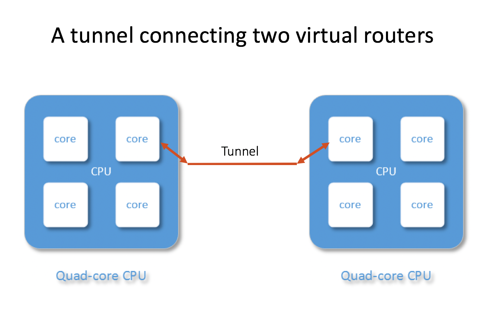

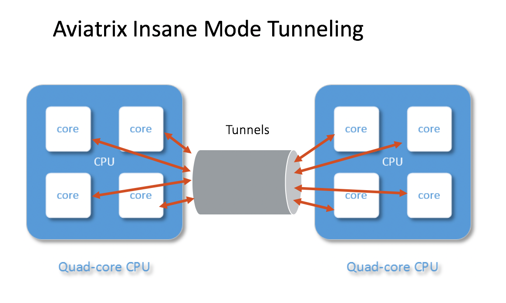

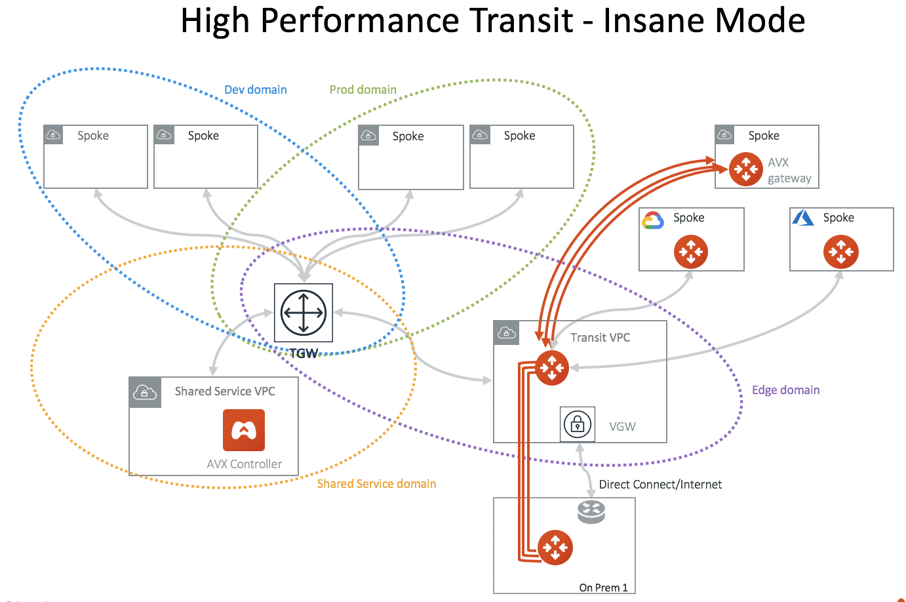

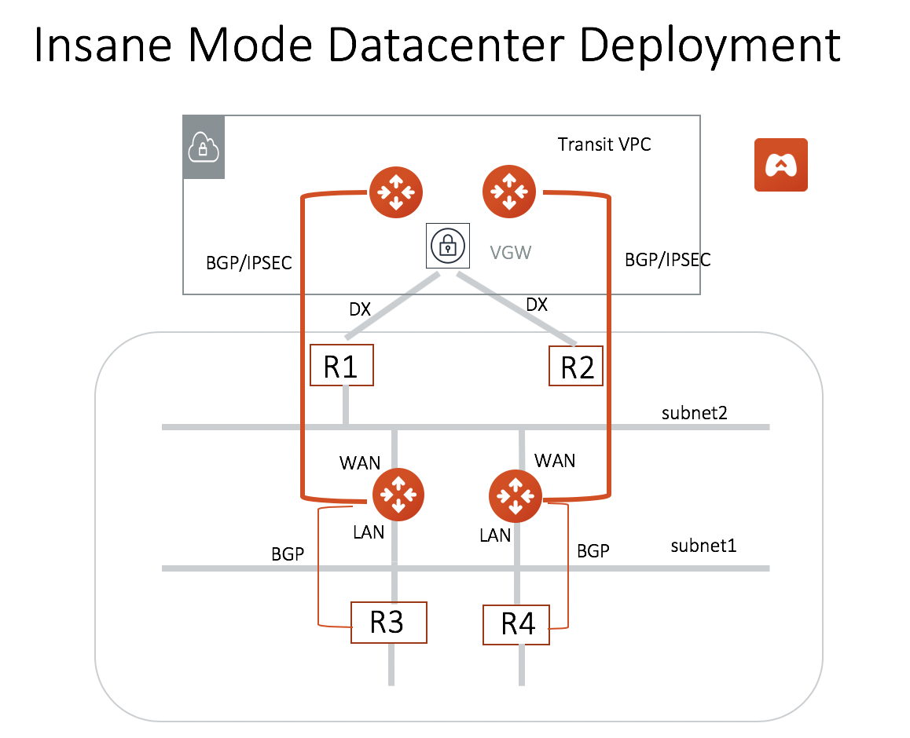

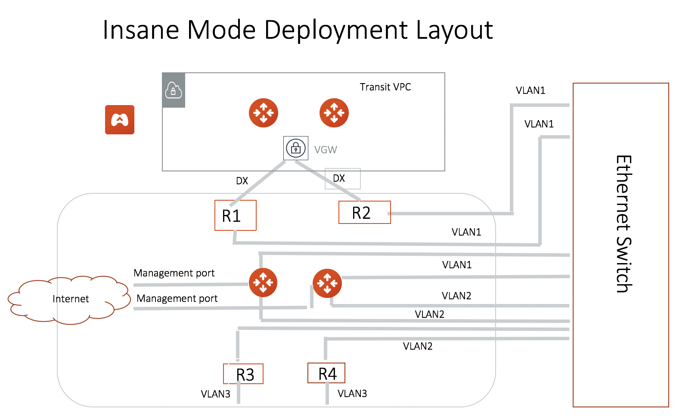

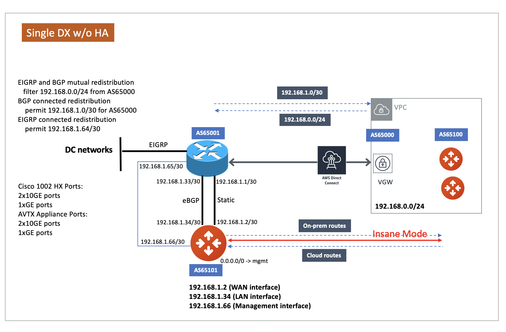

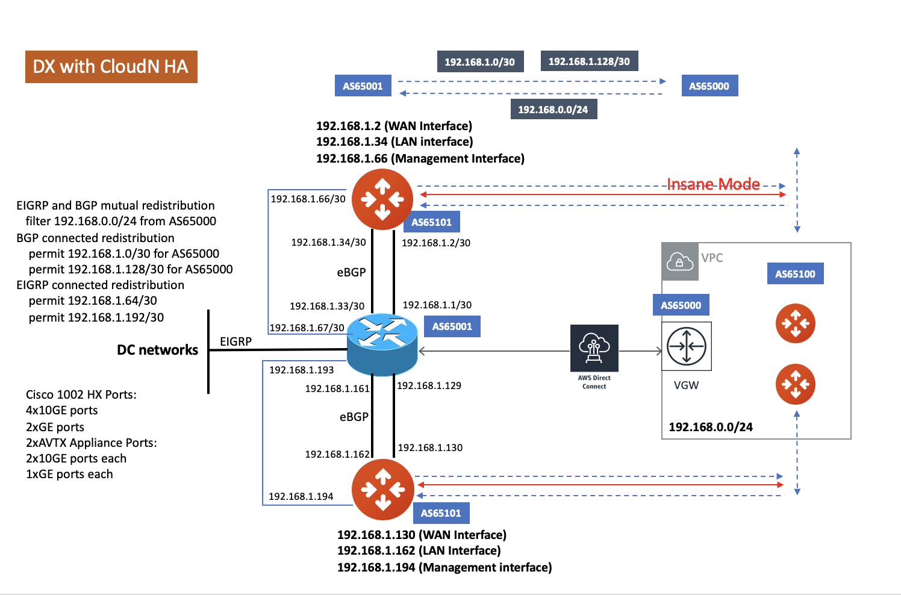

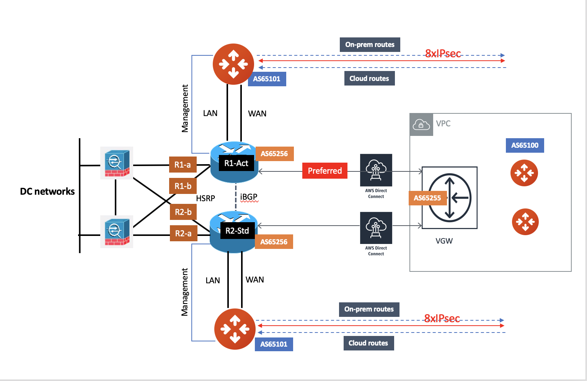

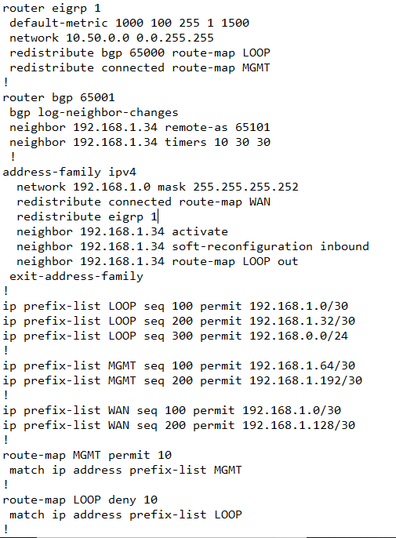

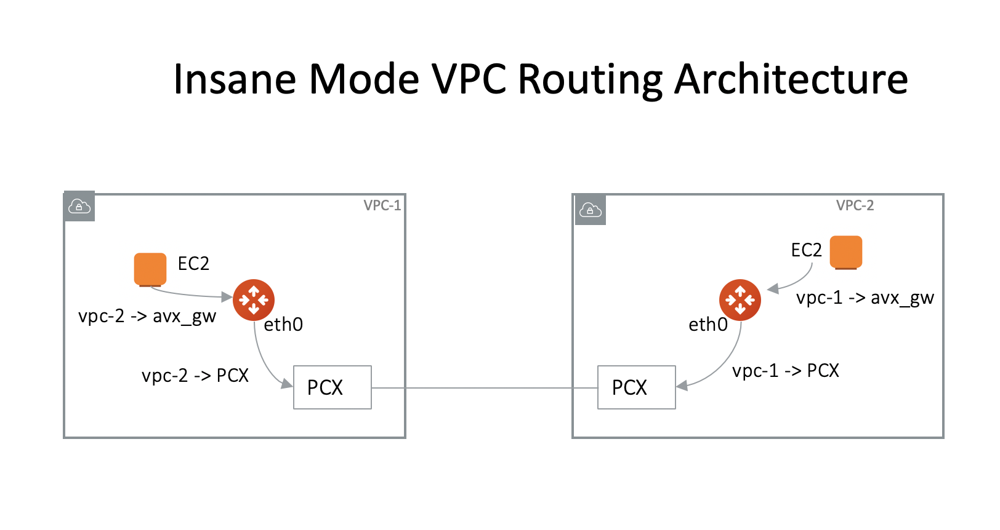

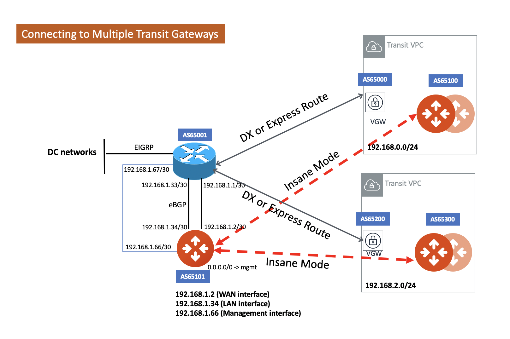

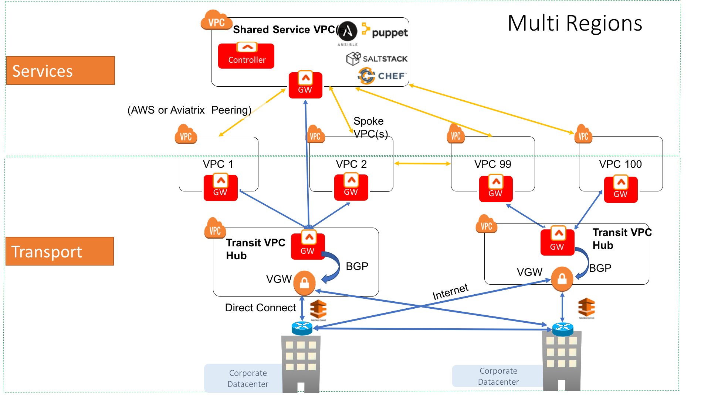

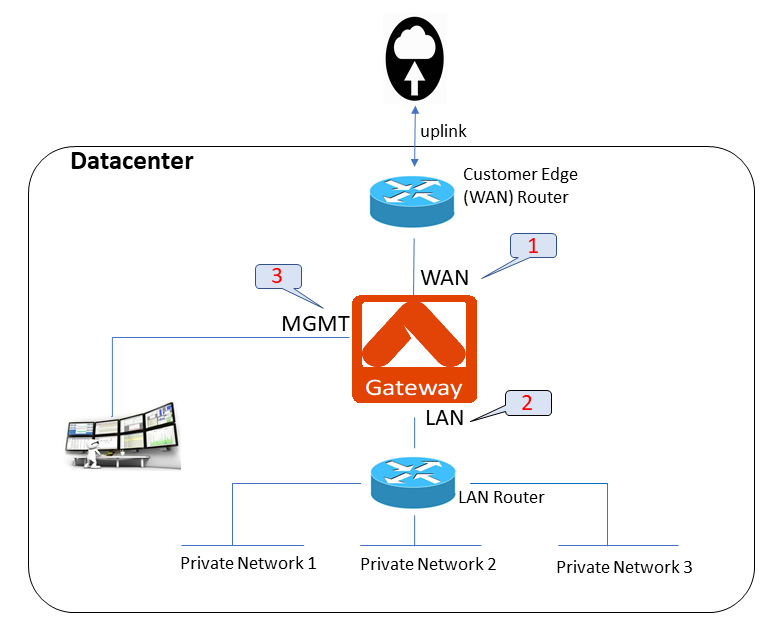

.. disqus::
