.. meta::
  :description: Insane Mode performance benchmark
  :keywords: Transit Network, Transit hub, AWS Global Transit Network, Encrypted Peering, Transitive Peering, Insane mode, Transit Gateway, TGW

===============================================
ActiveMesh Insane Mode Encryption Performance 
===============================================

This document publishes Aviatrix ActiveMesh Insane Mode encryption performance test benchmarks. 

For more information on Aviatrix Insane Mode, check out `this link. <https://docs.aviatrix.com/HowTos/insane_mode.html>`_

Test Result Summary
--------------------------

Aviatrix High Performance Encryption (HPE), also known as ActiveMesh Insane Mode, achieves line rate performance with encryption in AWS when 
Jumbo frames are deployed (the default setting for AWS instances). The test benchmark baseline is the native AWS peering  
where no Aviatrix gateways
are deployed in the VPCs. Adding 500 stateful firewall rules have little impact to the performance. 

Insane Mode Performance Test Topologies
---------------------------------------------------

|test_topologies|

The test is conducted by iperf3 tool with TCP 128 streams. The two VPCs are in the same region. 

ActiveMesh in AWS Performance Test Results
----------------------------------------------

1. MTU = 9000 Bytes (AWS default setting)
============================================

|jumbo|

2. MTU = 1500 Bytes 
===========================================================================================

|1500|

Single Gateway in AWS Performance Test Results
--------------------------------------------------

For MTU = 9000 Bytes, the result is shown in the diagram below. 

|single_gateway_jumbo|

For MTU = 350 Bytes, the result is shown in the diagram below. 

|single_gateway_350B|

Azure Performance Test Results
--------------------------------

The performance results below are from tests conducted with the topology of `Test VMs -> Spoke -> Transit -> Spoke -> Test VMs` in the same 
region with active-mesh deployment. Note test VMs' route tables are load balanced to point to either primary Spoke gateways
or HA Spoke gateways to take advantage of the active-mesh deployment. 

====================      ===============================
**Gateway VM Type**       **Throughput with MTU 1500B**    
====================      ===============================
Standard_F48s_v2          24.52Gbps                         
Standard_F32s_v2          21.56Gbps                          
Standard_D32_v3           20.47Gbps                         
Standard_D5_v2            20.56Gbps                          
====================      ===============================

GCP Performance Test Results
--------------------------------

====================      ===============================
**Gateway VM Type**       **Throughput**    
====================      ===============================
n1-highcpu-4              3.12Gbps                          
n1-highcpu-8              6.54Gbps                         
n1-highcpu-16             11.58Gbps                          
n1-highcpu-32             19.97Gbps                                           
====================      ===============================

Topology:
  
    - VM <-> Spoke <-> Transit <-> Spoke <-> VM
    
    - HA enabled
    
    - HPE mode enabled

How to Tune Performance
--------------------------

1. Check MTU size
=================

Use Trace Path. Go to Troubleshoot -> Diagnostics -> Network. Select a gateway and destination IP address, click Trace Path. It should display MTU of the devices along the path. 

2. Tune TCP window size
========================

For Linux machine, follow the `instructions here <https://wwwx.cs.unc.edu/~sparkst/howto/network_tuning.php>`_ to tune TCP  window size.

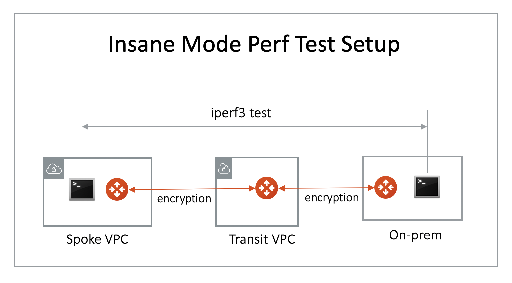

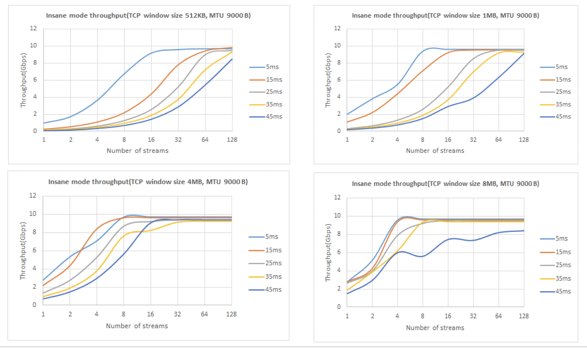

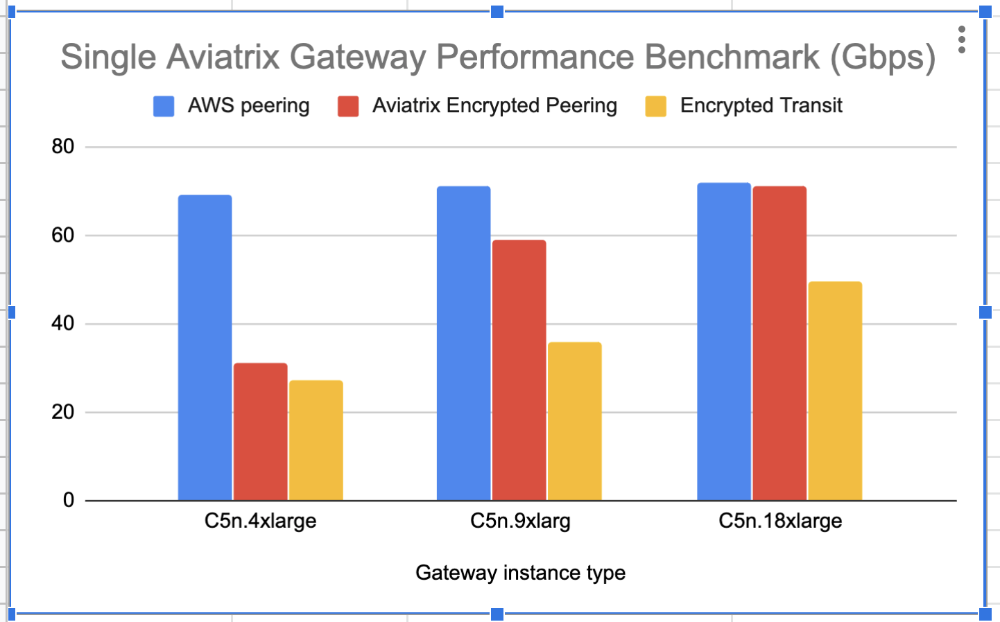

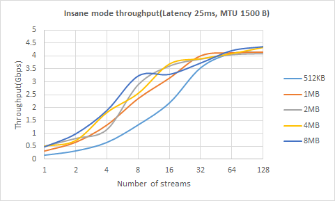

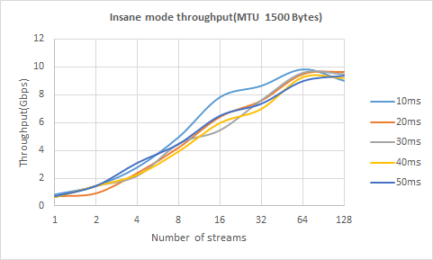

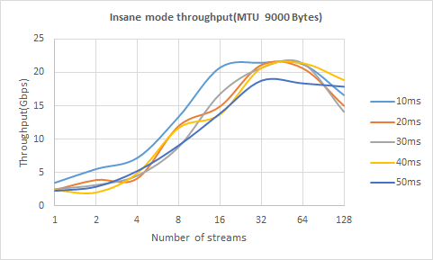

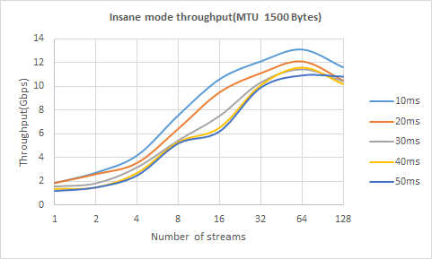

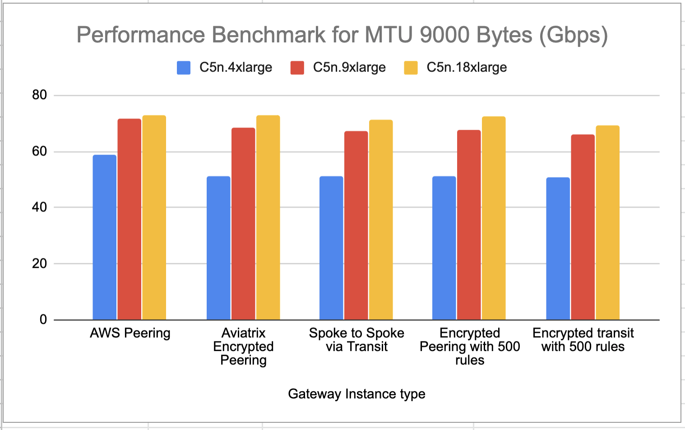

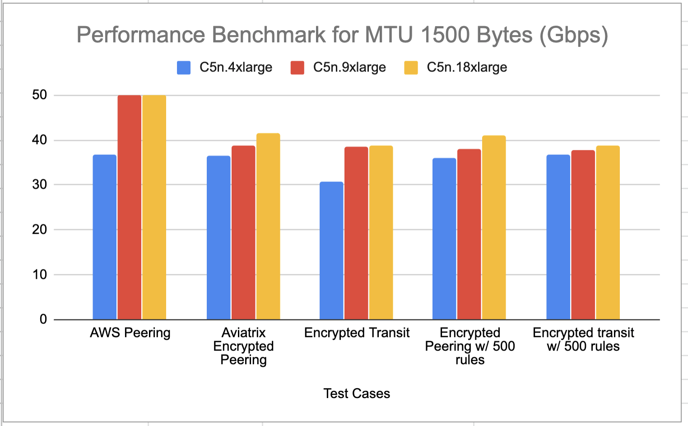

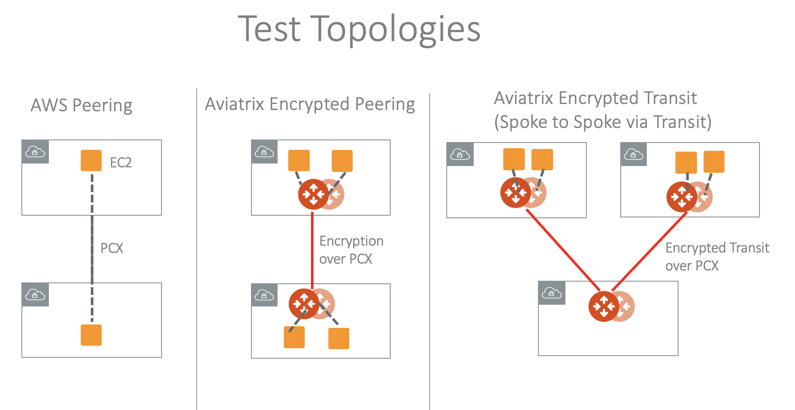
   
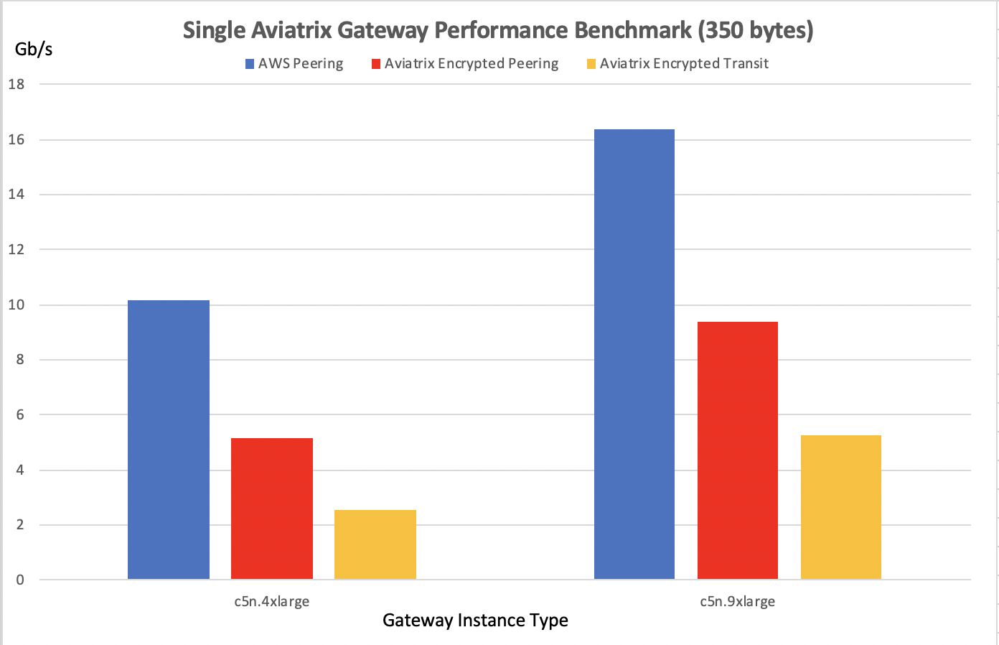

.. disqus::
