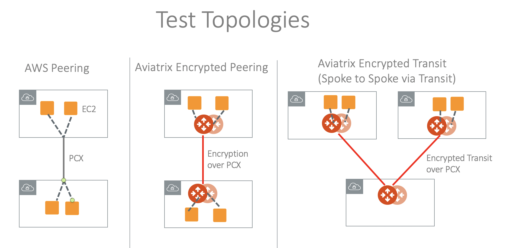

.. meta::
  :description: Insane Mode performance benchmark
  :keywords: Transit Network, Transit hub, AWS Global Transit Network, Encrypted Peering, Transitive Peering, Insane mode, Transit Gateway, TGW

===============================================
ActiveMesh Insane Mode Encryption Performance 
===============================================

This document provides Aviatrix ActiveMesh Insane Mode High-Performance Encryption (HPE) test benchmarks. 

For more information about Aviatrix Insane Mode, refer to `Insane Mode Encryption FAQ. <https://docs.aviatrix.com/HowTos/insane_mode.html>`_

AWS Performance Test Results
----------------------------------------------

Aviatrix ActiveMesh Insane Mode High-Performance Encryption (HPE) achieves line rate performance with encryption in AWS when 
Jumbo Frames are deployed (the default setting for AWS instances). The test benchmark baseline is the native AWS peering  
where no Aviatrix Gateways
are deployed in the VPCs. Adding 500 stateful firewall rules have little impact to the performance. 

The test topologies are shown below.

|test_topologies|

The test is conducted by using iperf3 tool with TCP 128 streams. The two VPCs are in the same region. 

MTU = 9000 Bytes (AWS default setting)
^^^^^^^^^^^^^^^^^^^^^^^^^^^^^^^^^^^^^^

|jumbo|

MTU = 1500 Bytes 
^^^^^^^^^^^^^^^^^^^^^^^^^^^^^^^^

|1500|

Single Gateway in AWS Performance Test Results
^^^^^^^^^^^^^^^^^^^^^^^^^^^^^^^^^^^^^^^^^^^^^^^^^

This test is done without HA enabled in either Spoke or Transit Gateways. The traffic is end-to-end from user instance > Spoke Gateway > Multi-Cloud Transit Gateway > Spoke Gateway> Instance. 

For MTU = 9000 Bytes, the result is shown in the diagram below. 

|single_gateway_jumbo|

For MTU = 350 Bytes, the result is shown in the diagram below. 

|single_gateway_350B|

T3 Instance Series Performance
^^^^^^^^^^^^^^^^^^^^^^^^^^^^^^^^^

==========================      ===============================     ===============================
**Spoke Gateway**               **Throughput Gbps (MTU 1500B)**     **Throughput Gbps (MTU 9600B)**
==========================      ===============================     ===============================
t3a.xlarge                      6.12                                9.82
t3a.medium                      2.33                                8.85
t3a.small                       2.7                                 8.52
t3.large                        3.34                                9.5
t3.medium                       3.03                                9.6
t3.small                        3.35                                9.96
==========================      ===============================     ===============================

Azure Performance Test Results
------------------------------------------------

The performance results below are from tests conducted with the topology of Test VMs > Spoke > Transit > Spoke > Test VMs in the same 
region with active-mesh deployment.

Test VMs' route tables are load balanced to point to either primary Spoke Gateways
or HA Spoke Gateways to take advantage of the active-mesh deployment. 

The test topology is shown below. 

|azure_test_topology|

===========================      ===============================
**Transit Gateway**              **Throughput with MTU 1500B**    
===========================      ===============================
Standard_F48s_v2                 24.52Gbps                         
Standard_F32s_v2                 21.56Gbps                          
Standard_D32_v3                  20.47Gbps                         
Standard_D5_v2                   20.56Gbps                          
===========================      ===============================

GCP Performance Test Results
-------------------------------------------

The test topology is shown below with the following conditions:

    - VM <-> Spoke <-> Transit <-> Spoke <-> VM
    - HA enabled
    - HPE mode enabled

|gcp_test_topology|

N1 Series Performance
^^^^^^^^^^^^^^^^^^^^^^^^^^

====================      ===============================
**Transit Gateway**       **Throughput Gbps (MTU 1500B)**    
====================      ===============================
n1-highcpu-4              3.12                       
n1-highcpu-8              6.54                        
n1-highcpu-16             11.58                       
n1-highcpu-32             19.97                                          
====================      ===============================

N2 Series Performance
^^^^^^^^^^^^^^^^^^^^^^^^^

====================      ===============================
**Transit Gateway**       **Throughput Gbps (MTU 1500B)**     
====================      ===============================
n2-highcpu-4              5.063                          
n2-highcpu-8              10.2                         
n2-highcpu-16             14.98                          
n2-highcpu-32             25.549                                          
====================      ===============================

C2 Series Performance
^^^^^^^^^^^^^^^^^^^^^^^^^

====================      ===============================
**Transit Gateway**       **Throughput Gbps (MTU 1500B)**    
====================      ===============================
c2-standard-4             5.792                          
c2-standard-8             9.44                         
c2-standard-16            18.48                         
c2-standard-30            25.52
c2-standard-60            32                              
====================      ===============================

.. note::

  To deploy Aviatrix Gateways with  N2 or C2 series successfully, you need to apply `CPU Quota Increase <https://cloud.google.com/compute/quotas#cpu_quota>`_ request to GCP support first.

OCI Performance Test Results
------------------------------------

The performance results below are from tests conducted with the topology of Test VMs > Spoke > Transit > Spoke > Test VMs in the same region with active-mesh deployment. 

.. note::

Test VMs' route tables are load balanced to point to either primary Spoke Gateways
or HA Spoke Gateways to take advantage of the active-mesh deployment.

===========================      ===============================
**Transit Gateway**              **Throughput with MTU 1500B**    
===========================      ===============================
VM.Standard2.2                   0.5092Gbps                         
VM.Standard2.4                   1.057Gbps                          
VM.Standard2.8                   2.471Gbps                         
VM.Standard2.16                  4.99Gbps
VM.Standard2.24                  6.039Gbps                          
===========================      ===============================

===========================      ===============================
**Transit Gateway**              **Throughput with MTU 9000**    
===========================      ===============================
VM.Standard2.2                   2.584Gbps                         
VM.Standard2.4                   4.878Gbps                          
VM.Standard2.8                   10.75Gbps                         
VM.Standard2.16                  20.1199bps
VM.Standard2.24                  24.65Gbps                          
===========================      ===============================

How to Tune Performance
--------------------------

Check MTU size
^^^^^^^^^^^^^^^^^^

To check MTU size, use Trace Path. 

1. In Aviatrix Controller, go to **Troubleshoot** > **Diagnostics** > **Network**.
2. In Gateway Utility, select a gateway and specify a destination host name or IP address.
3. Click **Trace Path**. The MTU of the devices along the path is shown. 

Tune TCP window size
^^^^^^^^^^^^^^^^^^^^^^

For Linux machine, follow the `instructions here <https://wwwx.cs.unc.edu/~sparkst/howto/network_tuning.php>`_ to tune TCP  window size.

.. |insane_perf_setup| image:: insane_mode_perf_media/insane_perf_setup.png
   :scale: 30%

.. |insane_perf_jumbo| image:: insane_mode_perf_media/insane_perf_jumbo.png
   :scale: 30%

.. |single_gateway_jumbo| image:: insane_mode_perf_media/single_gateway_jumbo.png
   :scale: 30%

.. |throughput_1500_25ms| image:: insane_mode_perf_media/throughput_1500_25ms.png
   :scale: 30%

.. |c5n_throughput_9000B| image:: insane_mode_perf_media/c5n_throughput_9000B.png
   :scale: 30%

.. |jumbo| image:: insane_mode_perf_media/jumbo.png
   :scale: 30%

   
.. |azure_test_topology| image:: insane_mode_perf_media/azure_test_topology.png
   :scale: 30%

.. |gcp_test_topology| image:: insane_mode_perf_media/gcp_test_topology.png
   :scale: 30%

.. |single_gateway_350B| image:: insane_mode_perf_media/single_gateway_350B.png
   :scale: 30%

.. disqus::
