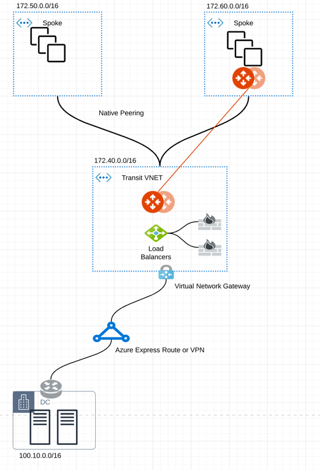
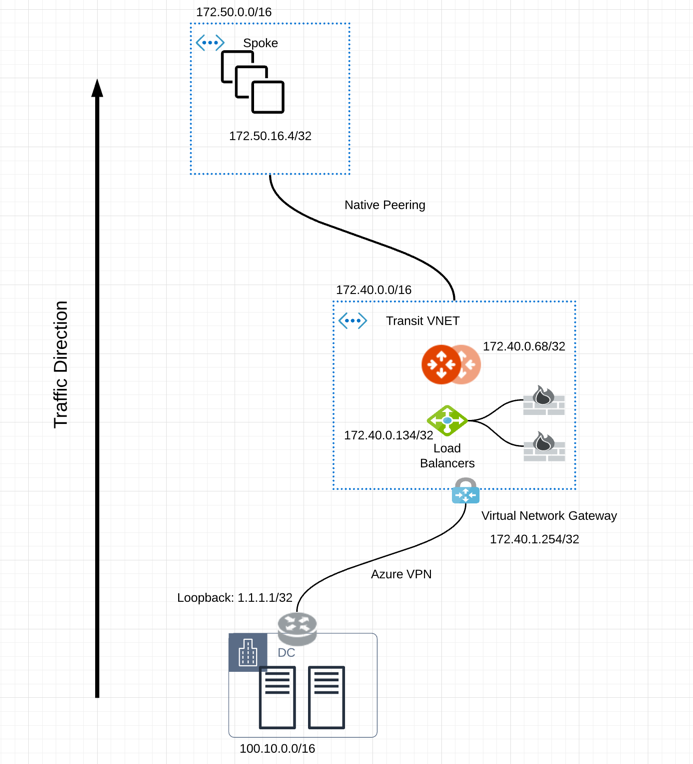
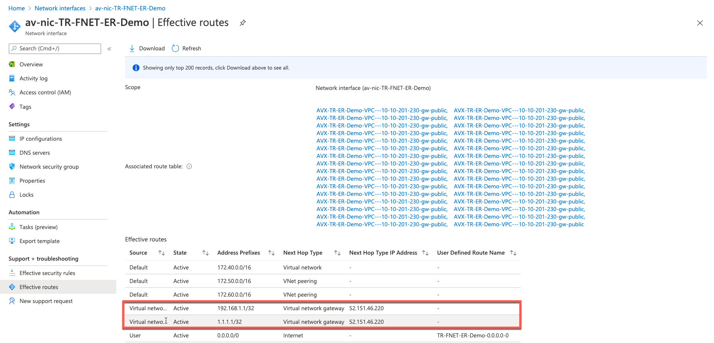
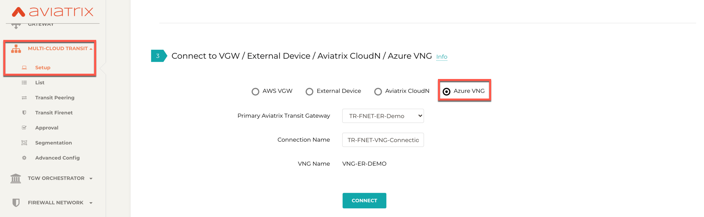

==================================================================
Multi-Cloud Transit Integration with Azure VNG
==================================================================

Introduction
============

Currently, Aviatrix Multi-cloud Transit solution requires encryption over Azure ExpressRoute or External Device to on-prem directly. 
There are times where encryption is not required and native network connectivity on ExpressRoute is highly desirable. 
In such scenarios, Aviatrix Transit solution including Transit FireNet can only forward traffic between Spoke VNets or inspect east-west traffic only, as shown `here <https://docs.aviatrix.com/HowTos/azure_transit_designs.html#aviatrix-transit-gateway-for-azure-spoke-to-spoke-connectivity>`_.

This feature allows Aviatrix Multi-cloud Transit solution to integrate with native Azure Virtual Network Gateway (VNG) and enables 
Aviatrix Transit Gateway to inspect traffic from on-prem to cloud in addition to east-west and egress traffic inspection. Both 
native Spoke VNet and Aviatrix Spoke Gateway based Spoke VNets are supported. 

The key ideas for this solution are:
-------------------------------------

    - The edge (WAN) router runs a BGP session to Azure VNG via Azure ExpressRoute or VPN where the edge router advertises to the Azure VNG the on-prem routes and the VNG advertises the Spoke VNet CIDRs.  

    - Aviatrix Controller periodically retrieves route entries from the Transit VNet VNG route table advertised from on-prem. The Controller then distributes these routes to Spoke VNet and Aviatrix Transit Gateway.

    - Azure native VNet Peering is configured between each Spoke VNet and Transit VNet VNG  with `Allow Remote Gateway` attribute configured on the Spoke VNet to automatically advertise routes from Spoke VNet to VNG and to On-prem.

    - Traffic coming from on-prem to VNG is routed to the Azure Load Balancer which then forwards traffic to both Aviatrix Transit Gateways for Active-mesh deployment. The same Load Balancer is also used to distribute traffic to firewalls for inspection. 
   
    - Traffic coming from Spoke VNet is routed to Aviatrix Transit Gateway directly which then forwards the traffic to the Azure Load Balancer. Future release will support ActiveMesh in this direction of traffic. 

This document describes the configuration workflow for the following network diagram. 

|topology_expressroute|

where there are two Spoke VNets, one with Aviatrix Spoke Gateway (172.60.0.0/16) and one native Spoke VNet (172.50.0.0/16).

Prerequisite
====================

`Upgrade <https://docs.aviatrix.com/HowTos/inline_upgrade.html>`_ Aviatrix Controller to at least version 6.3.

.. tip::

  We highly recommend creating a Azure Transit VNET by using the Aviatrix feature `Create a VNet  <https://docs.aviatrix.com/HowTos/create_vpc.html>`_ with Aviatrix FireNet VNet option enabled. Create a VNG in this Transit VNet.

Connecting VNG on On-Prem 
=======================================================================================================

If you have already created VNG in Transit VNet, skip this section. 

Building Azure ExpressRoute is customer's responsibility. For more information about Azure ExpressRoute, please check out the below documents:

  - Refer to `Azure ExpressRoute <https://azure.microsoft.com/en-us/services/expressroute/>`_.

  - Refer to `ExpressRoute documentation <https://docs.microsoft.com/en-us/azure/expressroute/>`_ for more info.

  - Refer to `Equinix ECX Fabric Microsoft Azure ExpressRoute <https://docs.equinix.com/en-us/Content/Interconnection/ECXF/connections/ECXF-ms-azure.htm>`_ if users select Equinix solution. This is just an example here.

Adjust the topology depending on your requirements.

Follow the steps below to set up this configuration workflow.

1. Create an ExpressRoute circuit. See `Tutorial: Create and modify an ExpressRoute circuit <https://docs.microsoft.com/en-us/azure/expressroute/expressroute-howto-circuit-portal-resource-manager>`_.
2. Create Azure private network for an ExpressRoute circuit. See the `private peering section in Create and modify peering for an ExpressRoute circuit <https://docs.microsoft.com/en-us/azure/expressroute/expressroute-howto-routing-portal-resource-manager>`_.
3. Create a VNG in Transit VNet. We highly recommend creating Azure Transit VNET by utilizing `Create a VPC <https://docs.aviatrix.com/HowTos/create_vpc.html>`_ with Aviatrix FireNet VNet option enabled. Note that this step may take up to 45 minutes to complete. See `Configure a virtual network gateway for ExpressRoute using the Azure portal <https://docs.microsoft.com/en-us/azure/expressroute/expressroute-howto-add-gateway-portal-resource-manager>`_
4. Connect a virtual network to an ExpressRoute circuit. See `Connect a virtual network to an ExpressRoute circuit using the portal <https://docs.microsoft.com/en-us/azure/expressroute/expressroute-howto-linkvnet-portal-resource-manager>`_.
5. Check ExpressRoute Circuits - List Routes Table on the Azure portal. 

Checking ExpressRoute Circuits Routes Table in Azure
-----------------------------------------------------------------------

1. Log in to the Azure portal and search for "ExpressRoute circuits" on the search bar.
#. Select the ExpressRoute circuits that you created.
#. Select the Azure private peering row
#. Select **Get route table** to verify routes learned from on-prem.

Connect Aviatrix Transit Gateway with VNG
============================================================================

Refer to `Global Transit Network Workflow Instructions <https://docs.aviatrix.com/HowTos/transitvpc_workflow.html>`_ for the below steps. Please adjust the topology depending on your requirements.

Deploying an Aviatrix Multi-Cloud Transit Gateway and HA in Azure
--------------------------------------------------------------------------------------

    - Follow this step `Deploy the Transit Aviatrix Gateway <https://docs.aviatrix.com/HowTos/transit_firenet_workflow_aws.html#step-2-deploy-the-transit-aviatrix-gateway>`_ to launch Aviatrix Transit Gateway and enable HA with insane mode enabled in Azure Transit VNET. Insane mode is not required but an optional feature to increase throughput.

    - Instance size of at least Standard_D5_v2 will be required for `Insane Mode Encryptions <https://docs.aviatrix.com/HowTos/gateway.html#insane-mode-encryption>`_ for higher throughput. Please refer to this `doc <https://docs.aviatrix.com/HowTos/insane_mode_perf.html>`_ for performance details.

    - Enable `Transit FireNet Function <https://docs.aviatrix.com/HowTos/transit_firenet_workflow.html#enable-transit-firenet-function>`_.

Connecting Transit FireNet Gateway to VNG
------------------------------------------------------------------------------

This step assumes VNG is already deployed in the Transit VNet. 

1. Go to Multi-Cloud Transit > External Device tab.
2. Select **Azure VNG** radio button.
3. Select **Primary Aviatrix Transit Gateway** in the dropdown menu. Note if VNG has not been deployed in the Transit VNet, this step cannot complete. 
4. VNG Name will populate automatically. Click **Connect**.

|vng_step|

Checking Effective Routes Info on Azure Portal
------------------------------------------------------------

1. Log in to the Azure portal and search for "Network interfaces" on the search bar.
3. Select Aviatrix Transit Gateway's interface.
4. Navigate to the "Effective routes" page by selecting **Effective routes** under the Support + troubleshooting section.
5. Check route entry for On-prem pointing Next Hop Type **Virtual network gateway**.

|azure_effective_routes_routing_entry|

Attach Spoke VNet to Aviatrix Transit Gateway 
=========================================

1. Deploy Aviatrix Spoke Gateway in Spoke VNet. Create an Azure VNET for Aviatrix Spoke Gateway by using the Aviatrix feature `Create a VPC <https://docs.aviatrix.com/HowTos/create_vpc.html>`_ or manually deploy it in cloud portal or feel free to use existing virtual network.
2. Follow this step `Deploy Spoke Gateways <https://docs.aviatrix.com/HowTos/transit_firenet_workflow_azure.html#step-3-deploy-spoke-gateways>`_ to launch Aviatrix Spoke Gateway and enable HA with insane mode enabled in Azure Spoke VNET. Insane mode is optional. An instance size of at least Standard_D5_v2 will be required for `Insane Mode Encryptions <https://docs.aviatrix.com/HowTos/gateway.html#insane-mode-encryption>`_ for higher throughput. Please refer to this `doc <https://docs.aviatrix.com/HowTos/insane_mode_perf.html>`_ for performance details.
3. (Optional) Create Spoke VNet. If you do not have any Spoke VNet, create one by using Aviatrix feature `Create a VPC <https://docs.aviatrix.com/HowTos/create_vpc.html>`_ or manually do so in Azure portal.
4. Attach Spoke Gateways to Transit Network. 

* Follow this step `Attach Spoke Gateways to Transit Network <https://docs.aviatrix.com/HowTos/transit_firenet_workflow_azure.html#step-4-attach-spoke-gateways-to-transit-network>`_ to attach Aviatrix Spoke Gateways to Aviatrix Transit Gateways in Azure
* Follow step `Attach Native Azure VNET to Transit Network <https://docs.aviatrix.com/HowTos/transit_firenet_azure_native_spokes_workflow.html?highlight=Transit%20Firenet%20Native%20Azure%20Spoke%20workflow#step-3-attach-native-spoke-vnets-to-transit-network>`_ to attach Azure Native VNET Spoke to Aviatrix Transit Gateway.

Ready to Go
============

Now you should be able to send traffic from cloud to on-prem as well as on-prem to cloud over Azure Express Route.

For an end-to-end example configuration workflow, follow the `Multi-cloud transit with  Azure VNG VPN example <https://docs.aviatrix.com/HowTos/transit_gateway_integration_with_vng_IOSexample.html>`_. 

For FireNet deployment, follow the `Transit FireNet workflow <https://docs.aviatrix.com/HowTos/transit_firenet_workflow.html>`_.

Limitations
===========
By design routes advertised to VNG to onprem are limited only to native spoke VNET peering, it does not advertise non-native spoke/transit-to-transit peerings.

.. disqus::

