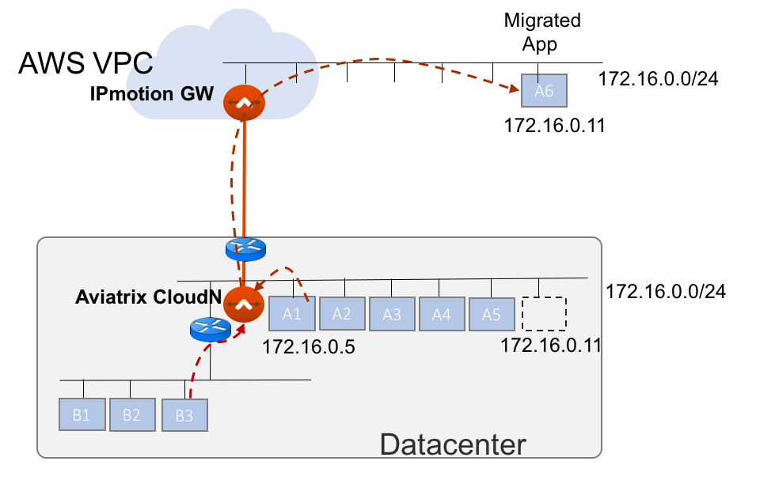
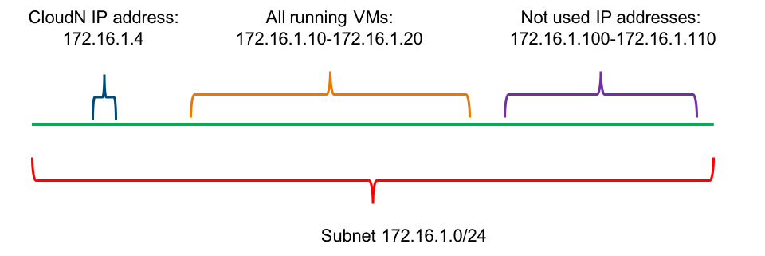

.. meta::
  :description: IP motion Ref Design
  :keywords: AWS Migration, DR, Disaster Recovery, aviatrix, Preserving IP address, IPmotion, ip motion

=================================
IPmotion Setup Instructions
=================================

`Aviatrix IPmotion <http://aviatrix.com/blog/aws-migration-made-safe-simple/>`_ (IP Motion) is a technology that connects the same two subnets between on-prem and in the VPC. The technology is useful when migrating an on-prem VM to a public cloud while preserving its IP address. It can also be used for mission critical application HA to public cloud. 

The technology is described in the diagram below, 
where an on-prem VM with IP address 172.16.1.11 is migrated to AWS
while preserving its IP address. After migration, any on-prem VMs can continue to communicate with this migrated VM
as if it still resides on-prem. 

Note that the actual migration process is not included in this document. We assume you have the necessary tools, for example, `AWS Migration Hub <https://aws.amazon.com/migration-hub/>`_ to migrate on-prem VMs to public cloud. We also provide an `example <http://docs.aviatrix.com/HowTos/HowTo_Setup_IPMotion.html>`_ that demonstrates how to migrate a VM by combining AWS Server Migration Service and IPmotion. 

 |image0|

Planning and Prerequisites
---------------------------

 1. Identify an on-prem subnet where you plan to migrate VMs. For example, the subnet is 172.16.1.0/24.
 #. Create an AWS VPC that has the same or larger CIDR block than the migrating subnet. 
 #. IPmotion builds an IPSEC tunnel using UDP ports 500 and 4500. Make sure these two UDP ports are open for outbound traffic. Inbound return traffic will also run on these two ports. The ports should be open to AWS public IP address ranges. 
 #. Consider `Design Patterns <http://docs.aviatrix.com/HowTos/design_pattern_ipmotion.html>`_ for IPmotion.  
 #. For simplicity, in this guide, we assume the cloud subnet is a public subnet and the migration is over the Internet
 #. Deploy Aviatrix virtual appliance CloudN in the on-premise subnet.  Read `this document <http://docs.aviatrix.com/StartUpGuides/CloudN-Startup-Guide.html>`_ on how to deploy the virtual appliance. AWS reserves `five IP addresses <http://docs.aws.amazon.com/AmazonVPC/latest/UserGuide/VPC_Subnets.html#vpc-sizing-ipv4>`__ on a given subnet, make sure that the CloudN IP address is not any one of them. For example, in a 172.16.1.0/24 subnet, 172.16.1.0-172.16.1.3 and 172.16.1.255 are reserved. 

 #. Once the virtual appliance is deployed, go through the on-boarding process and create an AWS account. 

 #. Take an inventory of IP addresses of all running VMs and unused IP addresses on this subnet, as shown in the example below. 

  |image1|

.. note::
   For description purpose, a migrated VM that has the same IP address as its on-prem VM is called the migrated EC2 instance.

Login to the CloudN Controller
^^^^^^^^^^^^^^^^^^^^^^^^^^^^^^
Open a browser and navigate to `https://<cloudN IP address>/`.  Once authenticated, click on `IP Motion` in the left navigation bar.

Follow the steps below to set up `IP Motion` for the selected subnet.

1. Specify on-Prem IP Address List
-------------------------------------------

The `on-prem IP address list` of a subnet includes both the list of IP addresses of VMs that will be
migrated and the list of IP addresses of VMs that will remain on-prem 
but need to communicate with the migrated VMs. 

One simple way to specify this address range is to provide the list of IP addresses of 
all running VMs, excluding CloudN IP addresses, since out of this list, 
some or all VMs will be migrated to the cloud. For example, as shown in the above diagram, 
if the running VMs excluding CloudN on subnet 172.16.1.0/24 are in the range of 172.16.1.10-172.16.1.20, 
and you plan to move all running VMs to cloud, then specify this range for Step 1 as below.  

    ::

      172.16.1.10-172.16.1.20

.. Note:: the on-prem IP address format could be a single IP address or a range of IP addresses using a "-" in the list. Specify multiple ranges of IP addresses by separating them with a comma.  Example: 172.16.1.10-172.16.1.20, 172.16.1.30, 172.16.1.120-172.16.1.130

..

Note that the larger this list is, the larger the IPmotion gateway instance size needs to be in the cloud (AWS). 
The reason is that the IPmotion gateway needs to allocate private IP addresses from AWS
for any on-prem VMs. 

You can optimize the list by making sure only the running VMs are being specified. For the above example, if 172.16.1.11 is an IP address not assigned to any VM, you should skip this address and specify a multiple range separated by a comma: 172.16.1.10,172.16.1.12-172.16.1.20. 

    ::
     
      172.16.1.10,172.16.1.12-172.16.1.20

Currently the largest number of VMs that a CloudN can handle on a subnet is 202 which requires a c4.4xlarge IPmotion gateway instance size. This number of VMs can be expanded in the future release. 

(You can further optimize the list for the on-prem part by specifying only the 
dependent VMs. 
For example, the CloudN is deployed on subnet 172.16.1.0/24. On this subnet, the IP addresses of VMs that are going to be migrated are 
172.16.1.10, 172.16.1.15-172.16.1.20. 
The IP addresses of VMs that are to remain on the subnet but need to 
communicate with migrated VMs are in the range 172.16.1.50-172.16.1.70
then you should enter 
172.16.1.10,172.16.1.15-172.16.1.20,172.16.1.50-172.16.1.70)

  ::

   172.16.1.10,172.16.1.15-172.16.1.20,172.16.1.50-172.16.1.70

2. Reserve IPmotion Gateway IP Address List
--------------------------------------------

This field is about specifying 10 IP addresses that are not being used by 
any running VMs and reserving these addresses for Aviatrix IPmotion gateway. Again as an example displayed in 
the above diagram, 172.16.1.100-172.16.1.110 are not used by any running VMs, you can reserve this range
for the IPmotion gateway. In other words, 
if you specify 172.16.1.100-172.16.1.110 as the IPmotion gateway reserved IP addresses, 
it means that this range of IP addresses is not currently used by any VM on 
the subnet, and is reserved by Aviatrix during the migration phase. 

.. Note:: AWS reserves the 5 IP addresses of a subnet in VPC. For example, if the VPC subnet is 172.16.1.0/24, the addresses 172.16.1.0, 172.16.1.1, 172.16.1.2, 172.16.1.3 and 172.16.1.255 are reserved by AWS. If you have on-prem VMs including CloudN that use the first 3 IP addresses (excluding default gateway, DNS or any other infrastructure purpose) of a subnet, the IPmotion method will not work. 

..

3. Launch IPmotion Gateway
----------------------------

This step launches an Aviatrix IPmotion gateway and builds a tunnel 
(IPSEC tunnel if the connection is over Internet, direct tunnel if the connection is over Direct Connect.) 
between the two subnets. 
Note that the IPmotion gateway size reflects how many on-prem VMs can be supported, as 
the table shown below.

===============================    ================================================================================
**IPmotion Gateway Size**           **Max VMs can be migrated**
===============================    ================================================================================
t2.micro                           0
t2.small                           2
t2.medium                          9
m4.large                           8
m4.xlarge                          41
m4.2xlarge                         41
m4.16xlarge                        202
c3.large                           17
c3.xlarge                          41
c3.2xlarge                         41
c3.4xlarge                         202
c4.large                           17
c4.xlarge                          41
c4.2xlarge                         41
c4.4xlarge                         202
c4.8xlarge                         202
===============================    ================================================================================

The "Migrate Subnet" is the subnet that has the same CIDR as the on-prem migrating subnet. "IPmotion Gateway Subnet" is the subnet where the Aviatrix IPmotion gateway is deployed. Consult the `Design Pattern <http://docs.aviatrix.com/HowTos/design_pattern_ipmotion.html>`_  for IPmotion subnet choice. 

4. IPmotion Move
------------------

This step consists of two parts: Staging and Commit. 

Staging
^^^^^^^^
Staging is the preparation step. After an IP address is moved to the Staging state, 
you can power up the migrated EC2 instance with the same IP address as the on-prem VM  
for testing and staging. Note that the migrated EC2 instance at this point cannot communicate with on prem.

Highlight a specific IP address in the on-prem panel and click the Staging button. 

Undo Staging
^^^^^^^^^^^^
If you want to move any IP address in the Staging state back to on-prem, select the IP address and click Undo. 

.. Note:: if the migrated EC2 instance is already running, you must terminate the instance from the AWS console before you can move its IP address back to an on-prem state. 

..

Commit
^^^^^^^^
Commit enables the migrated EC2 instance to communicate with any on-Prem VM. 

.. Note:: Before you commit an IP address, the on-prem VM that has been migrated must be powered down first. Committing the IP address implies that the migrated EC2 instance will be in operation. 
..

Highlight a specific IP address and click the Commit button. 

Undo Commit
^^^^^^^^^^^

If migration fails after cut over, you can Undo the Commit by 
selecting the IP address from the cloud panel and click Undo.  

The Undo function of Commit reverts a committed IP address to Staging state. After reverting to Staging state, 
the communication between the migrated EC2 instance to on-prem is stopped and you can power up the on-prem VM and resume its operation. 

5. Test Connectivity
---------------------

After an IP address is committed, you can test connectivity. 
Go to the CloudN console, Troubleshoot -> Diagnostics -> Network -> Ping Utility. Enter the committed IP address
and click Ping. Make sure the security group of the migrated EC2 has ICMP allowed. Also make sure that the 
migrated EC2 instance responds to a Ping request.  

6. Troubleshooting Tips
-----------------------

- **View Button** click the View button on Step 1 or Step 2 at any time to see what state an IP address is at.  
- **Reset Button** If all things fail and you would like to start over, first delete the IPmotion gateway by going to the Gateway List, selecting the gateway and clicking Delete. After deletion is completed, go to Step 1 and click Reset. You can then start it over by going through Step 1 again.  
- **Get Support** email support@aviatrix.com for assistance. 

7. Discover application dependencies
----------------------------------------

After migrating one VM, you can use the Aviatrix IPmotion gateway to discover application dependencies by following `the dependency map discovery. <http://docs.aviatrix.com/HowTos/ipmotion_dependency_discovery.html>`_ 

8. Migrate more VMs on the same subnet
---------------------------------------

Repeat Step 4 to migrate more VMs on this subnet.

9. Migrate VMs in a different subnet
-------------------------------------

To migrate a VM in a different subnet, you need to launch a new virtual appliance CloudN on that subnet 
and repeat all the steps described in this document. 

For example, suppose you have created a VPC 172.16.0.0/16 and migrated subnet 162.16.1.0/24. Now you plan to migrate subnet 172.16.2.0/24. Follow these steps:

- Go to the AWS console to create a second public subnet 172.16.2.0/24 in VPC 172.16.0.0/16. 
- Launch Aviatrix virtual appliance CloudN on subnet 172.16.2.0/24.
- Repeat the steps listed in this document.  

10. Post Migration
------------------

Once you have migrated a few subnets to a VPC, you have the option to delete the Aviatrix IPmotion gateway, delete the Aviatrix on-prem virtual appliance 
and remove the on-prem subnets that are now empty of any VMs. 
You can then connect the VPC to on-prem via Aviatrix site2cloud, 
AWS Direct Connect and other layer 3 connectivities. 

11. Limitations
----------------

There are a few known limitations in the current release. 

  - You cannot migrate any on-prem VMs whose IP addresses overlap with AWS reserved IP addresses on a given subnet. AWS reserves five IP addresses of a given subnet if an on-prem VM overlaps with any of these three IP address, this solution cannot migrate this VM. 

  - VPC CIDR cannot be 192.168.0.0/16. In the 192.168.0.0 range, the largest CIDR is 192.168.0.0/17. 

  - The maximum number of on-prem VMs that can be migrated per subnet is 202.

  - The Aviatrix IPmotion solution is deployed on a per subnet basis, the maximum throughput per gateway is 1Gbps for IPSec performance.   
  - During the stage of disk copying, the function of disk copying can be done over Direct Connect. After  the migrated VM boots and starts to communicate with on-prem, packets can only travel over Internet. 
  - Although the migrated instances do not require public IP address, the migrated subnet must be a public subnet during migration. If a migrated instance requires Internet access, it should be assigned a public IP address.

 

.. disqus::
