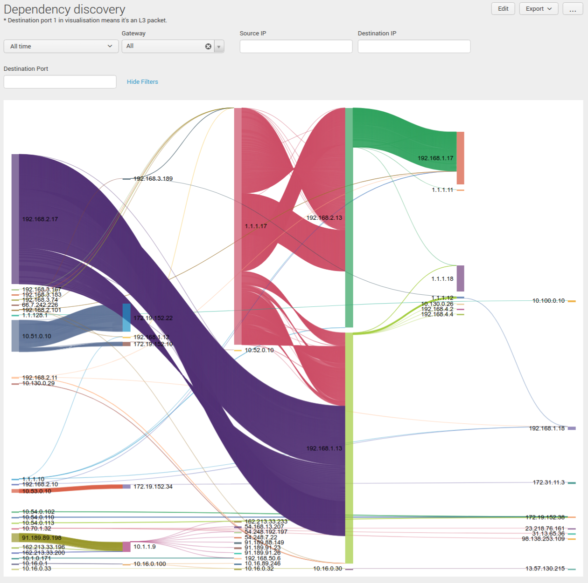

.. meta::
  :description: IP motion dependency discovery
  :keywords: Splunk, DR, Disaster Recovery, aviatrix, Preserving IP address, IPmotion, ip motion, Dependency Discovery

=============================
IPmotion Dependency Discovery
=============================
Dependency discovery can be set up on Splunk to see all the dependencies after migrating your applications to cloud.

Setup instructions
------------------
  1. Enable packet logging on all gateways for which you want to see dependency discovery. See `instructions <http://docs.aviatrix.com/HowTos/tag_firewall.html#apply-policy>`_ to enable packet logging.
  #. Install and set up the Aviatrix Splunk app using instructions mentioned `here <https://github.com/AviatrixSystems/SplunkforAviatrix>`_.
  #. Install another app named `Sankey Diagram - Custom Visualization`, which will be used to visualise Dependency discovery. To install this app, log in to the Splunk server. Go to Apps-> Find More Apps. Search for `Sankey Diagram` in the search bar and install the app named `Sankey Diagram - Custom Visualization`
  #. Now go to the Aviatrix Splunk and click on the `Dependency discovery` dashboard to see dependencies across apps.
  #. This dashboard lets you see network flow to/from servers across the network. It allows you to also filter on gateway, Source, Destination and Port.

 |image0|

.. disqus::

