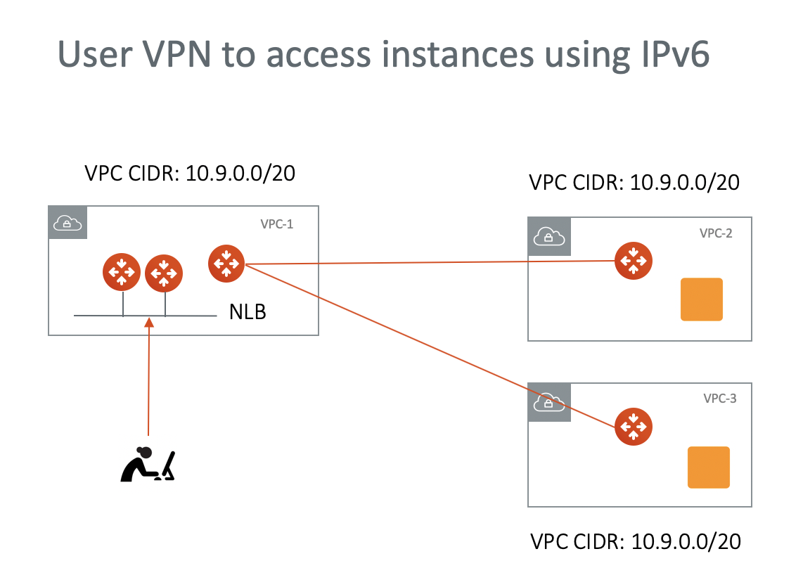
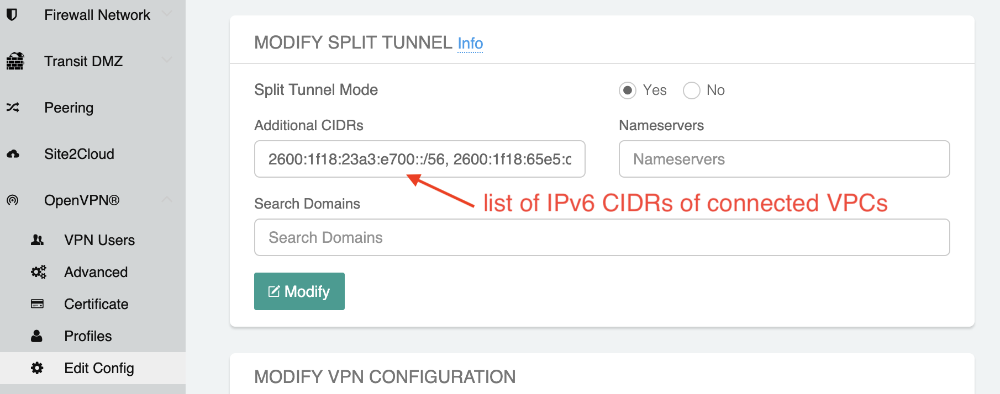

.. meta::
   :description: Use IPv6 to connect overlapping VPC CIDRs
   :keywords: IPv6, Peering,  SNAT, DNAT, Aviatrix Transit network

=========================================================================================
Use IPv6 for User VPN Access
=========================================================================================

The Problem
---------------------

If you need to give user VPN access to VPCs but the VPCs have overlapping CIDRs, currently there are two common solutions. 
One is to run a User VPN gateway in each VPC and have users to connect individually to a VPC. This approach makes managing user
VPN certificates difficult for both users and administrators if the number of VPCs are large. Another approach is to use
NAT functions to translate the addresses between the overlapping CIDRs. 

This document describes how to use IPv6 to support user VPN access to multi VPCs where the VPC CIDRs may overlap, as 
shown in the diagram below. 

|ipv6_uservpn|

Prerequisite
--------------

Follow the instructions `here <https://docs.aviatrix.com/HowTos/ipv6_peering.html>`_ to created encrypted peering that tunnels 
IPv6 addresses. 

Step 1. Launch Aviatrix gateway  
----------------------------------------------

Login to the Controller. Go to Gateways -> Add New to launch a gateway in one central VPC. Make sure you check "VPN Access" field 
to enable user VPN function. 

Step 2. Add VPN Networks for Split Tunnel
-------------------------------------------

this step adds the VPC CIDRs of the peered VPC so that the VPN gateway can push routes to the VPN endpoint. 

Login to the Controller. Go to OpenVPN -> Edit Config -> MODIFY SPLIT TUNNEL. Add a list of VPC IPv6 CIDRs in a comma separated 
format, as shown below. 

|ipv6_vpncidr|  

Step 2. Add VPN User
-----------------------------------

Login to the Controller. Go to OpenVPN -> VPN Users -> Add New. Select the VPN gateway you launched above. Create a new user with
email address. An email will be sent to the VPN user with instructions on how to download the VPN client and connect to VPN. 

Run the VPN client and you should be able to access EC2 instances using its IPv6 address!

Step 3. Scale out VPN gateways
----------------------------------

You can repeat Step 1 to launch more VPN gateways to scale out the performance. To learn more about user VPN, check out 
`User VPN FAQ <https://docs.aviatrix.com/HowTos/openvpn_faq.html>`_

Step 4. Add more VPCs
-----------------------

If you need to connect more VPCs, make sure you build encrypted tunnel and repeat Step2 to add the new IPv6 network CIDRs to the 
VPN Network list. 

All done. 

Troubleshooting Tips
---------------------

If you experience VPN client connectivity issue, check the following:

  - Encrypted tunnel is up. 
  - Instance Security Group is configured with the correct inbound port open. 
  - If you have User Profile enabled, the profile has the correct policies.

For support, please open a support ticket at `Aviatrix Support Portal <https://support.aviatrix.com>`_

.. disqus::
