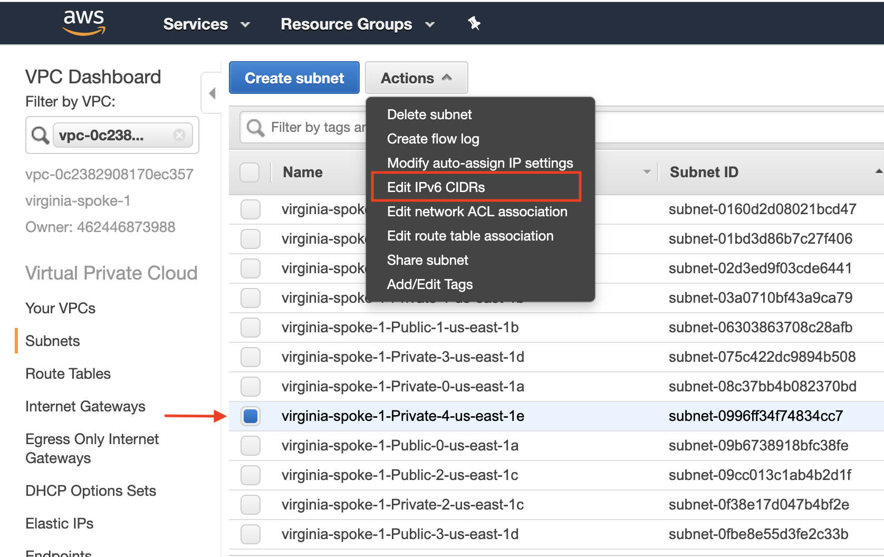

=========================================================================================
Use IPv6 to Connect Overlapping VPC CIDRs
=========================================================================================

The IPv6 technique
---------------------

If you have two overlapping VPC CIDRs and need to connect them together, the normal technique is to use SNAT and DNAT to translate
the IP addresses. 

This tech note describes an alternative approach. In this approach, it assumes the EC2 instances are capable of addressing each
other with IPv6 addresses. The idea is that even though two VPC CIDRs are overlapping with IPv4 addresses, 
the IPv6 network address ranges are 
always unique. If the EC2 instances are capable of communicating with each other with IPv6, then we just need to build a IPv4 
tunnel that tunnels IPv6 address. The diagram is shown as below. 

|ipv6_peering|

In the above diagram, both VPC CIDRs are 10.9.0.0/20. The requirement is to have EC2 instances in each VPC to communicate with
each other via IPv6 addresses. 

Step 1. Launch Aviatrix gateways in each VPC
----------------------------------------------

Login to the Controller. Go to Gateways -> Add New to launch a gateway in each VPC. 

Step 2. Enable IPv6 on the gateway
-----------------------------------

Login to the Controller. At the Gateway page, highlight one gateway, click Edit. Scroll down to IPv6, click Enable. Do the same 
for the second gateway. 

When IPv6 is enabled on the gateway, the Controller enables IPv6 on the VPC CIDR (auto assign one), the gateway instance 
and the subnet where the 
gateway is launched. You can validate this by login to the AWS Console EC2 and check for both gateway IPv6 address and the 
associated subnet. 

Step 3. Enable encrypted peering
----------------------------------

Login to the Controller. Go to Peering -> Encrypted Peering -> Add New. Select the gateways launched and click OK. 

This step builds an IPSec encrypted tunnel between the two gateways, where the tunnel endpoints are IPv4 addresses of the
gateways but the tunnel policy is IPv6 for the two VPC CIDRs.  

Step 4. Enable IPv6 on EC2 and subnet
--------------------------------------

4.1 Enable IPv6 on EC2
^^^^^^^^^^^^^^^^^^^^^^^^^
Login to AWS console. Select the instance you want to ping. Click Action -> Networking -> Manage IP Addresses. Assign a new 
IPv6 address, as shown below.

|ipv6_addr|

Repeat the same step for the destination address. Make sure you configure the instance Security Group to inbound allow IPv6 address. 

4.2 Enable IPv6 on subnet
^^^^^^^^^^^^^^^^^^^^^^^^^^^^

Login to AWS console VPC, select the subnet, click Actions -> Edit IPv6 CIDRs. Make sure you enter some numbers that are unique. 

|ipv6_subnet|

4.3 Edit EC2 Security Group
^^^^^^^^^^^^^^^^^^^^^^^^^^^^^^

Login to AWS console EC2. Select the instance and Edit Security Group to enable inbound IPv6, as shown below.

|ipv6_security_group|

Step 5. Ping
--------------

Use command "ping6" to ping IPv6 address. For example

 ::

     ping6 2600:1f18:65e5:ce01:100d:bcfa:2aef:1030

All done. 

.. disqus::
