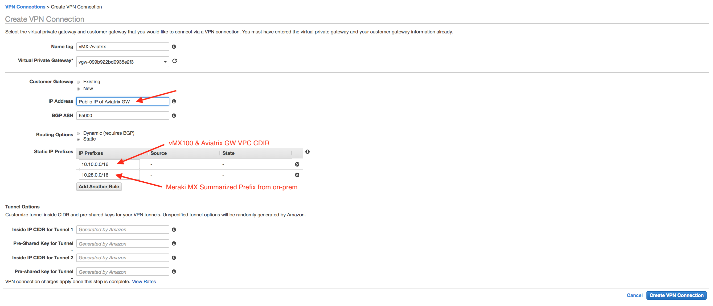

=====================================================
Connecting Meraki Network to Aviatrix Transit Network
=====================================================

This document assumes that you have deployed a Meraki vMX100 in AWS that has full meshed to all your branch offices using Meraki MX products. 
In this technical note, we will outline the steps to have end to end connectivity from your Meraki network to your AWS Global Transit Network using Aviatrix solution. At the end of configuration, your on-prem client will be able to access an EC2 instance in a Spoke VPC.

  |meraki_avxtransit01|

In this configuration guide, we will summarize the Meraki on-prem subnets (10.28.144.0/24 and 10.28.145.0/24) into a single 10.28.0.0/16. We will also summarize Aviatrix Spoke subnets (10.32.0.0/16, 10.50.0.0/16, 10.63.0.0/16) into 10.32.0.0/11. With good planning of on-prem subnets and VPC subnets, we can use summarized subnets in the Site2Cloud connection and avoid configuring AWS route tables and security groups when we add a new Meraki on-prem subnet or a new Aviatrix Spoke. 

The objectives here are:

 - Build an Aviatrix Transit Network with multiple spokes.
 - Launch an Aviatrix gateway in the same VPC as vMX100.
 - Create a Site2Cloud connection from the Aviatrix gateway to the same VGW used in Aviatrix Transit Network.
 - Adjust security groups on both vMX100 and the Aviatrix gateway and update AWS route tables accordingly.

.. Note::

  This document assumes you have already `launched an Aviatrix Controller <http://docs.aviatrix.com/StartUpGuides/aviatrix-cloud-controller-startup-guide.html>`_.
  An Aviatrix GW uses an EIP, so make sure you have sufficient quota space for an EIP. You can contact AWS support to request more EIPs. 
  Aviatrix supports multiple Transit GW groups from one Controller. In this example, we will only use one Transit GW group with HA enabled. 

..

Build an Aviatrix Transit Network with multiple spokes
------------------------------------------------------
1. **Launch Aviatrix Transit GW** `Follow Step 1 and Step 2 <http://docs.aviatrix.com/HowTos/transitvpc_workflow.html#launch-a-transit-gateway>`_ to launch an Aviatrix Transit GW and enable HA in the Transit hub VPC. You can consider using a new Transit hub VPC in case the existing Transit hub VPC does not have enough IP addresses to launch new instances (The Aviatrix Transit GW pair).

2. **Connect Aviatrix Transit GW to VGW** `Follow Step 3. <http://docs.aviatrix.com/HowTos/transitvpc_workflow.html#connect-the-transit-gw-to-aws-vgw>`_ At this point, VGW starts to advertise to Aviatrix Transit GW. Make sure you specify a different "AS" number for the BGP session of Aviatrix Transit GW connection to VGW. 

3. **Attach Spoke VPC to Aviatrix Transit GW** `Follow Step 4, Step 5 and Step 6 <http://docs.aviatrix.com/HowTos/transitvpc_workflow.html#launch-a-spoke-gateway>`_ to launch an Aviatrix GW in this Spoke VPC (with HA as an option) and attach to the Aviatrix Transit GW. 

4. **Repeat the above step 3 and 4** Repeat the above 2 steps for the remaining Spoke VPCs. 

.. Note::

  In the Aviatrix solution, Spoke VPCs have no connectivity to each other by default. If a Spoke VPC needs connectivity to another Spoke VPC, for example, the shared service VPC, configure `AWS Peering <http://docs.aviatrix.com/HowTos/peering.html#aws-peering>`_ or `Aviatrix Encrypted Peering <http://docs.aviatrix.com/HowTos/peering.html#encrypted-peering>`_ from the Controller console. 

..

In this example, the Meraki vMX100 is already deployed in the us-west-2 (Oregon) region in a VPC with a CIDR of 10.10.0.0/16. The following is the configuration for vMX100 in AWS VPC.

  |meraki_avxtransit02|
  
Here is the configuration for the MX64 at on-prem.

  |meraki_avxtransit03|

Launch an Aviatrix gateway in the same VPC as vMX100
----------------------------------------------------
1. Login to the Aviatrix Controller UI and click Gateway at the navigation panel.
2. Click New to launch a gateway with the following settings:
   
 - Gateway Name = vMX-AvxGW
 - Access Account Name = Select the same AWS account where the vMX100 is deployed
 - Region = us-west-2 (Oregon)
 - VPC ID = Select the same VPC where vMX100 is deployed
 - Public Subnet = Select the same subnet where vMX100 is deployed

3. Click OK to create the gateway.

Create a Site2Cloud connection between an Aviatrix GW and a VGW
----------------------------------------------------------
1. Go to the AWS console in the us-west-2 (Oregon) region. Click on Services and go to VPC Dashboard.
2. Click on VPN Connections at the left panel. 
3. Click "Create VPN Connection" to create an IPsec tunnel to Aviatrix GW. 

  |meraki_avxtransit04|

4. Select the VPN connection that you just created and click "Download Configuration" to download the "Generic" configuration.
5. At the Aviatrix Controller UI, click Site2Cloud at the navigation panel.
6. Click "Add New" to configure the Site2Cloud connection to the same VGW that is already connected to Aviatrix Transit Networks.

  |meraki_avxtransit05|

7. Click on the Site2Cloud > Diagnostics page and verify that the IPsec tunnel is established between Aviatrix GW and the VGW.
   
  |meraki_avxtransit06|

Adjust security groups and update AWS route tables
--------------------------------------------------
1. Go to AWS console and select us-west-2 (Oregon) region.
2. Go to EC2 Dashboard and click on the vMX100 instance.
3. Click on the Security Group for the vMX100 and add Allow Inbound traffic from 10.10.0.0/16, 10.28.0.0/16 and 10.32.0.0/11. Let the default Outbound Allow All.

  |meraki_avxtransit07|

4. Select EC2 Aviatrix GW instance and click on its Security Group.
5. Add Allow Inbound traffic from 10.10.0.0/16, 10.28.0.0/16 and 10.32.0.0/11. Let the default Outbound Allow All.

  |meraki_avxtransit08|

6. Go to AWS VPC Dashboard and edit the route table of the VPC where vMX100 and Aviatrix GW are deployed. Configure both the public and private route tables such that 10.28.0.0/16 is pointed to vMX100 eni. The 10.32.0.0/11 and 10.254.0.0/26 are automatically added when we create the Site2Cloud connection to the VGW in the previous section.

  |meraki_avxtransit09|

Validate connectivity
---------------------
1. At the Aviatrix Controller UI, click Site2Cloud at navigation panel.
2. Select Site2Cloud connection for the Aviatrix Transit Network. You should observe that both IPsec tunnels to VGW are UP. There will be 2 learned routes from VGW (10.10.0.0/16, 10.28.0.0/16) and 3 advertised networks from spokes (10.32.0.0/16, 10.50.0.0/16, 10.63.0.0/16). 

  |meraki_avxtransit10|
  |meraki_avxtransit11|

3. In this example here, I have 3 EC2 instances in each Spoke VPC (10.32.102.81 in private subnet, 10.50.0.5 in public subnet, 10.63.100.97 in private subnet). My on-prem client is 10.28.144.19. The following screenshot shows the end to end connectivity from on-prem to each spoke.

  |meraki_avxtransit12|
  
4. Here is a logical view of the networks from Aviatrix Controller UI.

  |meraki_avxtransit13|

5. If you have a high number of spokes in your deployment, we recommend that you enable `Manual Summarization <https://docs.aviatrix.com/HowTos/site2cloud.html#manual-bgp-advertised-network-list>`_ to reduce the number of advertised networks. This is needed due to an AWS BGP route limitation. Please see `How do I troubleshoot BGP connection issues over VPN? <https://aws.amazon.com/premiumsupport/knowledge-center/troubleshoot-bgp-vpn/>`_ for more details.

6. In order to summarize Spoke CDIRs, please go to Transit Network -> Advanced Config -> Edit Transit, select the Transit GW. Enter the summarized route in the "Manual BGP Advertised Network Lis" and click "Change BGP Manual Spoke Advertisement".
You can then go to Site2Cloud page, and select the connection to check out summarized advertised networks.
  |meraki_avxtransit14|
  

In summary, we can connect an existing Meraki network to Aviatrix Transit Network to leverage the agility, automation and other benefits of using Aviatrix solution. 

.. |meraki_avxtransit09| image:: meraki_to_transit_media/meraki_avxtransit09.png

.. disqus::
