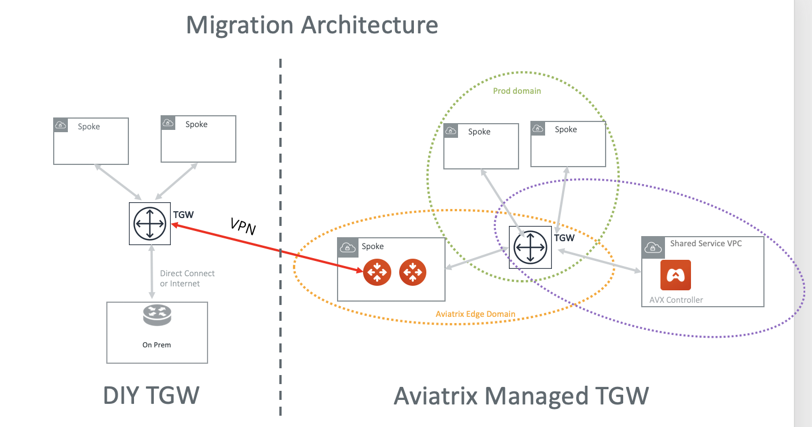
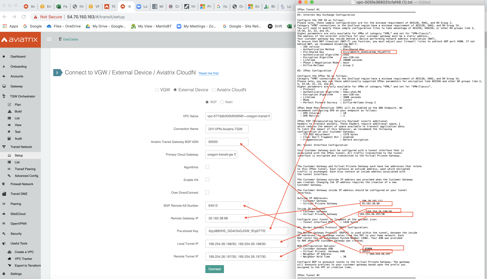

.. meta::
   :description: instructions on migrating Aviatrix TGW Orchestrator deployment to multi-cloud Transit
   :keywords: Transit Gateway, AWS Transit Gateway, TGW, TGW Migration

==================================================================
Migrating TGW Orchestrator to Multi-Cloud Transit 
==================================================================

This document helps you migrate from an Aviatrix deployed `TGW Orchestrator <https://docs.aviatrix.com/HowTos/tgw_faq.html>`_ to an 
Aviatrix `Multi-Cloud Transit <https://docs.aviatrix.com/HowTos/transitvpc_workflow.html>`_ deployment. 

The objectives here are:

 - Minimum downtime during migration.
 - No change to existing VPC infrastructure.
 - Minimum change to on-prem connectivity.   
 - Transferring Security Domains and Connection Policies in TGW to multi-cloud transit. 

The Solution
^^^^^^^^^^^^^^^^

The migration architecture is shown as the diagram below. We assume the current TGW Orchestrator deployment deploys Aviatrix Transit Gateway to connect to on-prem. 

|tgw_to_multi-cloud_transit|

1. Migrate to ActiveMesh 2.0
-----------------------------

If the Aviatrix Transit Gateways was deployed prior to Release 6.0. A migration step to ActiveMesh 2.0 is necessary before 
migrating to multi-cloud transit. 

 1. Upgrade to Release 6.0. Go to Settings -> Maintenance -> Upgrade to the Latest. 
 #. After upgrading to 6.0 is complete and successful, go to Settings -> Maintenance -> Migration -> ActiveMesh 2.0 Migration. Click to migrate. It should take a few minutes. 

2. (Optional) Create multi-cloud security domains 
---------------------------------------------------

If TGW Orchestrator configured Security Domains and Connection policies other than the default domains, create the corresponding security domains and connection policies. Otherwise skip this step and proceed. (You can always setup security domains for multi-cloud transit later.)

Follow the `Multi-Cloud Transit Segmentation workflow <https://docs.aviatrix.com/HowTos/transit_segmentation_workflow.html#aviatrix-transit-network-segmentation-workflow>`_ to plan.

3. Migrate
-------------

 1. Enable `Connected Transit <https://docs.aviatrix.com/HowTos/transit_advanced.html#connected-transit>`_ on the Aviatrix Transit Gateway if it is not already configured. This configuration mode ensures that migrated Spoke VPCs can communicate with Spoke VPCs that are still attached to TGW. 
 #. Launch an Aviatrix Spoke gateway in Spoke-1 VPC, enable HA if required. 
 #. Detach Spoke-1 from TGW. Go to TGW Orchestrator -> Build -> Detach.
 #. Attach Aviatrix Spoke-1 gateway to Aviatrix Transit Gateway. Go to Multi-Cloud Transit -> Attach (Step 6a)
 #. Repeat the above steps for all remaining Spoke VPCs during the migration process. 
 #. (Optional) After all Spoke VPCs have been migrated, setup multi-cloud connection policies. Go to Multi-Cloud Transit -> Segmentation -> Build to associate each Aviatrix Spoke gateway with a security domain. 
 #. Done. 

4. Other Components
-----------------------

4.1 Hybrid Connectivity
~~~~~~~~~~~~~~~~~~~~~~~~~

If Hybrid connectivity is accomplished via TGW DXGW or TGW VPN, these connections can continue to serve the new deployment after migration to not to change the connectivity to on-prem. 

4.2 FireNet
~~~~~~~~~~~~

If TGW FireNet has been deployed with TGW Orchestrator, migrate that to `Transit FireNet <https://docs.aviatrix.com/HowTos/transit_firenet_faq.html>`_ where firewall instances can be attached too the Aviatrix Transit Gateway. Disassociate firewall instances from FireNet and launch and associate to Aviatrix Transit Gateway after Spoke migration is complete.  

.. |tgw_to_multi-cloud_transit| image:: migrate_tgw_orchestrator_to_aviatrix_transit_media/tgw_to_multi-cloud_transit.png
   :scale: 30%

.. disqus::
