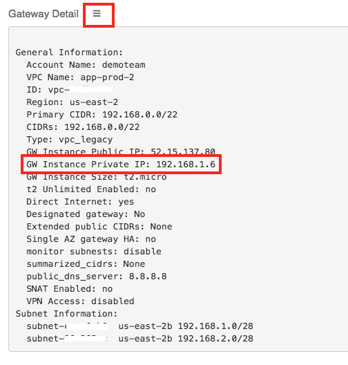

=================================
NAT for non-tunnel-bound Traffic
=================================

If you set up `egress filtering <FQDN_Whitelists_Ref_Design.html>`__, you must enable `SNAT <gateway.html#source-nat>`__ so private instances can access the internet through the AVX gateway.  With SNAT enabled, traffic going through the gateway will leave with the private IP of the gateway as its source.  This is fine for common use cases; however, it can present a problem if you want the source unchanged for traffic destined for your data center or another VPC, for example.  In this guide, we will show you how to set up the SNAT to only change the source IP for traffic headed out of the gateway on the **eth0** interface and not the tunnel interface(s).

Steps to Enable SNAT for non-Tunnel Traffic
--------------------------------------------

Navigate to Source NAT Configuration
************************************

#. Login to your AVX Controller
#. Navigate to **Gateway**
#. Select the Gateway and click **Edit**
#. Scroll down to the **Source NAT** section

Configure
*********

|source_nat_fields|

#. Select the **Customized SNAT** radio button
#. Click the **+ Add New** button
#. Enter the values in the fields as follows:

   +-----------------------+-------------------------------------------------+
   | Field                 | Value                                           |
   +=======================+=================================================+
   | Src CIDR              | **<<enter the CIDR for this VPC>>**             |
   +-----------------------+-------------------------------------------------+
   | Src Port              | <<Leave blank>>                                 |
   +-----------------------+-------------------------------------------------+
   | Dst CIDR              | <<Leave blank>>                                 |
   +-----------------------+-------------------------------------------------+
   | Dst Port              | <<Leave blank>>                                 |
   +-----------------------+-------------------------------------------------+
   | Protocol              | **all**                                         |
   +-----------------------+-------------------------------------------------+
   | Interface             | **eth0**                                        |
   +-----------------------+-------------------------------------------------+
   | Mark                  | <<Leave blank>>                                 |
   +-----------------------+-------------------------------------------------+
   | SNAT IPs              | **<<enter the private IP of the gateway>>**     |
   +-----------------------+-------------------------------------------------+
   | SNAT Port             | <<Leave blank>>                                 |
   +-----------------------+-------------------------------------------------+

   .. tip::

      To find the Private IP address of the gateway, scroll to the top and click the three lines next to **Gateway Detail**.
      
      |get_private_ip|

#. Click **Save**
#. Click **Enable SNAT**

This enables NAT only for traffic that is leaving the gateway via **eth0**.  For traffic going to the data center or to other spokes, the traffic will be leaving via a tunnel interface rather than eth0.

.. |source_nat_fields| image:: nat_only_outbound_traffic_media/source_nat_fields.png

