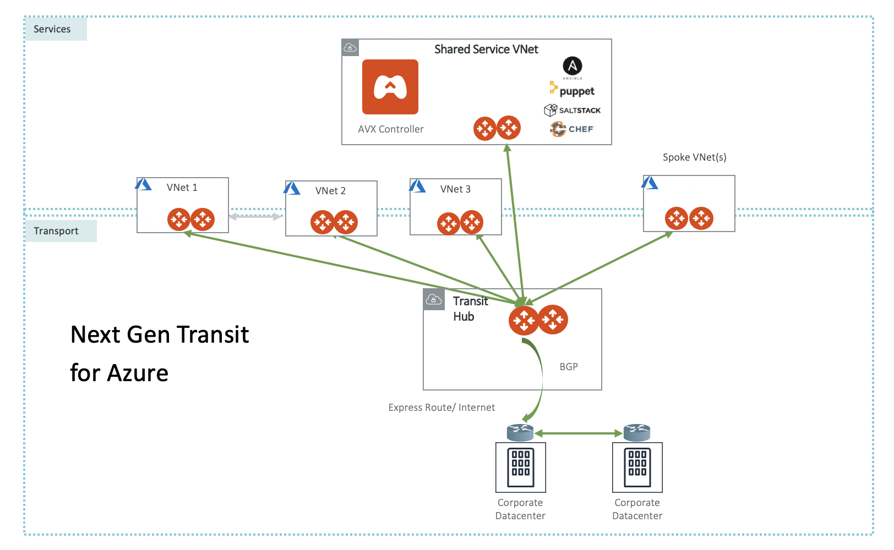
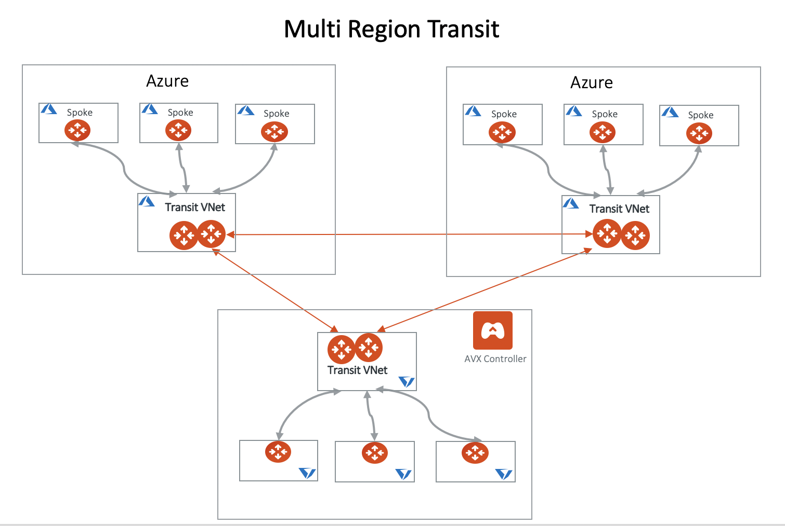
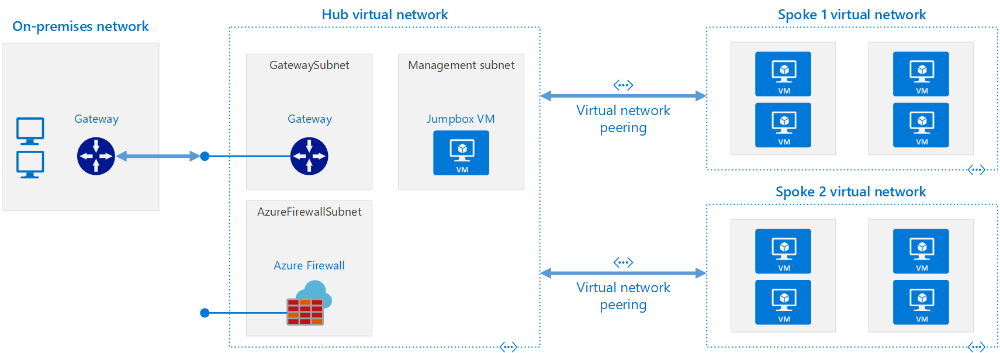
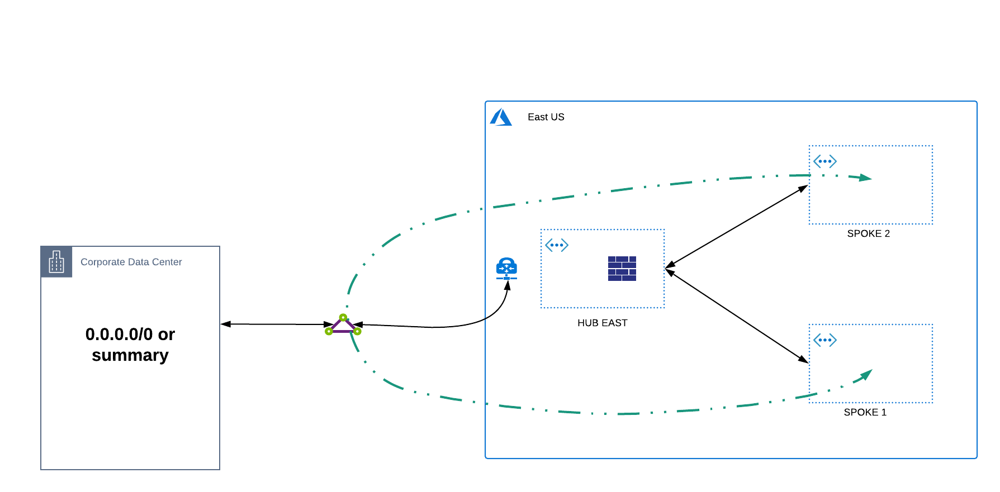
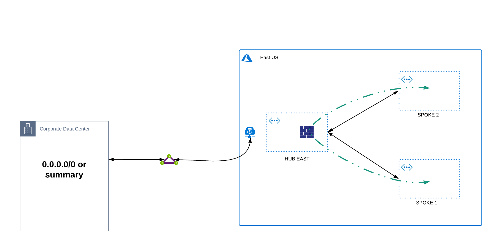
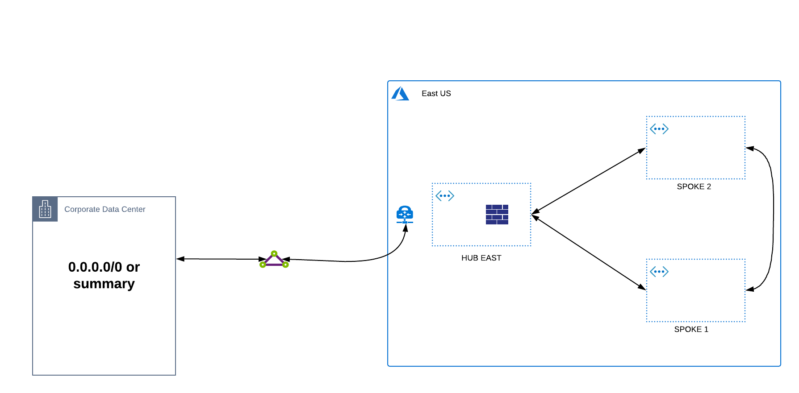
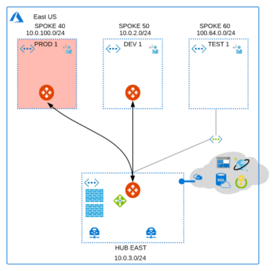

============================================
Aviatrix Transit Architecture for Azure
============================================

Azure Native Transit
---------------------------------------------------------------
The most common design topology within Azure is the Hub and Spoke model. The hub is a virtual network (VNet) in Azure that acts as a central point of connectivity to your on-premises network. The spokes are VNets that peer with the HUB and can be used to isolate workloads, departments, subscriptions, etc... Traffic flows between the on-premises datacenter and the hub through an ExpressRoute or VPN gateway connection.  It is common in these environments for spoke to spoke communication to be desired both within and across regions.  To facilitate spoke to spoke communication, Azure natively provides three methods for performing this functionality.  Each of these options has advantages and disadvantages however, these options can be used simultaneously for customers to apply the right transit method for the desired outcome.

|hub-spoke|

Intra-Region Transitive Options:
################################

1. **Leveraging ExpressRoute** - the most common transitive method is for customers to leverage their ExpressRoute circuits to provide spoke to spoke communication.  This method requires a default (0.0.0.0/0) or summary route to be advertised from on-prem to allow spoke to spoke traffic to hairpin off the Microsoft Edge Routers.  The advantage to this method is that this traffic will not incur VNET peering charges and this provides any to any spoke connectivity.  The disadvantage to this approach is that bandwidth is limited by the ExpressRoute gateway SKU, traffic takes a longer path from spoke to spoke, a lack of granular control as this method provides any to any communication, and the fact that this is not a recommended approach as there is no dedicated bandwidth allocation on the Microsoft Edge Routers for this configuration.

|S2SER|

2. **Leveraging a HUB Network Virtual Appliance (NVA)** - in this option, an NVA is deployed in the HUB VNET and User Defined Routes (UDRs) are created in each spoke to route traffic from spoke to spoke.  The advantage to this approach is that traffic takes a more ideal path, does not require any route advertisements from on-prem, and potentially provides additional security functionality depending upon the NVA being leveraged.  The disadvantage to this approach comes with the management of UDRs at scale, potential bandwidth limits of the NVA itself, and the configuration of NVA high availability (HA) to ensure redundancy in case of failure.

|S2SNVA|

3. **VNET Peering** - the recommended approach for spoke to spoke communication is VNET peering as this leverages the MSFT backbone directly and always takes the preferred path.  This option provides the lowest latency possible and has no bandwidth restrictions as opposed to the options previously discussed.  The disadvantage of this model is this connectivity is a 1 to 1 mapping.  Each spoke much be peered directly with another spoke in order to facilitate communication which at scale becomes a web of interconnected fully meshed VNETS.  As such, customers often have challenges in managing the scale of VNET peers.

|S2SPeer|

Inter-Region Transitive Options:
################################

The options for spoke to spoke communication across regions follow the same patterns above with a few notable nuances.  

1. **Leveraging ExpressRoute** - this method is similar to what was described in Intra-Region however, as ExpressRoute circuits are terminated across regions the routes are propagated automatically.  To facilitate cross region spoke to spoke communication, no summary or default route is required.  The same advantages and disadvantages apply.

2. **Leveraging a HUB Network Virtual Appliance (NVA)** - this method is also similar to what was previously described however, the number of UDRs increases as additional routes must be defined in the HUB VNETs to facilitate routing across regions to another HUB.  Additionally, a VNET peer must be leveraged between the HUB to facilitate this HUB to HUB transit path.

3. **VNET Peering** - the only change in VNET peering across regions is in naming convention.  Microsoft refers to this as Global VNET Peering but still has the same advantages and disadvantages previously discussed.

.. Note:: 

Azure Virtual WAN is another native architectural approach which can also provide transitive functionality.  Aviatrix Transit can integrate with Azure Virtual WAN and is not covered in detail here.

Aviatrix Transit for Azure
---------------------------------------------------------------

Aviatrix Transit for Azure is an architecture to interconnect multiple VNets and on-prem leveraging the hub and spoke deployment model while adding additional functionality and features.  This deployment is shown in the diagram below. 

|nextgentransit_for_azure|

In the above diagram, the Aviatrix Controller is a VM that manages all networking connections from VNETs to on-prem as well as between VNETs themselves. It deploys one Aviatrix gateway (two for redundancy) in each VNet. The Transit gateway is deployed in the transit VNet and connects to on-prem over Express Route or Internet.  The Transit Gateway is then peered to each spoke VNET gateway to provide end to end communication.  Communication can be granularly controlled to provide any to any communication between the spokes and to/from on-prem however, the transit gateway can also block certain traffic to keep spokes isolated.  Additionally, all Spoke UDRs are orchestrated from the controller based on desired traffic flows. 

For cross region communication, multiple Transit Gateways can also be interconnected. Spoke VNets can communicate to remote Spoke VNets through the two connected Transit Gateways with the same granular controls mentioned previously.  Additionally, route advertisements between the two transit gateways can be controlled to provide additional functionality like summarization, route exclusion, etc. This topology is depicted below.    

|multiregion_azure|

Another important advantage of using Aviatrix Transit is that all communications are encrypted by default providing additional levels of security.  Azure does not provide any native encryption across the Microsoft Backbone and depends upon third party NVAs to provide this functionality should customers require it.

The Aviatrix controller also has the ability to orchestrate native VNET peering for Azure VNETs should customers not wish to deploy gateways within spoke VNETs.  While customers will lose the encryption and visibility benefits across these links, all appropriate UDRs will be orchestrated to facilitate transitive communication as desired.  It is also important to note that certain native limitations may apply as to the number of peerings allowed as well as restricitions to overlapping IP space when native peering is leveraged.

|native_peering|

Why do I need Aviatrix Transit for Azure?
------------------------------------------------------

Transit architecture is about building connectivity between cloud and on-prem in the most agile manner possible. In the Transit architecture, there is one connection (not including the backup) between on-prem and a Transit Hub VNet. Everything else (the Spoke VNet to on-prem traffic) is routed through the Transit Hub VNet.

The alternative to Transit architecture is to leverage the native options already mentioned or is to build one connection (often referred to as "flat" architecture), either IPSEC over Internet or Express Route, each time you spin up a new VNet in Azure. This requires changes at the on-prem edge, which requires a change control process that takes from days to weeks.  Additionally, this method often facilitates the default any to any connectivity which may require additional configuration to prevent.

The Benefits of Aviatrix Transit for Azure
-------------------------------------------------------------------

- **Simplicity** The Aviatrix Controller provides an abstraction layer and workflow to build the Transit network. You do not need to program any Azure route tables, manage the route entries or understand the significant details about Azure networking.
- **Multi Subscriptions Support** The Controller provides a single pane of glass to manage the entire cloud network of multiple Azure subscriptions. 
- **Logging Service Integration** Out-of-the-box integration with Splunk, Sumo Logic, DataDog, ELK, remote syslog and Netflow.
- **Visibility** View connectivity status, network latency and traffic statistics from a central dashboard. 
- **Granular Routing Control** Route redistribution can be controlled to selectively allow specific route propagation and/or summarization. 
- **Advanced Networking Features** Support for Network Address Translation, NGFW Insertion, FQDN filtering, etc. 
- **No Route Limits** The Aviatrix solution auto summarizes the on-prem and Spoke VNet routes so that Spoke VNet route entries do not exceed the route limits. 
- **End-to-End Encryption** All traffic in flight, between Spoke VNets and between Spoke to on-prem, is encrypted.

How does it work?
-------------------------------------------------------------------------------------------------

Aviatrix Transit Network is a Duo Mode architecture. While the Transit Gateway runs BGP protocol, advertising Spoke VNets CIDRs to an on-prem network and learning the on-prem network CIDRs, Spoke VNets do not run dynamic routing protocols. Learned routes by the Transit Gateway are reported to the Controller which in turn propagate to the Spoke VNets. By minimizing dynamic protocol running in the network, operations and troubleshooting become simple. CloudOps engineers without extensive networking background are able to build and manage the network.

How do I deploy it?
--------------------------------------------------------------------

The Aviatrix Controller is available in the Azure Marketplace. 

1. Follow the `Azure Startup Guide <https://docs.aviatrix.com/StartUpGuides/azure-aviatrix-cloud-controller-startup-guide.html>`_ to launch the Controller. 
#. Follow the onboarding steps to setup Azure API credentials so that the Controller can launch gateways on behalf of the Azure account. 
#. Select the use case Next-Gen Transit Network and follow the `workflow <https://docs.aviatrix.com/HowTos/transitvpc_workflow.html>`_ to start building the transit network.   

   

.. disqus::
