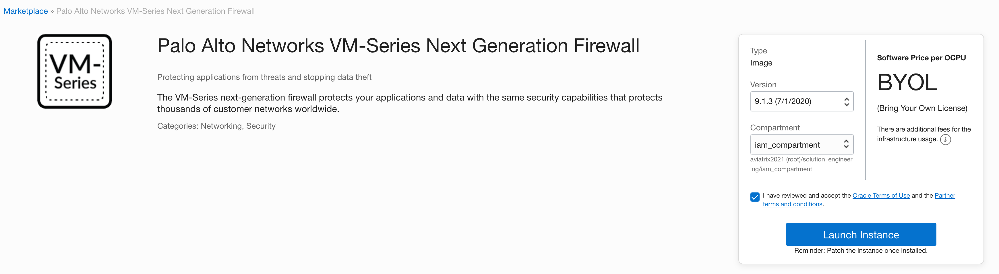

==================================
OCI IAM Least Privilege Policy
==================================

When the Aviatrix Controller uses Oracle Cloud Infrastructure APIs to manage networking, gateway, and firewall resources, the following IAM Policies can be implemented for least privilege.
In OCI, IAM is managed through groups and policies. The policy boundary can span a single compartment or an entire tenancy.

If you wish to limit the Controller access permissions, you can do so by creating a group with a set of policies used 
by the Controller as shown below and scope the policy to the compartment. This document describes what the minimal set of policies are.  `Oracle Cloud IAM documentation <https://docs.oracle.com/en-us/iaas/data-safe/doc/iam-policies.html>`_
covers more IAM concepts and technical implementation details.

Aviatrix Minimal Required OCI IAM Policy Bound by Compartment
--------------------------------------------------------------------------------------------

* Allow group <YOUR GROUP NAME> to manage volume-family in compartment <YOUR COMPARTMENT>
* Allow group <YOUR GROUP NAME> to manage instance-family in compartment <YOUR COMPARTMENT>
* Allow group <YOUR GROUP NAME> to manage virtual-network-family in compartment <YOUR COMPARTMENT>
* Allow group <YOUR GROUP NAME> to inspect all-resources in compartment <YOUR COMPARTMENT>
* Allow group <YOUR GROUP NAME> to inspect app-catalog-listing in compartment <YOUR COMPARTMENT>
* Allow group <YOUR GROUP NAME> to read app-catalog-listing in compartment <YOUR COMPARTMENT>
* Allow group <YOUR GROUP NAME> to manage app-catalog-listing in compartment <YOUR COMPARTMENT>
 
To use this policy: 
1. Assign the OCI User to the policy group.
2. Onboard the OCI User. Follow the OCI account onboarding instructions for the OCI user `here <https://docs.aviatrix.com/HowTos/oracle-aviatrix-cloud-controller-onboard.html>`_.

.. note::

  If you are deploying Transit FireNet that requires OCI Marketplace agreement, for example, Palo Alto 
  VM-Series firewalls, you will need to log in as the user created and accept the agreement from the vendor
  in the compartment and region and version for the firewall deployment. See the screenshots below for reference.

|pan_fw_subscribe|

|pan_fw_accepted_agreement|

.. disqus::
