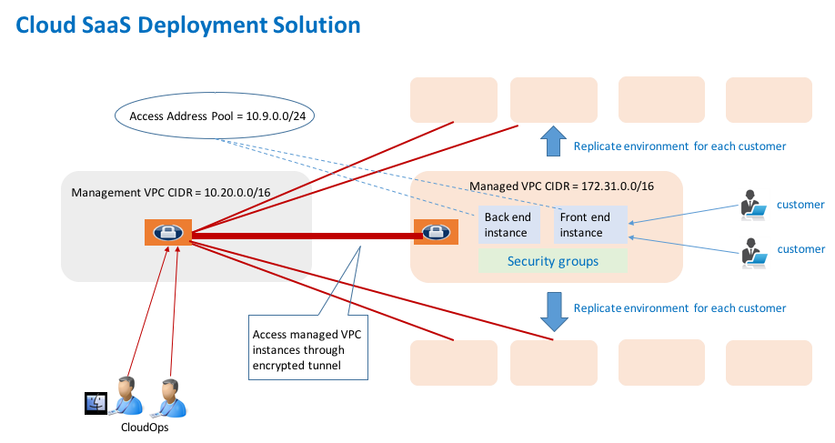

.. meta::
   :description: onboarding Frequently Asked Questions
   :keywords: Aviatrix Getting Started, Aviatrix, AWS

============================
Onboarding and Account FAQs
============================

Where do I start?
-------------------

The first time you log in, complete the Onboarding process. It takes a
few steps.

What is an Aviatrix Customer ID?
------------------------------------

If you have a BYOL license or use a community image, you need to have a
customer ID provided by Aviatrix to be able to use the product. Contact
support@aviatrix.com if you do not have a customer ID.

What is an Aviatrix access account on the Controller?
-------------------------------------------------------------

An Aviatrix access account (or account for short) represents the following information:

  - The cloud provider account (for example, AWS) credential that the Controller uses to launch Aviatrix gateway in that cloud account.

What is Controller ID?
-------------------------

Controller ID is a 32 digits Universal Unique Identifier (UUID). This ID is unique per customer and used for tracking purposes.

This 32 digits UUID can be seen under Settings -> Controller -> License.

What are different types of licenses available?
--------------------------------------------------

There are three different types of licenses option available in Aviatrix Controller.

    1. Bring Your Own License (BYOL) License - This license supports public cloud AWS, Azure, GCP and OCI. Contact support@aviatrix.com to get BYOL license.
    #. Metered or Platinum Metered License - This is only applicable to AWS and Azure public cloud
    #. Utility - The utility AMI is available in AWS and Azure both and supports maximum 100 tunnels and limited number of VPN users.

To check license type, Go to Controller's console -> Settings -> Controller -> License

Why do I need an AWS account credential?
-------------------------------------------

To build connectivity between two VPCs, the Aviatrix Controller launches Aviatrix gateway instances
in the respective VPCs, instructs the gateways to build an IPSEC tunnel and modifies AWS route tables
in each VPC.

To accomplish this task, the Controller needs your AWS credentials to issue AWS APIs, for example,
to launch the gateway instances and modify route tables, on your behalf. An AWS credential consists of

 - `The 12 digit AWS account number <https://docs.aws.amazon.com/IAM/latest/UserGuide/console_account-alias.html>`_
 - `IAM roles and IAM policies <http://docs.aviatrix.com/HowTos/HowTo_IAM_role.html>`_

If you need to connect two VPCs that are owned by one AWS account, you just need one AWS credential, i.e, one Aviatrix access account.

If you need to connect two VPCs that are owned by two different AWS accounts, you then need two AWS credentials, and therefore two access accounts.

The access account is also used to access the Controller web console, therefore it is associated with an email address and login password in case you want to login to only manage that one account.

What is the Aviatrix Primary Access Account?
---------------------------------------------

There is only one primary access account on the Controller. The primary access account's AWS account credential is the one that the Controller is launched on and it is already setup during the Controller instance launch time with a CloudFormation template.   

To setup the primary access account during onboarding time, you just need to enter the 12 digit AWS account that Controller is launched on. 

(For release 3.1 and earlier you also need to enter the Controller access credentials (email, password)).

Once you setup the primary access account, you can launch Aviatrix gateways in the VPCs that belong to this account. 

Why should I use IAM role instead of access key and secret key?
----------------------------------------------------------------

With the support of AWS IAM role, there is no need to enter an AWS access
key and secret key when creating an access account on an Aviatrix controller.
Instead, two IAM roles will be created. The Aviatrix Controller will use the
dynamically obtained security credentials to request access to AWS
resources. A role-based IAM cloud account helps to reduce the risk of AWS
credentials being compromised.

Can an Aviatrix Access Account be multi-cloud?
-----------------------------------------------

No. An Aviatrix Cloud Account corresponds to one cloud account of one cloud type. 
You can create multiple Cloud Accounts to support multi cloud and multi account deployment environment.

How do we apply Azure role-based access control to an Aviatrix Azure account?
--------------------------------------------------------------------------------

Step 1. Add Aviatrix Resource Role through Powershell
~~~~~~~~~~~~~~~~~~~~~~~~~~~~~~~~~~~~~~~~~~~~~~~~~~~~~~~
 

::

  avx_rbac_role.json:

  {
    "Name": "Aviatrix Resource Role",
    "IsCustom": true,
    "Description": "Aviatrix Resource Action",
    "Actions": [
        "Microsoft.MarketplaceOrdering/offerTypes/publishers/offers/plans/agreements/read",
        "Microsoft.Compute/*/read",
        "Microsoft.Compute/availabilitySets/*",
        "Microsoft.Compute/virtualMachines/*",
        "Microsoft.Network/*/read",
        "Microsoft.Network/publicIPAddresses/*",
        "Microsoft.Network/networkInterfaces/*",
        "Microsoft.Network/networkSecurityGroups/*",
        "Microsoft.Network/loadBalancers/*",
        "Microsoft.Network/routeTables/*",
        "Microsoft.Network/virtualNetworks/*",
        "Microsoft.Storage/storageAccounts/*",
        "Microsoft.Resources/*/read",
        "Microsoft.Resourcehealth/healthevent/*",
        "Microsoft.Resources/deployments/*",
        "Microsoft.Resources/tags/*",
        "Microsoft.Resources/marketplace/purchase/action",
        "Microsoft.Resources/subscriptions/resourceGroups/*"
    ],
    "NotActions": [],
    "AssignableScopes": [
        "/subscriptions/xyz/"
    ]
  }
 
In Powershell, perform the following:
 
1. Edit avx_rbac_role.json, copy and paste above Aviatrix RBAC role. Save the file

2. New-AzRoleDefinition -InputFile avx_rbac_role.json
 
 
Step 2. Add a role assignment in the Azure portal
~~~~~~~~~~~~~~~~~~~~~~~~~~~~~~~~~~~~~~~~~~~~~~~~~~~~
 
In Azure portal->Subscriptions->Access Control(IAM)->Add->Add role assignment->Select Aviatrix Resource Role as Role -> Select Service Principle-> Save

 
Step 3. Use the Service Principle to create an Azure ARM account in the Aviatrix portal
~~~~~~~~~~~~~~~~~~~~~~~~~~~~~~~~~~~~~~~~~~~~~~~~~~~~~~~~~~~~~~~~~~~~~~~~~~~~~~~~~~~~~~~~~~

How to setup OCI account credentials?
---------------------------------------

Follow the instructions on `Oracle Cloud Infrastructure Documentation. <https://docs.cloud.oracle.com/en-us/iaas/Content/API/Concepts/apisigningkey.htm>`_. 

How do I upgrade software?
---------------------------

Click Settings -> Upgrade, select latest. This upgrades to the latest release of the
controller software.

When a new release becomes available, an alert message appears on the
Dashboard. An email will also be sent to the admin of the controller.

Are there reference design examples?
-------------------------------------

Check out docs.aviatrix.com.

What is the support model?
----------------------------

For support, send an email to
`support@aviatrix.com <mailto:support@aviatrix.com>`__. We also offer premium customers 24/7 support.
To request a
feature, click the Make a wish button at the bottom of each page.

In my environment, Aviatrix will be within a PCI CDE environment, do you have a SOC2 or PCI AOC you would be able to share?
------------------------------------------------------------------------------------------------------------------------------

Aviatrix does not need to be PCI compliant or provide a PCI AOC.
 
Below is a good article that will help you understand why we are not eligible for PCI compliance:
 
https://www.proofport.com/blog/who-needs-aoc-and-why
 
From the article:
 
Companies that sell some types of **equipment or software** used in cardholder data processing, transmission, and storage environments, but have no access to, or do not impact, those environments, are also not required to be PCI compliant and therefore do not have AOCs. A few examples include routers, firewalls, application servers, database servers, telecommunications equipment, server operating systems, **application firewalls**, etc

.. disqus::
