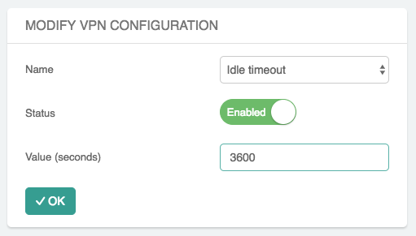
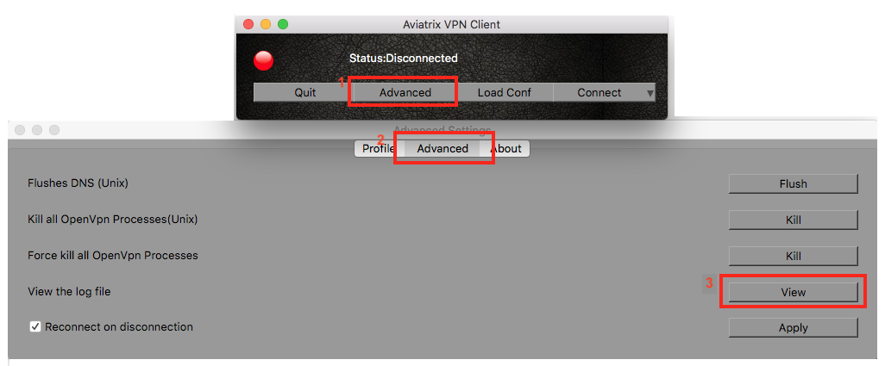
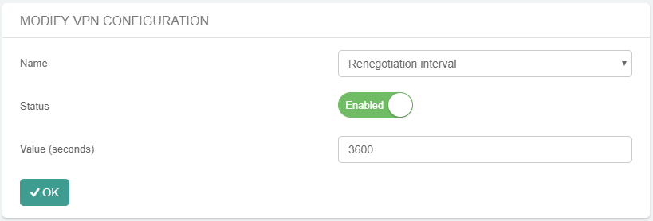
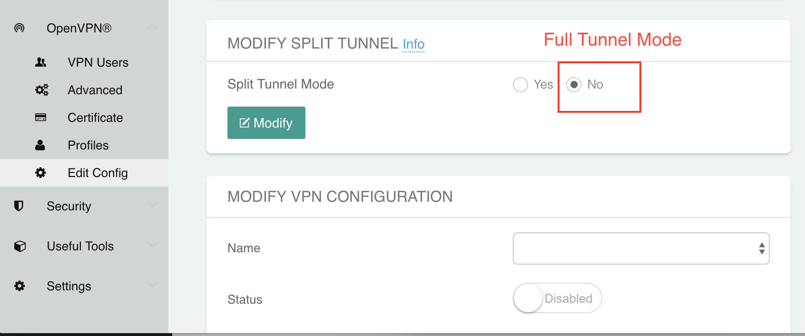
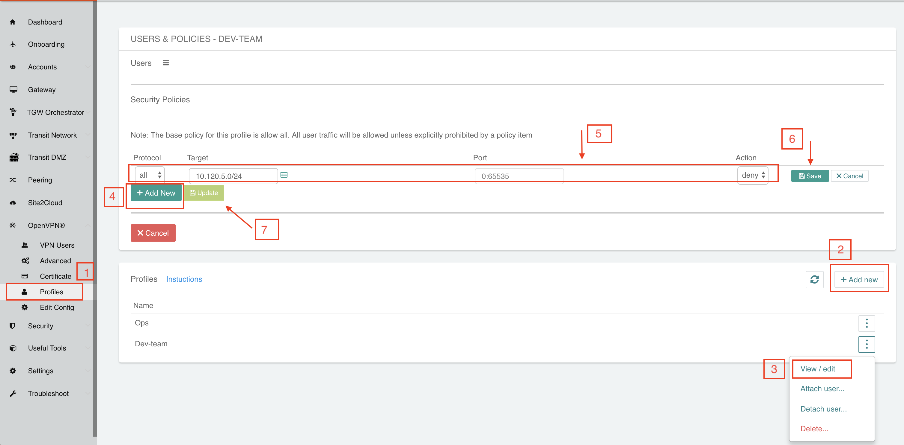
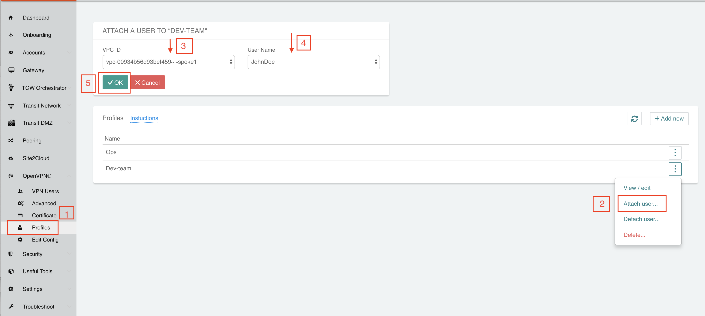
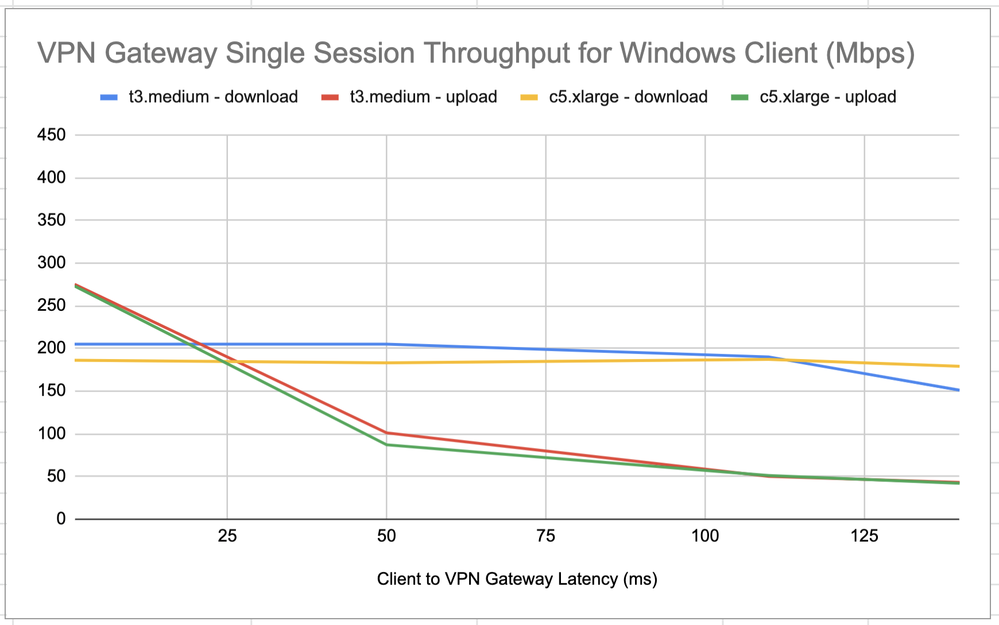
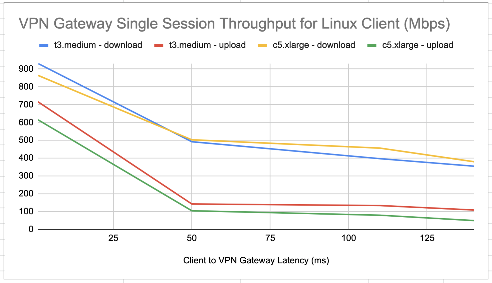
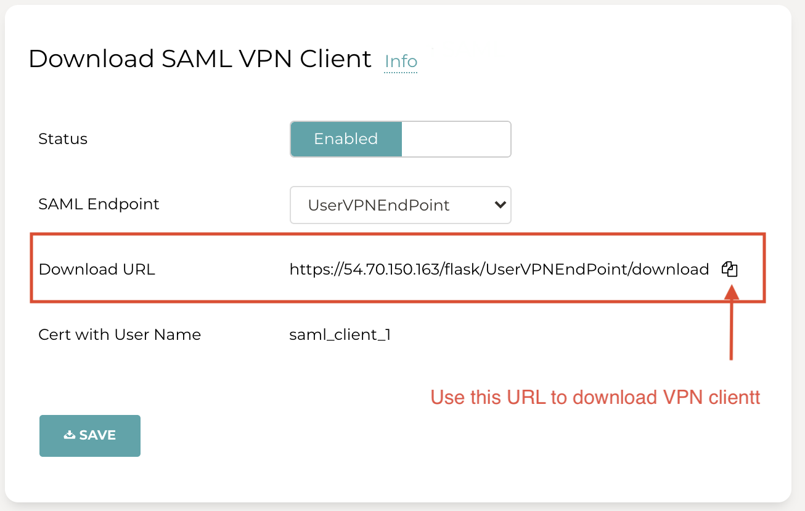



===========================
Aviatrix OpenVPN® FAQs
===========================

How do I launch a VPN Gateway?
-------------------------------------------

Navigate to Gateway > **+ New Gateway**.

The Controller launches an Aviatrix Gateway instance in
AWS/Azure/GCP. The gateway instance must be launched from a public
subnet for AWS and GCP. You need to give it a name (the name is presented as a Gateway
Name field), this name becomes part of the instance name with a prefix
CloudOps.

In the Create page, select VPN Access to enable OpenVPN® server
capability. There is a default VPN CIDR “192.168.43.0/24”, but you can
change it to make sure the CIDR is outside the existing and future VPC/VNet
CIDR range. This VPN CIDR is where the VPN server assigns a virtual IP address
to each user when she connects.

You can click **Save Template** to save the gateway template. When you come
to the page the next time, most of the fields are pre-populated. You may
change any of the fields.

How can I avoid managing multiple VPN user certs?
------------------------------------------------------------------

If you have multiple VPC/VNets, launching a VPN gateway in each VPC/VNet and creating VPN users is not the correct way of management. It forces your developers to carry multiple .ovpn certs and learn when to use which one when connecting to a VPC/VNet. 
`Leverage VPC/VNet-to-VPC/VNet connectivity to build a scalable solution. <http://docs.aviatrix.com/HowTos/Cloud_Networking_Ref_Des.html>`_

How do I scale out VPN solution?
----------------------------------------------

You can launch multiple `VPN gateways <https://docs.aviatrix.com/HowTos/uservpn.html>`_ in the same VPC/VNet. 
By default, the first VPN gateway in a VPC/VNet is launched with a NLB. Subsequent VPN gateways in the same VPC/VNet
are automatically associated with the same NLB, enabling a scale out VPN solution, where the NLB load balances incoming VPN user sessions.    

Consistent gateway configuration is required when NLB is
enabled. For example, authentication methods, tunnel modes and PBR
configurations should be identical.

How do I setup Okta authentication for VPN?
--------------------------------------------------

An Aviatrix VPN gateway integrates seamlessly with Okta. It can authenticate VPN users
to Okta service using Okta's OpenVPN® plugin in module.
Follow this link for directions: `How to set up Okta for Aviatrix VPN
gateway <http://docs.aviatrix.com/HowTos/HowTo_Setup_Okta_for_Aviatrix.html>`__.

How do I enable Geo VPN?
--------------------------------------

If you have a global workforce that needs to access the cloud, Geo VPN
offers a superior solution. Geo VPN enables a VPN user to connect to the
nearest VPC/VNet that hosts an Aviatrix VPN Gateway.

To enable Geo VPN, go to OpenVPN® > GEO VPN.

Also check out `this link <http://docs.aviatrix.com/HowTos/GeoVPN.html>`_ for help.

How do I add a VPN user?
-------------------------------------

After at least one gateway is created, you can add VPN users.

Click OpenVPN® > VPN Users > **+Add New**.

When a user is added, an email is sent to the user with instructions on how to download client software and connect to a VPN server. You can customize this email by updating the settings at OpenVPN > Advanced > Global Config > User Defined Email Notification. You could also use your own SMTP server to send these emails out by following `these instructions <https://docs.aviatrix.com/HowTos/alert_and_email.html#how-to-change-source-of-email-notification>`_.

If you prefer to not share the .ovpn file with your users via email, do not enter the email address when you add a VPN user. You can then download the .ovpn file from OpenVPN > VPN Users > Select VPN User and then download the file and share it with your VPN user via your preferred file share mechanism.

If you would like to assign user profile-based policies, you need to create
profiles first. See the next section.

What user devices are VPN client software supported?
----------------------------------------------------------

Windows, MAC, Linux, Chromebook, Android and iOS devices are supported.

Is NAT capability supported on the gateway?
-------------------------------------------------

Yes, you can enable NAT function at gateway launch time. When enabled,
instances on the private subnet can access the Internet directly.

If full tunnel mode is selected, you may want to enable NAT to allow
instances in the VPC/VNet to have direct Internet access.

Is full tunnel mode supported on the gateway?
------------------------------------------------------------S

Yes, both split tunnel and full tunnel modes are supported. You can
specify the mode at the gateway launch time.

Full tunnel means all user traffic is carried through the VPN tunnel to
the gateway, including Internet bound traffic.

Split tunnel means only traffic destined to the VPC/VNet and any additional
network range is carried through the VPN tunnel to the gateway. Any
Internet bound traffic does not go through the tunnel.

To enable full tunnel mode, go to Edit Config > Modify Split Tunnel, select **No**, as shown below.

|full_tunnel|

Can the maximum number of simultaneous connections to VPN gateway be configured?
-----------------------------------------------------------------------------------------------------------

Yes, you can set the maximum number of connections at the gateway launch
time.

What is user profile-based security policy?
--------------------------------------------

In VPN access, a user is dynamically assigned a virtual IP address when
connected to a gateway. It is highly desirable to define resource access
policies based on the users. For example, you may want to have a policy
for all employees, a different policy for partners and a still different
policy for contractors. You may even give different policies to
different departments and business groups.

The profile-based security policy lets you define security rules to a
target address, protocol and ports. The default rule for a profile can
be configured as deny all or allow all during profile creation. This
capability allows flexible firewall rules based on the users, instead of
a source IP address.

The security policy is dynamically pushed to the landing VPN gateway when a VPN user connects. 
It is only active when a VPN user is connected. When a VPN user disconnects, 
the security policy is deleted from the VPN gateway.  

How do I set up profile-based security policies?
--------------------------------------------------------------

When a user connects to a VPC/VNet, the security policies associated with the
profile that the user is assigned to are applied to the VPN gateway
instance that user logs in. This effectively blocks traffic from
entering the network.

Click OpenVPN® > Profiles > +New Profile to create profiles, then click **Edit
Policies** to add rules. You can add multiple of them. Click **Save**. Click **Update** for the rules to take effect.

|profile_config|

How do I assign a user to a profile?
----------------------------------------------

When you create a VPN user at OpenVPN® > VPN Users > +Add New, you
can select profile option to assign the user to a specific profile.

You can also attach the user to a profile at a later time. Go to OpenVPN® > Profiles. Click **Attach User** on a specific Profile and select a user that is added to the VPN gateway.

|assign_user_to_profile|

What if I want to change profile policies?
-----------------------------------------------------

You can change profile policies any time. However, users who are
currently active in the session will not receive the new policy. The user
will need to disconnect and reconnect to VPN for the new policy to take
effect.

How do I change a user’s profile programmatically?
-------------------------------------------------------------------

The Controller provides an API which can be invoked to change a
user’s profile. Refer to API documentation under the Help menu.

During this operation, the user’s existing VPN session will be
terminated. The new profile policy will take effect when he or she logs
in again.

The use case for this feature is to allow an administrator to quarantine a
VPN user for security reasons.

How to set User VPN License Threshold Notification?
--------------------------------------------------------------------

The User VPN License Threshold Notification can be set in Aviatrix Controller. Log into the Aviatrix Controller and navigate to Settings > Controller > License.

Under License, user can set the number of licenses purchased and threshold value. Once the number of licenses exceeded the threshold value an email notification will be sent.

The email id which receives all the notification can be set in Email tab (Settings > Controller > Email).

Is DUO multi-factor authentication supported?
-------------------------------------------------------------

Yes. If your enterprise has a DUO account with multi-factor
authentication, it can be integrated into the VPN solution. From
Gateways tab, click **Create**. At the two-step authentication drop down menu,
select DUO, then enter your company Integration Key, Secret Key, and API
hostname.

To obtain an Integration Key, Secret key and API hostname, log in to the DUO
website, `www.duo.com <http://www.duo.com>`__ as an admin. Click on the
left panel Applications and click **Protect an Application** below. Scroll down
the application list and select OpenVPN® (click Protect this
Application), the next page should reveal the credentials you need to
configure on the Aviatrix Controller.

For additional help, follow `this instruction. <http://docs.aviatrix.com/HowTos/duo_auth.html>`_

Currently, advanced features such as Trusted Device and Trusted Networks
are not supported. Send us a request if you would like to integrate these
features.

How do I configure LDAP authentication?
--------------------------------------------------

See details `here <./VPNUsers_LDAP.html>`__.

Can I combine LDAP and DUO authentication?
-------------------------------------------

Yes. With both LDAP and DUO authentication methods enabled on a gateway,
when launching the VPN client, a remote user will have to enter his or
her LDAP user credentials and then approve the authentication request
received on a registered mobile device to login to the VPN.

Is OKTA supported?
-------------------

Yes. OKTA with MFA is also supported. Follow the
`instructions <http://docs.aviatrix.com/HowTos/HowTo_Setup_Okta_for_Aviatrix.html>`__

How does Policy-Based Routing (PBR) work?
-----------------------------------------------------------

When PBR is enabled at gateway launch time, all VPN user traffic that arrives
at the gateway will be forwarded to a specified IP address defined as
the PBR default gateway. The user must specify the PBR Subnet which in AWS must
be in the same availability zone as the Ethernet 0 interface of the gateway.

When the PBR feature is combined with encrypted peering capability, a VPN user
should be able to access any instances in the peered VPC/VNets. This
helps build an end-to-end cloud networking environment. For details,
check out our `reference
design <http://docs.aviatrix.com/HowTos/Cloud_Networking_Ref_Des.html>`__.

Another use case for Policy-Based Routing is if you would like to route all
Internet bound traffic back to your own firewall device on Prem, or log
all user VPN traffic to a specific logging device. PBR lets you
accomplish that.

What are the monitoring capabilities?
-----------------------------------------

Active VPN users are displayed on the Dashboard. Click on any username and
the user VPN connectivity history is displayed.

You can also disconnect a user from the dashboard.

Does the Aviatrix OpenVPN® solution support SAML client?
--------------------------------------------------------------------------

Yes. The Aviatrix VPN client is the only OpenVPN® based client software that supports SAML 
authentication from the client software itself. Read `here <https://docs.aviatrix.com/HowTos/VPN_SAML.html>`_ to learn more. 

When should I use the Aviatrix VPN client?
--------------------------------------------------------

Aviatrix's `VPN Client <../Downloads/samlclient.html>`__ supports SAML authentication from the VPN client itself. If you need the VPN client itself to authenticate against an IDP (for example, Okta, Google, AWS SSO and Azure AD), you will need to use the Aviatrix VPN client.

An Aviatrix VPN gateway can authenticate a VPN user against OKTA on behalf of a VPN user.  In that case, the Aviatrix VPN client is not needed, and any OpenVPN® client software such as Tunnelblick can be supported.

Are multiple VPN configuration profiles supported by the Aviatrix VPN client?
--------------------------------------------------------------------------------------------------

Note that this is about the OpenVPN® configuration file that is installed on end user machines. 

Aviatrix's `VPN Client <../Downloads/samlclient.html>`__ allows you to load and switch between one or more VPN profiles.

Load multiple configurations:

#. Open the client.
#. Click **Advanced**.
#. Select the **Profile** tab.
#. Click **Add**.
#. Enter a name for the new profile.
#. Select the configuration file.

Switch to a different configuration:

#. Open the client.
#. Click **Connect** button.  A dropdown menu appears.
#. Select the profile from the list.
   
What is "Client Certificate Sharing"?
--------------------------------------------------

Enabling this feature allows the same user to be logged in from more than one location at a time.  If this option is disabled and a user logs in from a second location, the first location will be disconnected automatically.

How do I fix the Aviatrix VPN timing out too quickly?
----------------------------------------------

- How do I change the Renegotiation interval? 

#. Log in to your Aviatrix Controller.
#. Select OpenVPN on the left sidebar, and then select **Edit Config**.
#. Select the VPC/VNet (or DNS Name) and the Gateway.
#. Scroll to the **Modify VPN Configuration** section.
#. Click on the **Name**dropdown menu and select **Renegotiation interval**.
#. Click on the **Status** toggle switch to set it to **Enabled**.
#. Set the **Value (seconds)** to the desired timeout value.
#. Click **OK**.

|imageRenegotiationInterval|

- How do I change the idle timeout?

#. Log in to your Aviatrix Controller.
#. Select OpenVPN on the left sidebar, and then select **Edit Config**.
#. Select the VPC/VNet (or DNS Name) and the Gateway.
#. Scroll to the **Modify VPN Configuration** section.
#. Click on the **Name**dropdown menu and select **Idle timeout**.
#. Click on the **Status** toggle switch to set it to **Enabled**.
#. Set the **Value (seconds)** to the desired timeout value.
#. Click **OK**.

|imageIdleTimeout|

Where do I find the log for the Aviatrix Client?
-------------------------------------------------------------

#. Open the Aviatrix VPN Client.
#. Click **Advanced**.
#. Select the **Advanced** tab.
#. Click **View** next to the View the log file label.

|imageClientLog|

Why can't my VPN client access a newly created VPC/VNet?
------------------------------------------------------------------------------

If you are using Split Tunnel mode, it is very likely that the new VPC/VNet CIDR is not part of CIDR ranges that the Aviatrix VPN gateway pushes down to the client when the VPN client connects. To fix it, 
follow these steps:

 1. At the main navigation menu, go to OpenVPN® > Edit Config.
 #. Scroll down to Modify Split Tunnel, select yes to Split Tunnel Mode.
 #. At `Additional CIDRs <https://docs.aviatrix.com/HowTos/gateway.html#additional-cidrs>`_, enter the list of CIDR blocks including the new VPC/VNet CIDR that you wish the VPN client to access. 
 #. When complete, click **Modify** for the configuration to take effect. 
 #. Disconnect the VPN client and connect again. The new CIDR should take effect. 

How do I turn off NAT with an OpenVPN® Gateway?
------------------------------------------------------------------

An Aviatrix OpenVPN® Gateway performs a NAT function for the user's VPN traffic, effectively masking out the VPN client's virtual IP address assigned by gateway from the `VPN CIDR Block <https://docs.aviatrix.com/HowTos/gateway.html#vpn-cidr-block>`_. This does not affect profile-based policy enforcement as the landing VPN gateway has the information of the virtual IP address before NAT is performed and enforces policies based on user identification. 

If you do want to preserve the virtual IP address after the client packet leaves the gateway, you can do by enabling `PBR function <https://docs.aviatrix.com/HowTos/gateway.html#enable-policy-based-routing-pbr>`_. 

What IP Address is used for NAT'ing the VPN Clients?
-------------------------------------------------------------------

If the destination is another instance within the cloud provider, then the OpenVPN gateway’s private IP address is used to NAT the OpenVPN Client's traffic. But if the destination is outside the cloud provider(the Internet), then the public IP address of the OpenVPN Gateway is used.

What is User Defined Email Notification?
--------------------------------------------------

User Defined Email Notification feature allows users to customize the email notification (both email content and attachment file name) for VPN client. 

To configure it, go to OpenVPN® > Advanced > Global Config > User Defined Email Notification to edit the file name or email content. The new email format will be used when a VPN certificate is issued. See "How do I add a VPN user?" for more info.

How to customize popup messages after a VPN user is connected?
----------------------------------------------------------------------------------------

System Use Notification feature allows users to customize pop-up messages after a VPN user is connected. One use case is for customer to write their own messages for compliance. 

To configure it, go to OpenVPN® > Advanced > Global Config -> System Use Notification. 

.. note::

   Please ensure that you are running Aviatrix VPN Client version 2.9 or higher to view the usage notification.

How to set a minimum Aviatrix VPN client software version for OpenVPN® connection?
--------------------------------------------------------------------------------------------------------------

Minimum Aviatrix VPN Client Version feature allows users to set a minimum Aviatrix VPN client software version that is allowed to connect successfully. 

To configure it, go to OpenVPN® -> Advanced -> Global Config -> Minimum Aviatrix VPN Client Version to set the Aviatrix VPN client version.

What is Download SAML VPN Client?
-----------------------------------------------

This feature only applies to VPN client using SAML authentication. 

It allows users to download the ovpn VPN connection cert file and the VPN client installer in a self-service manner.

To configure it, go to OpenVPN® > Advanced > Global Config > Download SAML VPN Client to enable/disable this feature.

|client_download|

Once enabled, copy the `Download URL` link and send the link to your VPN users. When accessing the
URL link, a VPN user is redirected to SAML IDP for authentication. Only after authentication, a user
is allowed to access for VPN software download. 

Two files, the Aviatrix VPN client software and the UserVPN certificate (.ovpn file), are downloaded. Install the 
client package to start the VPN client software and then load the client certificate to connect to the cloud network. 

.. important::

  1. Only one load balancer is supported on a given Controller, implying that the system supports a fleet of UserVPN gateways behind one load balancer. 
  2. `Client Certificate Sharing <https://docs.aviatrix.com/HowTos/gateway.html#enable-client-certificate-sharing>`_ must be enabled for the UserVPN solution, implying you must first configure the VPN user on SAML IDP and on the Aviatrix Controller you need to configure only one VPN user. 

OpenVPN® is a registered trademark of OpenVPN Inc.

.. |image1| image:: FAQ_media/image1.png

.. disqus::
