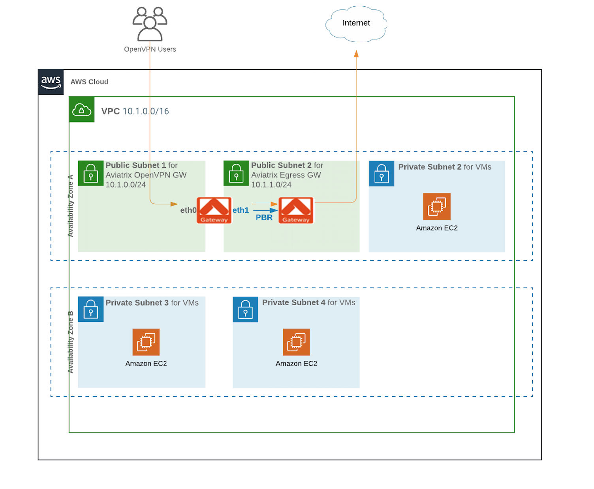

========================================================
OpenVPN + FQDN Filter Solution
========================================================

1. Solution Overview
======================

This solution provides how to deploy a network topology to filter OpenVPN user traffic by fully qualified domain name (FQDN).

2. Configuration Workflow
==========================

2.1 Pre Configuration Checklist
-------------------------------

Before configuring this solution, users need to make sure the following prerequisites are completed.

**Pre Configuration Check List**

1.  Deploy the Aviatrix Controller

2.  Create AWS VPC with two public subnets in a same AZ for Aviatrix OpenVPN gateway and Aviatrix Egress gateway.

These prerequisites are explained in detail below.

2.1.a  Deploy the Aviatrix Controller
-------------------------------------

The Aviatrix Controller must be deployed and setup prior to deploy Aviatrix Gateways. Please refer to "Aviatrix Controller Getting
Started Guide for AWS" on how to deploy the Aviatrix Controller.

`Aviatrix Controller Getting Started
Guide <https://s3-us-west-2.amazonaws.com/aviatrix-download/docs/aviatrix_aws_controller_gsg.pdf>`_

Check and make sure you can access the Aviatrix Controller dashboard and
login with an administrator account. The default URL for the Aviatrix
Controller is:

https://<public ip of Aviatrix Controller>

2.1.b  Create AWS VPC with two public subnets in a same AZ for Aviatrix OpenVPN gateway and Aviatrix Egress gateway.
-----------------------------------------

-   Create 1 VPC with CIDR such as 10.1.0.0/16

-   In the VPC, create 2 public subnets in a same Availability Zone such as 10.1.0.0/24 and 10.1.1.0/24.
    The public subnet means that it must be associated with a route table whose default route 0.0.0.0 points to IGW.
    
-   In the VPC, create multiple private subnets if needed.

2.2 Configuration Steps
-----------------------

Make sure the pre-configuration steps in the previous section are completed before proceeding.

The instructions in this section will use the following architecture.
The CIDR and subnets may vary depending on your VPC setup; however, the
general principals will be the same.

|image0|

2.2.a Deploy Aviatrix Egress Gateway
------------------------------

The first step is to deploy Aviatrix Egress Gateway in the Public Subnet2 10.1.1.0/24

**Instructions:**

a.1.  Login to the Aviatrix Controller Console

a.2.  Create Aviatrix Egress Gateway in Public Subnet2 of VPC

a.3.  Click on Gateway -> "New Gateway"

===============================    ================================================================================
**Setting**                        **Value**
===============================    ================================================================================
Cloud Type                         Choose AWS
Gateway Name                       This name is arbitrary (e.g. egress-gw)
Account Name                       Choose the account name
Region                             Choose the region of VPC
VPC ID                             Choose the VPC ID of VPC
Public Subnet                      Select a public subnet where the gateway will be deployed (e.g. 10.1.1.0/24)
Gateway Size                       t2.micro is fine for testing
Enable SNAT                        Check this box (IMPORTANT)
VPN Access                         Uncheck this box
Designated Gateway                 Uncheck this box
Allocate New EIP                   Check this box
Save Template                      Uncheck this box
===============================    ================================================================================

a.4.  Click “OK”. It will take a few minutes for the gateway to deploy. Do not proceed until the gateway is deployed.

a.5.  Refer Aviatrix FQDN documents to set up Egress Filter rules and enable Egress Control function 

`Egress FQDN FAQ <https://docs.aviatrix.com/HowTos/fqdn_faq.html>`_
`Egress Control Filter <https://docs.aviatrix.com/HowTos/FQDN_Whitelists_Ref_Design.html>`_
`Egress FQDN Discovery <https://docs.aviatrix.com/HowTos/fqdn_discovery.html>`_
`Egress FQDN View Log <https://docs.aviatrix.com/HowTos/fqdn_viewlog.html>`_

.. note::

   For HA topology, please refer `Aviatrix Single AZ HA <https://docs.aviatrix.com/Solutions/gateway_ha.html#deployment-guide>`_
   
2.2.b Deploy Aviatrix OpenVPN Gateway
------------------------------

The second step is to deploy Aviatrix OpenVPN Gateway in the Public Subnet1 10.1.0.0/24

**Instructions:**

b.1.  Create Aviatrix VPN Gateway in Public Subnet1 of VPC 
(note that OpenVPN Gateway is in a different subnet of Egress Gateway but both are in the same AZ)

b.2.  Click on Gateway -> "New Gateway"

===============================     ===================================================
  **Setting**                       **Value**
===============================     ===================================================
  Cloud Type                        Choose AWS
  Gateway Name                      This name is arbitrary (e.g. openvpn-gw)
  Account Name                      Choose the account name
  Region                            Choose the region of VPC
  VPC ID                            Choose the VPC ID of VPC
  Public Subnet                     Select the public subnet where the OpenVPN gateway will be deployed (e.g. 10.1.0.0/24)
  Gateway Size                      t2.micro is fine for testing.
  Enable SNAT                       Uncheck this box (IMPORTANT)
  Designated Gateway                Uncheck this box
  Allocate New EIP                  Check this box
  VPN Access                        Check this box
  Advanced Options                  Check this box
  Enable SAML                       Uncheck this box
  VPN CIDR Block	                  (e.g. 192.168.43.0/24)
  MFA Authentication                Optional (Disable is fine for testing)
  Max Connections                   100 is fine for testing
  Split Tunnel Mode                 No (IMPORTANT)
  Enable ELB	                      Yes
  ELB Name	                        Leave blank is fine for testing
  Enable Client Cert. Sharing       No
  Enable PBR                        Check this box
  PBR Subnet	                      Select the subnet where Aviatrix Egress Gateway is located (e.g. 10.1.1.0/24)
  PBR Default Gateway               Select the private IP of Aviatrix Egress Gateway (e.g. 10.1.1.185)
  NAT Translation Logging           Uncheck this box
  Enable LDAP	                      Optional (Uncheck this box is fine for testing)
  Save Template                     Uncheck this box
===============================     ===================================================

b.3.  Click “OK”. It will take a few minutes for the gateway to deploy. Do not proceed until the gateway is deployed.

.. note::

   1. This solution needs the function "Full Tunnel Mode" be enabled on Aviatrix OpenVPN Gateway.
   2. For Aviatrix OpenVPN GW scalability topology, any new Aviatrix OpenVPN gateways need to be added in the same AZ.
   3. PBR function and other OpenVPN functions can be modified on the page "OpenVPN® -> Edit Config" after Aviatrix OpenVPN GW is launced. `Aviatrix OpenVPN® FAQs <https://docs.aviatrix.com/HowTos/openvpn_faq.html>`_
   
2.2.c Create an OpenVPN® user
------------------------------------------------------------

This step explains how to create a OpenVPN® user.

**Instructions:**

c.1.  From the Aviatrix Controller Console

c.2.  Click OpenVPN® -> VPN Users

c.3.  Click button "+Add New"

===============================     ===================================================
  **Setting**                       **Value**
===============================     ===================================================
  VPC ID	                          Choose the VPC ID of VPC
  LB/Gateway Name                   Choose the ELB in VPC
  User Name 		 	                  This name is arbitrary (ex. vpn-user)
  User Email			                  Email address
  Profile			                      Uncheck this box is fine for the testing
===============================     ===================================================

c.4.  Click button "OK"

c.5.  Check your email to receive an ovpn file

c.6.  Done

3. OpenVPN FQDN solution POC
============================

This step proofs how this solution works.

**Instructions:**

1.  Set up a whitelist rule with Domain Name "*.google.com", Protocol "tcp", and Port "443" in `Egress FQDN Filter <https://docs.aviatrix.com/HowTos/FQDN_Whitelists_Ref_Design.html>`_

2.  Enable Egress filter function on Aviatrix Egress gateway

3.  Enable an OpenVPN® client tool

4.  Establish an OpenVPN® connection with the ovpn file which has received in email

5.  Confirm that the access to www.google.com via port 443/80 works properly

5.1. Issue CLI #wget www.google.com on your host machine where you established the OpenVPN session

5.2. It should access www.google.com and download the index.html to your host machine

6. Confirm that the access to www.yahoo.com via port 443/80 does not work 

6.1. Issue CLI #wget www.yahoo.com on your host machine where you established the OpenVPN session

6.2. It should not able to access www.yahoo.com 

OpenVPN is a registered trademark of OpenVPN Inc.

.. disqus::
