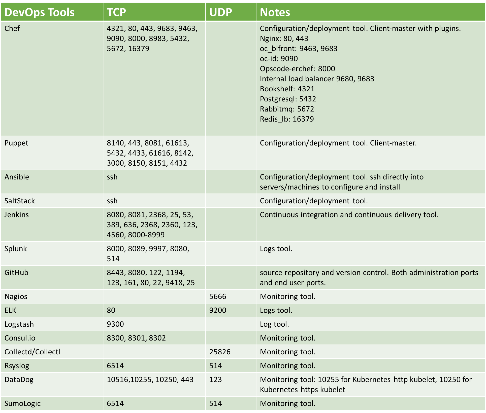

===========================================================================================
Survey of DevOps Tools
===========================================================================================

This document lists a popular set of DevOps tools, what functions they serve and the protocols they run on. 

Notice that most of these DevOps tools are unencrypted by default. They do not have to run 
on TCP port 443 or 22. 

For example, Chef can run on TCP port 4321, 80, 443, 9683, 9463, 9090, 8000, 8983, 5432, 5672 and 16379, as shown below.

|survey|

Understandably implementing encryption for each tool adds complexity as a DevOps 
admin must deal with certificates and keys, and if you deploy a set of them, it becomes unmanageable. 

Check with your DevOps team and understand the running environment and risk. 

   

.. disqus::    
