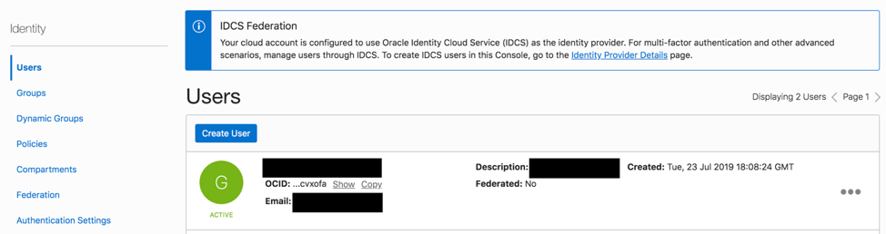
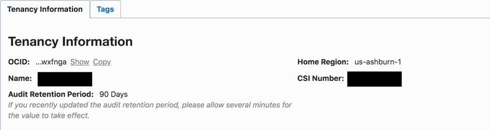
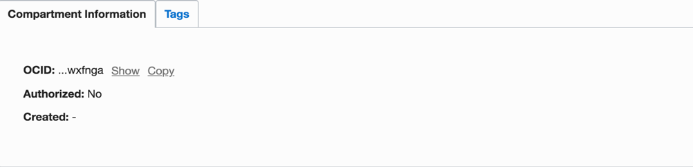
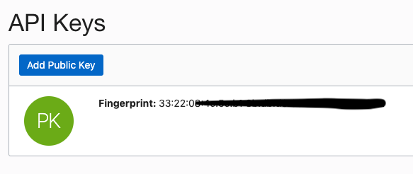
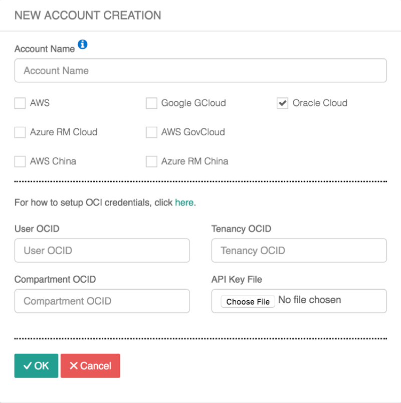

.. meta::
   :description: Onboarding guide for OCI
   :keywords: aviatrix, Oracle, Oracle Cloud Infrastructure, OCI, onboarding, user OCID, tenancy OCID, compartment OCID, API Private key file

==================================================
Oracle Cloud Infrastructure (OCI) Onboarding Guide
==================================================

Onboarding helps you set up an account on the Aviatrix Controller that
corresponds to an Oracle Cloud Infrastructure (OCI) account with compartment policies so that the Controller can launch gateways using OCI APIs.

To onboard the OCI account in the Aviatrix Controller, you need the following four pieces of information.
#. User OCID
#. Tenancy OCID
#. Compartment OCID
#. API Private Key File

This document explains where you can find these four pieces of information and how to use them to onboard your OCI account to your Aviatrix Controller.

Accessing Your User OCID
-----------------------------------
1. Log in to your OCI console and open the Navigation menu in the top left > Identity > Users.
2. Identify the IAM User who will be making the API calls and copy the User OCID.

 |oci_user|

Accessing Your Tenancy OCID
-------------------------------------
1. Log in to your OCI console and open the Navigation menu in the top left > Tenancy Details.
2. Copy the Tenancy OCID.

 |oci_tenancy|

Accessing Your Compartment OCID
-----------------------------------------------
1. Log in to your OCI console and open the Navigation menu in the top left > Identity > Compartments.
2. Choose the compartment and copy the Compartment OCID.

 |oci_compartment|

Please note that if you have multiple compartments, choose one that has right set of policies which are required for Aviatrix to work. The best practice is to create a separate compartment for your operations and assign right policies to it.

Accessing Your API Key
--------------------------------

If you already have an existing RSA key pair in .pem format, you can use that as well. However, please note that this key pair is not the SSH key that is used to access compute instances. Both the private key and public key must be in PEM format (not SSH-RSA format). If you do not have an existing RSA key pair, you can follow the aforementioned steps from the terminal in your laptop to generate the API key.

Generate an API Signing Key
^^^^^^^^^^^^^^^^^^^^^^^^^^^
If you're using Windows, you'll need to install “Git Bash for Windows” and run the following commands with that tool. Mac and Linux users can run the following commands on their terminal

1. Create a. oci directory to store the credentials: mkdir ~/ .oci
2. Generate the private key without passphrase: openssl genrsa -out ~/.oci/oci_api_key.pem 2048
3. Change the key settings, so that only you can read the file: chmod go-rwx ~/.oci/oci_api_key.pem
4. Generate the Public Key: openssl rsa -pubout -in ~/.oci/oci_api_key.pem -out ~/.oci/oci_api_key_public.pem
5. Copy the contents of the public key in clipboard locally in your computer: cat ~/.oci/oci_api_key_public.pem | pbcopy. 
Note: You may have to install pbcopy, if it is not already installed on your system. Alternatively, you can also open the public key file on the terminal and copy the file from there

Uploading the Public Key in the Console
^^^^^^^^^^^^^^^^^^^^^^^^^^^^^^^^^^^^^^^^^^

1. Log in to your OCI console and open the Navigation Menu in the top left > Identity > Users.
2. Select the user who will be making the API call.
3. Click **Add Public Key**.
4. Paste the contents of the PEM public key and click **Add**. Once you complete this, you will see the Key’s fingerprint.

 |oci_api_key|

For more details, please see `Required Keys and OCIDs <https://docs.cloud.oracle.com/iaas/Content/API/Concepts/apisigningkey.htm>`_

Onboarding Your OCI Account in Your Aviatrix Controller
--------------------------------------------------------------------------

Once you have your User OCID, Tenancy OCID, Compartment OCID, and API Private Key File, please go to Aviatrix Controller > Accounts > Access Accounts > New Account and fill the required information. Please note that you should upload the Private Key file in the Aviatrix controller (which is different than the one you put in the OCI console). You can find that key in the folder where you generated the key in the above steps (.oci folder in above example)

 |oci_account|

OCI Gov (oc2) Support
^^^^^^^^^^^^^^^^^^^^^^^^^^

Aviatrix provides support in OCI Gov (oc2) for customers interested in running workloads in this environment. See `Oracle Cloud Infrastructure US Government Cloud with FedRAMP Authorization <https://docs.oracle.com/en-us/iaas/Content/General/Concepts/govfedramp.htm>`_. 

OCI Gov (oc2) is a separate operating realm comprised of two regions: 

* us-langley-1 (Ashburn) 
* us-luke-1 (Phoenix)  

Initial OCI Gov support is tailored for customers interested in multi-cloud transit patterns. In future releases, if there is demand, Aviatrix will evaluate adding additional functionality. 

FireNet is not supported in initial release.

Onboarding OCI Gov Accounts 
~~~~~~~~~~~~~~~~~~~~~~~~~~~~

You need to subscribe to the Aviatrix image from OCI Marketplace in the same region and compartment used to onboard the OCI Gov account in the OCI Gov tenancy to your Aviatrix Controller. 

.. Note:: 

If you have an OCI Gov tenancy, the workflow for onboarding OCI Gov accounts is identical to commercial OCI. 

.. Important::

There are some limitations to using OCI Commercial (oc1) and OCI Gov (oc2) gateways in the same network. 

* OCI Gov and OCI Commercial have different regions, separate accounts, and separate compartments; they are completely isolated from each other. Therefore, you should treat them as two separate clouds. 
* HPE peering between OCI Commercial and OCI Gov gateways is not supported because oc2 and oc1 are two completely different environments and there is no native private connectivity between oc2 and oc1. 

Congratulations on finishing onboarding your new OCI account.

To create a VCN with all the dependencies, please navigate to the Useful Tools menu at the main menu on the left sidebar and select Create a VPC > **+Create**.

For more info, please see the Aviatrix product documentation at `https://docs.aviatrix.com/ <https://docs.aviatrix.com/>`_.

.. disqus::
